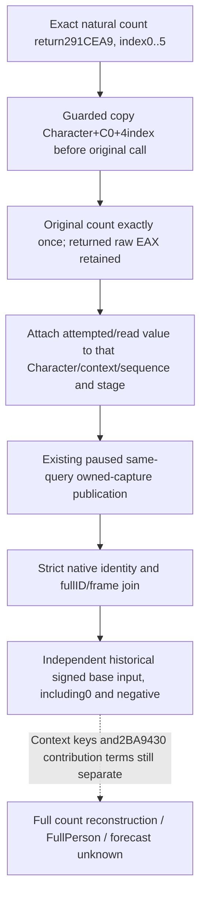

# Historical Person count base operands on actual 1.20.0.4

Source plan recorded before implementation on2026-10-10. The exact frozen
build is1.20.0.4 / Steam25734779 / EXE SHA256
`98702F88A547CDE2EAF29A85F93B85F68EE4CF8148336A4F7AFAEB75319DD518`.
No new EXE read, hash, Game/SDK contact, build or test is needed here.

## Native input and missing publication

The [complete count body](battle-person-six-stage-original-abi-12004.md)
contains `2BA95DF MOVSXD RDI,R8D`, `2BA95E6 MOV R15,RCX`, and
`2BA960E MOV R13D,[R15+RDI*4+C0]`. Thus the count consumes the signed DWORD
at actual Character+C0+4*index. The held caller170B at
`D:/p60next01/actual-six-attribute-branch02/caller-tail-0291CE85.asm`
passes the actual Character/context and iterates indexes0..5. These are the
six count base operands, not current final skill-cache bytes.

The full count source is already cached in
`Z:/ck3_mod_rewrite_process_assets/g2-background-20261010/native66-six-stage-abi-held/`:
old32B plus missing01/count-tail-first.asm and
missing02/count-return-fragment.asm. This work reuses that proof and credits
zero newly captured source bytes. The complete input also uses context68 key
operands and2BA9430 selected contributions. Publishing its base DWORD does
not close or emulate those remaining terms.

Existing legacy `CurrentRawNumericInputs` reads the same C0 six-slot concept,
but actual4 `BindBattleImage` leaves that old combined reader unbound. Its
caps, category getters and old context factory cannot be enabled merely to
publish these now independently proved actual4 inputs. The qualified natural
six-stage capture currently publishes returned counts, append PCs/weights,
pre/post aggregate and preparation Model. It lacks these historical base
values. Repeating the original callback or reading current final values would
not supply the same historical operands.

## Minimal implementation contract

Keep both hook signatures, trampoline prefixes, original-call count, append
observation, capture completion and existing readiness semantics unchanged.
For each exact admitted count caller and valid index, copy only its one DWORD
immediately before the original callback. Record the copy attempt and optional
value in that existing stage's owned capture. This avoids assuming that six
stage0 values remain constant during subsequent callbacks. Direct legacy
observer calls that lack the wrapper's pre-read retain unobserved operands.

Add optional `base_point_inputs` to the existing
`person_six_stage_captures.character_captures` leaf. Its shape is:

- `source_stage`: `before_each_original_count`;
- `character_offset`:192 and `stride_bytes`:4, source-defined constants;
- `observed`: six booleans in exact stage-index order;
- `values_i32`: six signed32 values or null for unread/unobserved inputs;
- `ready`: all six actual stage callbacks and base operands observed/readable;
- `reason`: null when ready, otherwise `base_point_unobserved` or `base_point_unread`.

Old packets may omit this sibling and acquire no base-input readiness. A
failed physical copy leaves its own value null, without changing raw callback
or append readiness. Later query/source mutation cannot overwrite the owned
pre-call value; a new native capture sequence obtains its own values.

The strict normalizer accepts this actual producer shape on both driver and
service passes. The whole-input emitter is
`emit_captured_person_base_points_12004(section)`. The independent stage
emitter is `emit_captured_person_base_point_12004(section,index)`; each returns
the value plus existing fullID, capture sequence/date/thread and actual
Character/context identities. No current held/final value is substituted.

One new whole-command producer/registered MCP compound will be authored for
Root FIRST, exercising owned pre-call values that change in the callback,
zero/negative inputs, a failed copy with independently available later slots,
new sequence ownership and retained values after later memory mutation. It
will use the existing private query/serializer and real driver/service route.
No prior qualified producer or ABI test is rerun. Status remains
source-authored/NOTRUN until Root's exact qualification receipt; this work
grants no live, FullPerson, Entry or forecast credit.
