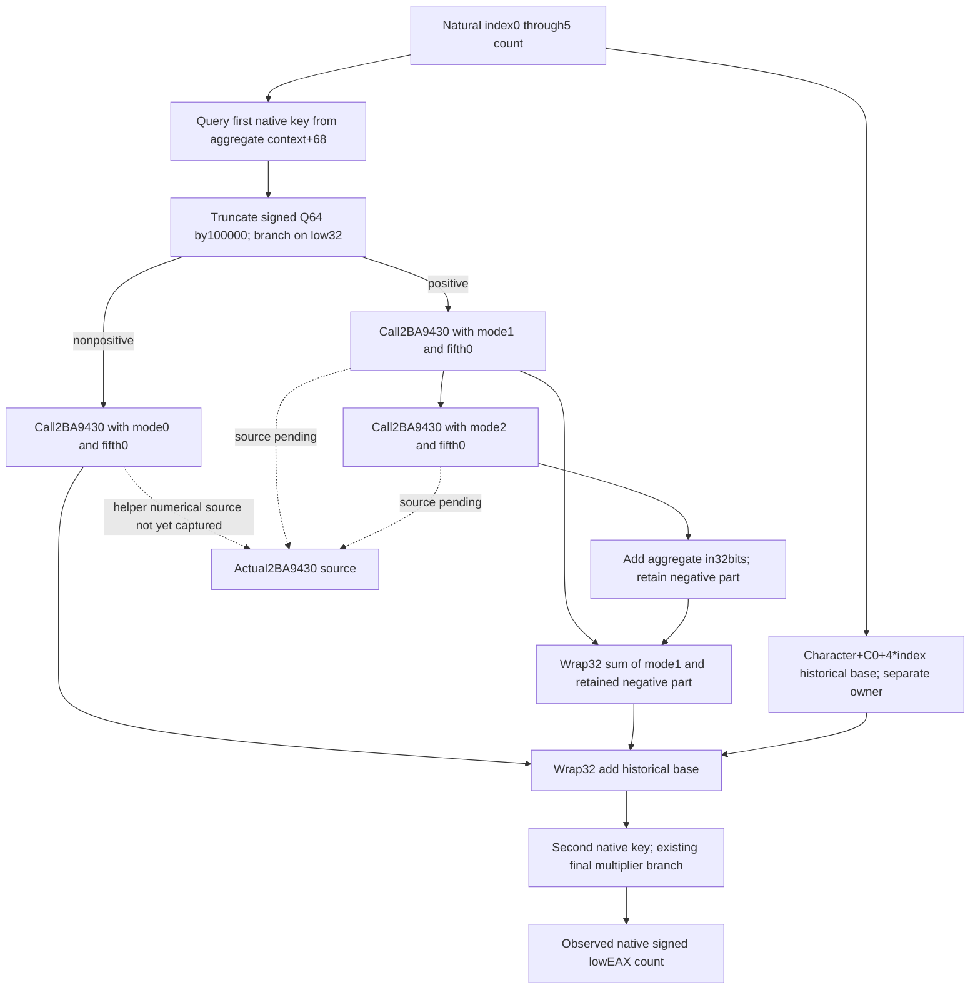
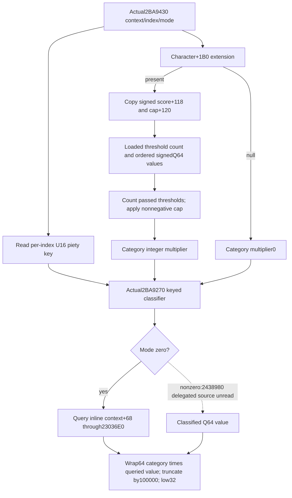

# Person six-stage classification and additional numerical sources, actual 1.20.0.4

Status: source implemented, Root FIRST pending. This package owns the direct `2BA9430` numerical
source branch of the six-stage count. The separate historical per-index
`Character+C0+4*index` base observer belongs to source `5bbff26c`; it is not
duplicated here. FullPerson, Entry and new G2 credit remain false.

Exact identity is CK3 1.20.0.4 / Steam25734779, with the previously frozen EXE
SHA-256 `98702F88A547CDE2EAF29A85F93B85F68EE4CF8148336A4F7AFAEB75319DD518`.
No hash, Game, SDK, process, build, import or test is performed by this author.

## Already held count branch

The complete count at `[2BA95C0,2BA97CD)` is 525 bytes. It is reused from
`BG10/native66-six-stage-abi-held/missing01/count-tail-first.asm`,
`missing02/count-return-fragment.asm` and the original32B entry in
`D:/p60next01/actual-six-count-entry03`. Its separate ABI source ledger is
[the original-body topic](battle-person-six-stage-original-abi-12004.md).
The natural six-stage caller is already held at
`D:/p60next01/actual-six-attribute-branch02/caller-tail-0291CE85.asm`.
Neither body is reread from the executable.

At each index, count reads the Character base DWORD and queries the aggregate
PC inline at context+68 using the key returned by `291D150`. It truncates the
queried signed Q64 toward zero at denominator100000, then branches on the
signed low32 result. `2BA9430` receives the actual Character/context/index,
locally selected mode and a literal outgoing fifth argument0.

| Native branch | Direct numerical operand before adding the base |
| --- | --- |
| Signed low32 aggregate <=0 | `2BA9430(mode0, fifth0)` |
| Signed low32 aggregate >0 | wrap32 of `mode1 + min(wrap32(mode2 + aggregate),0)` |

The positive path saves mode1 lowEAX, calls mode2, adds aggregate with a32-bit
LEA and selects a negative result with CMOVS. The base is then added with
a32-bit LEA. The second key from `291D0F0` supplies the separately held final
multiplier/zero-floor arithmetic; this package does not guess either key or
infer the direct helper's contribution by subtracting the final count.

## Finite next source entry

The cached NEW runtime table selects exactly zero-based row151520,
`[02BA9430,02BA95B9)`,393 bytes, unwind0510A6F4. The entry is proven by literal
CALLs at2BA966B,2BA9678 and2BA9693. The current finite document/filename cache
lookup found no retained actual helper body. Row bounds alone are not whole
function semantics; the returned actual flow must establish that.

Root-only recipe:
`D:/p6class01/ROOT-CLASSIFICATION-CAPTURE-ARGV.json`, invoking
`D:/p6class01/capture_classification_root.py`. It reads exactly393 bytes once
using the held text mapping RVA1000/raw400. It does not recurse into callees,
read adjacent code, parse PE/pdata or hash. Producer/helper execution is zero.

Root captured these393 bytes once on2026-10-10 at03:13:38 UTC. The complete
decode reaches RET2BA95B8. Receipt:
`D:/p6class01/ROOT-ACTUAL-CLASSIFICATION-CAPTURE01.json`; assembly:
`D:/p6class01/actual-classification01/classification-02BA9430.asm`.

## Actual classification sources

Every source below delegates to `2BA9270(context,key,multiplier,mode,fifth)`;
the helper adds their signed lowEAX results with wrapping32-bit ADD.

| Source | Key | Integer multiplier |
| --- | --- | --- |
| Generic attribute | `291D090(index)` | literal1 |
| First Character category | U16 at image+4807608+8*index | `28BE0B0(Character)` |
| Second Character category | U16 at image+480760A+8*index | `28BE110(Character)` |
| Third Character category | U16 at image+480760C+8*index | `28BE170(Character)` |
| Fourth Character category | U16 at image+480760E+8*index | `28BE1D0(Character)` |
| Resource extension term | U16 at image+4765BF8+2*index | `28BC580(&(signed32(extension+2F8)*100000))`, or0 if extension null |
| Index5 additional term | literal6 | literal1 |

The first generic call writes R8D1 but does not reset R9 after291D090. The
later category calls explicitly restore saved mode to R9D. This ledger does
not infer the generic call's mode preservation from an uncaptured getter.

The smallest already closed category is actual `28BE0B0`, retained complete
in `BG7/existing-mcp-factories-12004/general-combat/piety-gap11/maa_piety_rank-DETAIL.json`.
Its86 bytes are reused without decoding or rereading the executable. They
read Character+1B0, extension+118 signedQ64 and extension+120 signedDWORD;
iterate the loaded signedQ64 thresholds pointed to by image+54582D8 with
signed count at image+54582E4; and return the number of thresholds passed,
capped by extension+120 when that cap is nonnegative. The loop stops at the
first threshold strictly greater than the score. A null extension returns0.
The helper is the already qualified piety-category getter. Neither another
category getter nor the stress converter is treated as the old build's body.

Root's unique evaluator capture is GREEN:
`D:/p6class01/ROOT-ACTUAL-EVALUATOR-CAPTURE01.json`, assembly
`D:/p6class01/actual-evaluator02/evaluator-02BA9270.asm`.
Its complete numerical path reaches RET2BA941C. The earlier Root-only recipe is
`D:/p6class01/ROOT-EVALUATOR-CAPTURE-ARGV.json`: exactly441 bytes at
`[2BA9270,2BA9429)`, cached NEW row151519, unwind052AB190. It excludes the
265-byte stress converter and the three other category getters. This
dependency closes the selected category's numerical multiply, not ABI or
allocation. With the actual caller's fifth argument0, JE2BA93B4 bypasses all
string formatting and allocation. Mode0 queries context+68 via23036E0;
nonzero modes delegate to2438980. At2BA93E1, signed64 IMUL wraps the category
integer times the queried signedQ64. The high signed multiply magic, SAR14
and sign correction truncate that wrapped result by100000. The count caller
consumes only low32. No clamping or guessed coefficient is introduced.

The next exact native source entry is the literal2438980 selected at2BA93D9
for nonzero modes. Its body is not captured, no new recipe is scheduled here,
and neither classified Q64 values nor a complete count replay is claimed.
The stress converter, other three category getters, generic key getter and
remaining FullPerson/Entry families are separate dependencies.

The readonly source extension owns the per-index piety key, copied
resource operands, consumed threshold prefix and category result before that
natural original count. It shares the existing Character/fullID/context/
thread/sequence record and does not call a provider. A current post-loop
value cannot substitute for this historical input. The code is authored as
a child of5bbff26c to preserve that separate owner's base operand fields.

## Published input and qualification recipe

The existing `result.person_six_stage_captures` sibling gains optional
`piety_category_inputs`. Its six physical slots retain `observed`, `ready`,
`reason`, `property_key_u16`, `extension_identity`, `score_q64`, `cap_i32`,
`threshold_count_i32`, the exact `thresholds_used_q64` prefix and
`category_i32`. The source offsets/RVAs accompany the slots. Signed64 wire
operands use decimal strings and normalize to signed integers. A null
extension is an observed lawful category0; missing memory stays unavailable.
An unread category leaves existing raw counts, append PCs, base operands and
overall six-stage readiness independent. Older packets remain readable.

`emit_captured_person_piety_category_12004(section,index)` publishes one ready
key/category multiplier with copied explaining operands and the same captured
Character/fullID/context/thread/sequence. It never calls a native provider,
changes policy, infers a missing source value from the final count or writes
the game's Model. This closes a necessary additional numerical input beyond
the historical base DWORDs. It does not claim the category is itself a final
attribute contribution.

There is no new production TU or fixture target. The pending four-world base
producer `xar_ck3_12004_person_six_stage_base_points_mcp_test` and its sole
`consume_person_six_stage_base_points_12004.py` compound also verify this new
source through registered Person MCP -> real GameplayBridgeService -> real
NativeDriver. They cover changing each stage's score/cap, signedwide values,
threshold equality, nonnegative cap, native null extension, one unread source,
legacy bypass and retained ownership. They have not been executed by this
source author; no previous seven-world producer is replayed.

Root newly captured834 EXE bytes in two reads for this package; the prior525B
count,170B caller and86B category getter are reused. Source worker builds,
tests, imports, Game/SDK/process contacts and EXE reads are zero. This is an
authored readonly observer awaiting qualification, with no production-live,
FullPerson, Entry, forecast, gameplay-day or G2 credit.
