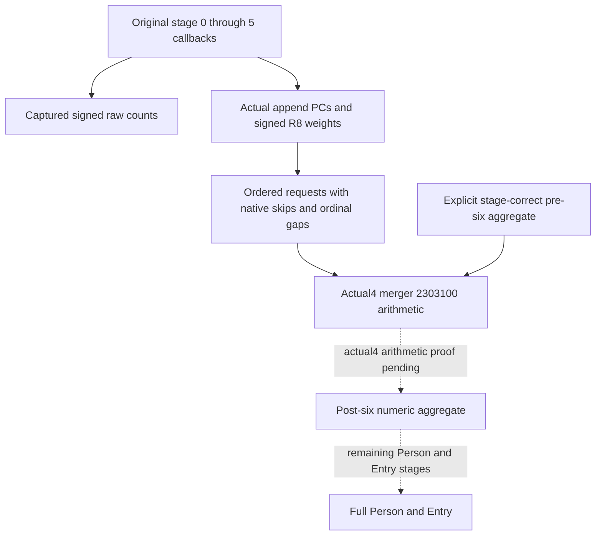

# Actual4 six-stage person composition: the next arithmetic dependency

Recorded on 2026-10-10 (Asia/Shanghai). Status: research, source contract
closed; the arithmetic capture below is authored and not run. This does not
qualify full Person, Entry, a battle terminal result or a gameplay milestone.

## The useful input already present

The [six-stage capture](battle-person-six-stage-native-capture-12004.md)
publishes the six original callback results and the naturally admitted calls
to actual `0x2438830`. Use
`emit_captured_person_six_stage_requests_12004` on the selected character's
normalized leaf. It emits the actual ordered PCs and signed R8 weights, with
ordinal `2 * stage_index + slot`. Skipped calls retain ordinal gaps. A skipped
call becomes resolved only when the original application-thread completion
has been observed. The occurrence emitter can expose a closed stage without
claiming that the other five stages are ready.

The next raw count already sees the preceding real appends. Recomputing
first/second weights from final skills would discard this historical feedback.
No such recomputation is needed. The Native62 candidate is C++ source
`61568495`, followed by consumer-only source
`73e2ea7c24d42e04b9e76839a4ed9c5bcd4a144e`; its qualification and a paused
capture are Root-owned and are not asserted by this source-only package.

## One remaining arithmetic closure

Actual `0x2438830` calls `0x2303100`. The held actual4 decoder proof covers
receiver/member/argument use, not the complete arithmetic. The existing
`simulation.battle_trait_materialized_prefix_12003._fold_property_request`
is an exact `.3` implementation of `0x2303120` and its cold scaling path.
It must not silently become an actual4 kernel.

That old implementation distinguishes an empty destination from a nonempty
one. Its empty branch copies physical key/value order, duplicates and the
`0xffff` key, then scales when the weight differs from 100000. Its nonempty
branch computes each signed fixed-point term, skips `0xffff`, performs a U16
lower-bound insertion and adds with signed 64-bit wrapping. Those are the
specific actual4 branches to prove; a schema or member-layout match is
insufficient. The supplied stage-chain module has no retained v77 six-loop
API locator; that narrow source lookup is recorded as a miss rather than an
excuse to expand the search.

Cached runtime rows give an 881-byte candidate union for the known old logical
interval `[0x2303120,0x23034a4)`. Reuse 284 held bytes and request only 597 new
bytes. Row boundaries alone do not prove a function: the returned instructions
must distinguish the main merger, its cold scaling path and the adjacent
typed setter. No later callee body is selected by this recipe.

| Fresh actual window, end exclusive | Bytes |
| --- | ---: |
| `0x2303100..0x2303109` | 9 |
| `0x2303116..0x2303142` | 44 |
| `0x230314f..0x2303190` | 65 |
| `0x2303198..0x2303218` | 128 |
| `0x230321f..0x2303276` | 87 |
| `0x2303380..0x2303488` | 264 |

The Root-only [capture helper](../../ck3_autonomous_player/native_bridge/research/fixtures/capture_person_merger_gaps_12004_root.py)
reads exactly these windows using the already-held `.text` mapping
`file_offset = rva - 3072`. It neither reads a PE header nor hashes the image.
Its output records complete decode separately from semantic closure.

The cached row pair ordinals are 120535 through 120543 (one-based), from
`Z:/ck3_mod_rewrite_process_assets/g2-background-20261007/upstream-build-migration/function-match-core/OLD-RUNTIME-FUNCTIONS.json`
and `NEW-RUNTIME-FUNCTIONS.json`. Their actual union is
`[0x2303100,0x2303276)`, `[0x2303280,0x2303373)` and
`[0x2303380,0x2303488)`.

Reuse the four actual member windows, totaling 41 bytes, in
`Z:/ck3_mod_rewrite_process_assets/g2-background-20261008/person-next-direct-entry12004/pc-decoder-source03/FAMILY-MAP.json`:
`3109..3116`, `3142..314f`, `3190..3198`, `3218..321f`, all prefixed `0x230`.
Reuse the complete 243-byte setter `[0x2303280,0x2303373)` from
`Z:/ck3_mod_rewrite_process_assets/g2-background-20261009/person-historical-model-stage/actual-typed-operands01/SOURCE-CAPTURE.json`.
Its prior interpretation is
`person-merged-helper-historical-model-input/native-tree/ACTUAL-TYPED-OPERAND-CONTRACT.json`
under the same background directory. Neither artifact body was reread for
this selection.

## Smallest composition after arithmetic proof

Keep the existing MCP and Native62 emitters. A local actual4 fold should accept
an explicit prior aggregate plus the unchanged ordered requests and retain
exact signed weights, native skip gaps, physical order and arithmetic branch
behavior. Consume captured raw counts as observations; do not derive later
counts by replaying a hypothetical model.

Captured requests alone provide append inputs. They do not establish the
pre-six aggregate, and an empty prior would describe only an explicitly
conditional contribution calculation. A full post-six aggregate needs a
stage-correct pre-six aggregate; a full modifier context additionally needs
its prior weighted rows. A current final Model is not that prior. This is a
data dependency of the requested total, not an additional execution gate.

No production Python/C++ change or new fixture is proposed before actual4
arithmetic is established. The current delivery is the exact native tree,
the reusable emitter contract and one bounded Root-only capture entry.
