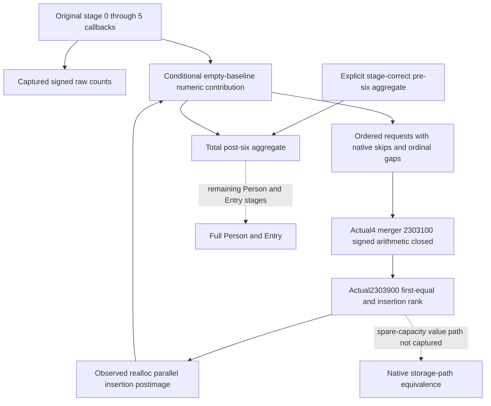

# Actual4 six-stage person composition: the next arithmetic dependency

Recorded on 2026-10-10 (Asia/Shanghai). Status: research. Root completed the
597-byte arithmetic batch, 367-byte index-helper batch and 401-byte insertion
batch once. The narrow Python numerical composition and its single reference
case are qualified offline by Root. This does not
qualify full Person, Entry, a battle terminal result or a gameplay milestone.

## The useful input already present

The [six-stage capture](battle-person-six-stage-native-capture-12004.md)
publishes the six original callback results and the naturally admitted calls
to actual `0x2438830`. Use
`emit_captured_person_six_stage_requests_12004` on the selected character's
normalized leaf. It emits the actual ordered PCs and signed R8 weights, with
ordinal `2 * stage_index + slot`. Skipped calls retain ordinal gaps. A skipped
call becomes resolved only when the original application-thread completion
has been observed. The occurrence emitter can expose a closed stage without
claiming that the other five stages are ready.

The next raw count already sees the preceding real appends. Recomputing
first/second weights from final skills would discard this historical feedback.
No such recomputation is needed. The Native62 candidate is C++ source
`61568495`, followed by consumer-only source
`73e2ea7c24d42e04b9e76839a4ed9c5bcd4a144e`; its qualification and a paused
capture are Root-owned and are not asserted by this source-only package.

## One remaining arithmetic closure

Actual `0x2438830` calls `0x2303100`. The earlier actual4 decoder proof covered
receiver/member/argument use. Root's new batch now closes the main arithmetic
through RET `0x2303275` and the separate scaler through RET `0x2303487`. The existing
`simulation.battle_trait_materialized_prefix_12003._fold_property_request`
is an exact `.3` implementation of `0x2303120` and its cold scaling path.
It must not silently become an actual4 kernel. At `0x23031c7`, CMP compares
weight with source value; CMOVL at `0x23031d3` selects the signed **maximum**
for quotient/remainder decomposition, and CMOVG at `0x23031d7` selects the
minimum multiplier. The scaler repeats this choice at `0x230340f` /
`0x230341b` / `0x230341f`. The old Python helper instead decomposes the minimum.
Wrapping the intermediate remainder product can make those results differ.

The actual code uses immediate bounds `3037000499` / `6074000998`, signed high
multiply by `0x29f16b11c6d1e109`, SAR14 and a sign correction. The two-operand
IMUL and addition instructions wrap at 64 bits. For source value `INT64_MIN`
and weight `-1`, the actual large-operand path decomposes `-1`; its remainder
product wraps to `INT64_MIN`, producing `-92233720368547`. This is an
instruction-derived reference, not an executed result or unbounded product.

The adjacent `[0x2303280,0x2303373)` is an independent typed setter, with
returns `0x230330c` and `0x2303372`, rather than a merger continuation.
The copy helpers are already closed by the outer-copy topic: independent
source counts, ordered U16 keys and complete QWORD values are retained.

Actual `0x2303228` calls `0x2303900`. Root's 367-byte capture closes that helper
through RET `0x2303a6e`: unsigned U16 lower_bound yields the first equal key;
an equal key returns its index. A missing key retains that rank and either
copies a prefix/new-key/suffix into new storage or rotates the appended key
into position. The value insertion receives that same rank and a literal
zero QWORD. Its delegated calls are `0xd87800` (key rotation) and `0xc8e7e0`
(parallel value insertion). Root's subsequent 401 bytes close the former
through returns `0xd8782f`, `0xd87847` and `0xd8787c`: it delegates the three
range reversals to the ordinary library helper `0x42209c4`. The latter's
reallocation path explicitly copies the QWORD prefix, stores the supplied
zero at the insertion rank, copies the suffix and increments the count,
then returns at `0xc8e8f3`. These observed logical postimages support the
local list insertion used by the Python contribution model.

The value helper's spare-capacity JNE at `0xc8e7fb` targets `0xc8e8f4`, exactly
outside the captured window. Its body and the ordinary reverse implementation
are not claimed as newly decoded. This package does not claim complete native
storage-path equivalence or allocator execution. Root explicitly stopped the
callee/read chain here. No extra capacity field, RIP read or readiness gate
is introduced by this local logical composition.

On2026-10-10, Root separately captured the56-byte spare-capacity continuation
`C8E8F4..C8E92C`, closing its append/count/range-call operands and RET C8E92B.
The [bounded value-insertion follow-up](battle-person-pc-value-insertion-12004.md)
retains the earlier partial capture as history. Delegated86E500 library
equivalence remains outside scope; the logical kernel is unchanged and needs
no new bridge, capacity gate, fixture or old qualification replay.

The three new batches total 1365 bytes in nine Root-only reads. Together with
the 284 held bytes consumed once, they close the arithmetic and observed
logical insertion paths above. No prior batch was read a second time.

That old implementation distinguishes an empty destination from a nonempty
one. Its empty branch copies physical key/value order, duplicates and the
`0xffff` key, then scales when the weight differs from 100000. Its nonempty
branch computes each signed fixed-point term, skips `0xffff`, performs a U16
lower-bound insertion and adds with signed 64-bit wrapping. Those are the
specific actual4 branches to prove; a schema or member-layout match is
insufficient. The supplied stage-chain module has no retained v77 six-loop
API locator; that narrow source lookup is recorded as a miss rather than an
excuse to expand the search.

Cached runtime rows gave an 881-byte candidate union for the known old logical
interval `[0x2303120,0x23034a4)`. Reuse 284 held bytes and request only 597 new
bytes. Row boundaries alone do not prove a function: the returned instructions
must distinguish the main merger, its cold scaling path and the adjacent
typed setter. No later callee body is selected by this recipe.

| Fresh actual window, end exclusive | Bytes |
| --- | ---: |
| `0x2303100..0x2303109` | 9 |
| `0x2303116..0x2303142` | 44 |
| `0x230314f..0x2303190` | 65 |
| `0x2303198..0x2303218` | 128 |
| `0x230321f..0x2303276` | 87 |
| `0x2303380..0x2303488` | 264 |

The Root-only [capture helper](../../ck3_autonomous_player/native_bridge/research/fixtures/capture_person_merger_gaps_12004_root.py)
reads exactly these windows using the already-held `.text` mapping
`file_offset = rva - 3072`. It neither reads a PE header nor hashes the image.
Its output records complete decode separately from semantic closure.

The cached row pair ordinals are 120535 through 120543 (one-based), from
`Z:/ck3_mod_rewrite_process_assets/g2-background-20261007/upstream-build-migration/function-match-core/OLD-RUNTIME-FUNCTIONS.json`
and `NEW-RUNTIME-FUNCTIONS.json`. Their actual union is
`[0x2303100,0x2303276)`, `[0x2303280,0x2303373)` and
`[0x2303380,0x2303488)`.

Reuse the four actual member windows, totaling 41 bytes, in
`Z:/ck3_mod_rewrite_process_assets/g2-background-20261008/person-next-direct-entry12004/pc-decoder-source03/FAMILY-MAP.json`:
`3109..3116`, `3142..314f`, `3190..3198`, `3218..321f`, all prefixed `0x230`.
Reuse the complete 243-byte setter `[0x2303280,0x2303373)` from
`Z:/ck3_mod_rewrite_process_assets/g2-background-20261009/person-historical-model-stage/actual-typed-operands01/SOURCE-CAPTURE.json`.
Its prior interpretation is
`person-merged-helper-historical-model-input/native-tree/ACTUAL-TYPED-OPERAND-CONTRACT.json`
under the same background directory. Neither artifact body was reread for the
original selection. For arithmetic interpretation, these specific 41-byte
windows and the 243-byte setter were each consumed once alongside Root's
new captures.

## Smallest composition after arithmetic proof

Keep the existing MCP and Native62 emitters. A local actual4 fold should accept
an explicit prior aggregate plus the unchanged ordered requests and retain
exact signed weights, native skip gaps, physical order and arithmetic branch
behavior. Consume captured raw counts as observations; do not derive later
counts by replaying a hypothetical model.

Captured requests alone provide append inputs. They do not establish the
pre-six aggregate, and an empty prior would describe only an explicitly
conditional contribution calculation. A full post-six aggregate needs a
stage-correct pre-six aggregate; a full modifier context additionally needs
its prior weighted rows. A current final Model is not that prior. This is a
data dependency of the requested total, not an additional execution gate.

The [new kernel](../../ck3_autonomous_player/src/xar_autoplayer/simulation/battle_person_pc_merger_12004.py)
uses the actual multiply, signed-MAX split, native binary-search iteration
and observed logical insertion postimage. It never imports the old arithmetic
helper. `fold_ordered_pc_contribution_12004` preserves the supplied request
order, first-copy duplicates and FFFF, nonempty sentinel skip and wrap64
accumulation. `compose_captured_six_stage_contribution_12004` consumes the
existing Native62 request emitter, retaining its real weights and feedback.

The sole [numeric reference](../../ck3_autonomous_player/tests/unit/test_person_pc_merger_arithmetic_12004.py)
is synthetic and instruction-derived. It covers the INT64_MIN/-1 maximum
split, nonunit copy, duplicate-first update, zero insertion, sentinel handling,
wrap64 additions, ordinal gaps and unchanged input operands. It is
Root-qualified GREEN: the sole pytest case passed in 0.19 seconds on
2026-10-09 at `20:32:56.852..20:32:57.499Z` (Oct10 Asia/Shanghai).
Receipt: `D:/codex-ck3-background-spill/person-ordered-merger-first02/RESULT.json`.
First01 failed in sparse source materialization before the test body; that
harness RED remains preserved. First02 executed only this synthetic
instruction reference. No native producer, C++ build, prior Green fixture,
SDK or game was replayed. The local contribution is static-ready, while
stage-correct historical baseline and full Person/Entry remain unfinished.
