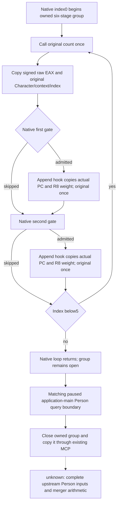

# Actual 1.20.0.4 Person six-stage natural capture

Source preparation on 2026-10-10, isolated from the running Native60 game.
Implementation base is qualified Native61 source
`4d3ba1d2b8dd8d460a2be3bdd663c859244832b3`; no Root tree or SDK mutation.
This observes native loop inputs and admitted PropertyCollection requests.
It does not qualify merger arithmetic, final skills, FullPerson or Entry.

The existing frozen build is CK3 1.20.0.4 / Steam25734779, EXE SHA-256
`98702F88A547CDE2EAF29A85F93B85F68EE4CF8148336A4F7AFAEB75319DD518`.
That identity is reused; this work performs no executable hash.

## Held actual source

Root captured the literal provider call on 2026-10-09 19:04:26 UTC:
`291CE80 E85B06FEFD -> 8FD4E0`, five bytes only, at
`D:/p60next01/actual-six-attribute-caller01/SOURCE-CAPTURE.json`.
The same target as an old build does not establish whole-function identity.

Root then captured 170 caller bytes `[291CE85,291CF2F)` and an eight-byte
provider cap at 19:13:50 UTC, 178 bytes / two reads, at
`D:/p60next01/actual-six-attribute-branch02/SOURCE-CAPTURE.json`.
The provider cap decodes only `SUB RSP,38`; it is not an old eight-byte leaf.
The raw count call is literal `291CEA4 -> 2BA95C0`, return `291CEA9`.
The normal path returns at `291CF28`; the cold `CALL852460` at `291CF29`
must be excluded when selecting the one count callback. No provider body
or callback numerical body is claimed from these caps.

For each EBX index 0..5, R15 advances by eight. RCX is the actual Character,
RDX the context, and R8D the index. The callback's signed EAX result is used
for the first request. The first provider table is +F08, definition PC +40;
native calls append `2438830` only when raw count and DWORD[definition+4C]
are nonzero, with sign-extended count times100000. Return is `291CEC9`.
The second table is +F58, PC again definition+40. Native loads signed DWORD
at actual RIP target `5C69D1C`, adds the raw count in32bits, and calls the
same append only when that count and DWORD[PC+C] are nonzero. Its return
is `291CEFB`. Negative nonzero counts are admitted. The next callback runs
after these native appends, so six final cached skills cannot replace the
six historical loop counts. This retains the existing v77 feedback method.

The count hook uses Root's separately captured32B entry cap at
`D:/p60next01/actual-six-count-entry03/SOURCE-CAPTURE.json`.
The first16B are whole stack/register instructions without RIP or relative
control flow. This is a trampoline anchor, not a complete arithmetic proof.
Append entry uses only the missing eight source bytes joined with the
already-held19B `[2438838,243884B)` documented in
`person-next-direct-entry12004/pc-decoder-source03/FAMILY-MAP.json`.
Root's actual missing-eight-byte receipt is
`D:/p60next01/actual-six-append-entry05/SOURCE-CAPTURE.json`.
The joined first15B are `405356574883ec30837a0c00498bd8`, whole instructions
ending at `243883F`, without RIP-relative operands or control transfers.

## Query and completion contract

Two entry hooks forward original arguments and full RAX return bits once.
Only physical returns `291CEA9`, `291CEC9`, and `291CEFB` admit observer
events. The append observer copies only naturally admitted PCs and their
exact signed R8 weights; it does not call a provider, recompute attributes,
or implement native append arithmetic. Source order, duplicate keys, zeros
and signed64 PC values are preserved as owned copies.

Index0 starts a fresh group keyed by actual Character pointer and fullID;
each callback and admitted append belongs to its actual context and thread.
The owned leaf exposes actual `capture_thread_id` and `query_thread_id`.
Six raw callbacks set `raw_counts_ready`; the callback at index5 does not
set `capture_complete`. Completion occurs after the existing native terminal
query reader returns inside its paused application-main mailbox executor,
after the matching thread's six-stage native invocation has returned. This covers
the final native append. A partial or foreign-thread group stays incomplete.
The mailbox already compares before/after snapshots and assigns the outer
query's expected revision and date. The leaf retains historical capture
sequence/date/context, so no later Model is relabeled as the captured one.

The optional whole-command result sibling is `person_six_stage_captures`,
with query schema `xar.ck3.person-native-six-stage-query-12004-v1`, matching
snapshot revision/date and requested-order `character_captures`. Its collector
strictly resolves each fullID through the existing Character storage layout
before selecting an owned record. Python validates that same fullID/frame join.
The selector supplies `following_six_attribute_captured_stages` as a local
emitter input, without inserting it into the native Game DTO or battle frame.
The original whole-command formatter symbol and common Game layout remain
unchanged; a new named formatter builds the typed response directly.
In a complete group, absent first/second append observations mean the
native branch skipped that call; no fabricated zero reason or skipped-PC
value is supplied. Ready observed requests may feed the existing ordered
Person input frontier. Python emits requests and provenance only.

## Readiness and validation boundary

The existing Native60 paused artifact is production-live primitive evidence
for the earlier title-tail leaf only. This six-stage addition is source work
pending Root compilation, fresh fixtures, and a future paused Native62
observation. Tests and fixtures are authored here but are not executed by
source workers. `full_helper_ready=false`, `actual_model_write_performed=false`.
No FullPerson, Entry, policy change, complete loop or additional G2 credit.
Coordinator owns OCT10/W41 report integration.

The seven-world native fixture and sole Python consumer are source-authored
for one Root compound run. The consumer entry is
`ck3_autonomous_player/native_bridge/research/consume_person_native_six_stage_capture_12004.py`;
`--producer-exe` executes the new native producer once before consuming its
seven fresh whole-command packets. Eight Python source cases remain authored
for later use; this work does not require a redundant execution of them.
