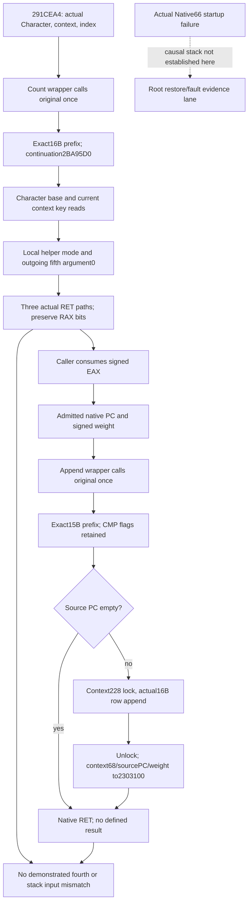

# Actual 1.20.0.4 six-stage original hook ABI

This source-only investigation responds to Root's actual Native66 restoration
failure: e69 DLL / R0085 / Game164340 reached exact4 hello, then remained
core-unavailable with timeouts, without a generation2 heartbeat or a full date.
Those observations establish a failure, not its cause. No Game, SDK, process,
build, test or executable hash is performed by this package.

The existing frozen identity is CK3 1.20.0.4 / Steam25734779, EXE SHA-256
`98702F88A547CDE2EAF29A85F93B85F68EE4CF8148336A4F7AFAEB75319DD518`.
The input is the already frozen
`Z:/ck3_mod_rewrite/artifacts/migrations/2026-10-07/installed-build/binaries/ck3.exe`.
The held `.text` mapping is RVA1000/raw400, from
`Z:/ck3_mod_rewrite_process_assets/g2-background-20261009/person-conditional-scope-8895d0/HELD-TEXT-MAP.json`.
No PE, pdata or unwind bytes are newly read.

## Exact coverage and cost

The packet is
`Z:/ck3_mod_rewrite_process_assets/g2-background-20261010/native66-six-stage-abi-held/`.
Its original `SOURCE-TREE.md` and `RESULT.json` preserve the initial cache-only
MISS. The following closure is a later, explicitly authorized increment.
The cached runtime table is
`upstream-build-migration/function-match-core/NEW-RUNTIME-FUNCTIONS.json`,
with the selected rows retained in `HELD-LOCAL-FRAGMENT-ROWS.json`.

| Logical body | Cached physical intervals joined by actual flow | Complete body |
| --- | --- | --- |
| Count | 2BA95C0..2BA95C8, 2BA95C8..2BA96ED, 2BA96ED..2BA97CD | 525 bytes; returns at2BA96F4, 2BA9704, 2BA97CC |
| Append | 2438830..24388A9, 24388A9..2438947, 2438947..243897B | 331 bytes; return at243897A |

The first count interval is eight bytes of a split function, not the entire
function. Fallthrough at2BA96ED and JNE2BA96F5 prove the final count fragment.
Append fallthrough24388A9, JNE2438947 and JE2438973 prove its remaining joins.
The adjacent function starting2BA97D0 is outside this package and is not read.

| Newly read interval | Bytes | Receipt |
| --- | ---: | --- |
| 2BA95E0..2BA96ED | 269 | missing01/SOURCE-CAPTURE.json |
| 243884B..24388A9 | 94 | missing01/SOURCE-CAPTURE.json |
| 2438973..243897B | 8 | missing01/SOURCE-CAPTURE.json |
| 2BA96ED..2BA97CD | 224 | missing02/SOURCE-CAPTURE.json |
| 24388A9..2438947 | 158 | missing02/SOURCE-CAPTURE.json |
| 2438947..2438964 | 29 | missing02/SOURCE-CAPTURE.json |

New cost is **782 EXE bytes / six disjoint reads**. All six decodes are
complete. The old count32B, joined append27B, and numeric-transfer15B are
reused, 74 bytes total, without rereading them from the EXE. The undecoded last
byte of the old count cap at2BA95DF is joined to the first new tail, forming
the complete `MOVSXD RDI,R8D`. The two receipt timestamps give the actual
October10 read times; elapsed file-read time is retained there. No full scan,
copy, rehash, new metadata parse or instruction-body catalogue is performed.

Held evidence used without new EXE reads:

- `D:/p60next01/actual-six-count-entry03/callback-entry-02BA95C0.bin` and `.asm`.
- `D:/p60next01/actual-six-append-entry05/append-joined-entry-02438830.asm`.
- `D:/p60next01/actual-six-attribute-branch02/caller-tail-0291CE85.asm`.
- `person-next-direct-entry12004/pc-decoder-source03/append_source_pc_to_numeric_merge-DETAIL.json`, actual2438964..2438973.

## Inputs, stack and return semantics

At a native function entry let **S** be RSP, including the return address at S.
The Windows x64 fifth integer argument would begin at S+28 hexadecimal.
Both complete bodies consume RCX, RDX and R8. Neither body explicitly reads
entry R9 or an entry stack argument at S+28 or above. R9 is used later for
locally selected helper operands; it is not copied from the entry value.
Native callee internals are not recursively catalogued here. No additional
argument is demonstrated or justified for either existing wrapper.

| Original | Native register meaning | Immediate caller proof |
| --- | --- | --- |
| 2BA95C0 | RCX=Character; RDX=context; low R8D=index, sign-extended by MOVSXD at2BA95DF | 291CEA4 supplies those registers; 291CEA9 consumes signed EAX |
| 2438830 | RCX=destination context; RDX=source PC; full R8=signed Q100000 weight | 291CEC4 and291CEF6 supply those registers; neither consumes a return |

The count body saves Character in R15 and context in R14. It loads the
Character base DWORD at `Character+C0+4*index`, selects two attribute keys
through291D150/291D0F0, and queries context+68 through23036E0. Calls2BA9430
explicitly set R9D to0,1,2 and write their outgoing fifth argument0 at RSP+20.
Those outgoing operands are not reads of incoming fourth/fifth parameters.
The last fragment uses the queried aggregate operand and the accumulated
count to choose the three native return paths.

| Count stack access | Meaning |
| --- | --- |
| S-8 | pushed RBX |
| S+18 / S+20 | saved RSI/RDI, written by the prologue before restoration |
| S-10 / S-18 / S-20 / S-28 | saved R12/R13/R14/R15 |
| current RSP=S-58; RSP+68=S+10 | saved RBP, written at2BA9618 before its later read |
| RSP+60=S+8 | output slot passed to23036E0, then read; not an incoming argument |
| RSP+20=S-38 | outgoing helper argument or locally written diagnostic operand |

Count return2BA96F4 executes `MOV EAX,EBX`; return2BA9704 executes
`XOR EAX,EAX`. The last arithmetic path writes full RAX through2BA97C4
before return2BA97CC. Thus the immediate caller's **signed low32 count** is
source-closed, while uniform sign extension of every full64 return is not a
valid assumption. The current `uintptr_t` original typedef and wrapper retain
the native RAX bits. Production observation takes low32 bits and copies them
to int32; it does not reinterpret the high32 bits as another count input.

Append first checks source PC+C. Empty PC jumps directly to2438973 and returns
without assigning RAX. Nonempty PC acquires the native context+228 lock,
appends the actual `{source PC, signed weight}` 16-byte row to context's
weighted-source vector, releases the lock at243895C, and calls2303100 with
RCX=context+68, RDX=source PC, R8=weight. Allocation and transfer paths converge
on the same epilogue. There is no meaningful numeric/pointer return established
for append: the empty path leaves incoming RAX unspecified and the observed
callers discard it. The existing wrapper returns the machine RAX bits from
its original call; this does not turn append into a numeric producer.

| Append stack access | Meaning |
| --- | --- |
| S-8 / S-10 / S-18 | pushed RBX/RSI/RDI |
| current RSP=S-48; RSP+20 / RSP+28 | locally stored source PC/weight pair, written before read |
| RSP+50=S+8 / RSP+58=S+10 / RSP+60=S+18 | saved RBP/R14/R15 on the allocation path, each written before restore |

The actual append lock sequence is `LOCK BTS [context+228],0`, with retry
and an additional wait for DWORD[context+228]<=1; release is `LOCK AND ...,FE`.
This proves a native spin exists at this site. No captured fault stack or
instruction pointer in this package places Native66 there, so it is **not**
a startup-cause claim or a reason to alter the native lock.

## Existing detour and relocation comparison

Production source is
`ck3_autonomous_player/native_bridge/include/xar_bridge/ck3_12004_person_six_stage_capture.hpp`
and its matching CPP. The originals remain
`uintptr_t __fastcall(void*,void*,uint32_t)` and
`uintptr_t __fastcall(void*,void*,int64_t)`.
`InvokePersonSixStageCapture12004` calls count once and returns the same bits.
`XarPersonSixStageAppendHook12004V1` observes, calls append once and returns its
same machine result. The hook intercepts all entry calls; filtering observer
events by return address does not restrict which callers are forwarded.

| Patched entry | Exact relocated bytes | Continuation | Relocation result |
| --- | --- | --- | --- |
| Count | `4c8bdc534883ec504989731849897b20` | 2BA95D0 | Five whole instructions; no relative branch or RIP operand |
| Append | `405356574883ec30837a0c00498bd8` | 243883F | Six whole instructions; CMP flags remain live into native JE2438845 |

`MakeTrampoline` copies these exact instructions and appends FF25 with an
absolute QWORD target. FF25 changes neither general registers nor flags.
The count's `MOV R11,RSP` binds to the wrapper's original-call stack, so the
native stack saves/restores retain their entry-relative meaning. The append's
native MOV instructions between continuation and JE also preserve CMP flags.
No prologue-relocation mismatch is demonstrated by this bounded closure.

## Qualification and next dependency

This is **research/source ABI closure**, not a new fixture or live result.
Builds, tests, callbacks, Game/SDK/process contacts and production source edits
are all zero. The existing two three-argument wrappers have no demonstrated
argument, return-preservation or relocated-prefix defect in these bodies, so
no speculative ABI patch or redundant FIRST is proposed. Complete Person and
Entry remain false. This result does not requalify Native66 or repair its
startup failure.

The actionable next dependency is Root's actual failed-runtime instruction
pointer/stack evidence correlated with this now complete body, or the separate
already-owned runtime restoration investigation. A stop inside2438860 or
2438870 would specifically implicate the native context228 wait; no such stop
is claimed here. This package does not expand into audio/wait helper bodies,
arbitrary callers or other ABI branches.
