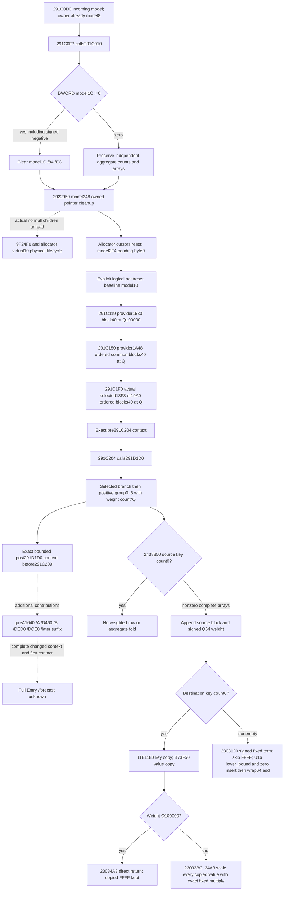

# Explicit person preparation stage baseline — CK3 1.20.0.3

The useful interface is a **logical post-reset context explicitly labeled
`post_291C010_pre_prefix`**, followed by the existing provider prefix and then
the actual291D1D0 requests. It does not identify an old snapshot as that stage.
Frozen EXE SHA256:94B55397ABB687A3DCD436805A5D885E6BE90FA6C693FEB44A9E3BBEEADE02A6.



## Ordered source ledger

| Stage | Exact source | Logical effect and required input |
|---|---|---|
| Incoming |291C0F0/F3|RCX model, owner QWORD[model+8]; current model identity alone gives no historical stage |
| Reset |291C0F7→291C010|model+1C !=0 clears weighted count, key count model+84, value count model+EC; otherwise the independent aggregate counts and active arrays survive direct reset |
| Owned cleanup |291C074→2922950|model+248 pointer array, allocator model+240; normal control zeros only owned count model+254 directly; nonnull cleanup/release children remain physical lifecycle unknown |
| Reset return |291C0B7/C0C8|pending byte zero after allocator cursor reset; no context values copied or initialized here |
| Baseline |before291C119|Explicit postreset logical weighted count0, aggregate paired arrays/count. Empty baseline is valid when explicitly supplied; weighted0 alone never implies empty aggregate |
| Base prefix |291C119|provider+1530 block+40, weight100000; empty source skips |
| Common prefix |291C150|provider+1A48, native 16B order; each first pointer block+40 at weight100000 |
| Selected prefix |291C1F0|Actual observed selector18F8 or19A0, native 16B order at weight100000; provider second qword is not a weight |
| Prebranch |291C204|Complete logical prefix result is the actual required input for291D1D0 |
| Selected branch |291D238|Initial flag14 true uses actual selected index/providerFA8 block+40 at100000 |
| Seven groups |291D407|Actual eligible record census; positive signed32 group count in0..6 source order supplies provider1000[group]+40 and signed64 count*100000 |
| Stop |return to291C209|Remaining preparation contributes additional requests. This packet does not call it complete context or full Entry |

291CF50 later swaps model owners, pending flags, context headers, allocator and
owned containers. Therefore a present address, pending0 or zero rows cannot
retroactively prove that present context was the historical baseline.

## Minimal logical input and implementation plan

Extend the existing materialized-prefix module with an explicit stage baseline
and a bounded prefix→291D1D0 assembler. Keep the existing completed-empty-reset
API. Reuse its source-defined copy/merge and the existing signed Q multiply;
factor the fold rather than duplicate the numeric model.

The explicit baseline carries a Character full ID, the exact stage label,
logical context and caller provenance. After reset the weighted count is zero.
The retained branch still requires its actual complete paired aggregate arrays;
negative or mismatched counts remain partial. Source contributions retain native
order, duplicates, signed zero/negative values and original property rows.

An explicitly requested **modeled new reset** may project the source's direct
count stores from supplied entering counts. Nonzero weighted count projects an
empty logical count state; weighted zero preserves the supplied aggregate.
This is a conditional new-stage numeric model, never proof that native cleanup
ran or that a historical current-final snapshot was preprefix. Physical allocator
state is not modeled. A caller can instead supply the explicit postcleanup
logical context. No automatic adapter turns current-final into historical prior.

Empty destination with nonunit weight is now source-closed at the necessary
23033BC continuation: copied key/value order is retained, every copied value
(including keyFFFF) is scaled by the already implemented signed fixed Q helper.
Constants3037000499 and0x29F16B11C6D1E109, fast and decomposed paths, truncation,
store order and normal exit match the existing arithmetic primitive. With
weight100000 the source returns without scaling; nonempty merge still skipsFFFF
after computing its term. First copy does not coalesce duplicate keys.

Scope is logical numeric postimages after supplied normal source requests,
without physical allocation readiness claims. The actual arrays determine the
numeric result; storage capacity remains diagnostic. Other trait/provider
changes, later helpers, full first-contact context, Entry/stat refresh and
calendar/RNG remain separate inputs and unknown branches.

## Read receipt

Reuse v79 caller/reset/writer, v83 insertion, v85 copy/materializer, v86 cleanup
and current state. New necessary scale reads total231codebytes (18B fragment plus
213B bounded continuation). No new metadata was needed. A29B cleanup-entry read
duplicated v86 before that cache was found; it is preserved as an avoidable
attempt, not new research credit. Total fresh EXE I/O260B. Whole EXE scans/hashes,
native builds, old tests, game/process/query/SDK/pipe/UI/Steam operations:zero.
CLI `check --plan` failed before source capture due to a wrong argument; the
correct positional plan check passed. This harness failure remains in receipt.


## Published Python interface and validation

`battle_trait_materialized_prefix_12003.py` now accepts
`stage_start_baseline=PersonStageStartBaseline12003(...)` on the existing
`materialize_current_prior_context_prefix_12003` function. Its previous
`CompletedResetContextState12003` empty-state API remains supported.

`assemble_person_stage_prefix_and_branch_12003(prior_inputs, branch_inputs,
stage_start_baseline=...)` returns the bounded complete `pre291C204_context`
and `post291D1D0_context`, or explicit missing inputs. The result stops before
291C209. All later preparation must be appended from its own exact inputs.

```python
baseline = PersonStageStartBaseline12003(
    character_full_id=actor_id,
    stage="post_291C010_pre_prefix",
    kind="explicit_post_reset_logical_context",
    context=explicit_postreset_context,
    source_provenance=stage_input_receipt,
)
assembled = assemble_person_stage_prefix_and_branch_12003(
    person["current_prior_context_inputs"],
    person["context_branch_inputs"],
    stage_start_baseline=baseline,
)
# Replace only context in supplied numeric operands when assembled.ready.
```

For a deliberately modeled new reset, choose `kind="modeled_new_reset"`
and supply `entering_counts=(weighted_i32, key_i32, value_i32)` explicitly.
Nonzero weighted count, including negative, supplies the direct empty logical
count projection without needing old arrays. Weighted zero with positive
aggregate count still requires the retained paired context. Unknown entering
weighted count and absent retained aggregate remain partial. A supplied
nonempty context inconsistent with the new-reset clear branch remains partial.
This result does not claim native cleanup completion or historical observation.

The common fold is shared with the existing prefix materializer. Unit-Q empty
copy retains values unchanged; nonunit empty copy uses the newly closed scale
tail for every copied value. Nonempty folds use U16 lower_bound/parallel zero
insertion and signed wrap64 accumulation, skippingFFFF only after the term.

One new focused integration case ran once on2026-10-05T14:21Z: production
terminal-transition normalizer → published prefix/branch inputs → explicit
stage assembler → existing six-skill kernel. GREEN1/1,0.003s test execution.
The retained aggregate and newly cleared stage produced final skills
`[9,6,6,6,8,9]` and `[9,6,6,6,8,7]`. A first group of weight2Q covered
empty-destination nonunit scaling with decomposed multiply, duplicate keys and
FFFF; raw prowess80006 clipped to120. Missing retained aggregate and a context
labeled current_final remained partial. The original current prowess8 and
input carrier were preserved. No old cases or native builds were run.

This is **static-ready logical stage composition**, based on source-shaped
synthetic inputs through the production normalizer. It is not native-frame
parity, observed history, full person preparation, full Entry or live forecast.

Evidence packet:
`Z:/ck3_mod_rewrite_process_assets/g2-background-round2-20261005/actual-entry-context/person-stage-baseline/`.
Source-first seal:`SOURCE-READ-RECEIPT.json` at14:12:04Z before implementation;
test receipt:`focused-attempt-01/RESULT.json`. The260B fresh EXE total includes
an explicitly recorded29B avoidable cleanup-entry duplicate. No whole scan or
hash and no process/game/query/SDK/pipe/UI/Steam activity occurred.
