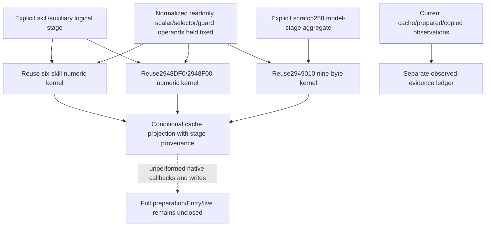

# Conditional person cache projection from explicit logical stages

Source-first specification, recorded during the 2026-10-05 background continuation,
before implementing this adapter. Exact CK3 1.20.0.3 / Steam25652598 / frozen EXE
SHA94B55397ABB687A3DCD436805A5D885E6BE90FA6C693FEB44A9E3BBEEADE02A6.
All source and numeric kernels below are already sealed and qualified. New EXE
I/O is0; this work does not reread their functions or repeat their tests.

The new explicit person-stage assembler supplies a logical modifier context.
The existing six-skill, auxiliary and nine-byte consumers only describe their
current readonly inputs. A subsequent stage therefore needs an explicit bridge
to those numeric consumers, with conditional provenance and separate contexts.
The purpose is to make a supplied stage useful to final-stat preparation while
preserving the current observations as evidence in their own right.

## Native inputs and order

`28C3D80` selects its skill/auxiliary context through`28C3AE0`, computes six
skills, then`2948DF0` and`2948F00`. Their existing kernels preserve source wrap,
weighted positive/negative contributions, category selection, caps and the
auxiliary selector. Current prepared430/438 and copied2E0/2F0 are observations;
they do not prove a new copy occurred.

`28C3F60` copies those two prepared values, then calls`2949010` at`28C4017`.
The nine-byte helper independently selects`QWORD[scratch258]` and its aggregate
at model78. It does not select the earlier`28C3AE0`fallback context and does not
consume430/438. Its two source guards, nine selected U16 keys/FFFF skips, nine
base keys, wrap64, truncQ100000, signedlow32 and clamp[-100,100] are already
implemented in the qualified current kernel.

Thus this adapter takes **two explicit logical inputs**: a skill/auxiliary stage
context and a scratch258-model stage aggregate. Neither defaults to the other
or to current final storage. Each has its stage label, queried Character fullID
and provenance. A caller may consciously supply corresponding contexts when
its source-stage association is closed. A missing context remains partial.

The other observed numeric operands are held fixed: base points, categories,
scratch factor, caps, auxiliary bases/selector, and the actual guarded nine-key
definition. The output is conditional on those operands staying as supplied;
this work does not claim to generate them for a future date or changed carrier.
An independently available family remains usable if another family is partial.
Native null-scratch remains a no-op and demands no stage context.

## Implementation and focused acceptance plan

Add the dedicated pure module`battle_person_stage_cache_projection_12003.py`.
It takes normalized raw input and explicitly tagged contexts, copies the input
views, and reuses the three qualified kernels. It changes the returned scope
to conditional logical-stage projection while retaining the observed values
and source branches. It does not change the old kernels or their serializers.
The same queried actor association is required; a different explicit actor does
not provide this actor's stage.

One new production-normalizer integration case will supply different skill and
nine-model contexts, verify the expected auxiliary/nine values, partial-family
independence, actor association and source null-scratch no-op, and check that
the input and current observations are unchanged. The new interface must
produce usable conditional values with complete supplied operands, not just
nullable schema fields. Old passed tests and native compilation are unnecessary
because this change adds no native reader and leaves those kernels untouched.

Readiness is bounded numeric **static-ready** only after that new case passes.
Native cache/copy writes, physical storage, historical-stage observation,
full-person callbacks, actual Entry refresh and live readiness stay false.
No new game day, process/game/SDK/pipe/UI/Steam/profile/save/cache/runtime contact
is permitted while the user uses CK3.

Source references: [person frontier and auxiliary/nine source](battle-first-contact-person-preparation-frontier-12003.md),
[explicit postreset baseline](battle-person-stage-baseline-12003.md), and the
dedicated stage-chain source ledger prepared by its owner. This numeric
adapter consumes an explicit bounded frontier; it does not remove any missing
intermediate construction stage from that ledger.

## Offline qualification (2026-10-05T23:35:04+08:00)

The dedicated production-normalizer integration passed once:1 case in0.306495s.
Separate supplied contexts yield sixskills[1,2,3,4,5,6], auxiliaries[270,-13]
and ninebytes[2,-3,0,0,12,0,0,0,0]. Missing-family independence, queried-actor
association, native null-scratch no-op and unchanged observed inputs are covered.
Current prepared/copied/nine values remain separate. Receipt:
`Z:/ck3_mod_rewrite_process_assets/g2-background-round4-20261005/cache-stage-projection/attempt01.json`.
Readiness is conditional numeric static-ready only. No native build, previous
test rerun, new EXE read or game operation occurred. This handwritten Python
fixture does not count as a new C++ serializer wire or actual paused sample.
