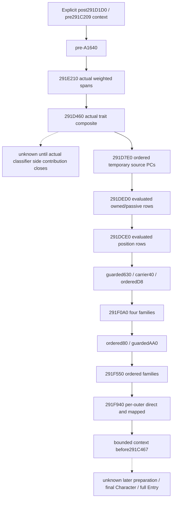
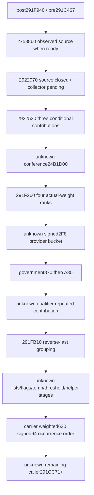
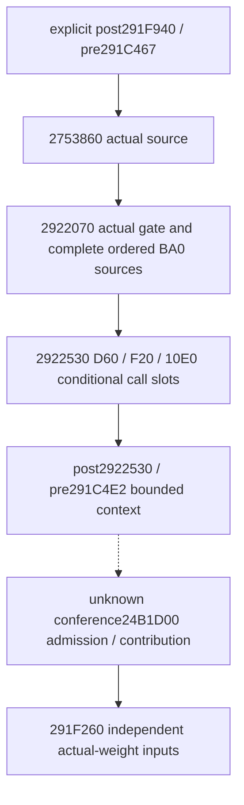
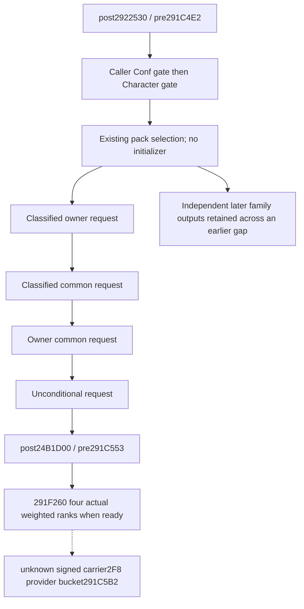
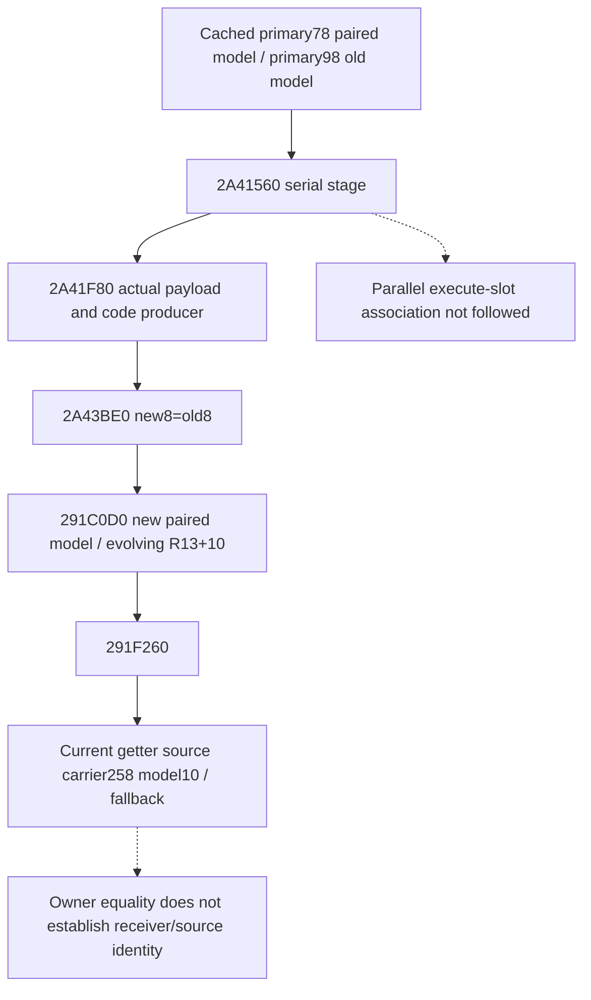
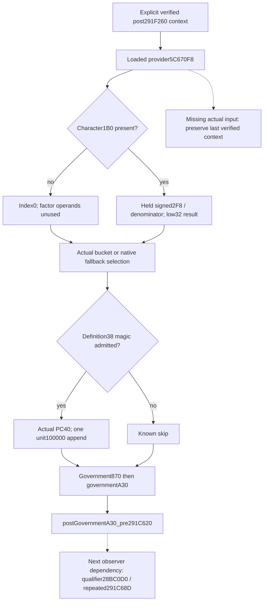
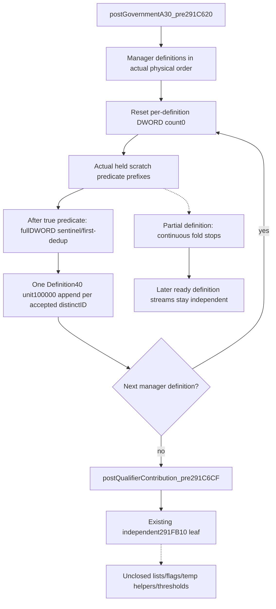
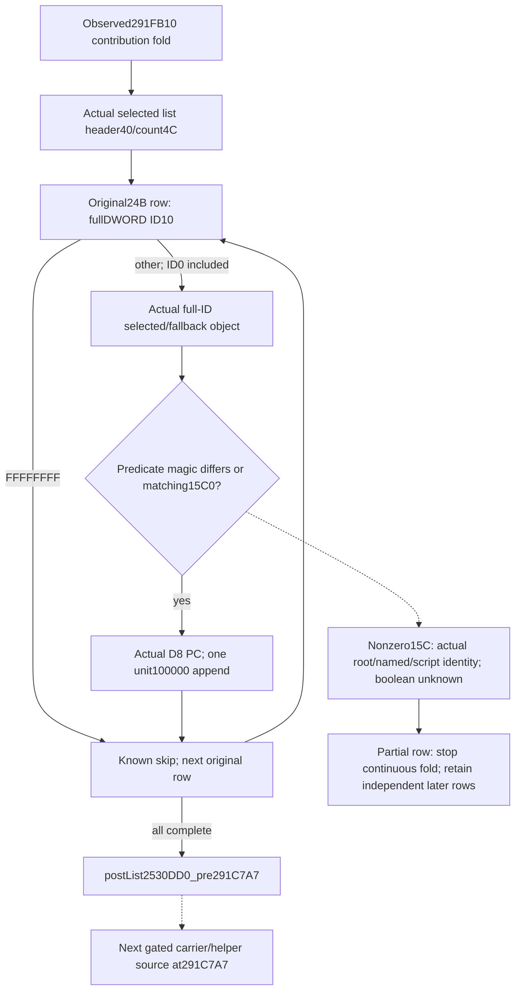
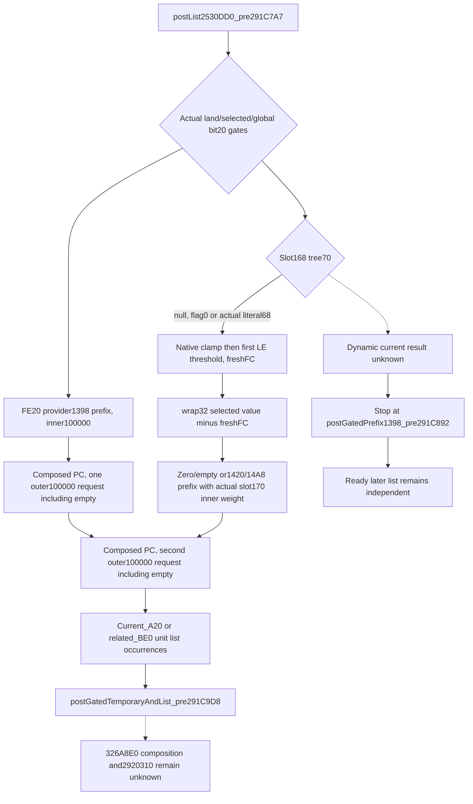
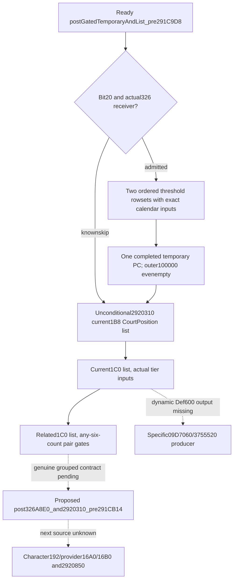

# Bounded person context stage chain (1.20.0.3)

The pure chain continues an explicitly supplied `post291D1D0_pre291C209`
logical context. It consumes the existing current-person source census and
task-position evaluated vectors in native caller order, stopping before
`291C467`. It never uses the current final Character context as a prior.

Source was sealed before implementation on 2026-10-05 at 23:25 Asia/Shanghai.
The frozen image is 1.20.0.3, SHA-256
`94B55397ABB687A3DCD436805A5D885E6BE90FA6C693FEB44A9E3BBEEADE02A6`.
This package reuses cached source; no fresh EXE read, hash, scan, or game access
is required for the ordered assembler.

The complete cached caller is
`Z:/ck3_mod_rewrite_process_assets/g2-resume-20261005/battle-trait-native-input-primitive-v79/context-source/region-0291C0D0.asm`.
The trait body is adjacent `region-0291D460.asm`, `[291D460,291D7D5)`.
Task inputs are documented in [task context preparation](battle-character-task-context-preparation-12003.md).
Source census families are documented in
[the person frontier](battle-first-contact-person-preparation-frontier-12003.md)
and [A/B source observation](battle-context-source-observer-12003.md).
The preceding constructor is documented by the person frontier's explicit
post-reset baseline section and implemented by
`battle_trait_materialized_prefix_12003.py`.

## Ordered input ledger

| Caller | Stage | Actual input and merge |
| --- | --- | --- |
| 291C209..277 | pre-A1640 | Actual Army generation/admission; provider1640 PC, Q100000 if admitted |
| 291C282 | 291E210 | Lifestyle, dynasty, house, optional house-extra spans; consecutive identity groups and signed64 weights |
| 291C28D | 291D460 | Ordered actual trait composites and each classifier side contribution; not base-only |
| 291C298 | 291D7E0 | Ordered source PC base then admitted A/B/C temporary composition; append each nonempty result at Q100000 |
| 291C2A3 | 291DED0 | Existing owned/passive evaluated rows, already scaled; append Q100000 |
| 291C2AE | 291DCE0 | Existing councillor/position evaluated rows, already scaled; append Q100000 |
| 291C2FE/32C/334 | post-B | Guarded630, carrier40, then every ordered D8 occurrence, Q100000 |
| 291C377 | 291F0A0 | Primary direct, manager range, A18 source, conditional direct, Q100000 |
| 291C3FB/44C | later direct | Every ordered80 occurrence then admitted AA0, Q100000 |
| 291C457 | 291F550 | Government indexed, culture direct, culture mapped, Q100000 |
| 291C462 | 291F940 | Per outer occurrence direct160 then inner450 occurrences, Q100000 |

`291DED0` and `291DCE0` are already available through
`current_context_task_position_inputs`. Their evaluated-vector readiness is
independent of the older causal API's unobserved historical prefix/postaggregate.
This assembler supplies the explicit prior and uses the existing merge kernel;
it must not reapply declaration scale. Source census whole-section `partial`
does not suppress an independently available leaf.

`291D460` uses Character+F8/+104 actual trait order, native B0/B4 selectors,
`28BB0F0` growth input, and `30E49F0` temporary composition. `291D683` appends a
nonempty composite at Q100000. Afterwards `291D6A1 -> 28BD84A0` selects no
side contribution for result0, provider1620+40 for result1, or provider1630+40
otherwise, through `291D71A -> 291B690`. The side helper needs its own source
closure before a collector can label the entire positive-trait stage ready.
Actual trait count0 is a distinct known-empty path. A missing collector is
unknown, not a synthetic empty stage.

## Minimal reachable interface

`PersonStageChainStart12003` requires full Character ID, the exact preceding
stage name, explicit logical context, and provenance. A caller can pass the
ready result of `assemble_person_stage_prefix_and_branch_12003` explicitly.
`assemble_person_stage_chain_12003` takes the normalized source section and
normalized task-position section from the same current-person observation.
The trait collector must publish its complete native-order requests into the
same source census; a detached parameter must not be the only reachable path.

The result exposes Character ID, stage name, logical context, readiness,
ordered source ledger, intermediate contexts, and independently available
later outputs. At the first gap, the coherent aggregate stops at the verified
frontier. Later outputs remain visible without being folded across the gap.
Known-empty branches advance the frontier; unknown branches do not. Existing
`2303120/23033BC` merge arithmetic retains first-copy duplicate/FFFF behavior,
signed64 wrapping and request occurrence order. Physical allocator state is
outside this logical projection.

The six-skill kernel can consume an explicitly named assembled context and
explicit remaining actual operands. Its result is a conditional projection
at that stage. The bounded chain does not close later preparation, scratch258,
final cache callbacks, Entry construction/refresh, or a battle forecast.

Status: **static-ready** for this bounded logical chain. The same-query trait
source contract is a dependency owned by the native observer package. Its
cached source now closes `291B690` as a unit100000 contribution of the original
PC and `2BD84A0` as a full TraitDef pointer lookup in the selectedA+950 effective
map. The new contract emits each complete composite followed by its classified
side PC. The initial source-first gap above records what was known before that
owner's closure; it is not a remaining source ban.

The new focused production-normalizer integration executed on **2026-10-06 at
00:01 Asia/Shanghai**. First attempt was harness RED because the synthetic A
census omitted the observed disabled-fourth-span header; correcting that fixture
to its explicit zero header yielded **1/1 GREEN in 0.015s**. No production logic
changed for the repair. The fixture covers a source-proven zero-trait stage and
positive A/B, already scaled task rows, and duplicate later occurrences. It
does not substitute an empty vector for a missing trait stage or qualify the
native positive-trait collector by itself.

The bounded stage returns six skills `(6,6,6,6,6,40)`. Removing the trait leaf
keeps the actual last coherent stage `post291E210_pre291C28D`, six skills
`(6,6,6,6,6,14)`, and independently available later outputs; whole-chain
readiness is false. The original current-final numeric operand is preserved.
Whole source and task sections may remain partial when their consumed leaves
are independently available. Task declaration scale7 is not applied again.

Receipts are
`Z:/ck3_mod_rewrite_process_assets/g2-background-round4-20261005/person-stage-chain/attempt-01.json`
and `attempt-02.json` with exact production source hashes. Integration used the
real parent-owned `Z:/gbs1/ck3_autonomous_player/src` production normalizer and
trait contract; only this owned stage-chain module was loaded from `Z:/gbs2`.
No mock contract or normalizer was installed. Old cases were not executed;
native builds, fresh EXE reads and game operations were zero. No live evidence
or complete person/Entry forecast is claimed.

## Next tail continuation, source ledger only

The native owner supplied the next order from the cached full caller and
`Z:/ck3_mod_rewrite_process_assets/g2-background-round4-20261005/person-tail/SOURCE-TREE-INITIAL.md`
(source-only commit `8557f9a7`). Closed helper source updates are supplied by
that owner's children; this chain does not reread their cached callee windows.

After `291F940`, native order is helper2753860 (`291C4C7`), REQUIRED helper2922070
(`291C4D2`), helper2922530 (`291C4DD`), conditional conference24B1D00
(`291C548`), helper291F260 (`291C553`), signed2F8 provider bucket (`291C5B2`),
government870/A30 (`291C5E4/61B`), qualifier/repeated contribution (`291C68D`),
helper291FB10 (`291C6CF`), intervening lists/flags/temporary helpers/thresholds,
and the stored signed64 carrier-weighted630 family (`291CC49`). More preparation
continues from `291CC71`; none of it is a default empty tail.

Source-closed sparse families use dedicated tail-prefix, middle-helper and
tail-direct contract modules. Helper2922070 is source closed but its collector
is the immediate missing contiguous dependency. Conference24B1D00 is the next
source gap. Both remain explicit gaps until their actual optional inputs close.
The cached first218 gate and first+1D0+48 recheck read the same physical byte;
a fixed-frame projection cannot manufacture contradictory values for them.

At its original source-ledger seal, no tail implementation or test qualification was claimed.

## Oct6 actual qualification and adoption (2026-10-06T00:21:35+08:00)

Source-first implementation `7af9c744ea960958b95ee3c96bc88a2a920d26d7` depends on actual shared production trait contract `c688d593`. First new case at00:01 had a fixture-only missing disabled fourth-span header; corrected known0 header then only newcase1/1GREEN0.015s. Exact earlier frontier remains useful when trait unavailable: prowess14 vs complete boundedpre467 prowess40, current-final input retained. Both attempts and sourcepins are in `person-stage-chain/ROOT-DELIVERY.json` and attempt-01/02 files. Source/implementation Oct5; first qualification Oct6. A subsequent2753860 continuation case is separately owned and not included in this first-case result. No earlier passed case rerun/native build/game operation.

That copied ledger was sealed before the continuation implementation.

The next bounded continuation API will take the existing chain result and the
same normalized source section. Its default requested bound is immediately
after helper2753860, before `291C4D2 -> 2922070`. This independently complete
prefix can be ready when actual275 operands are complete. Explicitly asking
through2922530 requires the intervening2922070 observation and preserves a
partial275 frontier until that observer exists. All later sparse outputs and
future gaps remain in the ordered ledger; readiness of a requested early bound
does not label the whole tail ready. A partial preceding pre467 result retains
its actual earlier context and cannot jump across its prior gap to275.

The continuation is now implemented by
`continue_person_stage_chain_tail_12003(previous_result,source_inputs,through_stage="2753860")`
and its same-query person-state wrapper. It reuses the existing logical merge
arithmetic and the native owner's real `c688d593` contract emitters. Each later
sparse stage remains independently visible in native caller order. Only
contiguous stages up to the explicitly requested bound are folded; future
gaps remain in `future_tail_missing_inputs`. `all_tail_source_stream_ready`
stays false. Source-closed2922070 currently has no emitter/collector, while
conference and other untranslated segments remain source gaps.

A distinct new production-normalizer tail integration passed **1/1 once in
0.012s on 2026-10-06 at 00:16 Asia/Shanghai**, receipt
`Z:/ck3_mod_rewrite_process_assets/g2-background-round4-20261005/person-stage-chain/tail-attempt-01.json`.
The actual275 input's two reads of the same gate byte both equal1, its native
pointer predicate and direct owner equality admit a Q100000 PC. Explicit prior
prowess2 plus contribution3 and base6 yields `(6,6,6,6,6,11)` at
`post2753860_pre291C4D2`. Requesting through2922530 remains partial at that same
275 frontier because2922070 is missing. Government870/A30 and stored signed64
weights `(0,-100000,200000)`, including duplicate identities, stay independent
and are not merged over the gap. An earlier A-stage partial prior also cannot
jump to275. Original query/prior data remain unchanged.

This new case did not rerun the previously successful pre467 case or any old
case. Native builds, fresh EXE reads and game operations remained zero. It is
**static-ready for the independently complete275 bound and sparse output
consumption**, not complete tail/person preparation/Entry or live evidence.

On 2026-10-06 the native owner's dedicated helper2922070 source packet closed
the remaining sort adapters with 4330 narrowly read bytes. This chain lane
reuses that packet and reads no EXE bytes. The actual Character comparator
passes `Character+10` to the getter's `+8`, yielding unsigned full DWORD18;
equal keys are stable and only adjacent equal Character pointers are removed.
The final existing-first comparator passes `source+8`, yielding unsigned full
DWORD10. Its equal keys remain stable and its source pointers are not deduped.
This corrects the older source packet's comparator argument without changing
its archived receipt.

The source ledger is
`Z:/ck3_mod_rewrite_process_assets/g2-background-round4-20261005/person-tail/helper-2922070/SOURCE-TREE.md`,
with its `QUERY-PLAN.json`. Whole government/land/subject false gates permit a
known skip. Admitted helpers require complete DFS, Character filter/order,
membership, full-ID output mapping and each demanded BA0 row. Type280 and
definitionmagic38 precede the native signed index clamp and actual inline BA0
PC. Each admitted occurrence requests Q100000 from the actual model+10
receiver, including an initialized empty PC. Missing demanded input remains a
gap instead of an empty helper.

The corresponding real contract, shared normalizer wiring and lazy prefix API
forwarder are committed as `24b70e4bd61c8446bcfe0008574b2be4afdb77cb`.
This source update precedes the new qualification; no new case has passed at
this point. The existing dynamic slot can now consume those real inputs.
The next distinct case requests through2922530, with an exact successful
frontier `post2922530_pre291C4E2`. Conference24B1D00 at291C548 remains the next
source gap.

The new through2922530 integration is now **GREEN 1/1 once in 0.010s**, on
2026-10-06 at00:41 Asia/Shanghai, receipt
`Z:/ck3_mod_rewrite_process_assets/g2-background-round4-20261005/person-stage-chain/2922070-attempt-01.json`.
It consumes the genuine production normalizer and the `24b70e4b` contracts,
using a distinct source-shaped synthetic frame. Complete singleton self
collection and membership preserve the signed full generation DWORD
`-2147483639`. No sort-key read is manufactured for the singleton. An admitted
BA0 contribution then joins the three actual2922530 call slots, including an
initialized empty PC at native selected index-1. That request stays visible,
while the existing kernel copies no aggregate/weighted rows from its empty PC.

Explicit prior prowess2,275 contribution3,BA0 contribution7,2530 contributions
empty/+2/-1 and base6 give `(6,6,6,6,6,19)` at the independently complete
`post2922530_pre291C4E2` bound. A demanded BA0 PC missing in the same case
preserves `post2753860_pre291C4D2` and `(6,6,6,6,6,11)`, while all three2530
requests remain independent. The dependency ledger now reflects actual
readiness instead of always reporting2922070 after that leaf closes.

No earlier GREEN case, old case, native target or game operation ran. This
qualifies the bounded pure chain and six-skill projection as **static-ready**.
It does not qualify the native2922070 collector, the full tail, full person
preparation, full Entry or live execution. The next source/input connection is
the actual conference24B1D00 stage at291C548; its native owner is preparing the
separate source ledger and optional leaf.

The next source-first increment reuses
`Z:/ck3_mod_rewrite_process_assets/g2-background-round4-20261005/person-tail/conference-24b1d00-source/SOURCE-TREE.md`
and `QUERY-PLAN.json`, sealed by the native owner with1632 narrowly read EXE
bytes. This pure chain lane reads no new EXE bytes. Actual optional leaf
`conference_24b1d00` and its family emitters are committed in `754edac6`.

Caller291C548 resolves Conf from Character1C8 carrier80 full DWORD or-1,
Conf registry5D1EB78/fallback5D1EB50. Its magicC/fullID8 gate precedes the
helper's Character magic1C/fullID18 gate. False gates are known zero requests.
Actual Conf38 configuration and signedConf60 target select the existing pack:
disabledAB08 chooses initialized inline54EBAB0; otherwise backward inline1530
rows choose the last timestamp at or before target. A mapped record consumes
no unused inline guard. This bridge does not call an initializer.

The four actual Q100000 requests are classified_owner
(24B1DF0/24B1E29/24B1E52), classified_common(24B1E67),
owner_common(24B1E87), unconditional(24B1E9C), in that order. Category compares
full first/second DWORD10, then actual QWORD220 equality if IDs differ. Owner
compares second DWORD160 with actual Character DWORD18. Category common does
not need owner; owner common does not need first/category; unconditional needs
only gates and selected pack. Initialized empty PCs remain requests.

Before implementation, the plan is to fold only the verified continuous
family prefix and preserve independently ready later families. A missing
second family keeps the explicit context at
`post24B1D00_classified_owner_pre24B1E67`; missing third keeps
`post24B1E67_pre24B1E87`; missing fourth keeps
`post24B1E87_pre24B1E9C`. Complete conference returns to
`post24B1D00_pre291C553`. The already source-closed291F260 four weighted ranks
may follow only when their actual normalized input is ready. Signed carrier2F8
provider bucket291C5B2 remains the next untranslated stage.

This increment is now implemented in the existing tail continuation. Each
conference family has an independent output under
`conference24B1D00.<family>`. Only its continuous ready family prefix enters
the assembled context. Its ledger records the four family readiness/results
in native order; the result stage names the actual last completed PC call
when a following family is missing. Fully observed conference can continue
to the existing291F260 emitter without requiring the later291FB10 family.

One distinct production-normalizer integration passed **1/1 once in0.011s**
on2026-10-06 at00:50 Asia/Shanghai, receipt
`Z:/ck3_mod_rewrite_process_assets/g2-background-round4-20261005/person-stage-chain/conference-attempt-01.json`.
It uses a source-shaped synthetic frame through the genuine `754edac6`
conference and `c688d593` middle-helper contracts. Different relationship full
IDs with equal actual null QWORD220 identities choose the other-ownerC70,
commonE30,other730 and unconditional8F0 PCs. Backward pack probes skip row2
timestamp70 and select row1 timestamp40 at target50; no unused inline default
guard is supplied. All four contributions remain in native order.

Actual291F260 weight lookups produce `(100000,-100000,200000,0)` for its four
rank0 families, without converting them to declaration multipliers. Their
nonempty PCs contribute net prowess1. Earlier explicit prowess13 plus
conference1+2+3+4, rank net1 and base6 produce `(6,6,6,6,6,30)` at the ready
bound `post291F260_pre291C558`. Later291FB10 remains explicitly unavailable
and does not erase the complete independent291F260 input.

When classified_common's demanded PC is missing, the same case retains only
the classified_owner addition at
`post24B1D00_classified_owner_pre24B1E67`, giving `(6,6,6,6,6,20)`.
Owner-common/unconditional and all four rank requests remain independent;
they are not merged across that gap. The original query and explicit prior
stay unchanged. No earlier GREEN case, old case, native build, new EXE read or
game operation ran. This is **static-ready for the bounded through291F260
chain**, with no full tail/person preparation/Entry or live claim. The next
contiguous dependency is signed carrier2F8 provider bucket at291C5B2.

Scope correction recorded immediately after qualification:291F260's emitted
weights are **held current evaluated same-query values**. Its arithmetic/order
fixture proves a conditional fold under those observed values; it does not
prove that a future assembled context would re-evaluate to those same weights.
The source ledger now explicitly records `source_operand_scope`,
`conditional_on_observed_source_values`, `291f260_weight_source_scope`, and
`291f260_weights_recomputed_from_assembled_context=false`. Readiness here
qualifies the bounded projection under its declared observed source operands.
The named stage is the source-order frontier of that conditional fold, with no
historical-frame or native preparation claim.

True preceding-stage weight evaluation needs the actual28C3AE0 receiver and
context/model10 source proof, then keys45/44/46/47 derived from the coherent
preceding context rather than copying current-final weights. That is a
separate functional input connection. This metadata-only clarification changes
no arithmetic and reruns no successful case. Native/provider source ownership
remains with the native owner; the next signed2F8 packet must also preserve its
actual control-flow return edges before extending the chain.

The dispatcher identity seam is now source-closed for its serial paired
construction binding. The packet is
`Z:/ck3_mod_rewrite_process_assets/g2-background-round4-20261005/person-stage-chain/model-assignment-timing/SOURCE-TREE.md`
with `SOURCE-READ-RECEIPT.json`. Cached2A3EF00 binds closure40 to primary78's
pair descriptor and closure48 to the primary manager. First stage2A41560's
serial call2A41944 reaches2A41F80, whose actual LEA2A41FBE pins callback2A43BE0.
The wrapper supplies `{indirect closure48, closure40, signed index pointer}`.

That callback selects newmodel=pair.data[index*16]+8 and
oldmodel=primary98.data[index*8]. At2A43C20 it copies oldmodel8 to newmodel8,
then tail2A43C91 invokes291C0D0 with the new paired model. Nonzero oldmodel1C
only requests storage reservation on the new model's context and aggregate
headers; no copied numeric postimage is inferred. There is no direct
carrier258 assignment in this captured binding callback. Its fresh evolving
R13+10 is therefore a separately constructed receiver. Same Character owner
alone cannot identify it with the already closed current28C3AE0 source.

The distinct2A3DB50 direct remaining-old-model branch, external queued-model
association, parallel execute slot and storage/constructor side effects stay
separate. This result supports retaining the held-current conditional scope;
it does not authorize automatic preceding-stage key45/44/46/47 substitution.
No arithmetic or query interface changed. New narrow frozen I/O was1616B:
1592code bytes including one necessary instruction-boundary overlap,24pdata
bytes,70reused metadata consults and no new handler/unwind read or full scan/
hash. The current getter cache was reused once before capture and never read
again during it; it receives no new research credit. No tests, native builds
or game operations ran. This source seam is not a live blocker; the real
signed2F8 provider input remains the next useful independently owned work.

The signed2F8 source seam had an initial reachability interpretation RED before
implementation: null1B0/nonnegative forward branches were mistakenly described
as bypassing government/qualifier/291FB10. Reusing only cached caller391-397
closes the return edges:291C715 jumps back291C595 on count miss;291C728 jumps
back291C59C after actual bucket selection. Both rejoin the Definition magic/
optional unit40 append and continue291C5B7. Null1B0 selects index0 and uses the
same flow. No production branch or readiness claim used the incorrect bypass.
The corrected native stage order remains bucket40 then government/qualifier/
291FB10. Original interpretation and correction are preserved in the external
`SIGNED2F8-CALLER-SEAM.md`; no test, native build or new EXE read was needed.

## Actual provider source connected to the government bound

The genuine optional same-query leaf `provider_bucket_291c5b2` and production
normalizer are committed as `9929e545abad505cab3a2b3dc67f1ec9b6886d1f`.
The chain now calls
`battle_person_provider_bucket_contract.emit_provider_bucket_requests_from_current_source_inputs_12003`.
It retains the actual selected PC object, its identity, unit100000 weight and
actual nonnegative bucket index (fallback occurrence index0), before the
existing government870 and governmentA30 contributions. It does not copy the
current-final context into the explicit prior.

The native provider getter requires loaded slot5C670F8 before the carrier
branch. Missing loaded state remains unavailable; no initializer is invoked.
Absent Character1B0 gives index0 without demanding numerator/denominator.
Otherwise its held signed2F8 and denominator5C68CE8 use the already closed
signed low32 factor result; denominator0 produces42949. A negative index or
signed count miss selects actual fallback5D1E0B0. An in-range index selects
the actual QWORD from provider11F8. Definition38 magic4744624F admits its PC40;
a wrong magic is a known skip. All selection paths rejoin291C5B7.

`through_stage="government_870_a30"` can now be independently ready under an
explicit baseline and observed source values. Missing provider data leaves the
last verified `post291F260_pre291C558` context and independently emitted
government requests. The next unknown chain slot is qualifier28BC0D0/repeated
append291C68D, owned by the separate qualifier work package; its source is
closed and its actual producer/contract are being implemented. Later lists,
flags, temporary helpers, thresholds and final preparation remain unclosed.
Held-current260 weights and provider2F8 operands remain conditional source
inputs; this connection supplies neither future reevaluation nor full Entry.

The new focused production-normalizer -> bounded stage fold -> six-skill case
is `test_battle_person_provider_stage_chain_12003.py`. Its first qualification
receipt is stored separately in the external stage-chain packet. Previous
successful cases are not rerun for this extension.

The first new case passed once on2026-10-06 01:38:36 Asia/Shanghai (1/1,
0.014s). The selected denominator-zero bucket42949 and null-carrier bucket0
both reach `postGovernmentA30_pre291C620`, six skills `[6,6,6,6,6,40]`.
The signed negative-index fallback reaches the same bound with skills
`[6,6,6,6,6,29]`. Missing selected PC preserves `post291F260_pre291C558`,
skills `[6,6,6,6,6,30]` and the two independent government requests.
Receipt `provider-attempt-01.json` identifies the exact consumed source files.
This is static-ready pure source assembly, using synthetic source-shaped input
through production code; it does not qualify the native collector or any live
frame. No old case, native build, fresh EXE read or game operation was run.

## Actual qualifier repetition connected in source order

The separate source owner sealed `battle-person-qualifier-repetition-12003.md`
at01:25:57 on2026-10-06, before its implementation (b5ee1c03). Its receipt
records913 new EXE bytes by that owner; this chain consumes the sealed tree and
reads zero new EXE bytes. Genuine pure45c69184 is adopted on the producer tree
as dd7e1886, followed by shared normalizer
`ce5cccf277517b6d0f949422eaf7ffd61b081e41`.

The optional `qualifier_28bc0d0` holds the current actual manager5D1E2B0
definitions50/count5C and Character1B0 scratch record prefixes. For each
definition, native291C655 resets the local output DWORD count. Call28BC0D0
evaluates2596950/25942D0 direct or relationship pointer matches first, then
reads the full DWORD ID, rejectsFFFFFFFF and keeps its first accepted
occurrence. Different generation bits remain different IDs. Dedup resets per
definition; duplicate manager definition occurrences remain distinct.
Native291C68D adds Definition40 with unit100000 once per accepted distinct ID,
in manager order. The next helper call is291FB10 at291C6CF.

The chain uses the genuine whole/per-definition emitters reexported by
`battle_person_qualifier_28bc0d0_contract`. A complete stream preserves its
global source ordinals and every unit request. On a partial definition it
retains all independently ready definition streams and folds only the complete
definition prefix. Its partial logical stage is
`postQualifierDefinition{last verified native index}_pre291C655`, meaning the
next definition's reset is the frontier. A known zero-repeat definition can
advance that prefix without fabricating a PC. With no complete definition
prefix, the verified government context remains the result.

`through_stage="qualifier_repeated_contribution"` supplies this bounded
logical context under explicit baseline and observed current scratch operands.
It does not establish a new construction-stage scratch association or reevaluate
future object/relationship inputs. Existing held-current260 weight scope,
current-final exclusion and full preparation/Entry false flags are retained.
The distinct new chain integration is
`test_battle_person_qualifier_stage_chain_12003.py`; the source owner's compound
predicate case and our previous provider/government case are not rerun.

The first distinct qualifier chain case passed once on2026-10-06 01:47:54
Asia/Shanghai (1/1, 0.014s). Its repeated unit stream has physical definition
indices `[0,0,1,2,2]`, preserving duplicate manager Definition0 again at2 and
full DWORD IDs `AB000001/CD000001` as different identities. The ready bound
`postQualifierContribution_pre291C6CF` projects skills `[6,6,6,6,6,47]`.
Missing Definition1 PC keeps the complete Definition0 prefix at
`postQualifierDefinition0_pre291C655`, skills `[6,6,6,6,6,44]`; the two later
Definition2 requests remain independently available and are not folded across
that gap. Receipt `qualifier-attempt-01.json` binds the actual source files.
This is static-ready conditional pure assembly, using source-shaped synthetic
frames through production code. The native collector and full current
preparation/Entry remain separate qualifications. No old test, native build,
new EXE read or game operation was run by this chain extension.

## First actual ordered predicate list connected after291FB10

Source-owned topic `battle-person-list-predicate-12003.md` is sealed by4b12dbc6;
its source receipt records3241 new EXE bytes by the gbs3 owner. This chain reads
zero new EXE bytes. Genuine pure/strict contract
`dd6a6200223bbabac3b0ae9fe4e4274c69b6f71f` is adopted on the producer tree
as f9bbad75. Shared production normalizer
`cfb47238632c163748687c7d380a0a2bdd019bd8` publishes the optional same-query
`list_predicate_2530dd0` leaf before this stage implementation.

Native291C6D4 follows the existing291FB10 helper. Getter28AA8B0 selects actual
inline held scratch458, or inline static54E7180 with guard5D67818. The list
header reads pointer40 before signed count4C, then24B physical rows/fullDWORD
ID10. Count0 and allFFFFFFFF are known no contributions. ID0 is a real lookup;
every nonsentinel occurrence is retained, including duplicate IDs. Selected
objects come from actual full-generation lookup5D1DE68 or actual fallback
5D1DE30. At291C779,2530DD0 returns true for predicateReceiver490 magic38
different from4744624F, or matching magic with signed15C exactly0. Only those
source-closed true branches select actualD8 PC and one unit100000 append.

Nonzero15C requires scoped evaluation with root kind4 Character18 and named
kind31 selected10 under key5D4C018. The raw trigger110/vtableC8 identity is an
observation seam; its boolean and applicability372B4E0 remain unclosed. A
negative15C is nonzero too. No true/false result or selected298 PC is guessed.
Selected static uninitialized state remains partial; unused default guard0/-1
does not remove valid held-scratch input because its initialization writes the
default only.

The public bound `through_stage="list2530DD0"` folds existing291FB10 first,
then this genuine whole-stream emitter. It preserves source ordinals, every
unit request and actual PC references. On partial input the genuine per-row
emitter retains independently ready later rows; only the complete physical row
prefix reaches the context. Sentinel skips can advance that prefix without
adding a contribution. A partial stage such as
`postList2530DD0Row1_preRow2` records exactly the last verified physical row and
the next missing row, rather than labeling the requested final bound.

Held-current list/scope inputs and260/provider/qualifier scope remain
conditional on observed values and the supplied explicit logical baseline.
This stage does not prove a freshly generated post291FB10 list or a historical
frame. Next source ownership is the separately assigned gated carrier/helper
segment at291C7A7/C8AE; remaining lists, flags, temporary helpers and thresholds
are still an explicit gap before weighted630. The one distinct new chain case
is `test_battle_person_list_stage_chain_12003.py`; neither the list source
owner's compound case nor our previous successful stage cases are rerun.

The first distinct FB10/list chain case passed once on2026-10-06 02:11:59
Asia/Shanghai (1/1, 0.030s). Ready bound
`postList2530DD0_pre291C7A7` projects skills `[6,6,6,6,6,51]`; source request
indices `[0,2,3,4]` retain duplicate ID occurrences and a real ID0 contribution
while sentinel row1 skips. Held-scratch selection remains ready with unused
default guard0. A nonzero scripted row2 preserves
`postList2530DD0Row1_preRow2`, skills `[6,6,6,6,6,50]`, its distinct root/named
full IDs and unknown evaluator pointer. Known later rows3/4 remain independent
and are not folded across the scripted gap. Receipt `list-attempt-01.json`
binds the exact consumed production source files. This is static-ready bounded
conditional pure assembly; source-shaped synthetic frames do not qualify the
native collector or a live frame. No old/sibling test, native build, new EXE
read or game operation was run by this chain extension.

## Raw literal gated temporaries and list at291C7A7

Source-owned interval `[291C7A7,291C9D8)` is sealed in the external
`person-tail/gated-temporary-tail-source/SOURCE-TREE.md`, `QUERY-PLAN.md`,
`LITERAL-EMPTY-ADDENDUM.md` and the final raw/numeric-empty schema clarifications.
The source owner reads2710 new EXE bytes, including72 duplicate metadata bytes;
this chain reads zero new EXE bytes. Source-only262adf4f and the genuine
producer contract/production normalizer932f2eac precede this stage code.
External `person-stage-chain/GATED-SOURCE-PLAN.json` seals family order and
partial frontiers before implementation. The actual addendum is5688 bytes with
SHA256 `d6ec94e236a8a74a90a85507b7eb65a8cf2679961a78ed44aafbbeabf730d86e`;
the separately reported1666-byte/hash receipt is metadata, not that Markdown.

The optional leaf `gated_temporary_tail_291c7a7` supplies the actual family
emitter in `battle_person_gated_temporary_tail_contract.py`. The new public
bound `through_stage="gated_temporary_tail"` folds, in order, `prefix_1398`,
`delta_prefix_1420_14a8`, then `list`. Internal FE20 blocks use the source-closed
paired property fold to form each temporary PC first. Only its one outer
unit100000 B3D0 request is appended to the person context. Inner slot170 weight
is consumed during temporary composition and is not applied a second time.
Duplicate source blocks and list occurrences remain ordered. A true temporary
gate has exactly two outer source occurrences, including a numeric empty PC;
the existing property writer skips the empty weighted row, not its source
position. Known bit20 false gives an empty whole segment. With absent current
selected458, the two temporary families skip, while a bit20-enabled relatedBE0
list still has its own source demand.

Slot168/170 decoding checks tree70 first. A nonnull tree remains precise
dynamic missing; a null tree with flag7B0 yields a legal zero without reading68;
any nonzero flag takes the actual signed literal68. Slot168 literal/zero is
clamped by the native minimum-first branch, then the first stored threshold
greater than or equal to it yields freshly derivedFC. CachedFC is not used.
Delta is wrapped signed32 selectedE8/F8 minus that fresh rank. Zero delta and
source-proven numeric-empty prefixes can leave170 unconsumed. This is numeric
assembly and does not claim equivalence to native evaluator activity.

The result preserves the verified context even if a later family is missing.
Completing only1398 reaches `postGatedPrefix1398_pre291C892`; completing both
temporary families reaches `postGatedDeltaPrefix_pre291C8AE`, including known
skips with zero requests. A missing delta never becomes an invented empty PC.
The bound becomes ready only when every preceding source stage and all three
families are ready. Current selected/provider/list inputs and earlier260
weights retain their held-current conditional scope, with an explicit logical
baseline. Full person preparation and full Entry remain false. The next exact
source seams are291C9D8→326A8E0→B3D0 at291CAFA and291CB0F→2920310; no broad
unknown segment is assumed empty before weighted630.

The new compound integration is
`test_battle_person_gated_stage_chain_12003.py`. It consumes the producer's
genuine fixture builder without invoking its test, then joins the production
normalizer, owned stage chain and existing six-skill kernel. Literal negative
inner weight, dynamic fresh-rank absence and zero-delta source occurrence are
the distinct new behavior. Its qualification is recorded only after the first
new run; previous/sibling qualified cases are not rerun.

The new compound chain case is GREEN on2026-10-06 02:52:35 Asia/Shanghai
(1/1, 0.018s), receipt `gated-attempt-02.json`. The literal path composes two
temporary PCs with contributions2Q and5Q, then two zero-valued list PCs; its
ready `postGatedTemporaryAndList_pre291C9D8` context has52Q and projects skills
`[6,6,6,6,6,58]`. The actual inner signed literal170 is-250000; both outer
requests remain100000. Dynamic168 absence preserves only the1398 prefix at
`postGatedPrefix1398_pre291C892`, context47Q and skills`[6,6,6,6,6,53]`, while
two later list requests stay independent. Zero delta retains its second empty
outer request with170 unconsumed; it yields46Q, skills`[6,6,6,6,6,52]` and one
fewer materialized weighted row. First attempt01 is preserved harness RED:
the test expected leaf reason text inside a field-based emitter diagnostic.
Only that assertion was corrected; production logic was unchanged before02.
This qualification uses source-shaped synthetic frames through production
Python, and does not qualify native reading or live execution. No old/sibling
case, native build, new EXE read or game operation was run by this extension.

## Next source ledger after the gated bound, before a released contract

The source owner seals `[291C9D8,291CB14)` on2026-10-06 03:10:36CST in
`person-tail/gated-tail-next-326a8e0-2920310/DELIVERY.json`. Source-ready knowledge
precedes any next chain code. Its recorded cost is6062 new EXE bytes
(5426 code+636 pdata; no duplicate reads), with cached730-byte calendar tables
reused. This consumer reads zero new EXE bytes and reuses the source tree and
corrections. Proposed optional leaf `after_gated_tail_326a8e0_2920310`, collector
and emitter names in that query plan are proposals; no genuine DTO/normalizer
or stage-chain implementation exists for this next segment yet.

The exact four-family order is326A8E0 composition,2920310 current1B8+D0/DC,
current1C0+3B8/3C4, then related1C0+3B8/3C4. The full-ID8 registry5D1DD10/08
and type110 are **CourtPosition**, proven by existing phase-misc ABI. Early
provisional Title wording is corrected before code. Fields120/124 remain raw
source labels; no owner/employer interpretation is inferred from their use.

| Ordered family | Source contribution boundary |
|---|---|
|326A8E0|Bit20 gates this family only. Current/related458 handle178 chooses mode1/0 and levelF8. Merge every admitted first threshold row in stored order, then month-threshold rows, into one PC. One CAFA B3D0 outer100000 occurrence is retained evenempty. Partial internal rows are not an actual Character outer contribution.|
|2920310 current1B8|Each original CourtPosition occurrence emits Def2748, then nonempty291B8D0 composition, then magic-admitted OtherDef1940.|
|2920310 current1C0|Each occurrence emits Def2908 and tier2CB8, nonempty291B8D0, then magic-admitted OtherDef1B00 and tier1CC0.|
|2920310 related1C0|Def3658/3818 and magic-admitted OtherDef2580/2740 pairs each require any of their six source PC counts nonzero. All-six-zero skips both/tier demand; an admitted pair retains two unit occurrences even if the chosen PC is empty.|

326A8E0 selects the entire8-byte date pointer with the signed maximum rawDWORD
between handle8 and currentCharacter1B8+E8, or literal4763CB8 when1B8 is absent.
Equal rawDWORD retains handleDate.3836460 compares currentDate to that chosen
date by completed calendar months, including cached day/month/year fields or
source-closed365-day decoding and day comparison. It is neither a rank nor
30-day division. The three2920310 lists are processed independently of bit20,
with full DWORD generation IDs and occurrence order, including repeats.

291B8D0 merges its base, conditionalB, then conditionalA PCs using previously
closed D460 membership inputs, without growth. It appends only a nonempty
composite. This differs from direct PC and326 caller occurrences, which retain
empty requests. Related default list54E7220 is an actual raw header or separately
explicit modeled initializer result; no initializer is executed or relabeled
observed. Negative list counts remain precise missing inputs.

Tier2423700 uses actual played-character full-ID membership and rawA0, or
Def600 numerical result with the first four stored signed thresholds. A
threshold count below4 proves numericalkind4 while native evaluation activity
remains a separate fact. Def600 ScriptValue checks modeC0 first: mode0 copies
raw signed98 before any tree access. This precedence differs from the prior
NamedValue tree70-first getter. Nonzero mode supports source-closed raw fallback
and nested named literal/zero; dynamic trees or typed targets keep exact missing
producer09D7060/3755520, without a generic expression interpreter or invented
tier. A future genuine grouped emitter must preserve these demand and source
occurrence differences before the pure chain can extend.

Current static-ready gated context does not depend on this future leaf. The
next query owner must release the actual four-group contract before this
consumer adds code or a new integration case. The proposed full next frontier
is `post326A8E0_and2920310_pre291CB14`; it is not attached to the current result.
Whole person/Entry readiness remains false. Source-only receipt and the minimal
input plan are in `person-stage-chain/AFTER-GATED-SOURCE-PLAN.json`; no test,
native build or game operation is run for this source-ledger increment.

## Source-only follow-on: Character192 provider and2920850

The disjoint unowned caller bound `[291CB14,291CB70)` is now source-ready in
`person-stage-chain/after-gated-provider-2920850-source/`. Its SOURCE-TREE.md
contains the exact stage ledger/Mermaid; QUERY-PLAN.md specifies the minimum
same-query raw inputs. Fresh narrow cost is1032B=888 code+144 pdata, with no
duplicate fresh spans, full EXE scan/hash, data/unwind/header read or game action.
Four contiguous2920850 fragments total757B throughRET2920B44. Its demanded
default getter28D7480 is131B; the cached provider getter and181B membership
helper4212920/mapper source are reused, not captured again.

Provider selection sign-extends Character WORD192. Signed upper5C69FE4 is
tested first: value>=upper selects loaded provider16A0. Otherwise value<=lower
5C69FE0 selects16B0; the middle interval selects actual fallback5D1E0B0.
Matching selected magic38 emits actual inlinePC40 once atunit100000, including
empty; wrong magic skips it.2920850 is unconditional after that selection.

Helper2920850 selects inline1C0+168 then1C0+180 when1C0 is present and1D0
absent, otherwise getter28D7480's static5D67E60 vector with guard5D67E58.
Each physical DWORD ID resolves through5D1EB60/fullID8 or actual5D1EB90
fallback. Its table4C0 has four fixed B30-stride rows. For each first-list
occurrence, all four directPCs at table80 precede all four nested headers at
table400; second-list offsets are240 and418. This ordering differs from
291F940's per-outer-row direct/nested interleaving. Duplicate list/descriptor
occurrences and direct empty source requests remain separate. Nested source
uses the existing thirdRite750 fullQWORD membership and first-match mapper,
with that Rite context distinct from the model10 recipient. No initializer or
native function is called; raw current default state and any explicit numeric
model of cold empty initialization remain separate scopes.

The proposed verified frontier is
`postProviderCharacter192_and2920850_pre291CB70`, requiring an explicit
preceding326/2920310 stage. No producer/contract or pure-chain extension is
delivered for this follow-on yet. Already closed carrierweighted630 follows
atCB70 and retains actual stored signed64 weights; later2920B50 atCC71 remains
the next source gap. Source-only evidence does not change current static-ready
preC9D8 readiness or qualify full person/Entry. There is no new test/build or
old-case rerun for this increment. The authorized four-family producer's
genuine contract remains the next implementation dependency for this consumer.
