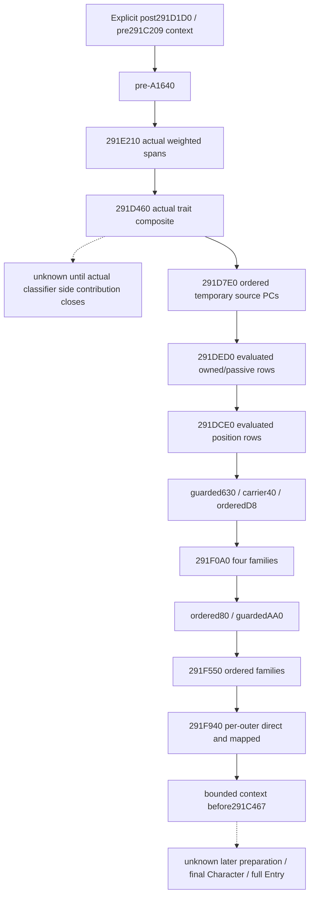
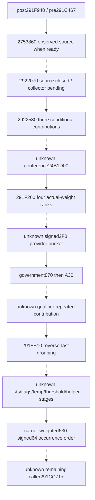
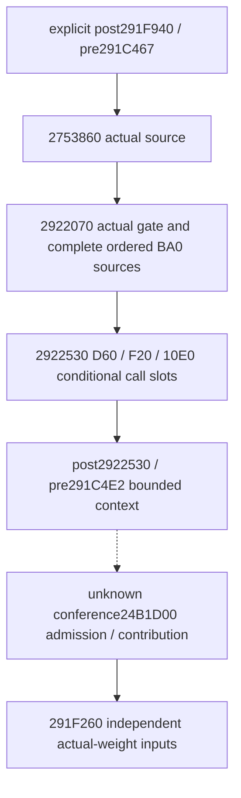

# Bounded person context stage chain (1.20.0.3)

The pure chain continues an explicitly supplied `post291D1D0_pre291C209`
logical context. It consumes the existing current-person source census and
task-position evaluated vectors in native caller order, stopping before
`291C467`. It never uses the current final Character context as a prior.

Source was sealed before implementation on 2026-10-05 at 23:25 Asia/Shanghai.
The frozen image is 1.20.0.3, SHA-256
`94B55397ABB687A3DCD436805A5D885E6BE90FA6C693FEB44A9E3BBEEADE02A6`.
This package reuses cached source; no fresh EXE read, hash, scan, or game access
is required for the ordered assembler.

The complete cached caller is
`Z:/ck3_mod_rewrite_process_assets/g2-resume-20261005/battle-trait-native-input-primitive-v79/context-source/region-0291C0D0.asm`.
The trait body is adjacent `region-0291D460.asm`, `[291D460,291D7D5)`.
Task inputs are documented in [task context preparation](battle-character-task-context-preparation-12003.md).
Source census families are documented in
[the person frontier](battle-first-contact-person-preparation-frontier-12003.md)
and [A/B source observation](battle-context-source-observer-12003.md).
The preceding constructor is documented by the person frontier's explicit
post-reset baseline section and implemented by
`battle_trait_materialized_prefix_12003.py`.

## Ordered input ledger

| Caller | Stage | Actual input and merge |
| --- | --- | --- |
| 291C209..277 | pre-A1640 | Actual Army generation/admission; provider1640 PC, Q100000 if admitted |
| 291C282 | 291E210 | Lifestyle, dynasty, house, optional house-extra spans; consecutive identity groups and signed64 weights |
| 291C28D | 291D460 | Ordered actual trait composites and each classifier side contribution; not base-only |
| 291C298 | 291D7E0 | Ordered source PC base then admitted A/B/C temporary composition; append each nonempty result at Q100000 |
| 291C2A3 | 291DED0 | Existing owned/passive evaluated rows, already scaled; append Q100000 |
| 291C2AE | 291DCE0 | Existing councillor/position evaluated rows, already scaled; append Q100000 |
| 291C2FE/32C/334 | post-B | Guarded630, carrier40, then every ordered D8 occurrence, Q100000 |
| 291C377 | 291F0A0 | Primary direct, manager range, A18 source, conditional direct, Q100000 |
| 291C3FB/44C | later direct | Every ordered80 occurrence then admitted AA0, Q100000 |
| 291C457 | 291F550 | Government indexed, culture direct, culture mapped, Q100000 |
| 291C462 | 291F940 | Per outer occurrence direct160 then inner450 occurrences, Q100000 |

`291DED0` and `291DCE0` are already available through
`current_context_task_position_inputs`. Their evaluated-vector readiness is
independent of the older causal API's unobserved historical prefix/postaggregate.
This assembler supplies the explicit prior and uses the existing merge kernel;
it must not reapply declaration scale. Source census whole-section `partial`
does not suppress an independently available leaf.

`291D460` uses Character+F8/+104 actual trait order, native B0/B4 selectors,
`28BB0F0` growth input, and `30E49F0` temporary composition. `291D683` appends a
nonempty composite at Q100000. Afterwards `291D6A1 -> 28BD84A0` selects no
side contribution for result0, provider1620+40 for result1, or provider1630+40
otherwise, through `291D71A -> 291B690`. The side helper needs its own source
closure before a collector can label the entire positive-trait stage ready.
Actual trait count0 is a distinct known-empty path. A missing collector is
unknown, not a synthetic empty stage.

## Minimal reachable interface

`PersonStageChainStart12003` requires full Character ID, the exact preceding
stage name, explicit logical context, and provenance. A caller can pass the
ready result of `assemble_person_stage_prefix_and_branch_12003` explicitly.
`assemble_person_stage_chain_12003` takes the normalized source section and
normalized task-position section from the same current-person observation.
The trait collector must publish its complete native-order requests into the
same source census; a detached parameter must not be the only reachable path.

The result exposes Character ID, stage name, logical context, readiness,
ordered source ledger, intermediate contexts, and independently available
later outputs. At the first gap, the coherent aggregate stops at the verified
frontier. Later outputs remain visible without being folded across the gap.
Known-empty branches advance the frontier; unknown branches do not. Existing
`2303120/23033BC` merge arithmetic retains first-copy duplicate/FFFF behavior,
signed64 wrapping and request occurrence order. Physical allocator state is
outside this logical projection.

The six-skill kernel can consume an explicitly named assembled context and
explicit remaining actual operands. Its result is a conditional projection
at that stage. The bounded chain does not close later preparation, scratch258,
final cache callbacks, Entry construction/refresh, or a battle forecast.

Status: **static-ready** for this bounded logical chain. The same-query trait
source contract is a dependency owned by the native observer package. Its
cached source now closes `291B690` as a unit100000 contribution of the original
PC and `2BD84A0` as a full TraitDef pointer lookup in the selectedA+950 effective
map. The new contract emits each complete composite followed by its classified
side PC. The initial source-first gap above records what was known before that
owner's closure; it is not a remaining source ban.

The new focused production-normalizer integration executed on **2026-10-06 at
00:01 Asia/Shanghai**. First attempt was harness RED because the synthetic A
census omitted the observed disabled-fourth-span header; correcting that fixture
to its explicit zero header yielded **1/1 GREEN in 0.015s**. No production logic
changed for the repair. The fixture covers a source-proven zero-trait stage and
positive A/B, already scaled task rows, and duplicate later occurrences. It
does not substitute an empty vector for a missing trait stage or qualify the
native positive-trait collector by itself.

The bounded stage returns six skills `(6,6,6,6,6,40)`. Removing the trait leaf
keeps the actual last coherent stage `post291E210_pre291C28D`, six skills
`(6,6,6,6,6,14)`, and independently available later outputs; whole-chain
readiness is false. The original current-final numeric operand is preserved.
Whole source and task sections may remain partial when their consumed leaves
are independently available. Task declaration scale7 is not applied again.

Receipts are
`Z:/ck3_mod_rewrite_process_assets/g2-background-round4-20261005/person-stage-chain/attempt-01.json`
and `attempt-02.json` with exact production source hashes. Integration used the
real parent-owned `Z:/gbs1/ck3_autonomous_player/src` production normalizer and
trait contract; only this owned stage-chain module was loaded from `Z:/gbs2`.
No mock contract or normalizer was installed. Old cases were not executed;
native builds, fresh EXE reads and game operations were zero. No live evidence
or complete person/Entry forecast is claimed.

## Next tail continuation, source ledger only

The native owner supplied the next order from the cached full caller and
`Z:/ck3_mod_rewrite_process_assets/g2-background-round4-20261005/person-tail/SOURCE-TREE-INITIAL.md`
(source-only commit `8557f9a7`). Closed helper source updates are supplied by
that owner's children; this chain does not reread their cached callee windows.

After `291F940`, native order is helper2753860 (`291C4C7`), REQUIRED helper2922070
(`291C4D2`), helper2922530 (`291C4DD`), conditional conference24B1D00
(`291C548`), helper291F260 (`291C553`), signed2F8 provider bucket (`291C5B2`),
government870/A30 (`291C5E4/61B`), qualifier/repeated contribution (`291C68D`),
helper291FB10 (`291C6CF`), intervening lists/flags/temporary helpers/thresholds,
and the stored signed64 carrier-weighted630 family (`291CC49`). More preparation
continues from `291CC71`; none of it is a default empty tail.

Source-closed sparse families use dedicated tail-prefix, middle-helper and
tail-direct contract modules. Helper2922070 is source closed but its collector
is the immediate missing contiguous dependency. Conference24B1D00 is the next
source gap. Both remain explicit gaps until their actual optional inputs close.
The cached first218 gate and first+1D0+48 recheck read the same physical byte;
a fixed-frame projection cannot manufacture contradictory values for them.

At its original source-ledger seal, no tail implementation or test qualification was claimed.

## Oct6 actual qualification and adoption (2026-10-06T00:21:35+08:00)

Source-first implementation `7af9c744ea960958b95ee3c96bc88a2a920d26d7` depends on actual shared production trait contract `c688d593`. First new case at00:01 had a fixture-only missing disabled fourth-span header; corrected known0 header then only newcase1/1GREEN0.015s. Exact earlier frontier remains useful when trait unavailable: prowess14 vs complete boundedpre467 prowess40, current-final input retained. Both attempts and sourcepins are in `person-stage-chain/ROOT-DELIVERY.json` and attempt-01/02 files. Source/implementation Oct5; first qualification Oct6. A subsequent2753860 continuation case is separately owned and not included in this first-case result. No earlier passed case rerun/native build/game operation.

That copied ledger was sealed before the continuation implementation.

The next bounded continuation API will take the existing chain result and the
same normalized source section. Its default requested bound is immediately
after helper2753860, before `291C4D2 -> 2922070`. This independently complete
prefix can be ready when actual275 operands are complete. Explicitly asking
through2922530 requires the intervening2922070 observation and preserves a
partial275 frontier until that observer exists. All later sparse outputs and
future gaps remain in the ordered ledger; readiness of a requested early bound
does not label the whole tail ready. A partial preceding pre467 result retains
its actual earlier context and cannot jump across its prior gap to275.

The continuation is now implemented by
`continue_person_stage_chain_tail_12003(previous_result,source_inputs,through_stage="2753860")`
and its same-query person-state wrapper. It reuses the existing logical merge
arithmetic and the native owner's real `c688d593` contract emitters. Each later
sparse stage remains independently visible in native caller order. Only
contiguous stages up to the explicitly requested bound are folded; future
gaps remain in `future_tail_missing_inputs`. `all_tail_source_stream_ready`
stays false. Source-closed2922070 currently has no emitter/collector, while
conference and other untranslated segments remain source gaps.

A distinct new production-normalizer tail integration passed **1/1 once in
0.012s on 2026-10-06 at 00:16 Asia/Shanghai**, receipt
`Z:/ck3_mod_rewrite_process_assets/g2-background-round4-20261005/person-stage-chain/tail-attempt-01.json`.
The actual275 input's two reads of the same gate byte both equal1, its native
pointer predicate and direct owner equality admit a Q100000 PC. Explicit prior
prowess2 plus contribution3 and base6 yields `(6,6,6,6,6,11)` at
`post2753860_pre291C4D2`. Requesting through2922530 remains partial at that same
275 frontier because2922070 is missing. Government870/A30 and stored signed64
weights `(0,-100000,200000)`, including duplicate identities, stay independent
and are not merged over the gap. An earlier A-stage partial prior also cannot
jump to275. Original query/prior data remain unchanged.

This new case did not rerun the previously successful pre467 case or any old
case. Native builds, fresh EXE reads and game operations remained zero. It is
**static-ready for the independently complete275 bound and sparse output
consumption**, not complete tail/person preparation/Entry or live evidence.

On 2026-10-06 the native owner's dedicated helper2922070 source packet closed
the remaining sort adapters with 4330 narrowly read bytes. This chain lane
reuses that packet and reads no EXE bytes. The actual Character comparator
passes `Character+10` to the getter's `+8`, yielding unsigned full DWORD18;
equal keys are stable and only adjacent equal Character pointers are removed.
The final existing-first comparator passes `source+8`, yielding unsigned full
DWORD10. Its equal keys remain stable and its source pointers are not deduped.
This corrects the older source packet's comparator argument without changing
its archived receipt.

The source ledger is
`Z:/ck3_mod_rewrite_process_assets/g2-background-round4-20261005/person-tail/helper-2922070/SOURCE-TREE.md`,
with its `QUERY-PLAN.json`. Whole government/land/subject false gates permit a
known skip. Admitted helpers require complete DFS, Character filter/order,
membership, full-ID output mapping and each demanded BA0 row. Type280 and
definitionmagic38 precede the native signed index clamp and actual inline BA0
PC. Each admitted occurrence requests Q100000 from the actual model+10
receiver, including an initialized empty PC. Missing demanded input remains a
gap instead of an empty helper.

The corresponding real contract, shared normalizer wiring and lazy prefix API
forwarder are committed as `24b70e4bd61c8446bcfe0008574b2be4afdb77cb`.
This source update precedes the new qualification; no new case has passed at
this point. The existing dynamic slot can now consume those real inputs.
The next distinct case requests through2922530, with an exact successful
frontier `post2922530_pre291C4E2`. Conference24B1D00 at291C548 remains the next
source gap.

The new through2922530 integration is now **GREEN 1/1 once in 0.010s**, on
2026-10-06 at00:41 Asia/Shanghai, receipt
`Z:/ck3_mod_rewrite_process_assets/g2-background-round4-20261005/person-stage-chain/2922070-attempt-01.json`.
It consumes the genuine production normalizer and the `24b70e4b` contracts,
using a distinct source-shaped synthetic frame. Complete singleton self
collection and membership preserve the signed full generation DWORD
`-2147483639`. No sort-key read is manufactured for the singleton. An admitted
BA0 contribution then joins the three actual2922530 call slots, including an
initialized empty PC at native selected index-1. That request stays visible,
while the existing kernel copies no aggregate/weighted rows from its empty PC.

Explicit prior prowess2,275 contribution3,BA0 contribution7,2530 contributions
empty/+2/-1 and base6 give `(6,6,6,6,6,19)` at the independently complete
`post2922530_pre291C4E2` bound. A demanded BA0 PC missing in the same case
preserves `post2753860_pre291C4D2` and `(6,6,6,6,6,11)`, while all three2530
requests remain independent. The dependency ledger now reflects actual
readiness instead of always reporting2922070 after that leaf closes.

No earlier GREEN case, old case, native target or game operation ran. This
qualifies the bounded pure chain and six-skill projection as **static-ready**.
It does not qualify the native2922070 collector, the full tail, full person
preparation, full Entry or live execution. The next source/input connection is
the actual conference24B1D00 stage at291C548; its native owner is preparing the
separate source ledger and optional leaf.
