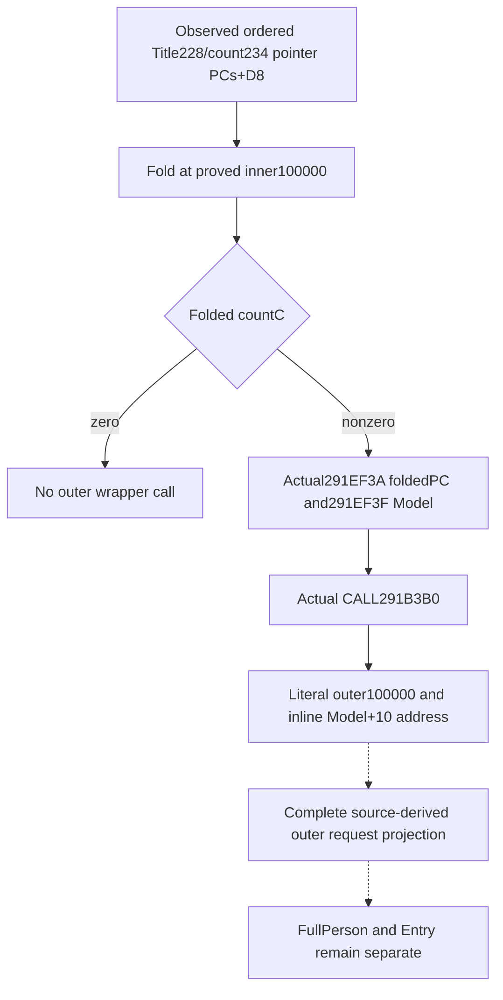

# Actual outer append of a composed Person Title input

This follows the source-closed [local Title](battle-person-local-title-inputs-12004.md)
and [first pointer-vector](battle-person-first-title-vector-inputs-12004.md)
families. The selected gap is the actual outer request contract of `291B3B0`:
its weight and destination rule. A complete folded per-Title PC already has
independent numerical value, but an inner100000 fold does not establish the
outer Model contribution.

The exact image is CK3 1.20.0.4 / Steam25734779, retained SHA-256
`98702F88A547CDE2EAF29A85F93B85F68EE4CF8148336A4F7AFAEB75319DD518`.
The author performs zero Game, SDK, process, EXE reads, hashes, compilation,
imports or tests. Root uniquely owns captures and FIRST. The user's local
CK3 prohibition from2026-10-09 21:07 Asia/Shanghai remains in effect.

## Actual native tree before implementation

The retained actual composer966-byte body supplies the positive frontier:
`291EF3A LEA RDX,[rsp70]` addresses the already folded local PC;
`291EF3F MOV RCX,R15` supplies Model; `291EF42 CALL291B3B0` performs the
outer operation. RAX is not consumed as a numerical return. The earlier
`291ED6A` count+C zero branch skips the outer call to291EF4E. There is no
R8=100000 staging at the outer call. `291ED4A`'s explicit inner100000 belongs
to the constituent fold and cannot be relabeled as a wrapper argument.

These arguments are already supported by typed same-query observations:
complete ordered composer constituents, full signed64 values and Model
ownership attribution. They do not require the main helper's later Model78
lookup. That separate main-helper path prepares keys97/111 from a historical
post-callback Model stage; copying a current final aggregate would not close it.
Only the per-Title outer wrapper is selected for this increment.

Finite named actual4 cache lookup in shared-span-cache, function-match-core
and the scoped Person indices missed the complete wrapper. Cached NEW runtime
row141220(one-based) is `[291B3B0,291B4CF)`,287 bytes, unwind0510C97C.
The historical exact3 `291B3D0` complete287-byte body is retained at
`person-tail/gated-temporary-tail-source/capture-0291B3D0-body/region-0291B3D0.{bin,asm}`;
it is a locator and older contract, not an actual4 reuse proof or RVA shift.

The Root-only recipe is
`Z:/ck3_mod_rewrite_process_assets/g2-background-20261009/person-title-outer-append/ROOT-CAPTURE-ARGV.json`.
It requested exactly the actual287-byte interval once, using retained .text
RVA4096/raw1024 and offset=RVA-3072. It reads no old body, PE, PDATA, hash,
other callee or process memory. Root completed that single287-byte read as
`actual-wrapper01/SOURCE-CAPTURE.json`; its actual56-instruction decode is
complete. There is no local RET or conditional branch: the final instruction
at291B4CA tail-jumps to actual2438830. The byte interval is closed by that
outgoing primitive, not by pretending it contains a return.
The existing selection tree is separately retained in
`person-merged-helper-outer-append/native-tree/RESULT.json` and `source-tree.md`.

## Current boundary

Existing numerical projection emits per-Title folded blocks and observed
nonempty append demand. The actual wrapper stages literal `R8D=100000` at
291B4AD and `LEA RCX,[Model+10]` at291B4A9 before its tail-jump. Its destination
is the address of the inline PropertyContainer, not QWORD[Model+10]. The
existing DTO's `destination_pc_identity` samples that QWORD; a correct
projection derives the inline destination from `selected_model_identity`
and does not reinterpret that sampled value as the container address.

The wrapper prepares an owned container from the input: actual11E1160 receives
newPC and sourcePC for keys, and B73F50 receives their respective+68 value
headers. It transfers raw flag1B8 and metadata190/1A0/1B0. The selected
numerical input contract needs preservation of ordered U16 keys and full
signed64 values; the named copy-helper proofs are checked as retained cache
dependencies before claiming that preservation. No allocation/OOM execution
or annotation identity becomes a new read-only admission gate.

The fixed outer weight and current Model association need no additional
bridge field. The actual2438830 numerical argument/source-use windows are
already retained in the direct carrier's `pc-decoder-source03` evidence;
they are reused without replay. Any genuinely missing copy operand is an
exact dependency of this one wrapper rather than a wider helper expansion.
No placeholder field, new tool or theoretical admission gate is introduced.
Native59 is Root-qualified GREEN at compiled source
c0359add01473d67021328392bd1542158312e56. Its six native worlds are not
replayed by this increment. FullHelper, FullPerson, Entry, live
and gameplay outcome credit remain false.

## Python request projection and one retained-packet compound

`bridge/battle_person_title_outer_append_12004.py` publishes ordered outer
wrapper entry requests from the existing same-query Title inputs. The first
pointer-vector API preserves phaseA then phaseB occurrence order and duplicate
Title pointers; a selected complete composer remains usable when another
composer or numerical family is partial. The local-title API reuses its
already source-closed composer and admission reader. Neither API adds native
fields, modifies the whole packets, or writes a Model.

Each request carries the selected Model, the derived inline Model+10 address,
Title occurrence, folded U16-key/full signed64-value block and literal100000
weight. A zero-count folded composer skips this wrapper just as the caller
does. The sampled `destination_pc_identity` QWORD remains a different value.
This increment publishes wrapper entry inputs. The complete arithmetic of the tail delegate remains a separate native proof
boundary; a projected request is not an observed Model mutation or final
historical Model aggregate.

The unique new connected compound is
`tests/unit/test_person_title_outer_append_12004_registered_mcp.py::test_person_title_outer_append_12004_registered_mcp_retained_whole_packets`.
It feeds unchanged Root59 whole bodies1/5/6, with their original query sequences,
through the real Driver, registered MCP and Service before projection. The
baseline gives five requests in A,A,B,A,B order, retaining the zero-valued key
and duplicate Title occurrences. The partial-composer packet permits the
independent phaseB input; the negative phaseB count packet permits its observed
phaseA input. Complete-family requests still report their actual missing input.
The known nonemitted occurrence yields no request. There is no invented native
empty-composer scene or replay of the old six-packet compound.

The author performed no execution. Root subsequently qualified the new
three-packet consumer once; no compiler, DLL link, native fixture invocation
or Game query was performed for this qualification.
The two retained14-byte copy-helper prefixes are only prologues through a
self-assignment JE. Their exact same-helper continuations exclude those28
bytes: keys `[11E116E,11E11CE)`96 bytes and values `[B73F5E,B73FCD)`111 bytes.
Root has captured the207 bytes once in
`person-title-outer-append/actual-copy-continuations03/SOURCE-CAPTURE.json`;
Both same-helper paths now close through their two returns. Keys retain the
source data/count, reserve destination storage and transfer count*2 bytes to
the retained byte-copy primitive4226860. Values retain their independent source
count, reserve storage and copy QWORDs in an explicit ascending stride8 loop,
preserving every64-bit value and order without arithmetic. Nonpositive counts
copy no elements; self-assignment skips the copy. The key helper delegates its
byte transfer; this increment does not claim a new decode of memcpy or allocator
internals. Neither storage helper introduces a decision input or an extra gate.
The complete wrapper-entry projection remains independent of actual Model writes.

## Root qualification on 2026-10-10

The source-ready increment was committed as
`ffb677a5713304d7fec40dbbc1e9ac3190d1bf22` and adopted by Root as
`17b8f411ca6f2c1564d5761b59de4968c73f49f9`. Root ran the unique new compound
at **2026-10-10 00:00:11.290042–00:00:15.035360 Asia/Shanghai**. It returned
exit0 / GREEN in **3.7465189000358805 seconds**, with pytest1passed in3.08s.
This FIRST belongs to October10, not the October9 source-delivery day.

The original result, structured argv/environment and stdout are retained at
`Z:/ck3_mod_rewrite_process_assets/g2-background-20261009/person-title-outer-append/source-package/root-first01/RESULT.json`,
`ARGV.json` and `stdout.log`. The path's background-day label does not change
the execution timestamp. All three registered calls consumed unchanged
Native59 whole bodies1/5/6 with original query sequences. No producer scene,
old compound or native build was replayed.

The request projection is **static-ready**. It supplies the observed numerical
composer blocks, exact outer unit100000 and inline Model+10 destination while
preserving occurrence order, duplicate Titles and independently available
partial-frame siblings. The native wrapper/copy closure used522new bytes in
five Root-only reads; retained prefixes were not read again. Neither this
qualification nor that source closure performs a Model write. FullHelper,
FullPerson, Entry, production-live and new G2 outcome credit remain false.
