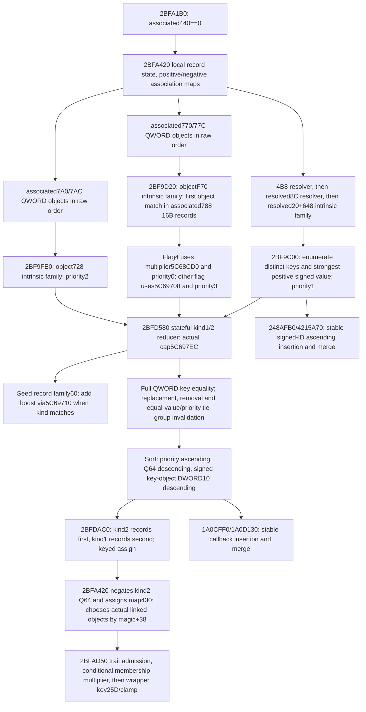

# Person uncached recipient input families, exact 1.20.0.3

This continues the absent-1C8 recipient packet after its cached branch was
released. It closes the physical intrinsic-record sources and the normal
record reducer behind associated DWORD440 zero. It is source research;
the current query and pure module still mark this branch partial. No current
cached430/458 map is substituted for the uncached builder's temporary output.

Pin: CK3 `1.20.0.3`, Steam build `25652598`, recorded EXE SHA-256
`94B55397ABB687A3DCD436805A5D885E6BE90FA6C693FEB44A9E3BBEEADE02A6`.
The source packet is
`Z:/ck3_mod_rewrite_process_assets/g2-background-round4-20261005/person-absent-recipient/`.
The preceding receiver, inline initialization and cached branch are documented
in [battle-person-absent-recipient-12003.md](battle-person-absent-recipient-12003.md).

## Native tree

The actual selected associated object and fallback/full-ID association are
those of the earlier Character B4 resolver. Its business type remains
unproved here. No native construction or dynamic getter is invoked by a
future readonly observer.

## Closed physical intrinsic family

`42149A0` enumerates keys from two **plain 40-byte record vectors**: family
data QWORD+0/count signed DWORD+C, then family data QWORD+168/count signed
DWORD+174. Each record has marker U8+14, key QWORD+8, and signed Q64+20.
Marker2 selects the record's key; any other marker selects the actual global
fallback key pointer at slot **5D1E318**. Preserve every raw row and its marker;
do not manufacture a key from an uninitialized record.

Key enumeration appends those effective keys, sorts them, then removes
adjacent equal full-QWORD pointers. For at most32 keys the complete joined
`248A490` insertion sort proves **signed DWORD[keyObject+10] ascending**.
This is not pointer-address sorting. The insertion path preserves the order
of equal signed IDs. More than32 keys dispatches through `4215310` to that
same base case plus `248AFB0/4215A70` merge helpers; those latter internals
remain a concrete next seam. Sorting and deduplication describe a native
derived key sequence, not permission to replace the observer's raw row order.

`42148C0(family, outputPair, keyObject)` scans the first vector, then the
second. It starts value0/kind0. For a matching effective full-QWORD key it
replaces the selected value only when the row's signed Q64 is strictly larger.
An improvement in the first vector sets kind1; an improvement in the second
sets kind2. Thus only a strictly positive value produces a nonzero kind,
and an equal second-vector value retains the first-vector selection. All
matching raw records remain observation data; this lookup is a separate pure
transformation.

`2BF9C00` invokes the key enumerator and pair lookup on the selected seed
family, then sends each result to `2BFD580` with priority1 in the derived key
sequence. The outer resolver and definition+648 receiver are fully closed in
the preceding topic.

## Dynamic and removed-object families

The caller traverses associated+770/count77C QWORD object pointers in order.
`2BF9D20` enumerates that object's intrinsic family at **object+F70**. Its
selection context is the plain16-byte record vector embedded at
associated+788: header data+0/count+C, each row object QWORD+0 and flag U8+8.
The first row whose full object pointer equals the current770 object applies.
No matching row contributes nothing, with no association update.

For a matching row, flag4 selects actual multiplier slot **5C68CD0** and
priority0; every other flag selects **5C69708** and priority3. Pair values
are multiplied with the exact signed Q100000 fast/decomposed arithmetic.
`2BFD580` receives its pair's actual kind. Only a true reducer return assigns
the local positive-link association map's trait key to the current object.

The caller then traverses associated+7A0/count7AC QWORD object pointers in
order. `2BF9FE0` reads each object's intrinsic family at **object+728**,
sends its pair values/kinds unchanged to the reducer with priority2, and only
a true reducer return assigns the local negative-link map to that object.
The `F70` and `728` offsets belong to their actual respective QWORD receivers;
they must not be read from the Character or the B4-associated object itself.

## Stateful reducer and materialization

The complete normal `2BFD580` body has1337 bytes. Its local state has a kind2
record vector at+0/count+C and a kind1 vector at+18/count+24. A record has
full key QWORD+0, signed Q64+8, priority U8+10 and kind DWORD+14. Priority1
seed records are additionally retained in a vector+60 for later same-kind
boosts. Kind0 immediately returns false; only kind1 and2 are produced by
the closed pair getter. Kind2 selects vector0 and kind1 selects vector18.

The source compares actual vector counts against signed DWORD global
**5C697EC**. It also uses per-family cached priority/value thresholds and the
last sorted row. This is not a simple top-K truncation: it can replace an
existing key, switch a key between kinds, remove a displaced key, and invalidate
an entire equal-priority/equal-value group while returning false. Preserve the
source branches and return value when implementing the reducer; source false
also controls whether the caller changes an association map.

The full-QWORD key predicate is now closed: the source's vtable at4809C90,
slot+10, contains pointer to `2BFE4A0`. The11-byte leaf compares record QWORD0
to the captured QWORD key. `2BFE250` searches that predicate in record order;
`2BFE070` removes matching keys from the selected vector and resorts it.
`2BFDEC0` searches retained seed vector60; when its kind equals the new kind,
it multiplies that seed Q64 by current global **5C69710**, adds it to the
candidate with signed64 wrap, appends the record, and resorts it. No default
for these actual native globals has been fabricated.

The joined42-byte leaf `2BFD470` supplies the exact sort comparator: priority
U8 ascending, then signed Q64 descending, then signed DWORD[keyObject+10]
descending. The final tiebreak is the key object's actual signed32 ID, not
pointer order. `2BFE330` invokes the comparator via `1A0CFF0` for at most32
records or a buffered `1A0D130` path for larger vectors. Those generic sorting
internals are not yet read; do not claim their allocation or tie-stability
details as closed.

### October 6 functional source continuation

The formerly open order seams are now narrowed and closed for their actual
value semantics. `248AFB0` sorts32-key chunks by signed ID ascending and
merges with **left selected on equality**. Its `248BA00` merge does the same.
`4215A70/4216020` trim already ordered ends, merge forward with left equality,
merge backward with right equality, and partition by paired lower/upper
bounds before rotation and recursive merge. The plain-pointer rotation
`C1A6B0` preserves each subrange's order; its unbuffered `86E500` route uses
three reversals. The specialized key sequence is therefore stable at equal
signed IDs for larger families as well as the32-key insertion base case.

The record callbacks `1A0CFF0` (joined through `1A0D125`) and `1A0EF70`
move an earlier row only when the comparator returns true. `1A10BF0`
selects left when the right-vs-left callback returns false. `1A0F2C0`,
`1A10D30`, `1A12C70`, and `1A13A70` use the corresponding forward/backward
equality and lower/upper-bound partition rules; `BADED0` rotates24-byte
records with per-subrange order preserved. This closes stable ordering by
priority ascending, Q64 descending, and signed ID descending. It does not
claim native allocator construction or call native sort code. Normal pure
sorting can reproduce this value order without an arbitrary32-record gate.

Before implementation, the packet seals a separate `uncached_recipient_inputs`
leaf for the same current-person query. It applies only when Character1C8 is
absent and actual associated440 is zero. Present1C8 and nonzero440 are legal
`not_applicable` skips. Every raw vector carries its actual signed count and
physical rows; count0 is an actual empty vector, while failed reads stay null.
The two resolver associations and fallback pointers remain diagnostics of
the actual selected receivers. No cached430/458 bytes are substituted.

The new dedicated reducer consumes seed, active and removed families in that
order. It retains seed records, exact reducer true/false, source-priority
thresholds, swap-last tie-group removal, stable key removal, kind switches,
seed boost, link assignment, and final materialization in its ledger. The
derived temporary map joins the closed AD50/key25D/clamp pure path using only
the nested current `downstream_inputs`. These are physical trait IDs,
membership bytes/guard, aggregate bytes/selection/guard and actual globals.

The active multiplier at `2BF9E79/7C/80` and seed boost at
`2BFDF96/99/9D` decompose the **signed maximum** operand: R8 receives max,
R9 receives min, and division/remainder apply to R8. This differs from the
shared minimum-operand multiplication helper when a remainder product wraps.
Use a dedicated maximum-operand Q100000 helper for these two uncached edges;
leave the previously closed downstream AD50 arithmetic unchanged. The seed
record is retained before the priority1 append, so this boost also applies to
the seed's own initial same-kind append, not only later active replacements.

Demand remains conditional: fallback key only for marker!=2; capacity for a
nonzero-kind reducer candidate; seed boost only for an append with a matching
seed kind; active multiplier only after the first matching context row;
object magic and link fallbacks only for a final materialized key; membership
and its guard only after trait admission; member multiplier only after a
matching linked object; aggregate inline guard only for inline selection.
No stage-start baseline, native initialization, native output-cache write or
actual Entry association is supplied. The dedicated DTO/bindings/collector/
serializer includes and strict contract are wired by the unified source owner
in its next package; the current26-wire qualification is independent.

`2BFDAC0` visits kind2 records in vector order before kind1 records. It uses
`2C00950` to insert or assign a32-byte-bucket keyed record map; the equal-key
path overwrites kind DWORD+10 and Q64+18. The caller `2BFA420` then negates
kind2 values with signed64 wrap and uses the already closed insert-or-assign
`2BFFE10` for output map430.

The two local link maps select actual linked object pointers or actual
fallback slots **5D1F6C0** and **5D1E288**. Object magic DWORD+38 equal to
`0x4744624F`, the record kind, and a retained source record priority govern
which valid link wins. Caller R9 is null, so the third destination map remains
undemanded. This branch then joins the already closed `2BFAD50` filter,
membership, current effective key25D and clamp path.

## Smallest readonly expansion

A future `uncached_inputs` leaf under the same current-person query can
release the following actual data without running `2BFA420`:

| Field family | Actual receiver / contents |
|---|---|
| `seed_definition` | associated4B8 resolver→8C resolver→QWORD20; actual full-ID/fallback association and intrinsic family at definition648 |
| `seed_family`, each active `intrinsic_f70`, each removed `intrinsic_728` | Raw two40B vector headers and rows, marker14/key8/value20, physical indexes and full key IDs at keyObject10 |
| `fallback_key_object` | Current QWORD slot5D1E318, actual key-object signed DWORD10 |
| `active_objects` | Raw associated770/77C QWORD order, actual object+38 magic, intrinsicF70 |
| `active_context` | Raw associated788 data/count; ordered16B object-pointer/flag8 records |
| `removed_objects` | Raw associated7A0/7AC QWORD order, actual object+38 magic, intrinsic728 |
| Current reducer globals | Actual signed DWORD5C697EC and Q64 slots5C68CD0,5C69708,5C69710 |
| Current link fallback objects | Actual pointers5D1F6C0/5D1E288 and their DWORD+38 magic; preserve current physical fallback source |

The cached-path leaf's current trait IDs, membership header/guard, effective
context selection/guard, key25D and clamp globals remain the shared downstream
inputs. Each intrinsic family can expose independent raw-read readiness.
That readiness is not the complete uncached scalar's readiness: the next pure
work is the exact ordered reducer and link-selection fold, preceded by closure
of the remaining specialized/generic large-sort seams where demanded.

This is a concrete additional background task. It supplies no stage-start
baseline or actual Entry association, performs no native initialization and
does not authorize a current-final value as an earlier state. No new Python
case, native build or game interaction was performed for this continuation.
The earlier cached query will qualify independently in the unified package.

The October6 implementation continuation adds dedicated pure kernel, strict
contract and native DTO/bindings/collector/serializer includes. Its single new
Python compound case passed33 assertions in0.35s. The retained first attempt
was harness RED at collection (missing PYTHONPATH, zero cases); the corrected
small-operand version passed30 checks, and the actual maximum-operand source
finding justified the final changed-case run. No old test was rerun.
The new native fixture hook emits11 current-query production wires, including
the uncached scalar's manager-range forwarding assertion. It has not yet been
built or executed here: main-query/contract/helper wiring and native validation
are the coordinating owner's next package. Current readiness is **static-ready
pure/contract**, with dedicated native integration pending; no live status is
claimed. Receipts are `uncached-python-01/02/03/RESULT.json`,
`UNCACHED-IMPLEMENTATION-SOURCE-PLAN.json`, and
`UNCACHED-MAX-MULTIPLY-SOURCE-ADDENDUM.json` in the packet.

## Read receipt

All new helpers were bounded by their exact `.pdata` extents; two leaf windows
were48 and16 bytes. The comparison leaf's second RET and branch target were
joined from the same captured48 bytes, with zero extra EXE reads. Resolving
the one needed predicate vtable slot used108 bytes of PE/section metadata and
an8-byte `.rdata` slot; no PE optional-header or whole-section read occurred.
The packet's `UNCACHED-SOURCE-SEAL.json` records this continuation and total
I/O, separate from the retained earlier5029-byte `SOURCE-SEAL.json`.

## Compiled uncached input qualification (2026-10-06T01:22:10+08:00)

Exact Root source `3fb869c751d9050caffa790716a332ca71238c1a`, first continuation fixture GREEN with 11 genuine new uncached wires. Strict production normalizer and pure reducer pass75checks once (process0.27675s). Scalar660000 reaches actual manager PC777; source is absent_1c8_2bfac30_uncached. No prior cached26/auxiliary/census or 33-check Python case repeats. UNCACHED-QUALIFICATION.json and original RESULT SHA82e3ee2564d6faaf1c8ed1bdc8c62d2cc6c580a438eefb14936bf9ff86fb4645 are archived in the central seal. This is current-input static-ready, with no stage-start baseline, full suffix, actual Entry or paused/live credit. Next source-owned dependency is qualifier28BC0D0/repeated291C68D; signed provider remains separately owned.
