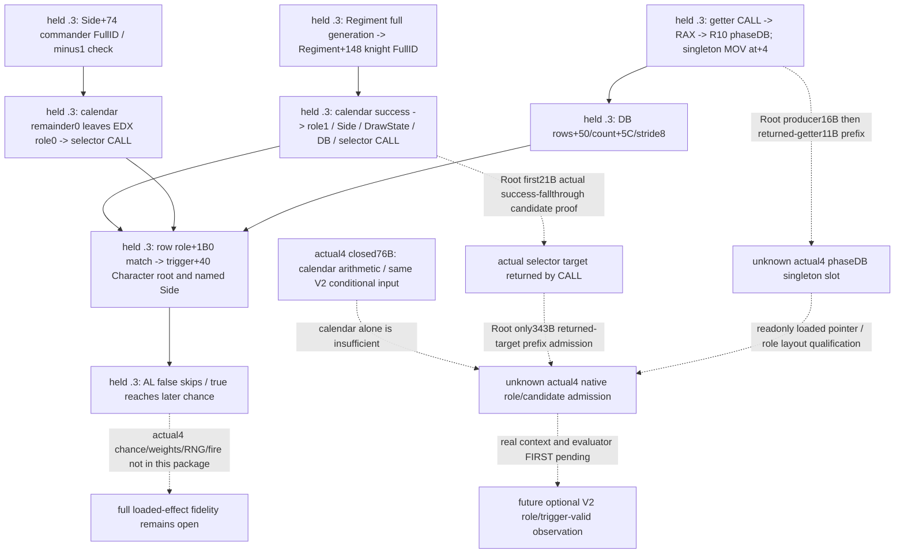
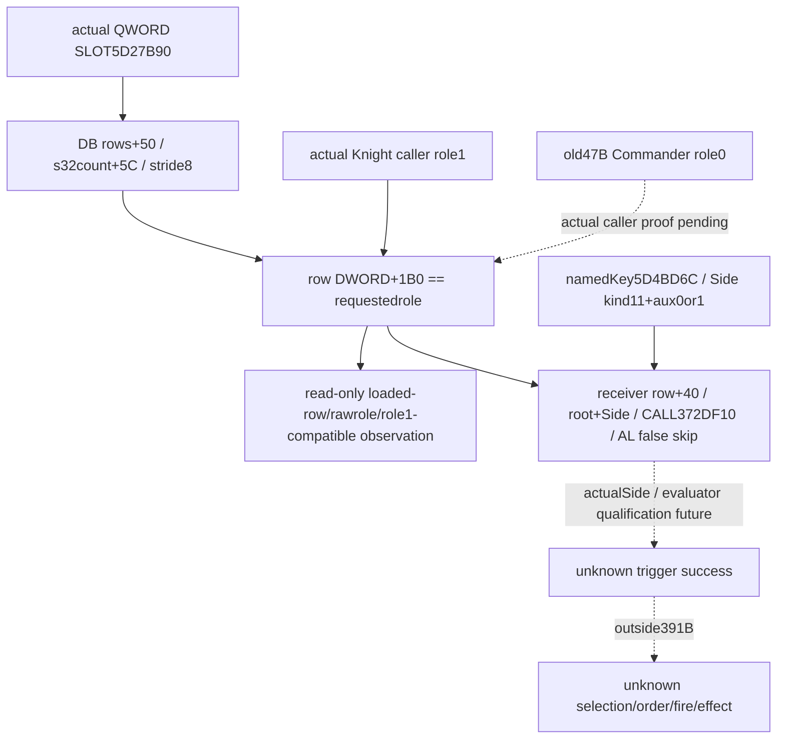

# Battle phase admission after the calendar condition

2026-10-07 / ISO2026-W41. Source baseline
`79b1ac5cdb8bfa54ce70050a250cc684dfa3a6a3`; exact target CK3
1.20.0.4 / Steam25734779 / EXE SHA256
`98702F88A547CDE2EAF29A85F93B85F68EE4CF8148336A4F7AFAEB75319DD518`.
This source-only package reuses the held **1.20.0.3** schedule and selector
text/cache, together with Root's previously closed actual4 interval/date76B.
It reads no old/new executable, hashes, PE/pdata, game/SDK/process, tests,
builds or imports. This is an input tree before any new observer or policy.

The existing same-query calendar condition is one native arithmetic input.
It is neither an event permission nor an event selection. Root's calendar
FIRST is reused without a rerun. No old source address becomes actual4 by
subtracting20, and no role beyond a captured caller is inferred from it.

## Held native caller and the real admission boundary

The old side schedule scans the stored knight entries at Side`+40/+4C`,
stride`60`. It resolves the full RegimentID from the entry and verifies its
generation before reading **Regiment`+148` intoR9D**, the current knight
FullCharacterID. Minus1 skips. Its subsequent Character resolution checks
full identity at`+18`, magic`+1C == Char`, and identity not minus1. The held
body has no separate `is_alive` or generic `CanBeKnight` call on this path.
That statement is restricted to this old source; actual4 guards outside
the earlier76B remain independently unclosed.

When its calendar remainder is zero, the old21B window
`[264D5F0,264D605)` sets R8=actual Side, stack fifth argument=shared local
DrawState pointer, **EDX=1** for knight role, RCX=R10 phase Database and
calls old selector`3298EE0`; R9D retains that current full identity.
RCX=R10 is an argument copy, not proof of the registry's global root.

The commander branch reads **Side`+74` intoR9D**, skips minus1, and performs
its calendar test. Its old16B postcalendar window`[264D752,264D762)` sets
Side/DrawState/Database arguments and calls the same selector. Role0 is
**implicit EDX=0 from successful unsigned DIV remainder**, which TEST/JNE
and the following argument moves retain. That16B alone does not prove the
preceding commander calendar or identity input. Knight21B cannot be used
as actual4 all-role authority.

Inside the held selector, requested role is preserved inR14D and R9D full
identity becomes the Character root. A loaded row is considered only when
its DWORD`+1B0` equals that role. It then evaluates the inline trigger member
`row+40` using the constructed Character root and named CombatSide context;
false AL skips to the next stored row. **This role match and row trigger is
the real event candidate-admission stage.** Calendar success alone never
bypasses it. There is no single universal character permission flag in this
source that substitutes for loaded per-event triggers.

Trigger-valid is still not positive-weight or selected. The following
chance evaluation, signed Q100000 weight conversion, positive-weight choice,
local RNG, empty-effect sentinel and eventual fire are later stages. They
are outside the requested prefix and this package's completion claim.

## Required registry and scope inputs

The old16B window`[264D4CB,264D4DB)` calls old phase Database getter
`2653880`, copies RAX intoR10 and preserves the pointer on the stack. The
held getter's first11B`[2653880,265388B)` reserve stack then read a qword
singleton from old slot`5D27B90` via MOV at`+4`; signed RIP displacement is
bytes`[7,11)`. The full old getter can initialize a null registry. A readonly
observer should use the admitted already-loaded singleton slot directly;
it should never call this getter to initialize a registry. A null loaded
pointer stays unavailable.

The selector receives that Database inRCX. Its old prefix publishes the
precise required layout: rows pointer`+50`, signed count`+5C`, pointer stride8,
row role DWORD`+1B0` and inline trigger member`+40`. This phase-event registry
is different from the constructor combat-effect-rule database`8FC3E0` and
the MAA combat-rules getter`899E40`; their closure cannot fill this root.

The trigger scope is also essential. Old selector constructs Character
kind4 with zero-extended FullCharacterID payload, then inserts one named
kind11 Side token. It uses actual Side`+B8 -> Combat`, that Combat's fullID
at`+8`, and an auxiliary bit for actual Side differing from Combat`+20`.
The named-side stable-key token is loaded from old slot`5D4BD6C`.
No owner token is inserted here. A precontact hypothetical constructor
context cannot be silently called an actual current Combat/Side scope.
Role-only loaded row observations can be independent, but a trigger result
needs its real input scopes, exact evaluator and current query qualification.

## Minimum Root capture sequence

The external author plan is
`phase-admission-source24/native-admission/ROOT-STAGED-391B-DEPENDENCY-MANIFEST.json`
under the existing migration/G2 artifact root. Root decides timing under the
highest-priority migration/live work. The plan is **21 +16 +343 +11 =391B**:

1. Knight21B postcalendar arguments/CALL. New candidate`264D5D0` comes from
   the **actual closed calendar span's zero-remainder fallthrough**, not a
   general address shift. Root must admit the new instructions and return
   the actual CALL target.
2. R10 Database producer16B. New candidate`264D4AB` is the successor of the
   closed actual date56B span. Root must similarly admit instructions and
   return the actual getter target.
3. Capture only343B at the **returned actual selector target**. Held old
   prefix`[3298EE0,3299037)` covers argument copies, root/named Side,
   registry array, role comparison and trigger false-return skip; it ends
   before the first chance setup. The old full886B is a cache, not a requested
   new capture. Actual new callee address remains unset until its real CALL.
4. Capture only11B at the **returned actual getter target**. Admit its own
   singleton RIP load at`+4` and resolve the actual slot. Full87B return/
   initializer behavior is not claimed or invoked by this prefix.

No callee address is prefilled using an ordinal or -20 rule. Both caller
successor candidates still require actual code proof. The author manifest
retains old cached bytes and explicit address relocation ranges; Root's
standard finite manifest and receipt remain separate. There is no76B
recapture, new PE/pdata/hash, full-function expansion or native execution.

Knight FullID production17B and commander implicit-role/context47B are
separately listed conditional rows. They are not bundled into this391B.
Only add a row if the next published field really claims that native source;
existing same-query FullIDs may support explicitly conditional arithmetic
without claiming full native source admission.

## Observer value and remaining boundary

An admitted loaded registry and role layout can expose the effective
source-order role rows for the existing V2 occurrence and identify which
per-event trigger inputs still block a meaningful current candidate
decision. With a qualified real Side/Character scope and readonly evaluator,
a `role_and_trigger_valid` observation can resolve which conditional event
outcomes actually apply to the current commander/knight. It cannot claim
the event will be selected, fire today, or produce a calibrated death/win
probability. Before evaluator/context qualification, do not fabricate a
Boolean from role match, stock scripts or calendar success.

The parent owns a standalone optional observer/consumer in existing V2;
Root owns shared header/Bridge/CMake hooks and actual qualification. This
source package adds no runtime field, flag or tool and changes no base
completeness, MC status, risk budget, battle/siege decision or gameplay count.
Full `loaded_phase_event_effect_transition` remains open; bounded contact
and relief decisions continue using their already qualified inputs.

Readiness: **research / cached-source tree and finite plan**, AUTHORED_NOTRUN.
The new doc and its Mermaid do not claim a new actual4 admission leaf.

Evidence: held schedule `schedule-side-264D480.bin/.txt`, selector
`slice-03298EE0-376.bin/.txt` and `SOURCE-SCHEDULE.json` under
`Z:/ck3_mod_rewrite_process_assets/g2-resume-20261004/battle-phase-events-12003/native-schedule/`;
the earlier actual4 two-operand `SOURCE-CLOSED.json` under
`g2-combat-forecast-12004/phase-effect-next/native-stage/` is reused, not rerun.
New sourceclips, TREE, ledger, manifests and Oct7/W41 fields are external under
`g2-combat-forecast-12004/phase-admission-source24/native-admission/`.

## Root calendar FIRST GREEN baseline (reused)

Root reported `functional-runtime24-first01/calendar/RESULT.json`: native observation GREEN, 0.123 s for three whole snapshots; sole registered-service compound observation 4.781 s. This child reused the reported receipt and did not read the EXE, repeat a test, invoke the game or query the service. This remains the bounded calendar static-ready baseline. Actual phase-admission loaded row values, role membership, trigger eligibility and firing remain unqualified; base completeness and MC status are unchanged.

The complete next source plan is `phase-admission-source24/native-admission/ROOT-STAGED-391B-DEPENDENCY-MANIFEST.json`: 21B post-calendar CALL arguments + 16B R10 producer, followed only at their Root-proven actual CALL targets by selector343B and getter11B. Getter MOV begins at +4 and its signed RIP displacement occupies [7,11). See the companion `INPUT-LEDGER.json`, `TREE.md` and `OCT7-W41-FIELDS.json` for field value, unknown branches and coordinator report fields. Main owns the source package commit.

## Actual stage37B source confirmation and returned-target next capture

The earlier candidate-only stage1 plan above is now superseded by two Root receipts: `native-admission/knight-call21-first01/FAMILY-MAP.json` confirms the 21B argument/CALL window at actual `[0x264D5D0,0x264D5E5)`, and `native-admission/database16-first01/FAMILY-MAP.json` plus its sole `phase_schedule_database_return_to_r10-DETAIL.json` confirm the 16B producer at actual `[0x264D4AB,0x264D4BB)`. Both are complete-instruction normalized-equal spans, with 37 fresh bytes and two Root reads in total. This child consumed JSON receipts only, without rereading the 37B/76B binary spans, old774B cache or either EXE.

The knight window confirms literal role `EDX=1`, `R8=Side`, `RCX=R10` and stack `DrawState`; its actual CALL at window+16 targets **0x3298EC0**. R9's fullID producer and candidate guards outside this window are still not actual4-closed. The database producer's actual CALL at window+0 targets **0x2653860**, then copies returned `RAX` to `R10` and `[rsp+0xA8]`. This closes those argument/producer instructions and returned targets, not the getter's body or current loaded pointer value.

`ROOT-FINITE-PHASE-ADMISSION354-NEXT-MANIFEST.json` is now the standard-compatible sole next mapper input: selector **0x3298EC0/343B** and getter **0x2653860/11B**, maximum 354 fresh bytes/two reads. Both explicit addresses cite the actual returned CALL receipts; no address subtraction or ordinal inference supplies a target. Getter MOV starts at +4; its signed RIP displacement is [7,11). The original 391B author dependency manifest remains frozen as the pre-capture plan.

Actual registry singleton slot, row array/count, row role equality and trigger prefix remain pending the 354B capture. Knight role1 alone does not grant role permission or candidate admission; commander role0, trigger callable qualification, chance/selection/order/fire and effect state remain unqualified. Existing bounded calendar FIRST GREEN is reused without changing base completeness or MC status.

## Actual391B source closure and minimal role-compatible scalar leaf

The stage1/next-capture status above is now superseded by Root `native-admission/selector343-getter11-first01/FAMILY-MAP.json` GREEN: unique354B/two reads, both rows normalized equal; cumulative391B/four reads. This lane consumed only its two NEW DETAIL JSONs, not earlier37B/76B/old774B/cache binaries or EXEs. `native-admission/SOURCE-CLOSED.json` is the final source operand receipt; the original391B/354B capture manifests remain unchanged.

| Actual operand | Literal source | Independent observation value |
|---|---|---|
| phaseDB loaded pointer SLOT RVA **0x5D27B90**, QWORD | getter MOV at2653864, next265386B + signeddisp036D4325; MOV+4/displacement[7,11) | Direct loaded registry entry; never call getter/initializer. |
| rows pointer **DB+0x50**, QWORD | selector3298FD3 | Actual loaded array membership. |
| count **DB+0x5C**, signedDWORD; pointer stride8 | MOVSXD3298FD7; end=rows+count*8 at3298FDB | Preserve native signed count and registry indices. |
| current row pointer QWORD[rows+i*8] | selector3298FF2 | Registry occurrence. |
| row role **DWORD[row+0x1B0]** | CMP3298FFC against R14D, copied from EDX; mismatch skips3299072 | Raw roles and role1-compatible row indices before trigger. |
| namedKey SLOT **0x5D4BD6C**, DWORD | RIP MOV3298F3B, next3298F41 +02AB2E2B | Source location only; key value/current context not observed. |

The minimal scalar query is exactly: image_base+5D27B90/8 bytes -> DB+50/8 bytes and DB+5C/4 bytes -> each row pointer/8 bytes -> row+1B0/4 bytes. These operands are source-closed and allow an independently useful same-V2 optional loaded-row/rawrole leaf. Actual current-frame scalar values and observer behavior still require parent/Root implementation and qualification; this source package itself is research with a concrete construction entry.

Knight requested role **1** is closed by the actual21B caller literal and actual selector EDX/R14D comparison. Its native FullID producer/candidate guards outside21B remain unclosed. Commander requested role0 is still only held old47B source: the successful unsignedDIV remainder retained in EDX supplies0. Raw row role0 may be published as a number; calling it actual commander admission requires a separately necessary actual producer/calendar/implicit-EDX source proof. Other role meanings and extra candidate permission gates are not inferred.

The actual343B prefix closes root word kind4 and zeroextended full CharacterID payload; Side token word kind11 at+0, auxiliary word0/1 at+2 from actualSide!=Combat+20, and signextended Combat fullID payload at+8. Combat pointer comes from Side+B8 and FullID from Combat+8. No extra AND/mask semantics follow from these stores. Named insertion CALL target is373A0F0 and root constructor target889F60; their bodies/callable qualification remain outside this source package.

Role equality is followed by actual receiver `RCX=row+40` at3299005, `RDX=&root[rsp+30]` at3299009, CALL at329900E to **372DF10**, AL test3299013 and false skip3299072. These are source operands only. ActualSide/current context and evaluator qualification are future work; the role-compatible leaf must not call the trigger or construct hypothetical native scopes. Chance/positive-weight/selection/order/fire/effects remain outside391B. Base completeness and MC status are unchanged.

The full source tree and report-ready fields are synchronized in TREE.md,INPUT-LEDGER.json and OCT7-W41-FIELDS.json. Root calendar FIRST GREEN remains the reused bounded baseline; no additional build,test,import,SDK,game or process work was performed here. Main owns the new source/doc package commit.

## Minimal same-V2 role observation candidate

The independently useful leaf is `phase_event_role_compatibility_v1`, scope
`v2_roster_loaded_event_role_condition`. Its actual4 binder reads the loaded
singleton/array/count/row role scalars above without executing native code.
Loaded row indices and unsigned role values are preserved, including unknown
role numbers and duplicate role rows. A real zero loaded count is available
with an empty catalog; a null singleton or failed operand remains observable
as unavailable/partial rather than a stock default.

Every V2 roster occurrence retains its full CharacterID, army/nativeArmy/
regiment provenance, encounter role and phase role. Conditional Commander0
and Knight1 comparisons publish true/false per observed row; failed row reads
stay null. Commander `native_role_argument_source_closed` remains false.
Knight's corresponding flag is true only for the actual bound source. A
shared CharacterID in Commander and Knight roles remains two occurrences.
No current actual CombatSide is required to compare these loaded integers.

The candidate includes a standalone DTO, header-only actual4 binder/collector,
literal leaf serializer, optional Python normalizer and pure per-occurrence
compatible-row projection. Root alone integrates five shared hooks and builds
the new `xar_ck3_12004_phase_role_whole_fixture` target. The sole new FIRST
will take three complete V2 DTO/production-wire samples through the registered
MCP/service/Driver cache. Candidate source is prepared but has not been built,
imported or executed by this child. Calendar GREEN is reused as prior evidence,
never credited as role observation or admission.

The construction and exact Root argv are in external
`phase-admission-source24/ROOT-SHARED-HOOKS.md`. Actual frame loaded-row values,
trigger evaluation, selection and committed effects remain unobserved pending
their own qualification. The observer leaves existing V2 completeness and MC
flags intact and adds no new precontact or in-battle gate.
