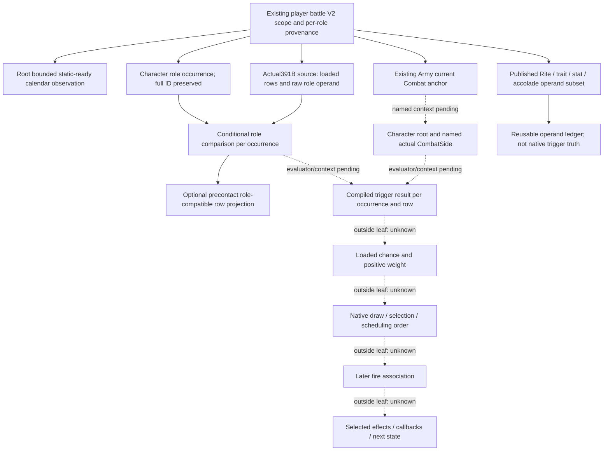

# Battle phase-event role and trigger observation inputs — CK3 1.20.0.4

2026-10-07 / ISO 2026-W41. This is a source/DTO input ledger, an implemented optional Python role-compatibility normalizer, and one authored/unexecuted registered-service FIRST consumer. Root's four actual391B reads are GREEN for the bounded loaded-registry/role-compare source. Root owns native collection, DTO/production serializer, build and FIRST; no actual loaded values or role/admission live readiness are claimed by this lane. It ran no test, import, build, game, SDK, process, executable read, or git operation.

## Frozen sources and adopted baseline

- Target: CK3 **1.20.0.4**, Steam build **25734779**, executable SHA-256 **98702F88A547CDE2EAF29A85F93B85F68EE4CF8148336A4F7AFAEB75319DD518**.
- Inventory clone: `C:/codex-ck3-background/g2-phase-admission-source24`, candidate commit `79b1ac5cdb8bfa54ce70050a250cc684dfa3a6a3`, with Root `ae003bece794acb7eed977a3a017555bab303394` native base. The workpackage name is not a claim that Root's integrated source24 is frozen.
- Historical .3 topic/stock/native bodies are reusable input and method ledgers. Their addresses, runtime values, event order, and registry contents are not actual4 bindings. A software DTO/module name containing `12003` can be reused when its factory binds the actual4 sources explicitly; its name alone is neither evidence of an outdated binding nor evidence of an actual4 observation.
- Root reported sole FIRST **canonicalruntime24b GREEN**: native `functional-runtime24-first01/calendar/RESULT.json` (0.123 s, three whole samples), consumer `functional-runtime24-first01/consumer/phase-event-calendar-registered-service-12004.json` (one compound, 4.781 s). This is bounded **static-ready** evidence for copied software DTO, the actual optional collector, literal production serializer, and existing registered service/MCP path. The samples are synthetic source-qualified context. They do not prove actual live loaded calendar values, role permission, trigger truth, selection, event firing, or effects.
- External packet root: `Z:/ck3_mod_rewrite_process_assets/g2-background-20261007/upstream-build-migration/g2-combat-forecast-12004/phase-admission-source24/candidate-inputs/`. Prior observation inventory and Python delivery under `phase-effect-next/observation-gap/` were reused; calendar code and those previous documents were not edited.

## The smallest useful next observation

Publish loaded event row identity and role, then each current V2 roster occurrence's **role match** and **compiled trigger result** under that occurrence's Character root and its actual named CombatSide. This makes it possible to inspect which event conditions apply to a candidate commander/knight in the current player battle, and compare the applicable condition sets when considering a lineup. It does not estimate outcome probability or prove that an event will be selected. Before the actual paused values and same-context collector are qualified, the proposal remains research and does not unlock an automated lineup action.

The concrete absent fields are loaded registry rows, per-event role permission, and per-occurrence native trigger validity. Existing fields should be reused; collecting every historical phase input before this narrow query would delay this independent observation unnecessarily. Native role/trigger evaluation consumes the loaded trigger itself, so the query need not first implement a complete Python reconstruction of all stock trigger inputs. Role-only loaded registry/row compatibility is independently usable in **precontact V2 without any current actual CombatSide**. Only the trigger branch remains current-actual-context-only until its source/evaluator is qualified; a hypothetical trigger context would require a separate explicit future scope and must never be labelled actual. This introduces no must-be-in-battle gate on bounded precontact forecast or role observation.

These predicates remain separate:

| Predicate | Meaning | Current boundary |
|---|---|---|
| Calendar condition | Full CharacterID and native dayIndex pass the observed loaded interval condition | Root bounded static-ready calendar FIRST; actual live values unobserved here |
| Roster member | A published knight belongs to its resolved CArmy/Regiment | Existing V2 `eligible` and `participant_army_membership_verified`; not event permission |
| Allow role | A loaded event's native role operand accepts the requested commander or knight occurrence | Actual4 event role mapping/field not yet source-admitted in this ledger |
| Trigger valid | The loaded compiled trigger returns true for this Character root and named actual CombatSide | Missing same-query observation; context/evaluator qualification required |
| Chance / positive weight | Loaded chance expression evaluates, is converted to a weight, and survives the native positive-weight filter | Outside this minimal leaf; stock base chance is not final native chance |
| Selected / fired | Native draw chooses a row, and the later fire path accepts its then-current source association | Outside this leaf; no selector/RNG/fire call |
| Effect applied | The selected effect executes, including trait/accolade/stat and queued callback transitions | Outside this leaf; no effect or model manifest readiness change |

## Existing V2 input and provenance ledger

Paths below are relative to `ck3_autonomous_player/`. “Published” means the source DTO, serializer/normalizer path, and actual4 binder exist. It is not this lane's live-value qualification. Optional leaf absence stays unpublished; a leaf's unavailable child stays unknown.

| Input | Exact existing public key(s) | Published scope / limitation |
|---|---|---|
| Requested player battle scope | `combat_simulation_inputs.armies[].army_id`, `encounter_role`, `scope_role`, `war_ids`, `current_province_id`, `native_carmy_id` | Public `army_id` is CUnitID; `native_carmy_id` is CArmyID. `scope_role` is player/active-war ally/enemy. Requested `encounter_role` does not by itself prove membership in an actual current CombatSide. |
| Commander source | `armies[].commander.status`, `.character_id`, `.generic_advantage_points`, `.battle_context.source_target_province_id`, `.effective_min_roll`, `.effective_max_roll` | Per-army commander source. Generic advantage and roll bounds are not generic martial/learning/prowess/trait inputs. Commander and knight roles stay distinct even if CharacterID is equal. |
| Selected contextual commander stat | `contextual_advantage.sides[].commander_source_inputs.selected_commander_character_id`, `.effective_martial` | The selected hypothetical-constructor contextual commander only. This is not a stat census for every commander/knight, an actual current Side context, or a candidate trigger result. |
| Knight identity / stats | `armies[].knights.members[].character_id`, `.source_regiment_id`, `.army_id`, `.eligible`, `.participant_army_membership_verified`, `.prowess`, `.knight_effectiveness_raw`, `.effective_damage_raw`, `.effective_toughness_raw`, `.scale` | `members[].army_id` is CArmyID and matches its enclosing native CArmy. Regiment and Character references are preserved; effectiveness operands can refer to employer/liege and must not be substituted as the phase Character root. |
| Adopted Rite parameters | Commander and knight `.phase_rite_parameters_v1.{status,source_character_id,raw_adopted_rite_id,rite_id,faith_id,boolean_parameters_complete,boolean_parameter_keys,unavailable_reason}` | Actual adopted Rite, not Faith's main Rite. A complete Boolean set can answer `death_is_glory`; it does not prove event trigger/chance as a whole. Raw `FFFFFFFF` means absent; reference 0 is legal. A valid Rite can have observed absent source Faith. |
| Warmonger core | Knight `.phase_warmonger_core_v1.{status,source_character_id,raw_adopted_rite_id,rite_id,rite_resolution,requested_tenet_key,target_tenet_key,warmonger_core_membership,unavailable_reason}` | Actual adopted/native-fallback Rite and loaded `tenet_warmonger` membership. Not the entire stock `knight_become_berserker` validity predicate. |
| Berserker culture and religion | Knight `.phase_berserker_validity_inputs_v1.source_character_id`, `.culture.{status,raw_culture_id,culture_id,resolution,selected_pillar_keys,heritage_north_germanic,unavailable_reason}`, `.religion.{status,raw_adopted_rite_id,rite_id,raw_faith_id,faith_id,raw_religion_id,religion_id,resolution,religion_key,germanic,unavailable_reason}` | Independent source-qualified heritage and adopted-Rite→Faith→Religion inputs. Five selected culture pillar keys and actual religion key are observed by this leaf when available. Not full faith doctrine/hostility/rite data. |
| Berserker exclusion traits | Knight `.phase_berserker_validity_inputs_v1.traits.{craven,berserker,calm}.{status,value,unavailable_reason}` | Three exact nullable trait predicates. No commander mirror leaf and no generic all-traits publication. |
| Chance operand traits | Knight `.phase_berserker_chance_inputs_v1.traits.<key>.{status,value,unavailable_reason}` | Keys: `wrathful`, `giant`, `impatient`, `sadistic`, `brave`, `ambitious`, `content`, `compassionate`, `temperate`, `lazy`, `patient`, `wounded_1`, `wounded_2`, `wounded_3`, `one_legged`, `disfigured`, `one_eyed`, `maimed`. Trait presence is not numeric wounded rank/XP or a full chance result. |
| Other chance / accolade provenance | Knight `.phase_berserker_chance_inputs_v1.source_character_id`, `.is_ai.{status,value,unavailable_reason}`, `.stalwart.{definition_key,presence}`, `.dynasty.{raw_house_id,house_id,raw_dynasty_id,dynasty_id,house_resolution,dynasty_resolution,warfare_legacy_3}`, `.acclaimed.{raw_accolade_id,accolade_id,resolution,is_acclaimed}` | Definition presence and full source references are independently nullable. `is_acclaimed`/AccoladeID are not `can_be_acclaimed`, attribute/MAA category predicates, or unlock progress. |
| Current combat anchor | `ongoing_combats[].{status,combat_id,province_id,phase,phase_day,base_combat_width,final_combat_width,side_0_roll,side_1_roll,base_advantage,resolved_advantage,orientation,unavailable_reason}` | Existing collector resolves each army's current Combat backlink and rechecks generation. `orientation` is `native_side_0_attacker_side_1_defender`. This row has no named CombatSide scope token/key and no event conditions. |
| Calendar occurrence provenance | Optional `phase_event_calendar_observation_v1.occurrences[].{occurrence_index,character_id,source_public_cunit_id,source_native_carmy_id,source_regiment_id,encounter_role,phase_role}` | Whole FullCharacterID including generation; legal 0 preserved. Same Character may have multiple role occurrences. Calendar modulo truth is not event role/trigger truth. |
| Current physical army/side census | Separate existing `current_army_combat_roles_phase_inputs_v1` source DTO: actual Army→Combat association, native side memberships/raw arrays, owner/primary/commander and phase scalars | Useful source reuse for actual side association. It is not a named kind11 key/token or trigger result, and this inventory does not adopt historical .3 offsets as actual4 bindings. No duplicate observer is proposed. |

The actual4 factory in `native_bridge/src/ck3_12004_combat.cpp` binds the phase Rite, warmonger, berserker validity and chance operand readers through actual4 religion, culture, trait, family, perk and accolade sources and enables them. Existing collection is in `native_bridge/src/ck3_12002_combat.cpp` (`ReadCommander`, knight collection, `AppendOngoingCombat`); shared software names do not authorize old .3 runtime RVAs. Existing types are `CombatCommanderSnapshot`, `CombatKnightSnapshot`, `OngoingCombatInputsSnapshot` in `native_bridge/include/xar_bridge/game_contract.hpp`. The V2 contract attachment points are `_normalize_commander`, `_normalize_knights`, `_normalize_ongoing_combats` in `src/xar_autoplayer/bridge/combat_contract.py`.

## Source-only or absent inputs

`CombatPhaseCharacterV3` and `_V3_NATIVE_LEAF_EXACT_REF_PATHS` contain a larger historical input inventory: alive/existence, martial/learning/prowess, generic traits/ranks/XP, liege/employer/house/dynasty, culture parameters, faith/religion, accolade qualification/attributes, court-position and progress inputs. The broad V3 collector still has incomplete scopes. A declared/default-valued field and the old strict 132-reference contract are not current actual4 observations and are not prerequisites for the narrow native role/trigger leaf.

The published V2 subset does not provide all-role `alive`, `martial`, `learning`, `prowess`; commander wound/maim predicates; `shieldmaiden`/`incapable`; wound numeric rank and trait XP; `can_be_acclaimed`; all accolade attribute/MAA-category/unlock predicates; loaded event trigger/chance definitions; full opposing knight/side participant context; or current loaded difficulty/other stock modifier inputs. Record these gaps for later chance or selected-effect work when its actual loaded expression requires them. Do not require them all to publish loaded role categories or a context-qualified native trigger result.

The `.3` stock snapshot `simulation/data/ck3_1_20_0_3_stock_combat_phase_events.json` has 13 source rows (four commander, nine knight). Historical base chance and valid blocks explain useful input names and can aid a later loaded-key match. They do not identify the actual4 loaded registry, active playset overrides, row count/order, role permission, trigger result or final chance. No stock fallback, empty-stock-trigger→true rule, or guessed role/admission default is allowed in the proposal.

Faith/rite reuse needs a specific boundary: the historical `enemy_side.any_participant_faith_hostility_at_least_evil`/fanatic branch belongs to a selected effect's internal path. That branch alone does not make a complete enemy Faith participant observer necessary for the minimal role/trigger query. The actual compiled trigger determines its own needed context. Historical kind11 type descriptor, the interned `combat_side` variable-name key, `enemy_side` conversion, and participant list filtering are distinct objects; a side census or type descriptor does not close all of them.

## Minimum same-MCP projection proposal

### Implemented bounded role leaf and new FIRST

The final implemented Python leaf is **`phase_event_role_compatibility_v1`**, schema 1, scope **`v2_roster_loaded_event_role_condition`**. It uses the existing `ck3_query_combat_simulation_inputs` response and observes a loaded native role operand compared with a **conditional** requested commander tag 0 / knight tag 1. The knight caller argument is actual source-closed; the commander caller remains old-held only and reports `native_role_argument_source_closed=false`. Conditional commander compatibility is useful without claiming that its native caller path is closed. Both `native_candidate_admission_observed` and `complete_phase_effects_ready` stay false. No CombatSide, ongoing combat, trigger, event name, chance, draw, fire, or effect field is fabricated.

The independent implementation is `src/xar_autoplayer/bridge/phase_event_role_compatibility_contract.py` with only optional import/key/attachment hunks in `combat_contract.py`. It preserves each army's available commander then knight occurrences, including FullCharacterID 0, generation bits and commander/knight identity equality. `loaded_registry` retains nullable signed32 `count_raw` and source row order. Available count 0 with `rows=[]` is a legal empty registry; a null singleton is unavailable with null count/empty rows. A measured negative count, or measured positive count with unreadable array, is partial with the held count and empty published rows; unavailable role members remain null with a reason. Unknown conditions never become false. Absent leaf is `None`; malformed present leaf becomes local unavailable without changing V2 input/model completeness. `compatible_loaded_row_indices` projects only observed true conditions for the given occurrence; it does not merge by CharacterID or become a counterpolicy gate.

One authored CLI consumer, `tests/unit/test_phase_event_role_compatibility_registered_service_12004.py`, takes `--source-root`, `--wire`, `--output-dir`. Root runs it once after the integrated production serializer supplies a bundle with scene order `[available, partial, unavailable]`. Each complete V2 sample traverses real `create_server(driver).call_tool("ck3_query_combat_simulation_inputs", ...)` once. It checks role rows `[0,1,7,1]`, commander mask `[true,false,false,false]` and knight mask `[false,true,false,true]`, failed row 2 as null in partial, unavailable singleton, the three identity mutations, full roster/order, detached whole query cache and wire JSON, and unchanged base readiness/model gaps. Legacy absence, malformed leaf, no-current-combat role normalization, and legal empty registry use pure normalization with no extra query. This consumer was authored, not imported or executed, by this lane.

The broader role/trigger proposal below remains a future frontier. Its native trigger branch still requires explicit qualified actual context/evaluator; it is not part of the implemented role leaf.

Proposed optional root key: **`phase_event_candidate_conditions_v1`**, scope **`v2_current_combat_role_trigger_conditions`**. It extends the same existing `ck3_query_combat_simulation_inputs` MCP / `service.query_combat_simulation_inputs` V2 response and does not add a tool, model gate, MC gate, RNG call, selector call, event-fire call, or effect invocation. This document does not implement or register the key.

Its external `MINIMUM-LEAF-PROPOSAL.json` provides the draft shape. A small read-only collector first reads the independently source-closed loaded singleton and row layout; it never calls the registry getter to initialize a null singleton. Role compatibility then needs only the observed loaded row and the V2 role occurrence, including in precontact queries. For the trigger branch only, it links the occurrence to its current actual Combat through the existing Army association and physical side membership. Trigger evaluation requires the exact Character root, named actual CombatSide token, variable-name key, and qualified trigger evaluator. Missing current combat leaves the trigger condition locally unavailable without invalidating measured role compatibility or the V2 base. A precontact hypothetical side cannot be relabelled as actual CombatSide. The two identities `encounter_role` (requested scenario) and native `side_index` (actual combat) remain separate.

The shape has:

- Root target SHA, schema/scope/status, source-closure flags and local unavailable reason; `complete_native_candidate_enumeration=false` and `complete_phase_effects_ready=false`.
- Loaded rows in native load order, including index, observed object identity/key when available, and observed raw role operand. Distinct rows are not merged by key.
- One occurrence for every valid published V2 commander/knight role, preserving full CharacterID, public CUnit, native CArmy and optional Regiment. Commander=knight identities remain separate; legal ID 0 is retained. This is a scoped V2 roster matrix, not proof of the complete native scheduling source vector or its order.
- Each occurrence's observed current CombatID, physical side subindex, named-scope kind/key and context status, then one condition result for each loaded row: nullable `allow_role` and nullable `trigger_valid` with independent status/reason. A role mismatch is measured false; its unevaluated trigger stays null with `role_not_allowed`. A failed read/evaluation is not false. No chance or selected/effect booleans are supplied.

Normalize the optional fragment only after V2 base armies are normalized, alongside the existing calendar attachment point in `combat_contract.py`. Match occurrence provenance to the base roster. An absent fragment stays `None`; a malformed present fragment yields local unavailable and preserves V2 base input/model completeness. Serializer integration belongs in the same production `AppendCombatSimulationInputs` path; a new DTO/binder/adapter owns only the source-admitted role/trigger observer. No code, shared header, bridge, or CMake mutation was performed by this lane.

## Actual4 finite source dependencies

Root's four finite actual reads **21+343+16+11=391 B are now once GREEN**. `knight-call21-first01` admits the knight-call arguments and returns actual selector target **0x3298EC0**; the returned selector's 343 B prefix and database caller 16 B plus returned getter 11 B prefix have now also been admitted. This supplies the bounded current loaded registry slot/layout and unsigned native role comparison for Root's role-only observer. It does not observe active loaded row values in a game, qualify all Character/CombatSide evaluator context, or make native candidate admission ready. Commander caller source closure, trigger truth, chance, selection, fire and effects receive no credit from this bounded role implementation. Root is the only executable reader; this lane performed no reread.

| Necessary step | Existing finite manifest | What it can close | What it cannot close |
|---|---|---|---|
| Actual zero-calendar fallthrough arguments | `native-admission/KNIGHT-POSTCALENDAR-21B-FIRST-MANIFEST.json`; Root `knight-call21-first01` GREEN | Actual 21 B caller admitted once; selector CALL target returned **0x3298EC0**. This closes caller arguments only. | Registry singleton producer, FullID producer, commander path, complete selector, trigger truth |
| Returned selector prefix | `native-admission/SELECTOR-RETURNED-TARGET-343B-NEXT-MANIFEST.json`; Root returned-target source GREEN | Actual 343 B at returned **0x3298EC0** admitted through role and compiled-trigger false skip; loaded row array/count/member and comparison source usable by the role-only observer. | Chance setup begins after this prefix; no positive weight, draw/order, fire/effect claim; evaluator/context qualification and current values remain distinct |
| Registry pointer producer | `native-admission/REGISTRY-R10-PRODUCER-16B-NEXT-MANIFEST.json`; Root caller and returned getter prefix GREEN | Actual 16 B return-to-R10 caller and returned getter's 11 B singleton RIP-load prefix admitted once. With the admitted selector layout this enables Root's direct loaded-table role observer. | Getter initializer/whole function, active loaded content, trigger result; no getter invocation |
| Current scope/evaluator observation qualification | Root follows the concrete source operands returned above | Admit only the needed current Character root, physical Side association/token/key and evaluator contract for this read-only leaf; then implement same-MCP collector and one new compound FIRST. | Native selector invocation or broad effect expansion is not required |

The selector-prefix role/trigger layout and singleton slot are not the combat-effect database or MAA rules database. The scoped roster projection does not replace proof of the native full candidate sequence; future order-sensitive work must use its own source-equivalence proof. Calendar's loaded interval and dayIndex proof is already adopted and is not recaptured for this task.

## Native tree and unknown branches

Siege's current phase-event reader and battle `loaded_phase_event_effect_transition` model manifest are different objects. Prior Siege field completeness does not close any battle registry, native candidate trigger, or Monte Carlo gap. Existing V2 input completeness and phase RNG/effect model gaps stay unchanged.

## Oct 7 / W41 reporting fields

Completed: reused prior observation inventory; inventoried actual4 V2 source-bound operands and exact public keys; separated role compatibility, native trigger truth, chance, selected/fire/effects; authored a minimal same-MCP projection and finite dependencies; implemented the optional Python role normalizer, independent V2 attachment and one registered-service FIRST CLI consumer. Root actual391B source GREEN reused without reread.

Readiness: **research** for native admission/trigger observation. Role-only Python source is implemented and its new compound FIRST is **authored, not run**. Root's bounded391B source is GREEN; no role fixture/live/game evidence was produced here. Adopted calendar baseline remains bounded **static-ready** from Root's sole FIRST. No fullMC/model-manifest gate change, new MCP, or policy action.

Tests/artifacts: this lane ran no tests/import/build/SDK/game/process/EXE reads. Root's already GREEN calendar compound is reused once as a baseline, not rerun. All four Root actual391B finite captures are now GREEN and reused; the new role-only registered-service consumer awaits Root's sole FIRST over the integrated native whole bundle. No native candidate/admission ready or live-value claim follows from source capture.

Remaining: Root adoption of the authored native role collector/DTO and five production hooks, source25 freeze and the new sole compound FIRST, followed by actual paused role observation as appropriate. Current named Side/evaluator qualification is a later trigger-leaf dependency and never blocks precontact role comparisons. Parent owns commit/push and merges these fields into Oct 7/W41 reports. This lane performed no git operation.

## Reused sources

- [Combat phase events .3](combat-phase-events-12003.md), [input frontier](combat-phase-readonly-input-frontier-12003.md), [physical combat roles](army-current-combat-roles-phase-observer-12003.md).
- [Named scope registration](phase-script-scope-registration-12003.md), [kind11 construction](phase-kind11-descriptor-construction-12003.md), [effect-internal enemy Faith branch](phase-enemy-participant-faith-conditional-12003.md).
- `native_bridge/src/ck3_12004_combat.cpp`, `ck3_12004_phase.cpp`, bounded relevant collector methods in `ck3_12002_combat.cpp`; `native_bridge/include/xar_bridge/game_contract.hpp`, `combat_v3.hpp`, `army_current_combat_roles_phase_inputs_v1.inc.hpp`.
- `src/xar_autoplayer/bridge/combat_contract.py`, `phase_rite_parameters_contract.py`, `phase_warmonger_core_contract.py`, `phase_berserker_validity_contract.py`, `phase_berserker_chance_contract.py`; source-only adapters `simulation/phase_*_12003.py` and frozen stock input manifest.
