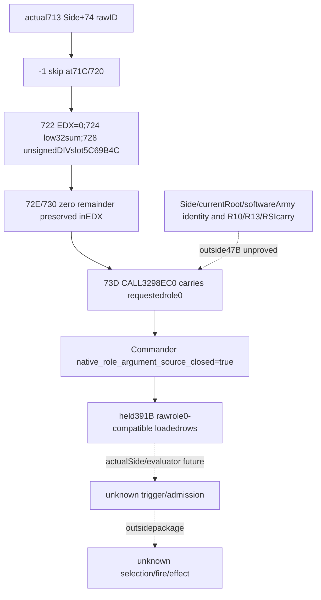

# Battle Commander role0 caller source — CK3 1.20.0.4

Actual Commander requested role0 is source-closed by Root's unique **47B / one read** capture. The useful delta is existing-V2 occurrence `native_role_argument_source_closed: false → true`,with requested rawrole0 unchanged. This is a source argument flag:whole Commander ABI liveness,software Army identity,candidate admission,trigger,selection and effects remain unqualified.

The exact target is **1.20.0.4 / Steam25734779**,frozen EXE SHA256 **98702F88A547CDE2EAF29A85F93B85F68EE4CF8148336A4F7AFAEB75319DD518**. Root Role848 adoption and source25 FIRST are reused parent-reported baselines and are never repeated by this lane. Battle source and Siege event closure are distinct. Main owns implementation,branch isolation and commit.

## Actual47B producer,calendar and implicit role argument

Root explicitly delegated the capture to Main using the held finite mapper `.venv -B -X utf8`. `native-caller/commander47-first01/FAMILY-MAP.json` is GREEN complete-instruction normalized-equal47B/one new read. Main consumed the sole DETAIL and relayed exactactualinstructions;this child did not reread receipts,37B/76B/391B spans,old774B/cache binaries orEXEs. The proof window is **[0x264D713,0x264D742)**,ending after the complete CALL.

| Actual source | Closed operand/condition | Limit |
|---|---|---|
|264D713 MOV R9D,DWORD[RBX+74]|Scheduled native Side raw FullCharacterID member|No actualSide/currentRoot or software per-Army Commander identity join.|
|264D71C CMP R9D,-1;264D720 JE264D744|Invalid-ID skip|-1 does not reach this selector route;no Character resolution,alive or suitability proof.|
|264D722 XOR EDX;264D724 LEA EAX,[R9+R13]|Unsigned high32zero and low32 fullID+day operand|R13 livecarry/currentday occurrence not newly qualified.|
|264D728 DIV DWORD[RIP+0361C41E]|next264D72E → interval SLOT **5C69B4C**|Matches held actual76B interval anchor;no interval0 predicate.|
|264D72E TEST EDX;264D730 JNE264D744|Successful zero unsigned remainder|Only EDX0 reaches the following CALL.|
|264D732 MOV R8,RBX;264D735 stackarg=RSI;264D73A RCX=R10|Argumentcopies preserve EDX|Copies do not prove RBX/R10/RSI origin or liveness.|
|264D73D CALL **3298EC0**|Same actual source-closed selector|No EDXwrite after successful DIV;requestedrole0 is carried to this CALL.|

The old cached47B `[264D733,264D762)` included a stack restore at+4. It was the shortest contiguous window covering producer,invalid-ID guard,calendar,zero-rem role argument and complete CALL. Post-calendar16B alone could not prove implicit role0. The exact47B ended before result-store/epilogue;no expansion was needed.

## Locator provenance and immutable source inputs

Before the capture,the explicit candidate264D713 came from already-held knight21 FAMILY-MAP cached namedcaller intervals old[264D509,264D733) and new[264D4E9,264D713):oldCommander entry equaled the old exclusive interval end,and the corresponding new exclusive end was only a successor-entry locator. Ordinal/address delta did not prove it. Actual47B instructions now admit this candidate and return actual JE/JNE target264D744,DIVslot5C69B4C and CALL3298EC0.

`COMMANDER47-AUTHOR-MANIFEST.json` and `ROOT-FINITE-COMMANDER47-MANIFEST.json` remain frozen as authored. Only decoded relocation ranges were permitted:JE[14,15),DIVsignedRIP[23,27),JNE[30,31),CALLrel32[43,47). Final actual closure is in `SOURCE-CLOSED.json`;no newPE/pdata/hash or callee was read/invoked.

## Independent value and unproved inputs

The existing rawrow-role inventory can now use requested0 as the actual native scheduled Commander role argument,and publish the same optional role-source flag for Commander occurrences. Shared391B already source-closes registry SLOT5D27B90,rows+50/signedcount+5C/stride8 and row RoleDWORD+1B0 equality. Those inputs were reused without instruction rereads. Source closure permits the role delta;Main/Root still own current-frame observer implementation and runtime qualification. Base completeness and MC status are unchanged.

The47B member producer does not make each software ArmyCommander equal to native `DWORD[actualSide+74]`. Explicit unproved inputs are RBX actualSide/currentRoot identity,R10phaseDB restore/carry,R13day-index carry,RSIDrawState carry,Character resolution/generation/liveness and suitability,actualSide/trigger-context/evaluator,selection/order/fire/effect. Registercopies are sourced;wholeCommanderABI liveness is not. These gaps do not justify extending this role-only capture for completeness.

The separate old Knight17B producer/guard `[264D576,264D587)` remains outside this package. Commander47B does not grant Knight identity-source qualification or complete eligibility.

External packet is `phase-commander-admission-source25/native-caller/`:SOURCE-CLOSED.json,TREE.md,SOURCECLIPS.md,INPUT-LEDGER.json,OCT7-W41-FIELDS.json and ROOT-DELIVERY.json. Source25 FIRST remains Root-owned; the native research lane performed no code/shared report change,build,test,import,game,SDK,process,EXE/hash or callee operation. Main executed only the explicitly delegated47B offline capture.

## Prepared role0 consumer increment

The exact47B result supports the minimal production delta in
`ck3_12004_phase_event_role_compatibility.hpp`: the source flag covers
requested role0 and1 under the exact4 binding. The Python contract preserves
new Commandertrue alongside historical Commanderfalse. Its pure qualified
role-row projection separates an unclosed argument source from observed
compatible role indices; it does not infer native participant membership.
No DTO/schema/serializer or production shared hook changes are needed.

The new `xar_ck3_12004_phase_commander_caller_whole_fixture` target emits one
complete V2 object using the production collector and integrated full-wire
serializer. One new registered-service compound verifies Commandertrue survives
normalization, keeps its role0 row and preserves Knight1 rows and base
completeness/MC. Historical false is checked through pure normalization
without another query. The original three-scene FIRST is not executed again.
This code and new FIRST are authored, not run; Root alone freezes, builds and
executes them. The delegated47B mapper is the only new source-file read.

Exact Root hook/argv and report fields are external under
`phase-commander-admission-source25/ROOT-CANDIDATE-HOOKS.md` and
`OCT7-W41-FIELDS.json`. Current physicalSide/root identity, event admission,
trigger evaluation, selection and committed effects remain explicit future
inputs. The current G2 loop retains its existing precontact and MC boundaries.
