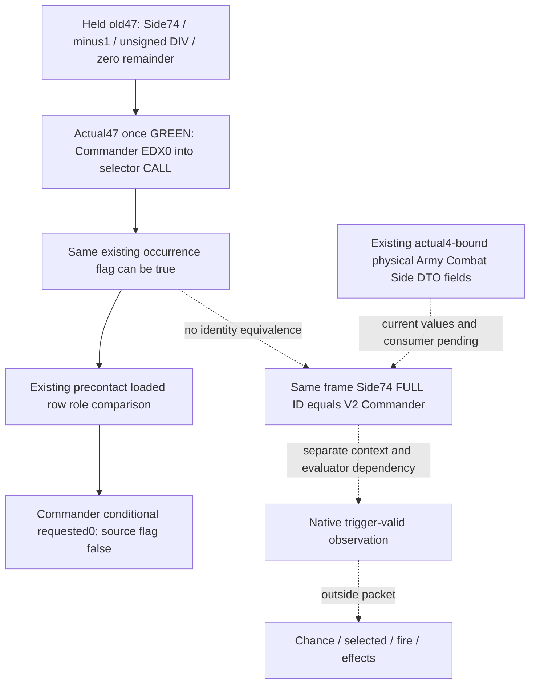

# Commander role 0 caller and identity frontier — CK3 1.20.0.4

2026-10-07 / 2026-W41. This DTO/consumer frontier now includes the minimal Python caller-attribution acceptance patch and one authored/unexecuted new registered-service FIRST after actualCommander47 source GREEN. It adds no ABI, public field, query tool, model gate or game action. Root's adopted Role848/source25 hooks and sole FIRST are not rerun or credited as complete here.

Target: CK3 **1.20.0.4**, Steam **25734779**, SHA-256 **98702F88A547CDE2EAF29A85F93B85F68EE4CF8148336A4F7AFAEB75319DD518**. Work tree: `C:/codex-ck3-background/g2-phase-admission-source24`; parent identifies its current candidate as Role848. Source baseline and actual391B receipts are reused. No executable, hash, SDK, process, build, test, import or git operation was performed.

## Minimal independently useful delta

The existing `phase_event_role_compatibility_v1`, schema 1, scope `v2_roster_loaded_event_role_condition`, already publishes native loaded role rows and each V2 roster occurrence's conditional requested role. Commander role 0 is useful in precontact now: equality against an observed loaded operand does not need an actual current CombatSide. The adopted old producer reported `native_role_argument_source_closed=false` for Commander and true for exact-bound Knight. The false flag marks the source of the conditional tag; it does not invalidate a measured role equality.

**ActualCommander47 is now once GREEN**, captured by Main under Root delegation. The exact-bound producer may now attribute the same field true for Commander. This upgrades role 0 from an old-held conditional tag to a source-closed actual native caller argument. Requested role 0, rows, compatibility masks, occurrence order and identities remain unchanged. Neither V2 base readiness nor MC readiness acquires an additional requirement. The Python normalizer accepts both legacy Commander false and actual-qualified true; Knight true remains required. Producer integration belongs to Main/native lane.

Current implementation seams:

| Seam | Current behavior | Delta only after actual proof |
|---|---|---|
| `ck3_12004_phase_event_role_compatibility.hpp`, `ReadPhaseEventRoleInputs12004` occurrence builder | `native_role_argument_source_closed = bindings.enabled && requested == 1` | Attribute Commander true only from the admitted actual role 0 caller and exact-bound producer; no copied Knight authority |
| `phase_event_role_compatibility_contract.py`, `normalize_phase_event_role_compatibility_v1` | Legacy false and actual-qualified true Commander flags now accepted; Knight true required | Implemented tiny Python acceptance patch; strict Boolean, exact target SHA and provenance checks retained |
| `phase_event_role_compatibility_v1.hpp` | Existing occurrence Boolean and requested uint32 role | No new public field or DTO layout required |
| `phase_event_role_compatibility_v1_serializer.hpp` | Serializes the occurrence Boolean directly | No serializer change required |
| `combat_contract.py`, registered service/MCP and query cache | Existing optional attachment and V2 transport | No new hook, tool, Side requirement or model gate |
| `compatible_loaded_row_indices` | Pure per-occurrence true-row projection | No change; retain occurrence ordinal and repeated CharacterID |

A null loaded registry or failed role row may coexist with a true caller source flag: source closure and current value availability are different. Unknown rows remain null; legal empty registry remains available. The new pure `source_qualified_role_row_indices` returns `None` for an unclosed caller flag, and otherwise the observed compatible indices for that role argument. It labels source-qualified role arguments, not current participants or admitted candidates; the existing conditional `compatible_loaded_row_indices` remains usable for legacy false. Root's existing whole role FIRST is not repeated to flip the caller attribution.

## Exact caller proof now closed

Held old window is **[0x264D733, 0x264D762), 47 B**. It loads Side `+74` into R9D, skips `FFFFFFFF`, forms the wrapped FullID + R13 dayIndex numerator, clears EDX, performs unsigned DIV by loaded interval, and tests the remainder. The zero-remainder fallthrough retains **EDX=0** through the Side/DrawState/Database argument moves to the selector CALL. The old postcalendar 16 B alone does not establish this role origin.

The candidate was only a locator until capture. Main's once-GREEN actual span **[0x264D713, 0x264D742), 47 B** now admits Side+74 FullID load/minus1 skip and the successful zero-DIV path retaining EDX0 into CALL **0x264D73D → 0x3298EC0**. Actual DIV **0x264D728 → slot0x5C69B4C** matches the admitted interval source; both JE/JNE skip targets are **0x264D744**. This lane reused Main/Root's result and performed no executable read, old391/76 reread, scheduler or selector invocation.

The 47 B source can establish where the native caller reads its Commander ID and how role 0 reaches the call. It does **not** observe that ID's current value or prove that a software Army Commander occurrence equals that physical Side Commander. There is no new generic permission/eligibility observation, alive check, native trigger truth, selected event, fire, or effect credit. `native_candidate_admission_observed=false` and `complete_phase_effects_ready=false` remain unchanged.

## Next identity join uses an existing field family

The next useful observation after role 0 source closure is whether a particular V2 Commander is the current physical side's scheduled Commander. Reuse the existing `current_army_combat_roles_phase_inputs_v1` DTO/serializer rather than inventing a duplicate Army/Combat/Side reader. Its source is currently exposed by the existing army-strength query and service projection. The following exact raw fields already exist:

| Existing leaf field | What it supplies for a join |
|---|---|
| `occurrences[].native_index`, `.raw_full_id_u32`, `.original_army_resolution`, `.same_query_army_selection_matched` | Original same-query Army selection and its full reference |
| `.actual_army_10_raw_u32`, `.army_128_raw_u32`, `.combat_resolution.object_identity` | Physical CArmy identity and current Combat backlink resolution |
| `.selected_combat_magic_0c_raw_u32`, `.selected_combat_full_id_08_raw_u32`, `.source_active_combat`, `.active_combat_inputs_ready` | Current resolved Combat's full generation/magic and active state |
| `.attacker_side/.defender_side.parent_identity`, `.parent_matches_selected_combat` | Physical Side belongs to the resolved Combat |
| Side `.armies.references[].{native_index,raw_full_id_u32}`, `.matching_army_indices`, `.matching_membership_ready` | Actual full Army membership, preserving native raw order/duplicates |
| Side `.commander_74_raw_u32` | Native stored current Commander FullCharacterID; `FFFFFFFF` is absent, zero remains a legal reference |
| Side `.primary_70_raw_u32`, `.owner_matches_primary`; occurrence `.selected_character_18_raw_u32` | Owner/primary context only; neither is a substitute for Commander `+74` |

The service preserves raw inputs under `current_army_combat_roles_phase_inputs_v1[].projection.observed_current_army_combat_roles_phase_inputs` and copies the occurrence fields into `.projection.occurrences[]`. Its provenance includes snapshot ID, public/native revision, date and executable identity.

**The family is already source-bound by Root's actual4 factory.** A finite read of `Z:/gb0/ck3_autonomous_player/native_bridge/src/ck3_12004_adapter.cpp` confirms it installs `BindArmyImage12004`. The exact-SHA guarded factory in `ck3_12004_army.cpp` calls `PopulateClosedCurrentInputs`, sets shared `common.enabled=true`, and fills `current_army_combat_roles_phase_bindings`: `roles.common=common`, actual Combat store/fallback from `dated` (`5D1DE70`/`5D1DE18`), actual CombatManager secondary vtable `477F188`, and threshold slot `5C69BB0`. Existing `ck3_12002_army.cpp` then calls `ReadCurrentArmyCombatRolesPhaseInputs12003` with **these actual4 bindings**, and publishes the optional leaf. The software type/method/projection contract retains .3 names and `source_contract_game_version='1.20.0.3'`; these are canonical software labels, not evidence of an unbound or failed migration. Effective build identity is the factory and current source provenance. No missing actual4 factory or extra ABI capture was found for this join entry.

The concrete next missing evidence is **same-frame actual4 paused Army/Combat/Side operands and the V2 Commander full-ID join consumer**, not a new native field. This lane has read source only and holds no such current values. Reuse the existing query/leaf and exact source provenance; do not wait for a duplicate observer or another entire ABI package. Identity match remains unobserved until the current operands are obtained. The join requires only its Army/Combat/Side identity operands, not the family's unrelated phase threshold, owner/primary, manager callback, or broad `current_combat_roles_phase_inputs_ready` aggregate.

Using its existing exact-bound current query, the minimal pure join is: match the V2 public CUnit/native CArmy provenance to its same-query physical Army occurrence; resolve the selected full Combat; use that Side's actual full Army membership and parent match; compare the Side's full `commander_74_raw_u32` with the V2 occurrence `character_id`. Return a local match/mismatch/unknown result. If no unique physical side membership is observed, retain unknown instead of choosing by requested attacker/defender role. Full references are compared as uint32 including generation; no slot-only or owner/primary substitution. Reuse matching snapshot/public/native revision/date provenance when consuming the existing army-strength and V2 query outputs. This does not prove that a Character is alive, eligible, trigger-valid or will be selected.

No actual-combat join is required for precontact role comparisons. A future hypothetical trigger context would have a distinct explicit scope; it must never be labelled actual. Existing `ongoing_combats[].combat_id`/orientation can provide a V2 anchor but lacks Side Commander identity and alone cannot close this join.

## One novel caller-qualified FIRST authored, not run

After Main's minimal producer integration, freeze one **new** caller-qualified package. Reuse the existing held full V2 seed and source-bound fake loaded registry `[0,1,7,1]` through the integrated production DTO/collector/serializer. Main emits **one complete V2 body**, not a three-scene bundle or external JSON flag rewrite, with exact admitted Commander caller attribution true. Keep the available registry and all base composition/model operands unchanged.

The authored CLI consumer is **`tests/unit/test_phase_event_commander_caller_registered_service_12004.py --source-root ... --wire ... --output-dir ...`**, output `phase-event-commander-caller-registered-service-12004.json`. It imports only the old role test's reusable `_WholeRoleEndpoint`, `_snapshot_for` and revision/date constants; its explicitly constructed unittest suite contains only the new one test method. It does not load/run the old test class or three-scene matrix. The source-qualified native fixture does not invoke scheduler, selector, RNG or effect code. The new consumer makes one real `create_server(driver).call_tool("ck3_query_combat_simulation_inputs", ...)` request.

Novel assertions: Commander requested raw role remains 0 and its source flag is true with row `[0]`; Knight retains role 1/source flag true and rows `[1,3]`; caller qualification does not change loaded rows/compatibility masks or occurrence provenance; roundtrip and detached whole cache retain the new Commander Boolean. No current CombatSide is required. Both admission/effect flags remain false and base input/model completeness and MC gaps stay unchanged. A pure leaf normalization changes only Commander flags back to legacy false, preserves them without rejection, retains conditional row `[0]`, and returns `None` only for the new source-qualified projection; it makes no additional query.

Do not rerun `test_phase_event_role_compatibility_registered_service_12004.py` or its prior three native whole scenes. Reuse its results when Root completes source25 FIRST. The novel one-sample test verifies only the new caller-attribution seam; it is not an actual live Side+74 identity test or complete native admission test.

Production shared hooks required: **0** if Root's adopted optional V2 leaf is already wired. Existing DTO, serializer, factory, query attachment, registered tool and cache are sufficient. A uniquely named test target in CMake is needed only if Root chooses to register a new fixture executable; it is a test registration, not a production Bridge/API hook. Main owns any later code/registration/commit; none was changed by this inventory.

## Source tree

## Oct 7 / W41 fields

Completed: identified the minimal existing caller-attribution Boolean delta and zero required production shared hooks; confirmed Root's actual4 physical Army/Combat/Side binding path; reused Main/Root's actualCommander47 GREEN; implemented the small Python acceptance/projection delta and authored one new caller-qualified single-body registered-service FIRST. Shared .3 software labels were distinguished from actual4 executable bindings.

Readiness: actualCommander47 bounded source GREEN, Python consumer **authored/not run**. Root Role848/source25 sole FIRST was not rerun or completed by this lane. New caller-attribution software is ready for Main's integrated sole FIRST; no current identity match, eligibility, trigger, live observation, MC or gameplay credit.

Next: Main producer freeze and unique one-sample native→service FIRST; then existing exact-bound army-strength/V2 same-frame observation and a small pure Side Commander full-ID join consumer. No new ABI/capture/observer is necessary just to reuse this identity family. This lane authored Python only and ran no import/test/build/game/SDK/EXE/git.

Reused sources: [role observation topic](battle-phase-admission-observation-inputs-12004.md), [held native admission source](battle-phase-admission-cached-stage-12004.md), `phase_event_role_compatibility_v1.hpp`, `ck3_12004_phase_event_role_compatibility.hpp`, its serializer and Python contract; `army_current_combat_roles_phase_inputs_v1.inc.hpp`, its serializer, `ck3_12003_army_combat_roles_phase_inputs.hpp`, the bounded existing projection/service source; Root `Z:/gb0` actual4 adapter/army factory and its shared reader invocation. Commander47 source is held under external `phase-commander-admission-source25/native-caller/`; Main/Root now admitted its single actual window GREEN.
