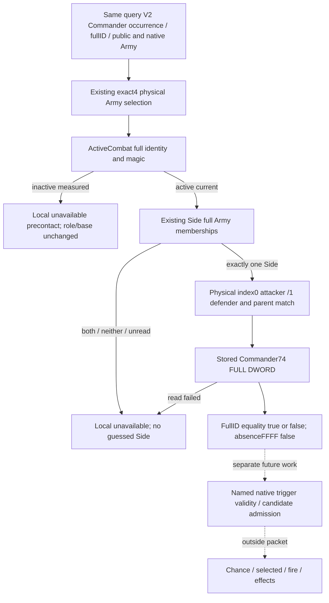

# Current physical Side Commander identity join — CK3 1.20.0.4

2026-10-07 / ISO2026-W41. Source26's independently scoped observation compares each published V2 Commander FullCharacterID with the current physical Side's stored Commander. It neither turns a roster Commander into an admitted phase-event candidate nor changes precontact role comparison, input completeness or MC readiness.

Exact target: **1.20.0.4 / Steam25734779 / SHA256 98702F88A547CDE2EAF29A85F93B85F68EE4CF8148336A4F7AFAEB75319DD518**. Private source tree is `C:/codex-ck3-background/g2-phase-admission-source24`, parent-provided HEAD `ed8`; no git lookup was performed. Source knowledge and this input tree were written before the new Python normalizer/consumer. Main owns the native wrapper, same-query attachment, production serialization and FIRST. This lane performs no imports, tests, builds, game/SDK/process or executable reads.

## Existing source fields are sufficient

The existing actual4 Army factory was finitely checked in the previous [Commander caller frontier](battle-phase-commander-role-input-frontier-12004.md): the exact-bound adapter fills `current_army_combat_roles_phase_bindings` and invokes the reusable software reader. The `12003` type/function/projection contract names are canonical software names, not old executable bindings.

`current_army_combat_roles_phase_inputs_v1` already contains original/same-query Army selection, physical Army full ID, its current Combat backlink and selected Combat full ID/magic, per-side parent association, raw full Army memberships/matching indices, and `commander_74_raw_u32`. Its normalized projection preserves the raw body and occurrence fields. No new ABI is required for this join.

The broader reader's `_derive` additionally requires owner, primary, manager roster, phase scalars and maneuver threshold. Those fields are not prerequisites for this identity equality. Main's new wrapper uses only **Selected + ActiveCombat + Side(owner=nullopt)**. It does not invoke whole Observe, manager, owner resolution, phase logic, scheduler, selector, RNG or effects. A Side may supply complete membership/parent/Commander operands while its broader `side_inputs_ready` is false because no owner was demanded; this join consumes the necessary operands directly.

| Needed source fact | Existing raw body |
|---|---|
| Physical CArmy resolves to the V2 source ID | `raw_full_id_u32`, `original_army_resolution`, `same_query_army_selection_matched`, `actual_army_10_raw_u32` |
| Current active Combat and full generation | `army_128_raw_u32`, `combat_resolution`, `selected_combat_magic_0c_raw_u32`, `selected_combat_full_id_08_raw_u32`, `source_active_combat` |
| Side membership is observed completely | attacker/defender `matching_membership_ready` and `matching_army_indices`, derived from full Army refs |
| The chosen Side belongs to that Combat | `parent_matches_selected_combat` |
| Native stored Commander full DWORD | `commander_74_raw_u32` |
| V2 requested Commander / provenance | normalized `armies[].commander.character_id`, public `army_id`, `native_carmy_id`, requested `encounter_role` |

Source facts are attached to the **same V2 query body**, not joined with a cached older query. Occurrence provenance matches the normalized V2 roster. MCP's outer snapshot/public/native revision/date identifies the frame; no second query is needed for the new leaf.

## Final additive exact-dict contract

Optional key **`phase_event_commander_side_identity_v1`**, schema 1, scope **`v2_roster_current_physical_side_commander_identity`**. Root keys are exactly:

`schema_version, scope, status, source_ck3_sha256, commander_side_identity_source_closed, native_candidate_admission_observed, complete_phase_effects_ready, unavailable_reason, occurrences`.

The admission/effect flags remain false. Root status is available when all Commander rows have a comparison (including measured false), partial when some do, and unavailable when none do. An empty published Commander roster is available.

Each row has exactly these 19 keys:

- Provenance/status: `occurrence_index, character_id, source_public_cunit_id, source_native_carmy_id, encounter_role, status, unavailable_reason`.
- Facts: `actual_physical_army_full_id_raw, actual_selected_combat_full_id_raw, source_active_combat, attacker_membership_count, defender_membership_count, unique_physical_membership, actual_side_index, actual_side_role, actual_side_parent_matches_selected_combat, actual_side_commander_full_id_raw, actual_side_commander_present, full_id_equal`.

Only Commander occurrences are emitted. Their indices remain **sparse global V2 role indices**, counted army Commander then every knight; dropping knights from this leaf must not renumber Commander occurrences. Source public CUnit and native CArmy stay distinct. Equal CharacterIDs in different army occurrences remain separate.

Full IDs are uint32 including generation; public/native source IDs use their existing signed integer representation. A qualified comparison requires the measured physical Army full ID to equal the uint32 form of the V2 native CArmy ID. A measured fallback/mismatch retains its raw fact but stays locally unavailable; it never authorizes a current Side comparison. Native ID -1 / absent source cannot identify a physical Army. No low24-only Character comparison is permitted.

## Local observation semantics

Membership counts are nullable nonnegative integers from complete per-side membership observations. More than one raw matching index within a single Side still identifies one physical Side. If exactly one Side has count greater than zero and the other has zero, `unique_physical_membership=true`, index 0/role attacker or index 1/role defender is derived from the **actual physical** membership. Requested encounter role does not pick that Side.

If both counts are positive or both zero, uniqueness is observed false. If either count is unread, uniqueness is unknown. Neither branch supplies an arbitrarily selected Side or identity equality: Side fields/equality remain null and the row is locally unavailable. These observations do not invalidate V2 base inputs.

For an observed unique Side with parent match true and a source-qualified current Combat, `full_id_equal` compares the full stored Commander DWORD with the V2 Commander. A different Commander or different generation gives **available/false**. The raw Commander `FFFFFFFF` is observed absence: `actual_side_commander_present=false`, `full_id_equal=false`, still an available comparison. Legal Commander ID 0 is present. A failed Commander read has null raw/present/equality and local unavailable.

When `source_active_combat=false`, preserve the known physical Army and any observed Combat sentinel; no Side fields are supplied, equality stays null, reason `physical_army_not_in_active_combat`. This is the valid precontact/unavailable case. A read failure is separate from measured inactive state. It adds no in-battle or MC gate to current role observations.

A comparison does not prove alive/eligibility, named trigger context, native candidate validity, selected order, chance, event fire or effect execution. Commander role0 caller source proof stays in its existing leaf and is unchanged.

## Consumer and sole FIRST boundary

The new pure normalizer is `src/xar_autoplayer/bridge/phase_event_commander_side_identity_contract.py`, signature `normalize_phase_event_commander_side_identity_v1(value, *, armies) -> dict | None`. Only distinct optional import/key/attachment hunks were added to `combat_contract.py`. Missing leaf remains None; malformed present leaf becomes local unavailable, preserving base composition/model completeness. It validates the exact dictionary, occurrence provenance, full-ID equality, unique-side/count relationship, physical orientation and source flags. It uses no broad-family phase/manager readiness gate.

Main supplies one new complete-V2 production-serialized bundle with scene order **matched, different_generation, ambiguous_side**. The authored CLI is `tests/unit/test_phase_event_commander_side_identity_registered_service_12004.py --source-root ... --wire ... --output-dir ...`, output `phase-event-commander-side-identity-registered-service-12004.json`. It uses the existing whole-V2 endpoint/snapshot helpers but its explicitly loaded suite contains only the new compound method; no old test class or prior compound runs.

Each new scene calls real `create_server(driver).call_tool("ck3_query_combat_simulation_inputs", ...)` once. Matched requires every Commander comparison true. Different_generation uses `character_id XOR 0x01000000`, matching low24 but different full uint32 IDs and **available false**, proving no slot-only match. Both unique scenes have the chosen Side count 2 and other Side count 0, and physical Side role opposite the requested encounter role: duplicates within one Side remain valid, and caller-selected orientation does not choose the Side. Ambiguous_side has complete counts 2/1, observed uniqueness false and null Side/parent/Commander/equality; it is locally unavailable. All retain sparse occurrence indices, distinct public CUnit/native CArmy attribution, query cache/JSON roundtrip and unchanged base readiness/MC gaps. Legacy absence, malformed-leaf isolation and measured inactive-Combat semantics use pure normalization with no extra query. The old caller/role/calendar compounds are not rerun. This packet grants no live-game credit; Root owns execution after native attachment and source freeze.

The new schema needs Main's additive DTO, exact-bound wrapper, existing V2 field/attachment/serializer hooks, plus Python optional import/key/normalize attachment. It does not create a new MCP or change service query policy. Main owns shared headers/Bridge/CMake; this lane changes only its Python files, new topic and external packet after source input closure.

## Native input tree

## Oct7 / W41 fields

Completed source frontier: confirmed existing selected/active/Side raw fields suffice; removed broad owner/manager/phase/threshold prerequisites from this narrow join; finalized the exact optional dictionary and local equality semantics; preserved same-query sparse Commander provenance and physical orientation.

Implementation/readiness: Main confirmed native wrapper/attachment plan before Python work. Normalizer and one new registered-service consumer are authored without import/test/build. Their sole FIRST remains Root-owned and unexecuted by this lane. No actual paused current Side values, admission/effect/live/MC credit is claimed.

Next: Main integration/freeze and the three new whole scenes' sole FIRST, then actual paused player battle identity observation when Root proceeds. Existing precontact role/caller capabilities and prior GREEN artifacts remain reusable without reruns. Parent merges these fields into Oct7/W41 and owns commit/push.

Sources: existing actual4 Army factory closure from the [caller frontier](battle-phase-commander-role-input-frontier-12004.md); `army_current_combat_roles_phase_inputs_v1.inc.hpp`, its serializer, `ck3_12003_army_combat_roles_phase_inputs.hpp` Selected/ActiveCombat/Side source; bounded `army_current_combat_roles_phase_inputs_12003.py` normalized body/projection and membership logic; normalized V2 role occurrence builder. The broader source remains open for its own phase/model claims.
