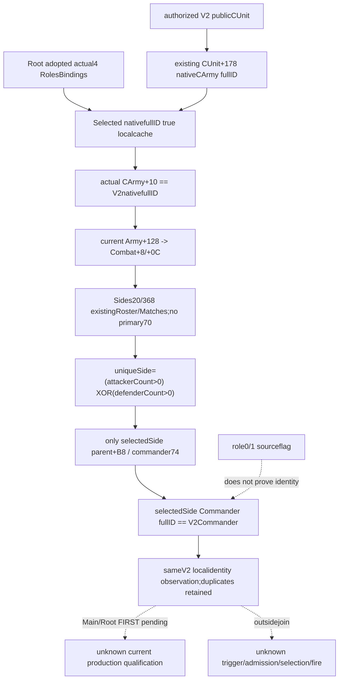

# Battle Commander current physical Side identity — CK3 1.20.0.4

The current Commander identity gap can be constructed from existing adopted actual4 source helpers,inside the same V2 query. Root supplies its existing `ArmyBindings.current_army_combat_roles_phase_bindings` plus actualSHA. Main can reuse the exact CArmy resolver,ActiveCombat and Side/membership fields for already-authorized V2armies;no fresh EXE capture,new Army ABI field/nativeRVA/getter or broader query is required. This is a source plan before implementation and runtime qualification.

Source HEAD is **ed8c92bba5f8ce8550b07da135606120bf77b749**,target **1.20.0.4 / Steam25734779**,frozen EXE SHA256 **98702F88A547CDE2EAF29A85F93B85F68EE4CF8148336A4F7AFAEB75319DD518**. Rooted8 adoption/source26 FIRST is parent-reported pending baseline and is not replayed. Previous role0/1 and actual391B source proofs are reused;their source flags alone do not join current Side participants.

## Existing IDs,scope and borrowed bindings

`CombatArmyInputsSnapshot` already separates public `army_id` from `native_carmy_id_observable/native_carmy_id`. The V2 row resolves public CUnit,reads native CArmy FullID at CUnit+178,and generation-matches CArmy+10 in its native registry. The public CUnit ID is never substituted for native CArmy ID. Preserve full32 ID bits,including generation,when copying signed software storage to raw native fields.

V2 authorization already selects requested armies from player armies and active-war allies/enemies,checks opposed encounter sides and common wars. This join borrows exactly those published rows. It does not add owner70,player-only,in_battle or state-code eligibility checks. The row's `encounter_role` describes a requested hypothetical encounter;actual Side attribution comes only from the current native Combat membership.

Actual4 `PopulateClosedCurrentInputs` assigns common Army registry/fallback5D1DE48/5D1DE50 and roles Combat registry/fallback5D1DE70/5D1DE18. Canonical12003 helper/type names remain usable with this actual4 common binding. Do not call the old-SHA Bind...12003 factory to reconstruct it. Root's planned wrapper is `BindPhaseCommanderSideIdentity12004(existingRolesBindings,actualSha)`;the existing field is lent to the same V2 hook.

## Minimal existing helper inventory

| Helper | Needed arguments | Local value reused |
|---|---|---|
|`post_admission_refresh_detail::Selected`|borrowedRoles.common,optional nativeCArmy fullID,army=true,localcache|Resolved.object plus fullID/objectIdentity provenance.|
|`combat_roles_phase_detail::ActiveCombat`|roles,borrowedFlag31common/CombatSlots,selected.object,local occurrence|Army+128 combatID;selected Combat fullID+8,magic+0C and source_active_combat.|
|`combat_roles_phase_detail::Side` source projection|Existing Roster/Matches for Side20/368,then Read on only selectedSide|Both membership counts;selected parent+B8 and commander74;do not invoke full Side helper.|
|`combat_roles_phase_detail::Matches`|Side roster,rawnativeArmyFullID|Every exact full32 matching index,preserving duplicates.|

Selected resolves native registry index rawID&FFFFFF,slotstride16/+8 and candidate fullID+10. Native fallback may still return `selected_object_ready=true` with a different observed ID;therefore compare its existing `selected_full_id_u32` with the V2 native FullID. This metadata already observes actualArmy+10 in the same frame,so do not read the identical member again. Selected physical pointer/objectIdentity is retained for internal provenance. No fabricated same_query_refresh or world roster is needed.

ActiveCombat reads CArmy+128 and uses the existing Combat resolver at fullID+8,magic+0C==436F6D62 and fullID!=-1. Its inactive/absent or unavailable observation is preserved. It does not invoke a native getter or require public CUnit in_combat.

The minimal projection reuses only existing Roster/Matches for Combat+20 and Combat+368:FullID roster data+10/capacity+18/signedcount+1C with stride4. After unique physicalSide is known,read only that Side's parent+B8 and commander+74. Require the locally observed parent equals selectedCombat. Do not invoke the complete Side helper or read primary70/owner fields. The complete helper's owner-dependent `side_inputs_ready` is not used;full ReadCurrentArmyCombatRolesPhaseInputs12003 also iterates the original all-Army manager roster and demands owner,manager andphase. Those aggregate readers/dependencies are unnecessary for this join.

## Unique physical Side and identity comparison

Let attackerCount and defenderCount be the two exact fullID membership counts. Unique physical Side is **(attackerCount>0) XOR (defenderCount>0)**. Duplicate occurrences within one Side are accepted and both counts remain observable. BothSides/noSide membership provides no unique physical Side,so only this localjoin remains unavailable;no new global ready gate is introduced.

Once local CArmy identity,current Combat,parent/membership and unique physical Side are available,compare raw FullCharacterID `selectedSide.commander74` with the published V2 Commander.character_id. A mismatch is a useful observation,not an inferred fault. The result identifies whether the software per-Army Commander is the current native Side commander;it does not replace the role-source flag with complete participant admission or trigger qualification.

The hook stays beside existing AttachPhaseEventRoleInputs12004 in the SAMEV2 available branch. Root owns shared integration;Main owns the standalone collector/optional DTO. This source chain was written before implementation. Base completeness,full phase fidelity and MC remain unchanged. ActualSide trigger-context construction/evaluator,R10/R13caller carry,selection/order/fire/effect remain future work.

External `commander-side-join-source26/native-tree/` holds the precise source inventory/signatures,sourceclips,TREE.md,INPUT-LEDGER.json and OCT7-W41-FIELDS.json written before Main code. Main subsequently authored the header-only exact4 borrowed-binding collector, optional DTO/serializer and independent strict Python contract. Five Root-owned hooks are specified in `commander-side-join-source26/ROOT-SHARED-HOOKS.md`.

The unique FIRST is authored NOTRUN: three complete native-produced V2 scenes exercise matching fullID,different generation and ambiguous Side membership through the integrated literal serializer and registered MCP service. Selected-Side duplicate membership remains valid;actual Side is deliberately opposite hypothetical encounter role. No prior GREEN check,compiler,test,import,game,SDK,process,newEXE read/hash/capture or shared report edit occurred. Source prepared is not static-ready or live;latest user instruction prohibits local CK3 execution.
