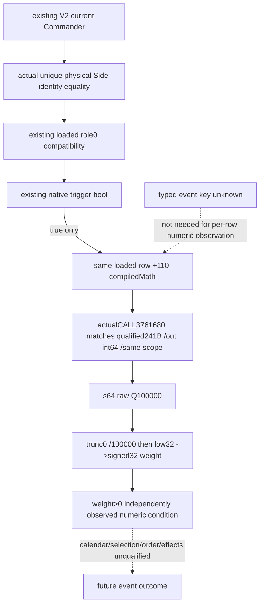

# Current Commander compiled chance and signed weight, CK3 1.20.0.4

Source31 independently exposes a numeric decision operand for already role-compatible, trigger-true current Commander rows. Target CK3 1.20.0.4 / Steam25734779 / SHA256 `98702F88A547CDE2EAF29A85F93B85F68EE4CF8148336A4F7AFAEB75319DD518`; sourcepin `896719b1363050644e90f1c747ce1510b4d0a475`. This tree precedes Main code. State is **research/SOURCE_CLOSED numeric operands; numeric FIRST NOTRUN**. Typed key remains a separate research lane.

Existing actual4 [role](battle-phase-admission-cached-stage-12004.md), [Commander role0](battle-phase-commander-admission-source-12004.md), [same-frame physical Side identity](battle-phase-commander-side-join-source-12004.md) and [trigger scope](battle-phase-current-commander-trigger-conditions-12004.md) source are reused without recapture. Observe the same loaded row pointer after known role0 and native trigger success, using the same Character root plus named physical Side token; calendar readiness stays independent.

Only the old cached selector suffix [3299037,329906C),53B was needed. Main's sole actual window [3299017,329904C) is **GREEN53B/1read,0.5528725s**, with complete normalized equality. Child consumed its sole NEW DETAIL once. Actual3299017 passes `RCX=row+110`,329901E sets `R8=same scope`,3299023 sets `RDX=caller-owned int64 out`, and CALL329902A(offset19) returns **3761680**, matching the already qualified241B evaluator. MOV329902F reads returned QWORDraw; STORE3299046 writes native signed32 weight. The window derives from actual known selector3298EC0+closed343B and stops before append/loop/RNG. New callee capture cost0. [SOURCE-CLOSED](Z:/ck3_mod_rewrite_process_assets/g2-background-20261007/upstream-build-migration/g2-combat-forecast-12004/commander-native-chance-source31/native-tree/SOURCE-CLOSED.json) seals actual operands; the53B author manifest stays immutable.

Main forwarded the actual held R12 producer at3298FE8 (prefixoffset296), bytes `49bc09e1d1c6116bf129`, literal **0x29F16B11C6D1E109**. This equals ceil(2^78/100000). The native conversion is:

```text
raw = s64(*returned_value_pointer)
high = signed_high64(raw * 0x29F16B11C6D1E109)
q = arithmetic_shift_right(high, 14)
q += unsigned_shift_right(bit_pattern(q), 63)
weight = bitcast_s32(low32(q))
       = bitcast_s32(low32(trunc0(raw / 100000)))
```

Raw0 and negative values remain legal observations; nonpositive weight is not a read failure. Preserve the full signed64 Q100000 raw separately from signed32 native weight. The low32 store is not saturation. Weight is an integer selection operand, not a normalized percentage. A positive weight for a current trigger-true role0 row is independently useful for identifying which loaded rows carry positive selection weight, but it does not prove calendar firing, full admission, chosen event, selection probability, effects or future battle outcomes.



The already qualified evaluator is tracked in [prisoner domain ABI](../../ck3_autonomous_player/native_bridge/research/ck3_12004_prisoner_domain_abi.json), row support_owner_layout, old37616A0/new3761680 declared241B and complete_instruction_span_normalized_equal. Its exact held [DETAIL](Z:/ck3_mod_rewrite_process_assets/g2-background-20261007/upstream-build-migration/prisoner/current4-ransom/named-map01/support_owner_layout-DETAIL.json) was consumed once for necessary NEW source semantics; the existing alias is `int64_t*(*)(const void* compiledMath,int64_t*out,void*scope)`. RCX math is saved inRDI, RDX caller-out inRSI and R8 scope inRBX. MOV RAX,RSI at3761755 then RET3761770 returns caller-owned out; it does not return a separately allocated numeric object. Reuse this full qualification without expanding its internal helpers. Main may directly bind actual4 imagebase+3761680 under exactSHA, borrowing existing phase scope/role bindings; no prisoner business-factory gate is needed. The actual53B CALL edge now matches this held callback; native frame values and numeric FIRST remain unqualified. [SOURCE-REUSE](Z:/ck3_mod_rewrite_process_assets/g2-background-20261007/upstream-build-migration/g2-combat-forecast-12004/commander-native-chance-source31/native-tree/SOURCE-REUSE.json) preserves the ABI and binding route.

Proposed output attaches nullable `chance_raw` (signed64), `integer_weight` (signed32), `weight_positive`, evaluation status/reason to the existing current Commander per-row condition observations. Rows that failed role/trigger remain uncalled; a read failure is distinct from zero or native false. Preserve loaded row indices/order and duplicate Commander occurrences. Main owns final DTO names, collector and hooks; base completeness/MC stay unchanged.

External [TREE](Z:/ck3_mod_rewrite_process_assets/g2-background-20261007/upstream-build-migration/g2-combat-forecast-12004/commander-native-chance-source31/native-tree/TREE.md), [53B manifest](Z:/ck3_mod_rewrite_process_assets/g2-background-20261007/upstream-build-migration/g2-combat-forecast-12004/commander-native-chance-source31/native-tree/ROOT-FINITE-PHASE-CHANCE53-MANIFEST.json), [ledger](Z:/ck3_mod_rewrite_process_assets/g2-background-20261007/upstream-build-migration/g2-combat-forecast-12004/commander-native-chance-source31/native-tree/INPUT-LEDGER.json) and [Oct8/W41](Z:/ck3_mod_rewrite_process_assets/g2-background-20261007/upstream-build-migration/g2-combat-forecast-12004/commander-native-chance-source31/native-tree/OCT8-W41-FIELDS.json) are authored. Child fresh EXE0, native calls0, game/SDK/process/window0, imports/tests/build0; no code/shared headers/CMake changes.
