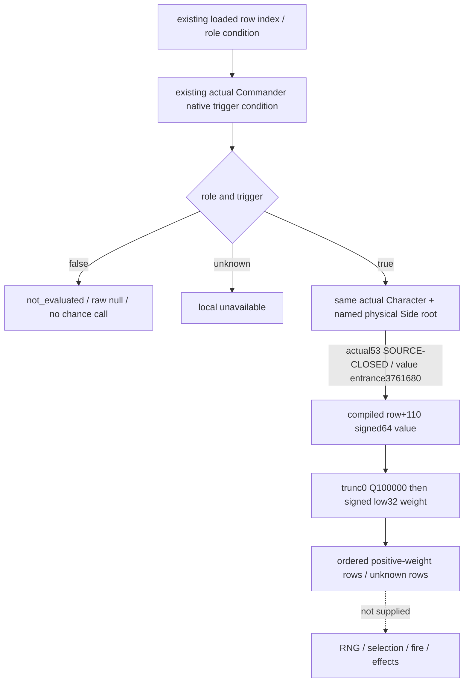

# Current Commander loaded chance and signed weight inputs — CK3 1.20.0.4

This source31 input package prepares a readonly numerical observation for current physical Side Commander rows whose loaded role and native trigger pass. It will expose the compiled chance result and the native signed selection weight. A current positive-weight row set is independently useful: a trigger-true row with a zero or negative final weight is excluded from that set. It is not a probability, selected event, random draw, fired effect, complete phase model or enter-battle permission.

## Source-first frontier

Private baseline is `896`, parent-owned tree `C:/codex-ck3-background/g2-phase-admission-source24`, with Root29 shared hooks as an explicit dependency. The target is CK3 1.20.0.4 / Steam build 25734779, SHA-256 `98702F88A547CDE2EAF29A85F93B85F68EE4CF8148336A4F7AFAEB75319DD518`. Existing calendar, role, Commander identity and current role/trigger publications are reused. This child does not rerun their GREEN compounds.

Root's sole `source31/native-tree/chance53-first01/FAMILY-MAP` now admits actual `[0x3299017,0x329904C)` / 53 bytes, following the existing actual selector prefix. It evaluates the loaded row's chance receiver `row+0x110` in the same Character/named physical Side root as its trigger; signed64 output is written via RDX. The actual returned value callee is **`0x3761680`**. Main reuses the held old241 evaluator qualification for this admitted entrance. Old `0x37616A0` is not installed as an actual4 address. This child reuses Main's source result without reading EXE bytes or rerunning the mapper.

The held actual prefix loads division magic `0x29F16B11C6D1E109` at `0x3298FE8` / prefix offset 296. The now-admitted following arithmetic uses signed shift by 14, sign correction and low32 storage: signed Q100000 `chance_raw`, quotient `trunc0(chance_raw / 100000)`, then low32 reinterpretation as signed32 `selection_weight_raw`. Integer arithmetic preserves truncation toward zero. A large quotient retains native low32 behavior; the final signed32 weight determines the positive set. Source closure authorizes implementation; runtime synthetic collector/serializer/Service qualification remains NOTRUN in this lane.

Typed event keys remain a separate research branch. Actual76 initializer suffix and returned31 diagnostic `Instance has not been created!` do not close an event key; this numerical row-index leaf does not wait for naming or guess a key/member offset. The new native source tree owns the actual53 and returned-evaluator frontier; this topic requests and performs no EXE read.

## Accepted additive optional contract

Accepted key: `phase_event_commander_chance_weights_v1`, schema 1. Scope: `v2_current_physical_side_commander_loaded_role_trigger_chance_weights`.

Root has **9 keys**:

`schema_version, scope, status, source_ck3_sha256, chance_source_closed, native_chance_evaluation_observed, complete_phase_effects_ready, unavailable_reason, occurrences`.

`chance_source_closed` records the exact4 qualified native binding. `native_chance_evaluation_observed` is true exactly when summed available `evaluated_count` is positive. `complete_phase_effects_ready` remains false.

Each Commander occurrence has **17 keys**:

`occurrence_index, character_id, source_public_cunit_id, source_native_carmy_id, encounter_role, actual_combat_full_id_raw, actual_side_index, current_commander_context_ready, loaded_named_side_key_raw, conditions, admitted_count, evaluated_count, not_admitted_count, unknown_count, chance_weight_observation_ready, status, unavailable_reason`.

These provenance/context fields match the same-query current Commander trigger occurrence, including sparse global roster ordinal, full uint32 character/Combat identity, nullable signed32 named Side key and actual physical side 0/1. Public CUnit and native CArmy remain distinct. Role0 is supplied by the existing current Commander scope. No hypothetical orientation, low24 identity match or duplicated Side observer is introduced. Current context is copied from that trigger context with chance callback qualification. It is required only for evaluating a trigger-true row; known rejected rows remain skipped without an active context, and the additive leaf never changes precontact/base readiness.

Each condition has **5 keys**:

`loaded_row_index, role_and_trigger_valid, chance_raw, selection_weight_raw, unavailable_reason`.

| Existing role/trigger condition | Chance/weight publication | Condition meaning/reason |
| --- | --- | --- |
| false | both null, no evaluator call | known not admitted / not evaluated, reason null |
| true, qualified receiver/output | signed64 raw and signed32 native weight | known numeric pair, reason null |
| true, receiver/evaluation unavailable | both null; no invented zero | unknown demanded value, nonempty local reason |
| unknown | both null; no evaluation | unknown admission, copied nonempty trigger reason |

`chance_raw` accepts the full signed64 range and `selection_weight_raw` the full signed32 range. Known values require a current source-qualified Commander context and a source-closed chance/weight evaluator. The normalizer checks the exact trunc0/divide/low32 relationship; it does not clamp negative values or convert unobserved chance to zero.

Admitted count is source role/trigger true count, evaluated count is available numeric-pair count, not-admitted count is source false count, and unknown count is source unknown or a demanded true row with unread value. Known skipped rows do not count as unknown. `chance_weight_observation_ready` requires observed catalog extent and unknown count 0; a legal empty or complete all-trigger-false catalog is ready with zero evaluations. An unobserved empty catalog is locally unavailable. Status is available when ready, partial when some numeric/skipped conditions are known, otherwise unavailable; root applies the aggregate rule and an empty Commander roster is available.

## Source reuse and implementation seams after closure

| Existing input / file | Reuse or proposed additive seam |
| --- | --- |
| `phase_event_role_compatibility_v1.loaded_registry` | Same captured loaded row indices and catalog extent; no new registry family. |
| `phase_event_commander_trigger_conditions_v1.occurrences[]` | Same role/trigger truth, sparse identity/provenance and qualified current Commander context. These statuses/counts/readiness remain unchanged by chance failure. |
| Existing native current Commander trigger context code | Borrow the source-qualified Character/named Side construction and lifetime for the chance receiver. Do not call selector, RNG, fire or broad phase manager observation. |
| New native optional chance/weight DTO, binder, collector, serializer | Main-owned after actual receiver/evaluator closure; attach to the same existing whole query. |
| New Python `phase_event_commander_chance_weights_contract.py` | Planned normalizer `normalize_phase_event_commander_chance_weights_v1(value, *, armies, role_compatibility, commander_trigger_conditions)`; absent leaf is None, malformed present leaf is locally unavailable. |
| Existing `combat_contract.py` | Future additive import/root-key/normalizer attachment only; current normalization and readiness stay unchanged. |

Consumer `current_commander_chance_weight_row_sets(occurrence)` returns ordered positive/nonpositive `{loaded_row_index, chance_raw, selection_weight_raw}` records, not-admitted row indices, unknown row indices and local readiness. It never divides by a sum, calls a random draw, merges repeated rows, assumes keys are unique, or supplies a probability. Zero and negative values remain visible, and unknown rows remain unknown. This is a numerical input frontier rather than a stock AST approximation.

## Unique future FIRST and Oct8 / W41 fields

The sole new whole registered-service compound has exactly `signed_weights`, `demanded_receiver_missing`, `no_admitted_rows`. Synthetic roles are `[0,1,0,0,0,0]`; signed/missing scene triggers are true/false/true/true/false/true, so only rows0/2/3/5 demand chance callbacks. Values by index are 0:`250001→2`, 2:`-199999→-1`, 3:`99999→0`, 5:`100000→1`. Rows0/5 form the positive set; rows1/4 never call chance. The missing scene refuses **row2's** receiver read after prior true trigger observation and preserves unknown numeric nulls. The no-admitted scene has all triggers false: catalog ready, all values null, chance calls 0. The wire has no per-condition status field; the raw/null/reason pattern expresses skipped versus unknown.

Each new whole production-serialized V2 sample will traverse one real registered service/MCP call and produce one retained whole cache/JSON result. The unique future CLI uses `--source-root`, `--wire`, `--output-dir`, reusing only endpoint/snapshot helper constants, not old test classes or old GREEN scenes. Native receipt owns the actual chance receiver, output and callback trace; synthetic numbers are not live loaded values. Optional absence/malformed checks are pure normalization of an already cached new sample and add no query.

External packet is `commander-chance-weight-source31/input-layer/{DTO-HOOKS.json,FIRST-RECIPE.md,OCT8-W41-FIELDS.json}`. Source31 actual53 is now **SOURCE-CLOSED** and Main authorized the accepted Python normalizer/optional attachment/unique FIRST source. These remain authored-NOTRUN until Root qualification. This child changes no shared native header/CMake and executes no game, SDK, process/window, build, test, import, EXE read or git operation. Existing calendar/role/identity/trigger and forecast readiness remain unchanged; numerical effects and full Monte Carlo are not claimed.
