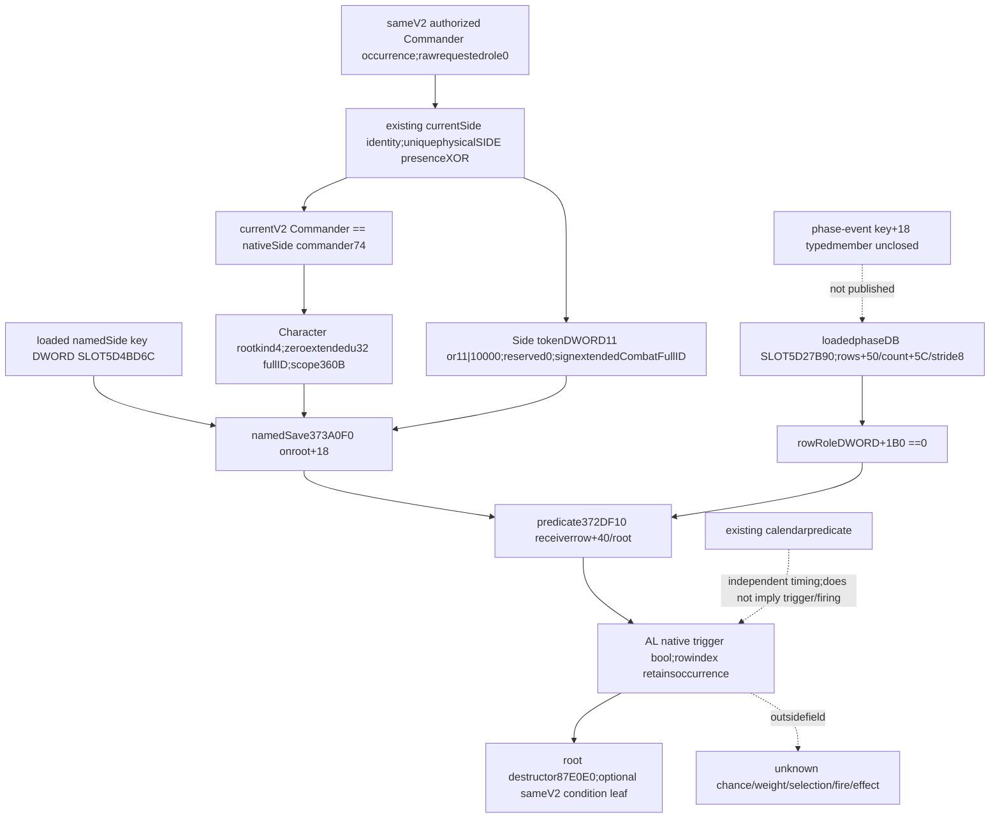

# Current Commander native phase trigger conditions — CK3 1.20.0.4

The next optional same-V2 leaf is **phase_event_commander_trigger_conditions_v1**: current Commander requested role0 plus the native loaded-row trigger Boolean. It reuses the actual currentSide identity join and source-closed scope/evaluator entrances. It does not calculate chance,select or execute an event. This native tree is sealed before Main implementation.

Exact target is **1.20.0.4 / Steam25734779**,frozen EXE SHA256 **98702F88A547CDE2EAF29A85F93B85F68EE4CF8148336A4F7AFAEB75319DD518**. Main source pin is **3725069765c8e42152fec261e59ac66db6d4430b**. Root Runtime27 CommanderSide **Native/Service GREEN** is reused as reported;this lane does not reread its whole artifact or repeat any runtime. New EXE bytes,hashes,SDK/Game/process contact,build,test and project import are zero.

## Current occurrence and the smallest native route

Use only Commander occurrences already published by the authorized V2 Army query. Existing nativeCArmy fullID resolution and current Combat/physicalSide join establish the actual nativeSide commander equality in this same frame. Unique physicalSide is membership-presence XOR across the two sides;duplicate membership within one Side remains valid and counts are preserved. The V2 hypothetical encounter_role is not actualSide attribution.

The actual47B caller proves requestedrole0 reaches selector3298EC0 as unsignedDIV successful remainderEDX0. Actual343B selector proves loaded phaseDB rows+50/signedcount+5C/pointerstride8,row RoleDWORD+1B0 equality,and receiverrow+40 / contextroot / CALL372DF10 / AL false-skip. Those source operands are reused without rereading the binaries or EXEs. Native role0 alone does not establish the same-frame currentCommander identity,calendar firing or complete admission.

For a currentCommander whose actualSide equality is observed true,and a loadedrow whose role is0,construct the same native Character root and namedSide token,then evaluate only its trigger. Missing current context or role mismatch does not become a fabricated false AL value;preserve an uncalled/unavailable local condition and reason. Loaded row index identifies the condition;duplicate Commander occurrences retain their own attribution.

## Scope/token ABI and reused callees

| Native operation | Exact actual4 source | Minimal contract |
|---|---|---|
| Root construct |889F60;religion receipt complete186B source span|Caller-owned aligned scope **360B / 0x168**.|
| Character root |actual selector root wordkind4/payload+8|FirstDWORD4,reservedDWORD0;payload **zeroextendedu32 FullCharacterID**.|
| NamedSide token |actual selector wordkind11/auxword0or1/payload+8|FirstDWORD **11 \| (actualSideIndex<<16)**,reservedDWORD0;payload **signextendeds32 Combat FullID**.|
| NamedSide insertion |373A0F0;religion logicalclosure313B|Loaded key from DWORD SLOT5D4BD6C;map receiver **root+0x18**.|
| Native Boolean predicate |372DF10;religion receipt complete232B source span|Typed **bool(const void* compiledTrigger,void* root)**;receiver **row+0x40**,no evaluator/reason object needed.|
| Root destroy |87E0E0;religion receipt complete126B source span|Destroy only the constructed caller-owned temporary scope.|

SideIndex is actual current physicalSide0 forCombat+20 and1 forCombat+368. Encoding follows the captured selector's lowword11/highwordaux store:it is not plainkind11 with padding1. Character ID is zeroextended,but Combat ID is signextended;the native selector's respective MOV and MOVSXD distinguish them. Preserve legal loaded namedKey0 rather than treating0 as unavailable.

Existing pilgrimage scope code supplies RootConstruct,Destroy,NamedScopeSave andPredicate function signatures,and its NativeScope uses360B storage,namedmap+18 and scoped destruction. Actual4 religion_context_addons binds exactly889F60/87E0E0/373A0F0/372DF10. The existing predicate's no-evaluator Boolean path is sufficient;reason allocation,evaluator construct/prepare/format and broad religion/pilgrimage producers are not prerequisites for this condition. Main may bind imagebase plus these already-qualified actual4 entrances and keyslot5D4BD6C directly under exactSHA,borrowing the existing role binding. This reuses callee source closure/types;it does not depend on religion factory/business switches or an unavailable adapter religion callback field. No new native entrance or EXE read is required.

The new native evaluation invokes the four callbacks on its temporary scope and loaded trigger when qualified;zero new EXE reads does not mean zero native calls in that implementation. This source-only lane invoked none and performs no Game/SDK/process operation. A 16B token struct u16kind11/u16auxSideIndex/u32reserved0/u64payload is ABI-equivalent to the captured firstDWORD11|(SideIndex<<16),with payload at+8.

The religion operand receipt separates source closure from its historical NOTRUN qualification;this reuse closes the source prerequisite,it does not grant new Runtime28 or trigger live credit. Main and Root own implementation and later qualification within the current user restrictions.

## Field value and boundaries

The independent value is an actual same-frame loaded-row trigger condition for the current nativeSide Commander,paired with currentrole0. False rules out this row's trigger stage now;true identifies a satisfied trigger under this concrete context. This fills a native admission input without substituting authored stock AST or default values.

Calendar remains an independent observed predicate. A role-compatible,true-trigger row is not proof of positivechance,selection/order,firing or effect completion. Existing berserker chance/validity providers already expose their own concrete inputs under the actual4 factory;authored row weights are not percentages and do not substitute for this loaded native trigger. Base completeness,full-phase fidelity and MC remain unchanged.

The actual343B prefix contains no phase-event row+18 stable-key read. Generic CString copying does not prove that typed member. **No event_key is added**;receiverrow+40,role+1B0 and row index are the only event-level operands required here. Chance+110,stable names and effects remain separate source/value gaps.

Existing source paths:

- ck3_autonomous_player/native_bridge/src/ck3_12004_religion_context_addons.cpp:actual callbacks in pilgrimage_activity_bindings.candidates.
- ck3_autonomous_player/native_bridge/include/xar_bridge/ck3_12003_pilgrimage_candidate_factory.hpp:ScopeToken and typed callbacks.
- ck3_autonomous_player/native_bridge/src/ck3_12003_pilgrimage_candidate_factory.cpp:NativeScope360B,map+18,destructor and no-evaluator Boolean call.
- docs/ck3-native-ai/religion-context-hostility-conversion-12004-operands.json:actual rows/root/dtor/predicate and complete named-save logical closure.
- commander-side-join-source26/native-tree/ and commander source27:held currentSide identity chain;Runtime27 GREEN is reported baseline.
- phase-admission-source24/native-admission/SOURCE-CLOSED.json and phase-commander-admission-source25/native-caller/SOURCE-CLOSED.json:actual343B/47B source receipts.

External commander-trigger-source28/native-tree/ contains TREE.md,SOURCE-REUSE.json,INPUT-LEDGER.json and OCT8-W41-FIELDS.json written before Main implementation. The native research lane changed only this new topic and its external subtree. Main subsequently authored the header-only actual4 scope/trigger collector, optional DTO/serializer and three-scene production-whole FIRST. Shared integration remains Root-owned;five hooks and the new target/sole consumer argv are in commander-trigger-source28/ROOT-SHARED-HOOKS.md.

Candidate FIRST is AUTHORED_NOTRUN. Its synthetic native callbacks inspect actual Side auxiliary/full signed Combat payload, skip role-mismatched rows, retain measured false/true, and preserve unknown when a demanded trigger receiver is unread or Commander generation differs. No compiler,test,import,game,SDK,process/window,newEXE read or live value was obtained. Current candidate conditions remain separate from calendar,selection and committed effects.
