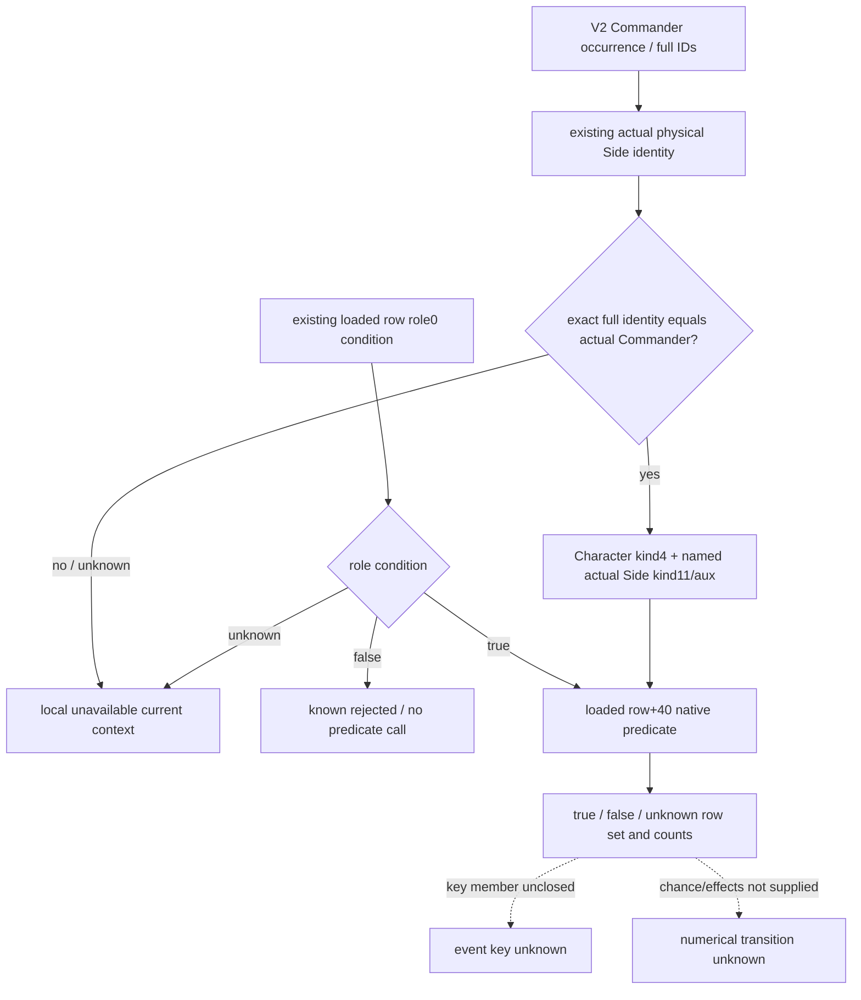

# Current physical Side Commander loaded-role trigger inputs — CK3 1.20.0.4

This source28 work package adds a readonly observation of the loaded role0 row trigger for a V2 Commander whose full identity equals the actual current physical Side Commander. It uses the existing `ck3_query_combat_simulation_inputs` query and its same-frame role and identity leaves. It can exclude rows whose native trigger is false and expose the current role/trigger candidate set. It does not supply chance, positive weight, selection, fire, numerical effects, a win probability, or an enter-battle permission.

## Reused baseline and source frontier

Target executable SHA-256 is `98702F88A547CDE2EAF29A85F93B85F68EE4CF8148336A4F7AFAEB75319DD518`, CK3 1.20.0.4 / Steam build 25734779. Source27 baseline is `37250697`; parent owns the `g2-phase-decision-input-source28` branch. Root's Runtime27 CommanderSide GREEN is reused without rerunning its compound. Its whole software DTO, source-bound collector, production serializer and registered-service observations remain source-qualified synthetic evidence; they do not prove a live loaded frame.

The actual selector prefix at `0x3298EC0` observes row role DWORD `+0x1B0`, then the inline trigger receiver `row+0x40` and native predicate `0x372DF10`. Existing exact4 religion context bindings provide root constructor `0x889F60`, destructor `0x87E0E0` and named-scope save `0x373A0F0`. The phase named-key slot is `0x5D4BD6C`. The existing role registry reads the loaded singleton `0x5D27B90`, pointer array `database+0x50`, signed count `+0x5C` and pointer stride 8. The new observer reads only a compatible row's trigger receiver and does not call the selector, chance evaluator or random draw.

Character root kind is 4, with **zero-extended uint32 FullCharacterID** payload. The named Side token is the 16-byte existing `ScopeToken` shape: its kind DWORD packs `11 | (actual_side_index << 16)`, its offset-4 padding remains 0, and its offset-8 payload is the **sign extension of the signed32 actual FullCombatID**. Named-map receiver is `root+0x18`. The actual physical side, rather than V2 hypothetical encounter orientation, determines the packed high word. Scope construct/save/destroy and predicate callbacks are owned and qualified by Main's native fixture receipt.

The actual 343-byte prefix does not read an event key at row `+0x18` and does not close that receiver's common definition base. Existing exact4 CString copying code can copy an already-proven string address; it cannot prove this phase-event member. **No event_key is published.** Exact4 phase-event key/member or common-base source proof is the next named-event input dependency. Loaded chance and effect semantics remain separate subsequent numerical dependencies.

## Published inputs reused without another observer

| Existing input | Reuse in this leaf |
| --- | --- |
| `phase_event_role_compatibility_v1.occurrences[]` | Sparse/global roster ordinal, complete uint32 character identity, public CUnit and native CArmy provenance, requested role 0 and source-closed caller argument; conditions retain loaded row order and nullable role comparison. |
| `.loaded_registry.{status,count_raw,rows}` | Current catalog extent and per-row role-read availability; legal empty registry is distinct from an unobserved catalog. |
| `phase_event_commander_side_identity_v1.occurrences[]` | Actual current Combat full ID, physical Side index and exact full-ID Commander equality. Identity mismatch, inactive precontact or ambiguous membership stays a local unavailable actual context. |
| V2 `armies[].commander` and `knights.members` | Canonical full identities and provenance; Commander ordinals count every knight occurrence without merging repeated character identities. |
| Exact4 context callbacks and phase named-key slot | Evaluate the loaded inline trigger in the same Character / actual Side context as the bounded native prefix. |

Role-only observations and bounded precontact forecasting remain usable without an active Combat. This new actual-context leaf never creates an in-battle or MC gate for them. Identity comparison false is preserved in its original leaf and never changed to unknown or replaced with a hypothetical Side.

## Exact additive contract

Optional key: `phase_event_commander_trigger_conditions_v1`. Schema: 1. Scope: `v2_current_physical_side_commander_loaded_role_trigger_condition`.

Root has exactly **9 keys**:

`schema_version, scope, status, source_ck3_sha256, trigger_source_closed, native_role_and_trigger_evaluation_observed, complete_phase_effects_ready, unavailable_reason, occurrences`.

`trigger_source_closed` records the exact4 source binding. `native_role_and_trigger_evaluation_observed` is true exactly when the sum of occurrence `evaluated_count` is positive. `complete_phase_effects_ready` remains false.

Each Commander occurrence has exactly **18 keys**:

`occurrence_index, character_id, source_public_cunit_id, source_native_carmy_id, encounter_role, requested_role_raw, actual_combat_full_id_raw, actual_side_index, current_commander_context_ready, loaded_named_side_key_raw, conditions, role_compatible_count, evaluated_count, admitted_count, unknown_count, role_trigger_observation_ready, status, unavailable_reason`.

Full character and Combat IDs are uint32, source public/native IDs retain their existing signed representation, named key is nullable signed32, actual Side is nullable 0/1, and requested role is exactly 0. Actual Combat/Side facts are reused even when the V2 Commander comparison is false; such a row has context-ready false and performs no scope or predicate call. Full-ID 0 and generation bits remain legal. Repeated identities remain separate roster occurrences.

Each condition has exactly **5 keys**:

`loaded_row_index, role_compatible, native_trigger_valid, role_and_trigger_valid, unavailable_reason`.

| Role condition | Context / evaluation | Trigger | Role and trigger | Reason |
| --- | --- | --- | --- | --- |
| false | skipped | null | false | null |
| true | qualified, predicate returned | native bool | same native bool | null |
| true | context or row receiver unavailable | null | null | nonempty local reason |
| unknown | role member unavailable | null | null | nonempty local reason |

Counts are derived from conditions: compatible counts role true; evaluated counts non-null native trigger booleans; admitted counts role-and-trigger true; unknown counts role-and-trigger null. Readiness means all published role-and-trigger conditions are known and the observed catalog extent is complete. A legally observed empty registry is ready. An unobserved or incomplete registry with no published conditions is not a known empty set. Occurrence status is available when ready, partial when some conditions are known, otherwise unavailable. Root status applies the same rule over all occurrence conditions, with all rows ready required for available; an empty Commander roster is available.

The pure consumer returns admitted, rejected and unknown loaded row indices and their counts for the given occurrence. These are a current loaded-role/trigger observation, not chance, selected order, effects or future numerical transition.

## Sole new FIRST recipe and Oct8 / W41 fields

Author `tests/unit/test_phase_event_commander_trigger_conditions_registered_service_12004.py` with `--source-root`, `--wire`, `--output-dir`. Main's production-serialized whole-V2 bundle has exactly scenes `native_mixed`, `identity_mismatch`, `row_pointer_missing`. Each traverses one real `create_server(driver).call_tool` and caches the whole normalized result. The new class does not load or rerun prior calendar/role/CommanderCaller/CommanderSide test classes.

The synthetic loaded roles are `[0,1,0,2]`. Mixed row 0 predicate false and row 2 predicate true; role-false rows 1/3 skip evaluation. Identity mismatch changes the full generation while retaining low24 and performs no scopes/evaluations. Row-pointer-missing leaves the prior role observation intact but denies row2's new pointer read: row0 false stays known, row2 stays unknown. Native receipt separately verifies opposite physical/hypothetical orientation, high-bit Combat IDs, signed token payload and balanced scope lifetime.

At author delivery the state is **research / authored-NOTRUN**. This lane executes no game, SDK, process, build, import, test or EXE read and performs no git operation. Root runs the sole FIRST after integrated collector, serializer and hooks freeze. Base completeness, missing model domains and Monte Carlo readiness are preserved. Oct8 / W41 delivery fields are external under `commander-trigger-source28/dto-consumer`; Main merges them into the shared daily and weekly records. Next construction entry is the exact4 phase-event key member source, followed by loaded chance/effect numerical semantics; it is not a theoretical full-MC completion gate.

Author delivery files are the new bridge module `phase_event_commander_trigger_conditions_contract.py`, the additive import/optional-key/normalizer attachment in `combat_contract.py`, this topic, and the single new CLI FIRST source. Normalizer signature is `normalize_phase_event_commander_trigger_conditions_v1(value, *, armies, role_compatibility, commander_side_identity)`. Consumer signature is `current_commander_role_trigger_row_sets(occurrence)`. The authored compound includes only pure absent-optional, malformed-local-count and legally observed empty-catalog checks after caching the first new scene; they produce no additional native queries. Main's fixture/callback receipt owns native scope qualification.
