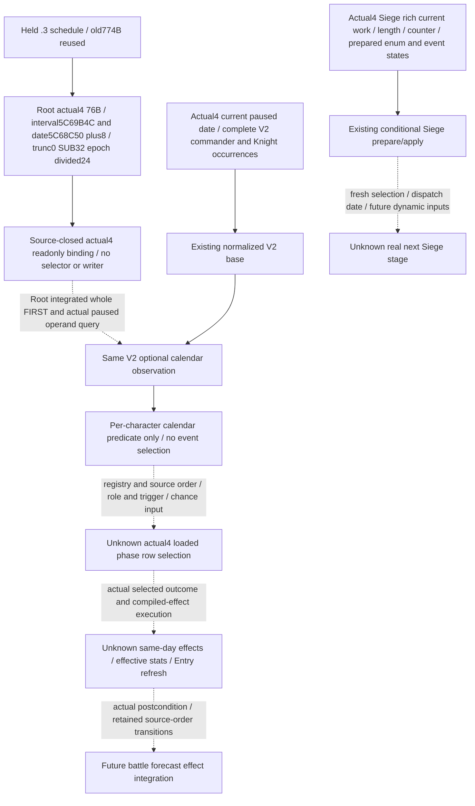

# Actual4 loaded phase-effect input frontier

2026-10-07 / ISO 2026-W41. Exact source is
`ae003bece794acb7eed977a3a017555bab303394`, fetched and rebased without a
merge. Root supplies CK3 1.20.0.4 / Steam25734779 / EXE SHA256
`98702F88A547CDE2EAF29A85F93B85F68EE4CF8148336A4F7AFAEB75319DD518`.
The prior siege-relief V2 compound is Root-qualified and is not rerun here.
This package contains no game/SDK/process operation, build, test, import,
new EXE read/hash, current whole response or shared report/CMake/header edit.

## One model frontier and the concrete input

`loaded_phase_event_effect_transition` is derived from
`TransitionFidelityManifest.loaded_phase_effects_exact=false` in the battle
research envelope. It is not the native V2 completeness-domain name and is
not a missing Siege field. The four V2 native model gaps and this envelope's
two fidelity gaps remain separate lists. Neither list is a new permission
or readiness gate for the already qualified bounded V2 decisions.

Root's retained [single-domain input ledger](Z:/ck3_mod_rewrite_process_assets/g2-background-20261007/upstream-build-migration/all-existing-live-review/final-phase/G2-PHASE-GAP-LIST.json)
already identifies a concrete battle selector dependency: the actual loaded
phase-event interval and per-character calendar predicate. The [held .3
native schedule tree](combat-phase-events-12003.md) sources the predicate
from current date, FullCharacterID and the loaded DWORD. Stock default five
days is not the observed loaded interval; historical RVAs and a nearby -0x20
address shift are not actual4 binding proof.

The actual4 `BindPhaseImage12004` closes constructor/populate/selected
commander/strength/dynamic inputs and the combat-effect-rule database getter.
It does not bind the battle phase-event registry, interval, schedule or fire
chain. The combat-effect-rule database is distinct from the phase-event-row
registry. Existing `ck3_query_combat_phase_event_trace_v1` names a paused
evaluator probe, but its native implementation is the historical11906
profile and actual4 does not advertise that capability. An old tool name or
experimental trace flag supplies no current ABI; this package enables none.

The selected next operand is therefore the actual4 loaded **battle** interval
and its native predicate source, through the existing V2 observation. Full
loaded row selection, weighted local/global draws, compiled-effect writes,
callback timing and post-effect effective stats remain separate dependent
steps. A read-only calendar predicate does not select an event or assign its
probability, and does not prove the engine next-date dispatch or a pending fire.

## Reuse the Siege reader without conflating its domain

The [actual4 Siege source chain](siege-ooda-source-chain-12004.md) already
publishes current work/total, ordinary daily progress, current and prepared
phase lengths, phase counter, can-advance, five event states and last-prepared
selected enum through the rich occupation/objective MCP. Its current native
daily and phase getters already include their effective commander/modifier
inputs. No observed existing Siege DTO leaf failure is demonstrated here.

`siege_current_tick` and `siege_current_phase_event` use those inputs for
conditional prepare/apply calculations with an explicitly supplied selected
event. A last-prepared enum is not the next selection. They retain unknown
outer dispatch identity/date, fresh event selection/draws and future dynamic
inputs. This independent conditional Siege value does not close battle loaded
effects, and duplicating its existing fields would not advance this frontier.

## Native tree before any new consumer

Solid edges below are held source semantics for their labeled build. Root's
two actual4 operand captures close the date/cadence arithmetic. Dashed edges
retain runtime qualification, native candidate admission and future updates.

The .3 selected-effect implementations and
[numeric feedback tree](battle-phase-event-feedback-12003.md) remain reusable
software interfaces only. Primary wound/trait/death/resource requests cannot
stand in for committed actual4 effects, after-effective prowess, six Entry
caches or roster cleanup. A basic prowess delta cannot replace an effective
getter. This package creates no random effect tape and never invokes a native
selector, accessor with possible initialization, script executor or writer.

## Bounded construction and Root qualification

Root performed the necessary finite actual4 capture and closed the native
date and loaded slot sources. Read existing slots after this closure; do not
call a database accessor or selector. The first
interval/predicate package is independent of the later registry/row and fire
packages, so it does not expand into neighboring callees or a full effect audit.

Root approved this minimum cached source window. The held old schedule body
is `schedule-side-264D480.bin`, span `[0x264D480,0x264D786)`, 774 bytes,
recorded SHA256
`e8e9630a431d0d42ca2fdb94dd25c9e8338f131dbd0ee594d89e3210932d1cf0`.
The old 20-byte window `[0x264D5DC,0x264D5F0)` witnesses zero EDX,
uint32 CharacterID-plus-day, `DIV DWORD`, remainder test and branch. The
instruction at `0x264D5E2` is `f7 35 64 c5 61 03`; its next RIP `0x264D5E8`
plus signed displacement `0x361C564` identifies the old interval slot
`0x5C69B4C`. The independent commander DIV at `0x264D748` refers to that
same old slot. These are cached old source operands, not new reads or .4 RVAs.

Use the Root-held `function-match-core/OLD-RUNTIME-FUNCTIONS.json` and NEW
cached metadata to select this named callee's ordinal candidate. An ordinal
match is a locator, not semantic proof. If the new 20-byte offset is unstable,
the actual returned CALL target and this caller's minimum required prefix
provide the finite construction entrance. There is no global -0x20 rule or
old-EXE reread. In addition, the 20-byte DIV witness alone does not close the
actual4 producer of dayIndex, epoch constant or signed truncation; keep the
calendar result unknown until its necessary date-production source is closed.

That minimum capture is now GREEN in
[SOURCE-CLOSED.json](Z:/ck3_mod_rewrite_process_assets/g2-background-20261007/upstream-build-migration/g2-combat-forecast-12004/phase-effect-next/native-stage/SOURCE-CLOSED.json).
The actual20B interval DIV is at `0x264D5C2`: next RIP `0x264D5C8`
plus displacement `0x0361C584` resolves actual loaded DWORD slot
`0x5C69B4C`. The independent actual56B date producer MOV at `0x264D473`
uses next RIP `0x264D47A` plus `0x0361B7D6`, resolving pointer slot
`0x5C68C50`; low32 date is at pointed object+8. The actual SUB epoch is
`0x029C55A8`. Signed magic multiplication, SAR and sign correction close
`dayIndex(D) = trunc0(s32(u32(D)-0x029C55A8)/24)`.
Unsigned low32 FullID-plus-day is divided by the **observed** nonzero DWORD.
Both named windows are normalized-equal with complete instruction spans:
76 new bytes, two Root physical reads, no old EXE reread or broad expansion.
Their actual slots happen to retain the old RVAs; each RIP was independently
closed and no global delta is inferred.

The76B does not include R9D FullID production or the actual4 commander
branch. The new projection therefore applies this literal arithmetic
conditionally to each existing V2 roster occurrence; it does not assert
native event admission or event order for all those roles. Next-day values
condition on the same loaded interval and FullID at wrapped `u32(D+24)`.
The day index is recomputed from that date, rather than incrementing it,
because signed truncation and wrapping can make that shortcut incorrect.

The same V2 optional projection should retain actual date and observed loaded
interval, plus source Character occurrence identities and the calendar
predicate result. Use a name explicitly describing the calendar predicate,
not full native candidate eligibility, occurrence order or selected event.
The commander/knight's role, Army/Regiment provenance and full CharacterID
remain separate even when a Character appears more than once. The projection
must keep constructor/fixed-contact scope distinct from an active Combat.

The concrete existing seams are `CombatSimulationInputsSnapshot` in
`game_contract.hpp`, `AppendCombatSimulationInputs` / its optional projection
in `bridge.cpp`, and the V2 optional-key and normalization seams in
`combat_contract.py`. The registered MCP at `mcp_server.py` needs no new
parameter or tool. Model/query readiness stays separate. A proposed
`phase_event_calendar_observation_v1` carries `date_low32`, observed interval,
and occurrence Character/Army/Regiment/role provenance; its predicate is
nullable with an explicit source-boundary reason. A closed interval read is
useful new input even while date production or complete native occurrence
admission remains unclosed. No missing predicate is silently made false.

Independent DTO, exact4 binder, three-read collector, optional serializer and
Python normalizer are authored after that source closure. Shared DTO/binding,
adapter and Bridge/CMake hooks remain Root-owned. A real observed interval
zero is retained and gives a partial leaf with null predicate/remainder;
failed reads are independently unavailable/partial, without downgrading the
base V2 readiness. Legacy absence stays absent. FullID0 is valid, generation
bits are retained, and Commander and Knight occurrences are not merged.

The unique FIRST runs after Root integrates the shared hooks and freezes the
source. It builds a complete DTO from the held software fixture, injects
synthetic operand memory through the real exact4 binder/attachment helper,
and projects the literal complete production `AppendCombatSimulationInputs`
function and its dependencies from that frozen Bridge source. The
projection refuses an absent optional serializer hook. No external JSON
concatenation supplies the new leaf. Its whole available/zero/read-failure
bundle enters the registered MCP, real service and native-driver cache once
per scene; the compound checks full IDs and role provenance while preserving
the existing input/model readiness. This is source-qualified fixture credit,
not actual4 paused/live observation or a whole native battle-producer run.
Root's real paused query then qualifies the observation. Calendar false is
not an event-free battle or an action refusal; missing capture does not delay
the current target/move/native-one-day/save OODA.

## Oct7/W41 status

- Completed: source/domain distinction and source-first Mermaid; existing
  Siege observation reused; concrete unpublished battle interval dependency
  selected rather than duplicating current fields or reopening old GREEN.
- Why: the native scheduler consumes this operand, so observation precedes
  future phase-effect integration. It is a genuine missing model input,
  not evidence that an existing actual4 read has failed.
- Readiness: actual4 two-operand source confirmed; optional observer/consumer
  and the sole new whole FIRST are authored, not executed; no live credit.
- Testing/operations: zero child tests/builds/imports/game/SDK/process/EXE
  operations; Root's prior qualified compound and37 checks are reused.
- Root evidence: actual4 76B/two-read capture GREEN; child consumed its source
  closure only. This does not observe the loaded runtime interval itself.
- Unknown: actual loaded slot values and paused leaf, native role admission,
  loaded phase rows/draws, next dispatch and committed effects/refresh.
  `loaded_phase_event_effect_transition` remains incomplete.
- Next: Root adopts the minimal shared hooks, freezes source24 and runs the
  one new whole wire/registered-service FIRST, then the existing actual
  paused V2 query can qualify this leaf. No selector/fire step is requested.
- Reports/push: external Oct7/W41 fields; Root owns central reports and push.
