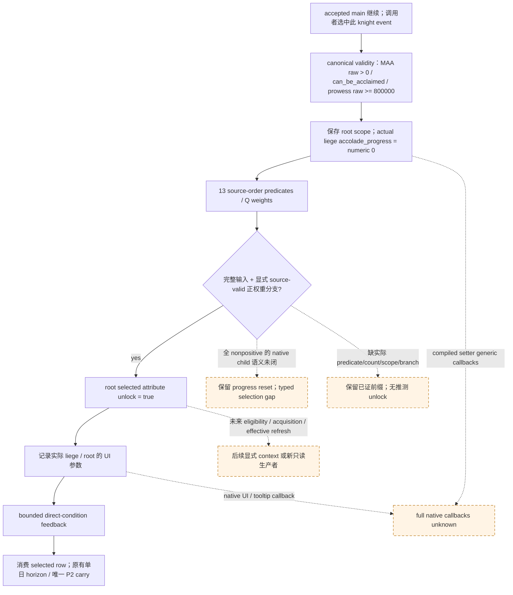

# CK3 1.20.0.3：骑士 accolade qualification 的选中分支回流

2026-10-05，本专题只扩充 `knight_qualify_for_accolade` 一个 selected-event source seam，基于当前已采用的 [v60 条件事件回流](battle-phase-event-feedback-12003.md)。适用 **CK3 1.20.0.3 / Steam build 25652598 / EXE SHA-256 `94B55397ABB687A3DCD436805A5D885E6BE90FA6C693FEB44A9E3BBEEADE02A6`**。source-first 合同、新 helper/adapter 与唯一新 focused case 已封存；资格为 **static-ready 的 synthetic caller-conditioned selected-event 子集**。该 case 首轮 harness RED、修正夹具后第二轮 GREEN，完整 native callbacks 与实机仍未获得资格。

authority 为 `Z:/g38`。Root 的 [CURRENT-V60-SOURCE-BASELINE.json](Z:/ck3_mod_rewrite_process_assets/g2-resume-20261005/battle-phase-event-one-seam-v61/CURRENT-V60-SOURCE-BASELINE.json) 已记录 adopted module/test/topic 与 v60 封存字节一致；本 lane 直接复用该 metadata，不重复字节核验或旧 cases。v60 的 13 events / 7 supported primary / 6 unsupported 是历史输入基线，本包没有研究其余五事件，也不将这个 seam 自动改记为 13/8/5 个完成事件。

## 单一 source seam 与直接写集

[selected-event-source/ROOT-DELIVERY.json](Z:/ck3_mod_rewrite_process_assets/g2-resume-20261005/battle-phase-event-one-seam-v61/selected-event-source/ROOT-DELIVERY.json) 最终为 3755 B，SHA-256 `800ef4b75f00a93d70735cf5f823ff0bebc2025e257ab67b2bb044188a2ae5d7`；[INPUT-CONTRACT.json](Z:/ck3_mod_rewrite_process_assets/g2-resume-20261005/battle-phase-event-one-seam-v61/selected-event-source/INPUT-CONTRACT.json) SHA-256 `cde27e0afb36960bf6112bf2ddb39db1699eaa969b6469a8134bbcd18a57d274`。精确 canonical trigger refs 与显式 bounded-context 条件的 metadata 纠正保留原 receipt，source branch/math/tree 不变。来源是既有 cached stock `00_knight_phase_events.txt:1430..1890` 的完整 461 行 block，whole-file SHA-256 `6307140e6f0543d9c44cacf40771710032a050279b82b0074a86df7b68e3cadf`；本轮未重读 EXE 或扩大 source 采集。

该 block 的完整直接 statement vocabulary 是 scope、变量写入、random_list/条件/权重与界面消息。它依次：

1. 将当前 root 保存为 `acclaimed_knight` local scope。
2. 给实际 liege 的**储存变量** `accolade_progress` 写 numeric raw `0`。
3. 从 **13** 个 source-order 分支中接受调用者明确提供的 source-valid、正权重选择；给 root 对应 `*_attribute_unlock` 写 boolean `true`。
4. 为同一 liege 记录该分支的界面消息参数。

直接 source 没有 trait/skill/XP、人物 modifier、死亡/健康、实际 accolade 创建、Army/Regiment 成员、兵数/损失、commander、date/phase/winner 或延后 event 的 mutation。声明 fixed-context 的条件模型可保留已有缓存与战斗账户，并只添加 modeled-variable overlay。完整 generic native setter/UI callbacks 尚未证明无额外反馈；这项直接写集 closure 不等于完整 native script fidelity。



## 13 支的 source 顺序、条件与权重

每支均读取实际 scripted attribute-trigger；已经 eligible 时该支不进入选中集合。MAA 分支另外需要真实 any-regiment predicate；这些布尔值与 count getter 是独立输入。表中 `C(type)` 是全 Army 对应 regiment **整数个数**，`N` 是独立查询的 total Army MAA regiment count，不能从给定 base types 相加或 current-fighting Q 推导。

| index | root unlock variable | 条件满足后的 source 权重 |
| ---: | --- | --- |
| 0 | `skirmisher_attribute_unlock` | `10 × C(skirmishers)` |
| 1 | `archer_attribute_unlock` | `10 × (C(archers) − C(crossbowmen) − C(shenbigong) − C(accolade_maa_crossbowers))`；实际 any non-crossbow archer。 |
| 2 | `crossbowmen_attribute_unlock` | `10 × (C(crossbowmen) + C(shenbigong) + C(accolade_maa_crossbowers))`；实际 any crossbow variant。 |
| 3 | `pike_attribute_unlock` | `10 × C(pikemen)` |
| 4 | `vanguard_attribute_unlock` | `10 × C(heavy_infantry)` |
| 5 | `outrider_attribute_unlock` | `10 × C(light_cavalry)` |
| 6 | `lancer_attribute_unlock` | `10 × C(heavy_cavalry)` |
| 7 | `camelry_attribute_unlock` | `10 × C(camel_cavalry)` |
| 8 | `elephantry_attribute_unlock` | `10 × C(elephant_cavalry)` |
| 9 | `horse_archer_attribute_unlock` | `10 × C(archer_cavalry)` |
| 10 | `gunpowder_attribute_unlock` | `10 × C(gunpowder)` |
| 11 | `fanatic_attribute_unlock` | `10 × N/2`；实际敌 participant faith **朝 root faith** 的 hostility 至少 evil。 |
| 12 | `valiant_attribute_unlock` | `50 × N/2`；`own_size_raw >= mulQ(enemy_size_raw, 66000)`。 |

机器权重为 Q100000：整数 count 先乘 Q，`N/2` 使用 `divZ(N×Q,2)`，保留半个 regiment 的 Q 小数；每次 source multiplication 都向零截断。archer 的三个减法与 crossbow 的三个加法保持 source 顺序。保留算出的非正权重并从选择集合排除，不额外 clamp。valiant 的 literal comparator 是 own 大于等于 enemy×0.66，不能按 comment 将方向倒置；own/enemy size 也是明确 script Q 查询，不替换为战斗当前兵数。完整 branch AST 见 [EFFECT-AST.json](Z:/ck3_mod_rewrite_process_assets/g2-resume-20261005/battle-phase-event-one-seam-v61/selected-event-source/EFFECT-AST.json)，SHA-256 `7ea8b3d296be7e768e3daf89aa83baebcb65682c88af392cb6d180bfaebe64fd`。

## Typed 输入、变量结果与真正缺项

调用者提供完整原始 observed coordinate、CombatID、root knight 的 full CharacterID、角色/side/Army/PublicUnit identity，以及实际 liege full CharacterID 和有效存在的 liege scope。当前 canonical manifest validity 的精确三项 refs 是 `root.knight_army.maa_regiment_count_raw > 0`、`root.can_be_acclaimed`、`root.skills.prowess_raw >= 800000`；这些是已封 manifest 的条件，未额外宣称 actual loaded getter/requirement 闭合。before 变量 storage 包含 present/value：`root.liege.variables.accolade_progress` 与 root 的选中 unlock storage；chance-factor alias `root.liege.accolade_progress_raw` 不是这个储存变量。

source-valid 选择使用完整 typed outcome，purpose 为 `knight_qualify_for_accolade:attribute_unlock:source_order`，branch index 在 `0..12`，其 predicate 为 true 且 computed weight>0。它是调用者给定分支，不消费或复现原生 RNG，也不声称获得实际 active accolade。

数值 progress 写入与 boolean unlock 输出分别记录接收者 full CharacterID、target scope、变量名、before/after present/value 与 unit。numeric before 已知时才计算 delta_raw；缺失/未观察的 before 不捏造 delta 0。progress 的 after numeric 0 始终是合法结果，不与 missing 混同。原始 observed snapshot 保留，新的变量值进入 typed model overlay；cached entry attributes、数量、hard 账户、成员和 commander 按声明条件保留。

全分支 nonpositive 时，实际 SCRIPT random_list 的 zero-child/native draw 语义仍未知；实际 liege 已知即可保留前缀 progress reset，但没有推断 unlock、消息或 horizon-ready。缺 primitive、liege scope 或合法分支时同样返回具体 typed gap。actual any/unit-type/base-type/type counts、attribute-trigger、方向 hostility 与 storage identity 尚未因 stock AST 或 current combat query 自动变成已观测字段；同一 MCP 的 Army/attribute/storage 只读生产者是后续明确 seam，不从 casualty/class census 代填。

full callback 的具体入口保持独立：fire `264E680` 下 compiled effect `+160 → 3765780` 的 selected variable child、UI/tooltip child 与 zero-positive random_list child；unlock 的未来消费位于 attribute trigger、显式 accolade action 与后续有效属性刷新。bounded positive direct-condition 可完成本次变量回流；继续 horizon 还须调用者**显式声明 fixed current combat context**，不能默认 true。numeric 写集可计算与该条件声明分别记账，声明缺失不抹掉已算出的变量结果，也不使未知后果成为已知。`full_script_feedback_ready / complete_transition / complete_monte_carlo` 保持 false。

## 增量接口与唯一新 case

新 [battle_phase_event_one_seam_12003.py](../../ck3_autonomous_player/src/xar_autoplayer/simulation/battle_phase_event_one_seam_12003.py) 为 17200 B，SHA-256 `f871114f343c18eb0c798265127387d04e3904a4aed21690b0a444525de5d4bd`；[既有 adapter](../../ck3_autonomous_player/src/xar_autoplayer/simulation/battle_phase_event_feedback_12003.py) 的最小增量 projection 为 24454 B，SHA-256 `421ce8c6de04cef53b302cbda4ff58f9540c8a0f61fab423f6966ea91493b5c8`，preimage 为 adopted v60 `3f8adc99f787a0eacfaeccc9ded54d6ffa8a836812c630268684baf2e82a12f8`。最终 [module/ROOT-DELIVERY.json](Z:/ck3_mod_rewrite_process_assets/g2-resume-20261005/battle-phase-event-one-seam-v61/module/ROOT-DELIVERY.json) 为 5211 B，SHA-256 `c7bab5b7e316f3608f22478208e16ce8bf653f6973a1200b333ba1a325448a16`；验收后仅 qualification metadata 更新，两个业务文件字节不变。Root 在当前 v60 上顺序采用此增量，不重复旧 patch。

```python
execute_selected_accolade_qualification_12003(
    context, *, script_outcomes, inputs, source_context,
    manifest=None, advantage_model=None,
)
```

现有 `SelectedPhaseEventInput12003` 增加 `one_seam_inputs: AccoladeQualificationInputs12003`；`apply_selected_phase_event_feedback_12003` 与 `run_selected_phase_feedback_horizon_12003` 的调用签名保留。`AccoladeQualificationInputs12003` 明确携带 liege identity/scope、actual stored progress、root unlock storage、base/exact/total counts、any predicates、13 个 attribute-trigger booleans、directional hostility、Q sizes 与 `fixed_current_combat_context: bool | None`。数值/布尔 storage 类型分别是 `ScriptNumericVariableState12003(present, value_raw)` 和 `ScriptBooleanVariableState12003(present, value)`。

helper 计算 `condition_numeric_deltas`，adapter 合入 typed `character_numeric_deltas` 与 ledger；原始 `source_snapshot` 不覆盖。只有完整正分支且显式 `fixed_current_combat_context=True` 才可清除此 selected row 并进入既有单日 horizon；该声明缺失时，两变量仍可计算并保留，condition feedback 继续 partial。全 nonpositive 时只保留已证 progress reset，selection gap 独立存在。其余五事件 dispatch、全局 stock manifest 与完整 native callbacks 资格未扩张。

唯一新增 [test_battle_phase_event_one_seam_v61.py](../../ck3_autonomous_player/tests/unit/test_battle_phase_event_one_seam_v61.py) 为 18933 B，SHA-256 `cac69e336346926fa46521c8a118e74d9251cad336789fdf940e63ac315ef5c0`。最终 [focused-fixture/ROOT-DELIVERY.json](Z:/ck3_mod_rewrite_process_assets/g2-resume-20261005/battle-phase-event-one-seam-v61/focused-fixture/ROOT-DELIVERY.json) 为 6554 B，SHA-256 `5be97173cd95a5462161fbd3c3e7a11896ed3ea2bd34cf81da741e09e9edc7ad`；[REPORT-FIELDS.json](Z:/ck3_mod_rewrite_process_assets/g2-resume-20261005/battle-phase-event-one-seam-v61/focused-fixture/REPORT-FIELDS.json) SHA-256 `c72113554d5b2dede0b1a817ea6560a994f9fcb1c74bf890ed568333ab741579`。唯一 meaningful case 为 `knight_accolade_selected_and_prefix_partial_source_seam`，下列数值来自 synthetic fixture，未复跑 v60 或其他旧 cases。

| 同一新 case 的观测范围 | 最终结果 |
| --- | --- |
| 正分支的 source 数值与类型 | 13 个 computed weights 为 `[3000000, 0×12]`，选 branch 0；实际 stored progress raw `400000→0`，delta `−400000`，chance alias raw `9900000` 未当作 storage。root skirmisher unlock `false→true`，typed positive feedback ready。 |
| 显式固定条件的原有 horizon | accepted invocation 1，phase day / cadence 为 `[5,1]`，current entry accounts 保持；不增加实际游戏日或 native event RNG 信用。 |
| all nonpositive | progress after raw 0 保留，无推测 unlock；feedback ready false、horizon partial、caller draw counter 保留 13。 |
| fixed context 省略 | 已算出的变量仍保留，feedback ready false；不能以默认 true 继续。 |

该唯一 case 共两个 focused attempts。首轮 [attempt-01-RED.json](Z:/ck3_mod_rewrite_process_assets/g2-resume-20261005/battle-phase-event-one-seam-v61/focused-fixture/attempt-01-RED.json) SHA-256 `de21642f5ef7ae82a45045d55f4ed09952c2aac70ab2f4cc03dfd654e18b2ae8` 是 **harness RED**：独立新夹具给 canonical context 多传顶层 `root_source_public_cunit_id`，在进入新 event 计算前被既有 schema 拒绝。仅修改新夹具，将身份 metadata 放到 source_context 并按既有 public CUnit 约定提供 root_source_army_id；能力代码不改。第二轮 [attempt-02-GREEN.json](Z:/ck3_mod_rewrite_process_assets/g2-resume-20261005/battle-phase-event-one-seam-v61/focused-fixture/attempt-02-GREEN.json) SHA-256 `7f1eb5c28bb437e7beba0c573e015cb26334fbce69ddbefccec6486bffe81ba4` 为 1 method、0 failures/errors/skipped、0.117122 秒。失败 attempt 保留，不写“首轮 GREEN”或“两个新 case”。

## Oct5/W41 资格

本 source-only topic lane 没有 SDK/game/window/pipe、EXE、业务代码/测试执行、共享文件、Git、foreign helper 执行或 game-day 操作，只消费已封 source/API/唯一新 case metadata。实际 paused selected-event 与 setter/UI callback parity 尚未取得；不增加 fixture-live、production-live、完整战斗、Monte Carlo 或 win odds 信用。Oct5/W41 报告字段独立输出，Root 负责共享日报/周报合并、commit/push 和后续实机。
