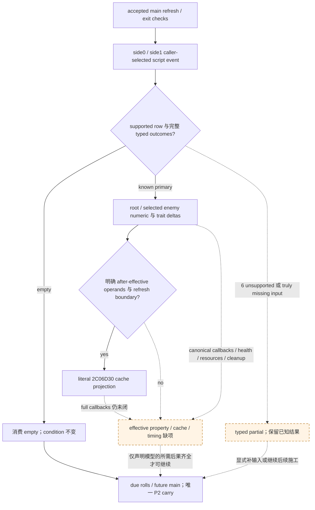

# CK3 1.20.0.3：selected phase script 的条件战斗回流

本专题把已选脚本事件的主要人物数值变化接到显式条件战斗输入，保留尚未闭合的 effective property、callback 与成员清理输入。版本绑定为 **CK3 1.20.0.3 / Steam build 25652598 / EXE SHA-256 `94B55397ABB687A3DCD436805A5D885E6BE90FA6C693FEB44A9E3BBEEADE02A6`**。当前 authority 是 `Z:/g38` 与已封外部 source packet；没有读取 EXE、调用 SDK/游戏或推进普通战役日期。

当前资格为 **static-ready 的离线条件 selected-event 数值/cache 子集**：新 adapter 与唯一两个 focused case 已封存，两个 case 首轮 GREEN。非空事件完整 callback、有效属性生产者与真实回写仍保留 typed partial，未获得本轮实机或完整战斗资格。

## 源码范围与坐标

上游 [当前阶段事件专题](combat-phase-events-12003.md) 与 `battle-phase-events-12003/root-packet-02` 已封 13-row stock manifest。canonical manifest SHA-256 为 `38BB943E208F53D106B90A2F6B895189ECA6471ED7B9888AC5A8454E7CD60240`；这是 stock source，不是实际 playset loaded override 表。旧 [horizon effect 分类](combat-phase-feedback-battle-horizon.md) 与 [retained readout](combat-phase-retained-transition-readout.md) 保留其历史构建和实机证据坐标，不能计作本轮新增 live。

本次 callback 输入账本来自 [selected-callback-source/ROOT-DELIVERY.json](Z:/ck3_mod_rewrite_process_assets/g2-resume-20261004/battle-phase-event-feedback-v60/selected-callback-source/ROOT-DELIVERY.json)，SHA-256 `4dade7299f1fb9d3eebd4a2d0e5321026544f279cd7d0be36d7ab6552d1420cd`。[INPUT-CONTRACT.json](Z:/ck3_mod_rewrite_process_assets/g2-resume-20261004/battle-phase-event-feedback-v60/selected-callback-source/INPUT-CONTRACT.json) SHA-256 `dce0ee30b7db178afc4fef53e5e4c80c850d72905c6eed682246a221abd26be5` 将数值 leaf 与未闭 callback 分开。两次 metadata 字段/示例纠正的历史 receipt 保留，source math 与 readiness 不变。13 events / 7 known / 6 unknown 只统计该账本的事件行；七个 supported primary 不是七个完整事件，也不代表所有内部分支、延后事件或 horizon 回流。

| 已封行范围 | 精确事件 key | 已知边界 |
| --- | --- | --- |
| 2 个实际 empty effect | `commander_none`、`knight_none` | 完整空 outcome tape 可以消费；人物与当前 condition 不变。 |
| 5 个 supported nonempty primary | `commander_wounded`、`commander_maimed`、`commander_killed`、`knight_wounded`、`knight_maimed` | 主要 injury/death 与已选敌骑士成长可投影；完整 callback、真实战斗属性与 cleanup 另计。 |
| 6 个 unsupported row | `knight_berserker_attack`、`knight_become_berserker`、`knight_shieldmaiden_attack`、`knight_becomes_incapable`、`knight_killed`、`knight_qualify_for_accolade` | 保留各自 source seam 与部分 helper 知识，不能当作可执行空事件。 |

## 已选事件与 typed 数值回流

既有 [battle_phase_events_12003.py](../../ck3_autonomous_player/src/xar_autoplayer/simulation/battle_phase_events_12003.py) 提供 `execute_selected_phase_event_12003(context, *, event_key, script_outcomes=(), advantage_model=None, manifest=None)`。调用者明确给定事件、当前人物条件及完整 source-order `PhaseEventScriptOutcome12003(purpose, branch_index=None, character_id=None)`；不选择原生事件，不产生或消费 native RNG draw，也不从权重推断 event probability。

结果的 `after_state` 含 `scope`、`root`、有序 `enemy_candidates`、`recompute`，另有 `transition_log` 与 `feedback_pending`；不存在 `after_state.refs`。人物接收者按 full CharacterID 匹配，不能以列表索引、已选 root 或公开 CUnitID 替代敌骑士身份。

| primary leaf | 可保留的数值结果 | 不能推导的输入 |
| --- | --- | --- |
| 非致命 wound | `wounded_rank_raw` 的 before/after；按 helper 递增并封顶 | 该 rank 对有效属性、健康回调与实际缓存的完整影响。 |
| maim branch | source-order injury trait 与可能的 wound/death primary | 将 trait 名称直接变成 damage/toughness multiplier。 |
| 成长 branch 0 | 没有主要 skill/XP 写入 | 不证明 `impressive` 维护或其他 callback 无影响。 |
| 成长 branch 1 | prowess 脚本 skill ledger 增加 `100000 Q`，即一个基础点 | Character+EC 的实际 effective int32 prowess，以及有效 martial 或 relation modifier。 |
| 成长 branch 2 | trait 缺失时添加；已有时使用 bounded XP `min(10000000, before + 1000000)`，即加十 XP | 未升级 XP 对战斗无影响；不能据此免除有效属性或缓存回流输入。 |

非空事件执行过与战斗后果全部处理完分别记账。已知 primary/state 输出与显式 resource pending 必须保存；同时完整保留 canonical `feedback_pending`。trait、wound、XP 或 script base prowess 不能替代 actual effective getter；delta 为零也不能清掉未闭 callback。fatal isolated projection 的 alive/membership 变化不等于实际 Entry 已删除，必须接独立 committed cleanup 输入。

## 可纯算的当前骑士 cache leaf

既有 exact .3 `2C06D30` 允许在**明确给定 after operands 与刷新边界**时计算有效 cache：当前有效 prowess 是 signed32 整数点，effectiveness 是 signed64 Q100000，loaded damage/toughness multiplier 是 signed32 整数槽 `5C699A8 / 5C699B0`。

```text
p = max(1, after_effective_prowess_points)
damage_raw    = p × effectiveness_raw × loaded_knight_damage_multiplier
toughness_raw = p × effectiveness_raw × loaded_knight_toughness_multiplier
```

这里没有额外除 Q；结果仍为 Q100000 属性。完整 identity 包括 CombatID、RegimentID、ArmyID、当前骑士 full CharacterID 与当前 valid special-knight 条件。caller 必须明确声明该 after-cache refresh boundary；source packet没有证明 selected effect 返回到 cached writer 的自动回调时点。

writer 仅改六项缓存：`Entry+30` max size、`+38` siege、`+40` damage、`+48` toughness、`+50` pursuit、`+58` screen。此 leaf 的 max size/siege/pursuit/screen 为零，damage/toughness 如上；pure entry 的 damage 字段为 `effective_damage_raw`，state 字段为 `toughness_raw / pursuit_raw / screen_raw`，不添加 `effective_` 前缀。start/current/soft 数量、owner hard 账户、backing、bucket/order、regiment 身份、成员集合和 winner/phase 不由这一计算改变。缓存属性计算不得再次扣伤亡。

原生来源复用 `battle-knight-entry-refresh-12003/injury-order/TREE.md` 的既封六-cache writer；source receipt metadata 历史由上游 source pins 保留，本轮不重封或修改该目录。`IncomingRegiment12003` 是从显式 effective 属性和 whole soldiers 初始化加入项，不能当作 base-skill→effective-property 生产者。

## 接入有限条件 horizon 的位置

[既有 horizon](battle-current-conditional-horizon-12003.md) authority 的 native-order receipt SHA-256 为 `85f7c373c8916a735af83b67852e7f38eff0564947f30959b836c132ed07b095`，采用前模块 SHA-256 为 `000b114c053e21c06aa8739cd8d7f591766e816529aa9eb6b6edfc2c86ccf3ec`。本轮引用其已封原生顺序，不重新引入旧专题尚未闭合的外层调度不确定性。

accepted main 先处理 current refresh 与 exit checks；继续 main 后 side0/side1 event fire 位于 due roll、cadence、advantage factor 与两侧 outgoing 之前。selected-event adapter 的槽位在该处；`run_conditional_future_main_tick` 继续独占一次 P2 carry，adapter 不能 replay casualty、重复 carry 或额外判胜。



`None`、显式无事件与非空 selected rows 保留各自语义。typed partial 必须指明实际缺失字段与下一入口，而不是把一切非空事件合成同一个 opaque unknown；已知主要数值变化与 unresolved consequences 可以同时存在。没有 event selection proof 不新增战争执行禁令，条件输出只对已声明的输入与模型负责。

## 新接口与唯一 focused 验收

[新 adapter](../../ck3_autonomous_player/src/xar_autoplayer/simulation/battle_phase_event_feedback_12003.py) 的最终模块为 22957 B，SHA-256 `3f8adc99f787a0eacfaeccc9ded54d6ffa8a836812c630268684baf2e82a12f8`；[module/ROOT-DELIVERY.json](Z:/ck3_mod_rewrite_process_assets/g2-resume-20261004/battle-phase-event-feedback-v60/module/ROOT-DELIVERY.json) 最终 metadata receipt 为 3601 B，SHA-256 `3ec1bb9b5f81f4695b552cb1625945263040d20377b50e49353579a5e364b3a9`。验收后只更新 metadata，模块字节不变；原 CODE_READY receipt 另保留。

```python
apply_selected_phase_event_feedback_12003(carried, *, selected)
run_selected_phase_feedback_horizon_12003(
    initial_condition, *, day, selected, draw_state,
    caller_seed_provenance=None,
)
```

`selected` 使用 `SelectedPhaseEventInput12003`，含 `context / event_key / script_outcomes / source_context / manifest / advantage_model / knight_refreshes`。可选 `KnightCachedStatRefresh12003` 携带完整身份、`after_effective_prowess_points / effectiveness_raw / loaded_damage_multiplier / loaded_toughness_multiplier / valid_special_knight / refresh_boundary_selected / source_context`；没有 after-effective 输入时不会用基础 prowess 猜 cache。合法零 effectiveness 与缺失字段分别保留。

直接结果 `SelectedPhaseEventFeedbackResult12003` 同时返回 `carried`、`character_numeric_deltas`、`executions`、`cached_stat_refreshes`、`typed_gaps`、`event_execution_consumed`、`feedback_ready` 与 `ledger`。总 consumed 是 bool，逐请求 consumed vector 留在 ledger；执行过的 known primary 不因另一 unknown row 丢失。`full_script_feedback_ready / complete_transition / complete_monte_carlo` 保持 false，`actual_game_days_advanced=0`。

horizon wrapper 只组合既有**单日** horizon，先确认 calendar accepted 与 main 入口继续，再消费 selected tape。未接受的日调用、forced/zero entry exit 不执行 script；实际 empty/noop closure 才把已知原始 events 的缺口清为显式空事件并继续原有 future-main。非空 callback 或 unsupported row 保留 typed partial 与已知更新，停在未知后果前；不修改原 observed identity，也不另跑一次 P2 carry。

唯一 [focused fixture/ROOT-DELIVERY.json](Z:/ck3_mod_rewrite_process_assets/g2-resume-20261004/battle-phase-event-feedback-v60/focused-fixture/ROOT-DELIVERY.json) 为 5665 B，SHA-256 `76b22c4b83afcf2f548dc3371a037415627ed1e94a5e0e2df8ad6d6fd05a6548`；[REPORT-FIELDS.json](Z:/ck3_mod_rewrite_process_assets/g2-resume-20261004/battle-phase-event-feedback-v60/focused-fixture/REPORT-FIELDS.json) SHA-256 `d5f324a29a7da8eaee337a6eb93d2cb6ecc5475f8bc43185f9c6ad28ea653d01`。唯一新 [test file](../../ck3_autonomous_player/tests/unit/test_battle_phase_event_feedback_12003.py) 为 14427 B，SHA-256 `44c37e9a0633156416577183a9971391829c77fe82e991fb21e32113e59a54f5`。首轮两个方法 GREEN，0 failures / errors / skipped，0.6571132 秒；无 RED attempt，不重跑旧 selected executor / horizon cases。下表均是 synthetic fixture 观测值。

| unique case | 新验收观测 |
| --- | --- |
| `selected_noop_horizon_and_explicit_literal_numeric_feedback` | accepted invocation 1；outgoing raw `[2500000,0]`，defender current raw `[3750000,3750000]`，owner hard total raw `1250000`，只携带一次。独立主要数值投影 wound `100000→200000`、base prowess `2000000→2100000`；显式 after-effective prowess **23** 产生 damage raw `287500000`、toughness raw `28750000`，未把基础 21 当有效值。full callbacks 仍 false。 |
| `mixed_unknown_known_preserved_and_admission_gates` | `knight_become_berserker` unsupported 与 known row 共存时保留 prowess raw `2100000`、cache damage raw `287500000`。缺有效输入保留旧 cache 且 partial；有效 prowess 0 clamp 到 1 的 damage/toughness raw `[12500000,1250000]`，合法 effectiveness 0 得 `[0,0]`。partial horizon draw counter 保留 13；not admitted 与 forced exit 均不消费 tape。 |

## Readiness 与后续输入生产者

本轮交付是 source-confirmed/static-ready 的 typed partial 条件回流。实际 loaded event 表、原生所选事件/outcome、完整 compiled-effect 写集、effective Character getter 与同日 callback parity 仍需真实观测；本包无 actual paused frame、fixture-live、production-live primitive/loop、full battle、完整 Monte Carlo、win odds 或新增 game-day 信用。2026-10-04 / ISO 2026-W40 的报告字段记录两例离线资格；topic lane 自身测试执行为零，只消费 source/API/fixture receipts。Root 独占 shared adoption、Git、full build 与游戏操作。

具体下一入口是 fire `264E680` 的 selected compiled effect `+160 → 3765780`，绑定 before/after Character+EC 与六项 Entry cache 的实际边界。death/roster 使用独立 committed cleanup lane；retreat/finalizer 继续由各自专题负责。未实现生产者以同一 typed input seam 保留，不能用恒定旧属性或 isolated detach 冒充完整后续战斗。
