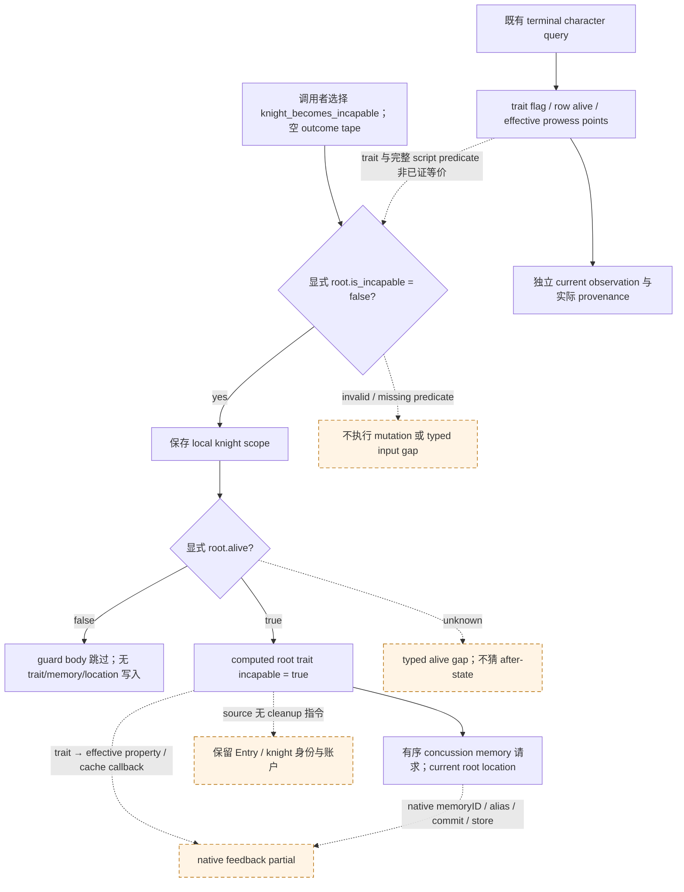

# CK3 1.20.0.3：骑士 incapable 事件的独立观测与人物投影

2026-10-05，本专题闭合 `knight_becomes_incapable` 的当前字段读取契约与 selected direct character primary；使用 NEW independent reader/model，不改 horizon、v61 adapter 或其他事件 dispatcher。版本绑定为 **CK3 1.20.0.3 / Steam build 25652598 / EXE SHA-256 `94B55397ABB687A3DCD436805A5D885E6BE90FA6C693FEB44A9E3BBEEADE02A6`**。source-first、独立 API 与唯一新 affected case 已封，资格为 **static-ready**；alive branch 的 native callbacks 仍 partial。

当前基线是已采用的 [v61 单事件增量](battle-phase-event-accolade-qualification-12003.md)，Root adoption commit 为 `4919898c6c0e83be8132a5cefad5446d2b150fa6`；[独立 adoption append](Z:/ck3_mod_rewrite_process_assets/g2-resume-20261005/battle-phase-event-one-seam-v61/topic-report/ROOT-ADOPTION-APPEND-20261005.json) SHA-256 `5a58c35b7bb11eb0b853a545ad89c3e55f41bbce5b826e599932338409aff967` 关联原封存字段与 Root receipt。原 v61 文档/receipt/日报字段未改或重封。本包不重读 qualify source，不研究其余四 unknown，也不升完整 event/callback 库存完成数。

## 精确 selected source 与 guard

[selected-event-source/ROOT-DELIVERY.json](Z:/ck3_mod_rewrite_process_assets/g2-resume-20261005/battle-phase-event-character-seam-v62/selected-event-source/ROOT-DELIVERY.json) 为 2856 B，SHA-256 `80119273b0dd9ca1617485c1e40ec5efa26c9b455c1c6e7bc2df8ece2c8b96cd`；[INPUT-CONTRACT.json](Z:/ck3_mod_rewrite_process_assets/g2-resume-20261005/battle-phase-event-character-seam-v62/selected-event-source/INPUT-CONTRACT.json) SHA-256 `4e6f9394d9ce473193592cb4f1c83573373a4fcf7d53677b507ea8dec78b6fb3`。该 seam 仅复用 cached stock `00_knight_phase_events.txt:515..544` 的完整 30 行 block，stock global index 8 / knight type index 4。

canonical validity 是 `not root.is_incapable`，chance 为固定 Q raw `100000`（整数候选 weight 1）；此 selected effect 没有 random_list、目标抽签或 outcome tape，不能因此推导整场 event probability。调用者给定已选 row、完整身份与显式 script predicate/guard；published trait flag 不自动补成 `root.is_incapable`。

source 顺序为：保存 root 的 local `knight` scope；仅在 `root.alive=True` 时添加 `incapable` trait，请求 `became_incapable_due_to_battle_concussion` memory，将 `new_memory` alias 为 `battle_memory`，给这个新 memory 设置 `battle_location=knight.location`。位置是 saved root 的当前 Province scope，不能用 Combat province 代替，也不是 root 身上的 `battle_location` 变量。



alive branch 的 exact primary 是布尔 trait membership after `true`，不是 skill arithmetic 或有效属性预测。memory 仅是有序 source request，不制造 native memoryID、成功 alias/store 或 creation ACK。缺 current root location 时仍保留已算出的 trait primary 与 memory type，另记 location argument gap。trait before 未知不能默认 false。

dead guard 在 validity 已通过且 alive 明确 false 时只保存 local scope；direct primary 不变、没有 memory 请求，也不需要 location。该分支的独立 no-write readiness 有 source 依据。alive branch 即使 primary 与 memory 描述齐全，native trait/memory/cache callback 仍使 condition feedback partial；此包没有 horizon integration。

## 已发布观测口与字段单位

[OBSERVATION-FIELD-MAP.json](Z:/ck3_mod_rewrite_process_assets/g2-resume-20261005/battle-phase-event-character-seam-v62/selected-event-source/OBSERVATION-FIELD-MAP.json) SHA-256 `e3e0972cb7109d114b954c33f85b86270360698b6455f8a4cd962969e3c2fe41` 闭合的是既有 MCP character query 的读取契约，没有新增 native reader 或调用游戏。对应 recipe：

```python
ck3_query_battle_terminal_transition_v1(
    prior_combat_id=None,
    subject_public_cunit_id=None,
    character_ids=actual_positive_knight_character_ids,
    expected_revision=fresh_public_revision,
)
```

从 observed control 的 occupied knight rows 取实际 full CharacterIDs，再按 `character_observations[*].character_id` 匹配。query 的去重请求顺序不是原生 MAA row order；独立 character 响应也不会自动等同于同一 native sample。诊断保留其 own snapshot/native revision、date/paused provenance，不为 authoritative current-entry refresh 新增门禁。

| published 字段 | 可读意义与边界 |
| --- | --- |
| `character_observations[*].character_id` | positive signed32 full CharacterID；不是 RegimentID 或 bucket index。 |
| row-level `alive` | optional bool；false 是合法当前人物观察，不推断 native cleanup。历史缺 key 与显式 null 分开。 |
| `current_person_state.scope` | `current_character`；该 object 历史缺失可保留，present 时的 literal null 不属于既有 normalizer 的合法 object 形状。 |
| `current_person_state.injury_traits.flags.incapable` | bool/null 的实际 trait presence；不是直接的 `is_incapable` script predicate。 |
| `current_person_state.injury_traits.status` | available / partial / unavailable 的八项 flag 覆盖；其他 flag 缺失不抹掉已知 incapable true/false。 |
| `current_person_state.effective_prowess.status / points / unavailable_reason` | independently observed signed32 整数 effective points，零和负值均合法；unavailable 保留原因，不填 0。不是 Q script base skill，也不是 trait mutation 后的预测值。 |

injury/alive 的可读状态与 custody 的 observed/none/unavailable 是独立轴。调用者可用当前 trait flag 填 `root.traits.incapable`，用 row alive 填 guard；完整 `root.is_incapable` 仍须显式提供。观察端点 before/after 的数值相容性不能独自证明事件 causality 或 callback 时点。

## trait、有效属性与 Entry 身份的边界

既有 .3 valid special-knight predicate `2634880` 只处理 Reg+148 sentinel/fullID/magic 解析，不测试 alive、incapable 或 prowess。因此 acquisition 不是 Entry 删除、header 变化、commander 移除或 observer-unavailable 指令。control 的六项 cached Entry 属性和 ordered identity 是独立当前输入；stat leaf `2C06D30` 读取实际 effective Character+EC，trait bool 不能替代它。

该 block 没有 direct death、cleanup、commander selection、六-cache、兵数/soft/hard loss、skill/XP、resource、UI 或 date/phase/winner 写命令。alive branch 可标记 character effective-property refresh 的模型请求，但不声称 native refresh 已执行，也不提交新的 cache calculator、cleanup 或 command-permission 推断。

实际回流的后续 source seam 是 fire `264E680` 下 selected compiled effect `+160 → 3765780` 的 `add_trait` child 与 effective-property/stat callbacks，以及 `create_character_memory / new_memory / alias / set_variable` 的实际 scope/materialization/store。当前 root location 与 native memory commit 尚未在此 reader recipe 中发布；使用明确 caller scope 做 bounded 描述，后续真观测按同一 MCP 的窄生产者施工。

## 独立 API 与唯一 affected case

[module/ROOT-DELIVERY.json](Z:/ck3_mod_rewrite_process_assets/g2-resume-20261005/battle-phase-event-character-seam-v62/module/ROOT-DELIVERY.json) 最终资格 receipt 为 3411 B，SHA-256 `9768cf5565f251011ca5859b8d13562c5d6945063a7c25856d6bd1d1eb432eb4`。NEW `battle_phase_event_character_seam_12003.py` 为 17401 B，SHA-256 `710b48e97fc00312728e52f600beb9567a92acd8252015a19c2a32d83f0a2e45`；[API-CONTRACT.json](Z:/ck3_mod_rewrite_process_assets/g2-resume-20261005/battle-phase-event-character-seam-v62/module/API-CONTRACT.json) 为 5255 B，SHA-256 `69edeb45ced486dd4dfd7dd4ce3887b01cf0acef80566016c82631a769e6df7d`。两个入口：

```python
read_current_character_fields_12003(
    payload, *, character_id, source_context=None,
) -> CurrentCharacterFields12003

execute_selected_character_phase_event_12003(
    context, *, script_outcomes=(), source_context,
    inputs=None, manifest=None,
) -> CharacterPhaseEventProjection12003
```

reader 接受 normalized `character_observations` leaf 或单个 normalized row，按完整 CharacterID 匹配；输出 `alive`、`incapable_trait`、`effective_prowess_points` 与各字段 ledger/missing inputs。`source_context` 保留 provenance；它不补 script predicate 或证明 causal 同帧。executor 使用 canonical context 的既有九个顶层键，metadata 另传 `source_context`；`root.is_incapable` 与 `root.alive` 显式供值，空 `script_outcomes` 才符合这个无抽签 effect。

`CharacterPhaseEventInputs12003` 可提供 `root_location_scope: RootCharacterLocationScope12003`、当前人物观察与其独立 source。trait primary delta 的字段为 `traits.incapable`，unit 为 `trait_boolean`，before 可未知、after true，`delta_raw=None`。`memory_requests` 保留 owner full CharacterID、memory type、有序 scope aliases 和显式 root-current Province `battle_location`；`native_memory_id=None`、`native_memory_commit_observed=False`、`request_only=True`。未知地点保留请求并记 typed argument gap。

`CharacterPhaseEventProjection12003` 同时返回 execution、primary deltas、reader、memory requests、typed callback gaps、consumed/condition-feedback readiness 和 ledger。alive primary/model 请求可算，但 `condition_feedback_ready=False`；source-closed dead guard 的独立 direct branch 可为 true。`full_script_feedback_ready`、`complete_transition`、`complete_monte_carlo` 均 false，`actual_game_days_advanced=0`。这两个独立入口没有接入 horizon 或 v61 adapter。

[focused-fixture/ROOT-DELIVERY.json](Z:/ck3_mod_rewrite_process_assets/g2-resume-20261005/battle-phase-event-character-seam-v62/focused-fixture/ROOT-DELIVERY.json) 为 5019 B，SHA-256 `e1879d040d6e15a32886babe0bc539f3564bac2770a304a5805b15bbdca04c55`；[REPORT-FIELDS.json](Z:/ck3_mod_rewrite_process_assets/g2-resume-20261005/battle-phase-event-character-seam-v62/focused-fixture/REPORT-FIELDS.json) 为 5399 B，SHA-256 `d1bdace4d5aff0fe6372d0c0009e450a2456303f93c38114a26ca866b73e827e`。**唯一新 case 首次 GREEN，1 attempt，0.0764578 秒，0 failures/errors/skipped，无 RED**；新 test 为 11015 B，SHA-256 `2fe616c8ae2552cc6fd32e4192d289475cb020a318b6cdbcc3cc3b30904e107c`。实际结果：

- Robert full CharacterID 29829 的 partial injury group 仍保留 incapable `False`，available effective prowess `0`；reader 保持 before observation，不冒充 trait 后的 effective value。
- alive branch 的 primary trait `False→True`，bool delta raw 仍 `None`；concussion memory 请求使用人物当前省份 **4100**，没有误用战场省份 **2586**。native memory ID/commit 仍 `None/False`，callback 保持 typed partial。
- 缺 location 时保留 trait 与 memory type、位置 argument 为 `None`；dead guard 无 trait/memory 写入，独立 direct readiness true；未知 trait/prowess 保留 `None/None`，不填成 `False/0`。

验证由 D 独占执行；topic lane 只采用封存 metadata，没有复跑、旧 test import、horizon、adapter、多日或真实游戏执行。

## Oct5/W41 资格

topic lane 只输出 NEW 文档与独立日/周字段，采用 A source、C final API 与 D 唯一新 case 后达到 static-ready，0 EXE/SDK/game/window/pipe/shared/Git/foreign helper/测试执行/新增 game-day。完整 native callbacks、实际 memory、有效属性与缓存回写、paused selected-event parity 未取得；不增加 live、完整 transition、Monte Carlo 或 win odds 信用。Root 负责共享索引与日报/周报合并、commit/push 和后续实际游戏任务。
