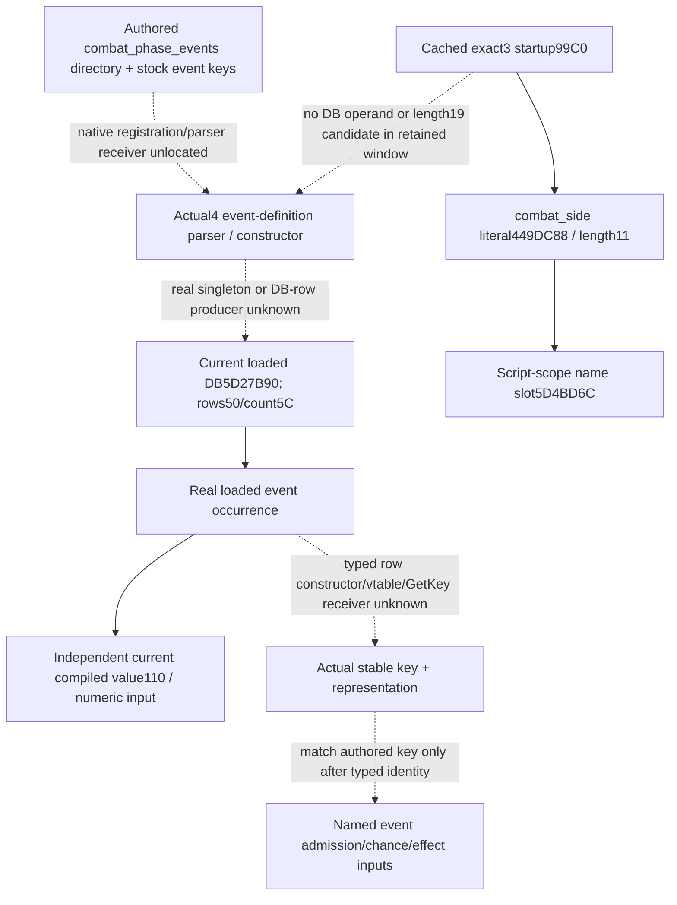

# Phase-event typed key: cached parser/caller frontier for actual 1.20.0.4

Source research, October 8 / 2026-W41. Target is frozen CK3 1.20.0.4 / Steam25734779 / EXE SHA `98702F88A547CDE2EAF29A85F93B85F68EE4CF8148336A4F7AFAEB75319DD518`. This lane owns the authored event-registration/parser caller search. The combat owner separately owns the current getter/selector/definition database and exact singleton-operand lookup in already parsed `.4` instruction caches. Neither lane executes the game, queries live memory, evaluates a callback or changes a provider.

The [current key correction](phase-compiled-enemy-list-registration-frontier-12003.md#october-8-correction-current-event-key-remains-a-typed-source-dependency) is reused: historical 1.19 `event+18` remains historical, and neither `.2` CCombatSide constructor `264CA60` nor CGameRuleSetting key `+18` supplies a typed phase-event key. The seven phase manifests and earlier RTTI negatives were not searched again in this caller lane.

## Actual retained caller and its distinct registry

`Z:/ck3_mod_rewrite_process_assets/g2-background-round6-20261006/phase-script-registration/STARTUP-LOCATOR-RESULT.json` retains the exact `.3` startup initializer `99C0..9A19`. It constructs a string operand from `449DC88`, length11, obtains the registry through `3F8A800`, supplies initialized name storage `5D4BD6C` at `99F5`, calls `3F8A4B0`, and follows `375AD00` / tail `B02D10`. The named literal is `combat_side`. Its retained source plan explicitly chose this family from an old combat-side name initializer and limited its earlier follow-up to the two script keys `enemy_side` and `any_side_participant`.

This is a real script-scope name-registration caller. It is not an event-definition database constructor, does not identify an event-row class, and cannot turn an authored stock event key into a current loaded key. The positive scope-name addresses remain useful to their original kind11 work; no `.4` database or class identity is inferred from them.

A previously captured binary is retained at `Z:/ck3_mod_rewrite_process_assets/g2-background-round6-20261006/phase-script-registration/startup-locator-00008000-2000.bin`, exact `.3` RVA window `[8000,A000)`, 8192 bytes. The earlier search checked name lengths10/20 for the original script keys. This lane performed one new **cached-byte** decode for the different authored directory name `combat_phase_events` (length19) and for the exact database singleton operand `5D27B90`.

The preserved result is `Z:/ck3_mod_rewrite_process_assets/g2-background-20261008/phase-event-parser-caller-frontier/CACHED-STARTUP-CALLER-RESULT.json`:

- Complete decoded instructions end at `9FFC`; the four-byte window tail is incomplete and is not interpreted as a constructor.
- Memory-immediate length19 `MOV` constructor candidates: **0**.
- RIP-relative operand references to `5D27B90`: **0**.
- Cached bytes reused: **8192**. New executable bytes/reads: **0/0**.

This bounded result does not prove the event parser absent from any image. It supplies no literal operand or database producer that justifies another constructor/body capture from this startup family. Length matching alone would not prove a typed event registration even if a candidate existed. No `.4` mapping, neighboring runtime function or new initializer is inferred.

## Native input tree and minimum source entry

The current loaded DB root, row storage and numeric consumer are closed independently of the missing name. The `.4` getter suffix's diagnostic `Instance has not been created!` and helper `3F8B640` are not a typed parser/constructor branch. The postchoice `5D27B80` fallback belongs to selection output, not definition creation. Neither is expanded here.

The next useful positive pin must be a genuine instruction producing `5D27B90`, an actual store/appender putting an event receiver into DB `+50`, or a typed vtable/GetKey consumer of that same row. The combat owner's distinct demand lookup checks the existing parsed `.4` caches for the singleton operand. A positive result must retain the actual instruction direction and enclosing runtime body before a capture is requested. A load-only getter is not a constructor or a writer.

For a producer supplied by that source, Root can capture its **exact RVA and full enclosing runtime window once**, with the already held `.pdata` arrays and any cached bytes reused. Follow only its actual receiver construction or key string stores and the constants they consume. If a typed vtable is emitted, join that real receiver to its COL/type identity and demanded name getter slot before publishing the key offset/representation. This is a conditional construction contract, not a new read request: this lane found no producer RVA and requests **no new EXE window**. Do not pick a neighbor or expand the diagnostic helper to fill the gap.

Numeric chance uses its own Source31 ledger at `Z:/ck3_mod_rewrite_process_assets/g2-background-20261007/upstream-build-migration/g2-combat-forecast-12004/commander-native-chance-source31/native-tree/INPUT-LEDGER.json`. A current loaded occurrence and closed compiled numeric source can qualify without being renamed an authored event. Named-event selection and effect reconstruction still need the typed key. This distinction leaves numeric work useful and avoids inventing a successful named-key observation.

## Cost, readiness and continuation

Readiness is **research** for actual `.4` typed event identity/parser association. This package adds one precise cached caller result and a branch-specific source plan; it adds no native leaf, policy, forecast, safety gate or live credit. New EXE reads/bytes0, native calls0, tests/builds0, Game/SDK/process access0, full-image/original-tree scans0, days/saves0. The cached decoder is a source-processing helper, not a native fixture or gameplay query. Root owns any newly anchored capture, integration, shared Oct8/W41 reports and publication. The next native capture must use the genuine producer pin described above; the separate numeric chance package continues independently.
