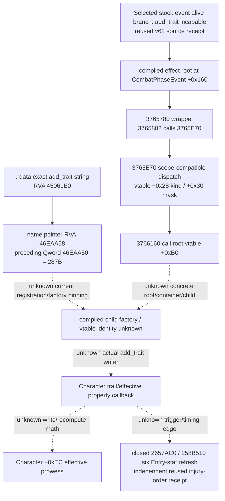

# Battle phase event trait callback — 1.20.0.3

Status: **research**, CK3 1.20.0.3, Steam build 25652598; frozen EXE SHA-256 `94B55397ABB687A3DCD436805A5D885E6BE90FA6C693FEB44A9E3BBEEADE02A6`. Day 2026-10-05 / ISO week 2026-W41.

The selected seam is the existing `knight_becomes_incapable` alive branch's compiled `add_trait` callback. This increment identifies current-build generic dispatch and the exact `add_trait` name-table location. It does not identify the concrete child writer or compute a new effective property.

`3765780..376587C` is 252 bytes; its call at `3765802` reaches `3765E70`. `3765E70..3766319` is 1,193 bytes and invokes the **generic root effect** virtual slot `+0xB0` at `3766160`. Scope slots `+0x28`/`+0x30` qualify that dispatch. The concrete root vtable, container, child constructor and actual trait writer are still unknown. The dispatcher also advances its context RNG counter before a compatible callback; this is not a trait-specific draw contract.

One authorized `.rdata` read searched only exact NUL-delimited `add_trait` and its same-section absolute pointer references. It read 17,123,840 bytes once, found one string at `45061E0` and one pointer at `46EAA58`, and retained a 224-byte reference window at `46EA9F8`. The preceding Qword at `46EAA50` equals `287B`. That observed value is **not** proof of an executable opcode, factory ID, class ID or writer address. The retained window is a value/name-pointer table, without a qualified factory or vtable target.

The next concrete source entry is the current registration/constructor cross-reference for `45061E0` / `46EAA50` / `46EAA58`, followed by the concrete root/container/child virtual target reached at `3766160`. No text-section search, live process read, memory callback research or whole executable hash was performed. The reused receipt supports `2657AC0`/`258B510` Entry refresh as a separate closure; it does not establish a trait callback edge or its timing. The earlier `2C06D30` label is removed because an exact pin for that label was not established in the referenced receipt. Character effective prowess remains a published observation and an unclosed callback output, rather than a getter address inferred from this packet.

No pure numeric API, module or test is released by this packet. Published current-person effective prowess and incapable presence remain current-frame observations. A trait flag cannot stand in for a computed `Character+0xEC` value, a completed callback, or refreshed battle Entry stats. `INPUT-CONTRACT.json` keeps these four concrete gaps visible and sets `SOURCE_READY=false`.

Evidence: `FROZEN-SOURCE-IDENTITY.json`, `function-03765780.{bin,asm,json}`, `function-03765E70.{bin,asm,json}`, `ADD-TRAIT-REGISTRATION-NEEDLE.json`, `add-trait-pointer-046EAA58.bin`, `NATIVE-SEAM-LEDGER.json`, `SOURCE-RECEIPT.json`.

The external source packet is `Z:/ck3_mod_rewrite_process_assets/g2-resume-20261005/battle-phase-event-trait-callback-v63/source/ROOT-DELIVERY.json`. The selected event's prior primary-request reader was adopted in commit `c5585c273573382c7881f7e57ed57acbed73e429`; this packet adds research evidence only.
