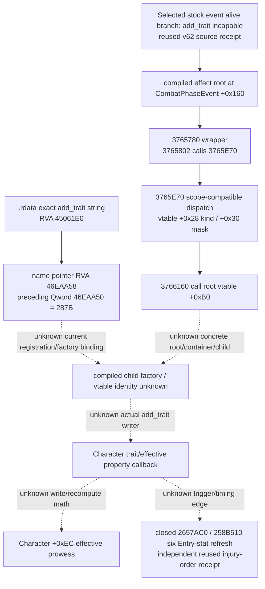
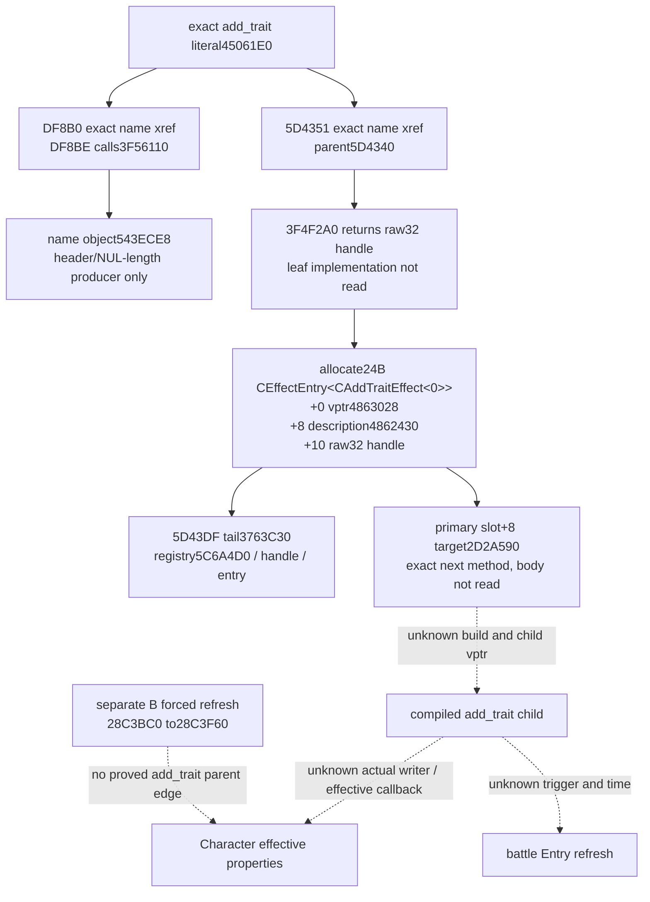
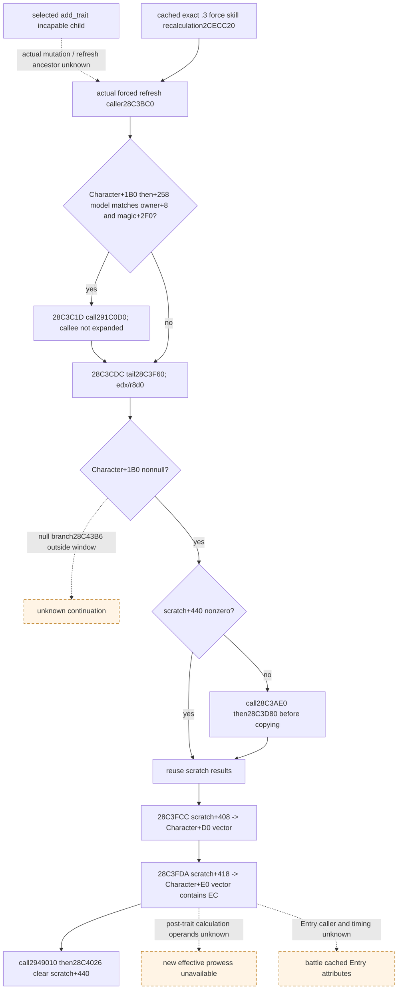
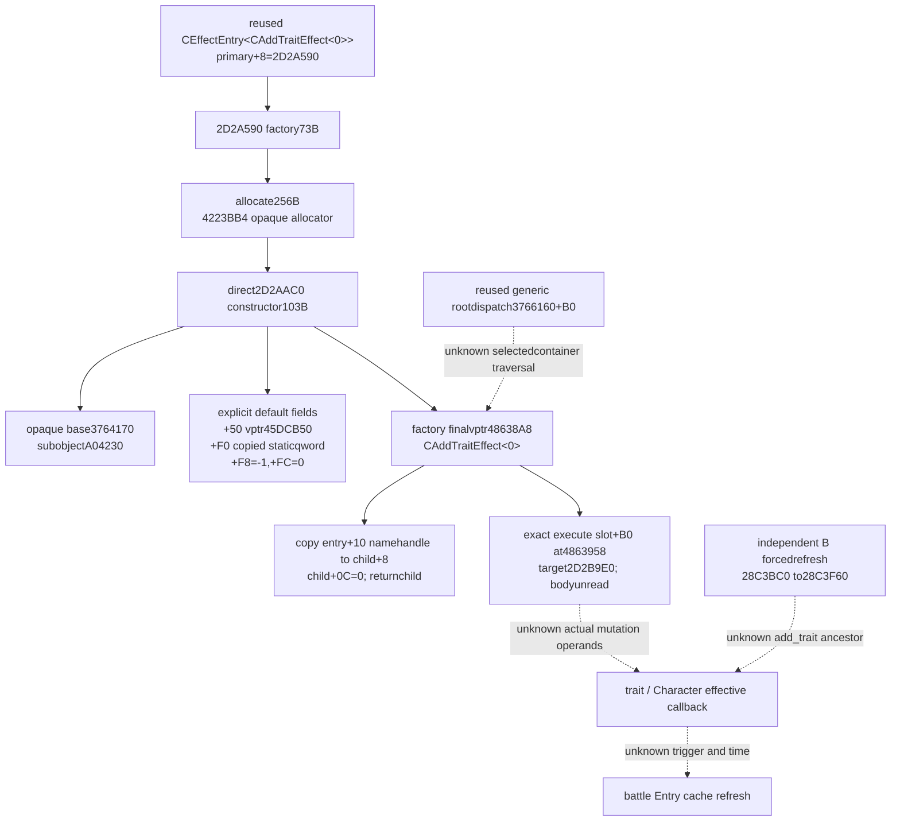

# Battle phase event trait callback — 1.20.0.3

Status: **research**, CK3 1.20.0.3, Steam build 25652598; frozen EXE SHA-256 `94B55397ABB687A3DCD436805A5D885E6BE90FA6C693FEB44A9E3BBEEADE02A6`. Day 2026-10-05 / ISO week 2026-W41.

The selected seam is the existing `knight_becomes_incapable` alive branch's compiled `add_trait` callback. This increment identifies current-build generic dispatch and the exact `add_trait` name-table location. It does not identify the concrete child writer or compute a new effective property.

`3765780..376587C` is 252 bytes; its call at `3765802` reaches `3765E70`. `3765E70..3766319` is 1,193 bytes and invokes the **generic root effect** virtual slot `+0xB0` at `3766160`. Scope slots `+0x28`/`+0x30` qualify that dispatch. The concrete root vtable, container, child constructor and actual trait writer are still unknown. The dispatcher also advances its context RNG counter before a compatible callback; this is not a trait-specific draw contract.

One authorized `.rdata` read searched only exact NUL-delimited `add_trait` and its same-section absolute pointer references. It read 17,123,840 bytes once, found one string at `45061E0` and one pointer at `46EAA58`, and retained a 224-byte reference window at `46EA9F8`. The preceding Qword at `46EAA50` equals `287B`. That observed value is **not** proof of an executable opcode, factory ID, class ID or writer address. The retained window is a value/name-pointer table, without a qualified factory or vtable target.

The next concrete source entry is the current registration/constructor cross-reference for `45061E0` / `46EAA50` / `46EAA58`, followed by the concrete root/container/child virtual target reached at `3766160`. No text-section search, live process read, memory callback research or whole executable hash was performed. The reused receipt supports `2657AC0`/`258B510` Entry refresh as a separate closure; it does not establish a trait callback edge or its timing. The earlier `2C06D30` label is removed because an exact pin for that label was not established in the referenced receipt. Character effective prowess remains a published observation and an unclosed callback output, rather than a getter address inferred from this packet.

No pure numeric API, module or test is released by this packet. Published current-person effective prowess and incapable presence remain current-frame observations. A trait flag cannot stand in for a computed `Character+0xEC` value, a completed callback, or refreshed battle Entry stats. `INPUT-CONTRACT.json` keeps these four concrete gaps visible and sets `SOURCE_READY=false`.

Evidence: `FROZEN-SOURCE-IDENTITY.json`, `function-03765780.{bin,asm,json}`, `function-03765E70.{bin,asm,json}`, `ADD-TRAIT-REGISTRATION-NEEDLE.json`, `add-trait-pointer-046EAA58.bin`, `NATIVE-SEAM-LEDGER.json`, `SOURCE-RECEIPT.json`.

The external source packet is `Z:/ck3_mod_rewrite_process_assets/g2-resume-20261005/battle-phase-event-trait-callback-v63/source/ROOT-DELIVERY.json`. The selected event's prior primary-request reader was adopted in commit `c5585c273573382c7881f7e57ed57acbed73e429`; this packet adds research evidence only.

## Current registration increment (2026-10-05, v64)

Status: **research**, 2026-10-05 / 2026-W41. Source-ready numeric trait writer remains **false**.

The one approved three-target static xref pass found four instruction-boundary-confirmed references to `45061E0`: `DF8B0`, `5D4351`, `2D2B310` and `2D2B789`. It found no code references to `46EAA50` or `46EAA58`; this does not imply absence of a factory. Only `5D4340` and the reachable `DF8BE` direct callee `3F56110` were captured as new bounded bodies. The large `DD2B0` initializer and the two funclet bodies were not captured.

`5D4340` passes the nine-byte name input through `3F4F2A0`, retains its raw32 return, allocates24 bytes, installs primary vptr `4863028`, description pointer `4862430`, and name handle at `+10`, then tail-calls `3763C30` with registry/handle/entry. Primary RTTI identifies `CEffectEntry<CAddTraitEffect<0>>`. Its primary table has only two methods, `+0=A03BD0` and `+8=2D2A590`; the next Qword is another RTTI COL. **The entry's `+8` field is a description string, not a second vptr; neither table nor field is the compiled child's `+B0` executor.**

`3F56110` is a58-byte string-object initializer: it zeros initial fields, writes15 at `+18`, computes the source NUL length, calls `855DB0`, and returns the destination. `DF8B0..DF8BE` binds that destination to `543ECE8`. No xref search of that new global was performed, and no trait/property writer is inferred.

Read costs are explicit: one authorized target-only `.text` read of71,141,888 bytes, four135-byte near windows, two bounded bodies totaling222 bytes with88 bytes reused from a near window and134 newly read, plus recorded `.pdata`/record metadata. The two-body budget is2/2. The metadata helper initially followed the description predecessor as a COL and read24 bytes at `2D25E60`, then failed its COL-signature assertion. That unintended text read and raw attempt are retained; its instructions were not decoded or used. Cached bytes corrected the field classification without another EXE read.

The next qualified source body is **`2D2A590`**, the current `CEffectEntry<CAddTraitEffect<0>>` primary virtual `+8` target. Its build role, actual child vptr/execute target, trait mutation operands and callback edges remain unknown. The separate B forced-refresh receipt does not establish an `add_trait` ancestor edge, numeric whole kernel, or knight Entry timing. There is no new model, test, game query or live claim.

External source packet: `Z:/ck3_mod_rewrite_process_assets/g2-resume-20261005/battle-phase-event-trait-callback-v64/registration-source/ROOT-DELIVERY.json`. The current mutation/forced-refresh sibling packet is `Z:/ck3_mod_rewrite_process_assets/g2-resume-20261005/battle-phase-event-trait-callback-v64/trait-caller-source/ROOT-DELIVERY.json`, SHA-256 `8bbb9fea208b45e861612bf508a6fac583cb68abc83e88ccece71c619249c3bc`, independently sealed and reused by metadata only.

## Independent Character refresh caller (v64 B, 2026-10-05)

The independent B result closes a real current-build **forced Character refresh caller and local cache-store order**. It gives the selected-trait research a qualified refresh target; the mutation-to-refresh ancestor remains unknown. The current-build cached skill research identifies `force_character_skill_recalculation` slot24 `2CECC20 -> 28C3BC0`. Original D: function transcripts were unavailable here, so B captured two bounded cached-lead windows from the frozen migration EXE: `28C3BC0..28C3E40` (640 B) and `28C3F60..28C4040` (224 B), totaling **864 B**. Their SHA-256 values are `7e4dc2592abb7f13702e5df5d357be5e60d03db84a9aa58d2afb11f71db92c2a` and `d3a373fa1c48bf4cbabbb3aa0f902979a14057baa42fdfcf0d20c0517ea7bc52`.

The caller resolves `Character+1B0 -> +258` and tests model owner `+8` and magic `+2F0=43684D64`. Its matching branch calls `291C0D0` at `28C3C1D` before the tail; bypass branches also reach `28C3CDC`. B's caller interpretation stops at the tail instruction ending `28C3CE1`. Adjacent bytes within that first retained window are not another closed function.

In the second window, null scratch branches to `28C43B6`, outside the capture. For nonnull scratch, a zero `+440` byte causes calls to `28C3AE0` and `28C3D80`; otherwise the window reuses scratch results. The vector store at `28C3FCC` writes Character `+D0` through `+DC`, including total diplomacy/martial. The store at `28C3FDA` writes Character `+E0/+E4/+E8/+EC`, including effective prowess. The window then calls `2949010` and clears scratch `+440` at `28C4026`. That is local synchronous write order; later continuation and these callees' mutation-dependent operands are not closed by the two windows.

Effective skill fields are **signed32 integer points**, not Q100000 or trait booleans. Zero remains legal. The separately pinned current skill-getter identity is `2B68870`; this increment does not use `2C06D30` as a skill getter. Observed current prowess is not automatically a post-trait value.

Concrete remaining seams are: actual compiled add_trait executor -> Character mutation -> this refresh caller or its dirty/schedule primitive; post-mutation base/modifier/percentage/boundary inputs for the scratch kernel; and the subsequent battle Entry caller/time with its six actual cached attributes. A registered entry plus B's independent cache writer cannot compose those unknown ancestor edges into a causal trait-stat chain. **SOURCE_READY remains false**, with no numeric module, case, live credit, complete horizon, Monte Carlo or win odds. A separate v65 source increment follows the qualified `2D2A590` target; its future findings are outside this v64 publication.

B evidence is [trait-caller-source/ROOT-DELIVERY.json](Z:/ck3_mod_rewrite_process_assets/g2-resume-20261005/battle-phase-event-trait-callback-v64/trait-caller-source/ROOT-DELIVERY.json), 3980 B, SHA-256 `8bbb9fea208b45e861612bf508a6fac583cb68abc83e88ccece71c619249c3bc`. Its `INPUT-AND-TYPED-GAPS.json`, `TREE.md` and `BOUNDED-CAPTURE-RECEIPT.json` bind the two raw/disassembly windows and the reused current-build skill research. A evidence is [registration-source/ROOT-DELIVERY.json](Z:/ck3_mod_rewrite_process_assets/g2-resume-20261005/battle-phase-event-trait-callback-v64/registration-source/ROOT-DELIVERY.json), 3428 B, SHA-256 `89d56bd41b2908f1c0bfa50d5b6cb7d212946767edacc300fb49af77ff2135ed`, binding `SOURCE-RECEIPT.json` (12374 B, SHA-256 `2cff0d5cf28a49216b36c0b3e816b0047c63077f3b74f34b54100689ab6bf92e`).

## v64 publication qualification and retained attempts

The research increment is complete and useful: exact registration type/next target plus a separate real Character-cache refresh caller. The selected trait feedback feature remains partial. C delivered no numeric model and D executed no case; no test GREEN or capability RED is claimed. A's retained COL-signature assertion RED came from misclassifying the description pointer as a second vptr, including the disclosed 24 B text read; cached metadata corrected that interpretation without a third decoded body. It is a source-helper attempt, not a failed trait capability test.

Root also retained ordinary pure-data read failures: two source Markdown/JSON read commands lacked their read helper and produced Markdown SyntaxError/JSON false NameError, then were corrected; a requested v61 source path was absent. These commands executed no business code and wrote no files. They do not add test attempts, capability failures or an audit prerequisite. This publishing lane only copied sealed A candidate bytes and appended this sealed B result; it performed no new EXE read, source lookup, test, SDK, game, window, shared write or Git operation. The one MOD topic patch is based on the already corrected v63 topic (4127 B, SHA-256 `de8d70d5d3d0d1b218bd8898694902d7007e00558c7887d2fa080d47fba7f5fa`), whose current g38 equality Root already confirmed. Root owns adoption, shared Oct5/W41 reports and commit/push.

## Compiled add_trait factory increment (2026-10-05, v65)

Status: **research**, 2026-10-05 / 2026-W41. Factory identity/order is source-closed; numeric trait writer source-ready remains **false**.

The qualified registration-entry virtual method `2D2A590` allocates256 bytes, directly calls constructor `2D2AAC0`, then installs final vptr `48638A8`, copies the entry raw32 name handle from `+10` to child `+8`, writes zero at child byte `+0C`, and returns the child. Constructor `2D2AAC0` calls two opaque initializers, writes its explicit subobject/default fields, and returns. Its temporary vptr `4863978` is overwritten by the factory's final vptr.

Validated final RTTI identifies `CAddTraitEffect<0>`. The exact final `+B0` qword at `4863958` points to **`2D2B9E0`**, now a qualified next execute entry. Scope slots `+28=A02D00` and `+30=2D29890` are addresses only; their bodies were not read. The name handle is a name-key bit pattern, not a selected trait ID or a prowess scalar. The constructor's `+F0` static qword and `+F8=-1` are not assigned guessed TraitDefinition semantics.

This increment contains two new bounded bodies totaling176 bytes,384 bytes of individually recorded `.pdata` lookup rows, and168 bytes of final vptr/COL/type/slot metadata. No new xref scan, whole executable hash, prior body/needle reread, third function body, game/SDK/liveRPM/window action or test was performed. The v64 metadata-read mistake belongs to its preserved prior packet; v65 metadata pointers were classified into backed noncode sections before following them.

The actual `2D2B9E0` execution body, parsed trait binding, selected loaded root/container-to-child edge, Character effective recompute arithmetic, and battle Entry timing remain typed gaps. The independent forced-refresh chain cannot establish an `add_trait` ancestor edge. This package releases no numeric model/API or fixture. The next source work should read `2D2B9E0` and a necessary actual mutation/callback target, within a separately authorized bounded package.

Sealed source: `Z:/ck3_mod_rewrite_process_assets/g2-resume-20261005/battle-phase-event-compiled-trait-factory-v65/source/ROOT-DELIVERY.json`, SHA-256 `7a735ca40bdb6c17715e249e6b33054e9d499b80e824eb968d1e2f3b31f8cfdb`. No model or fixture is released by this factory-only increment.
