# Battle phase event trait callback — 1.20.0.3

Status: **research**, CK3 1.20.0.3, Steam build 25652598; frozen EXE SHA-256 `94B55397ABB687A3DCD436805A5D885E6BE90FA6C693FEB44A9E3BBEEADE02A6`. Day 2026-10-05 / ISO week 2026-W41.

The selected seam is the existing `knight_becomes_incapable` alive branch's compiled `add_trait` callback. This increment identifies current-build generic dispatch and the exact `add_trait` name-table location. It does not identify the concrete child writer or compute a new effective property.

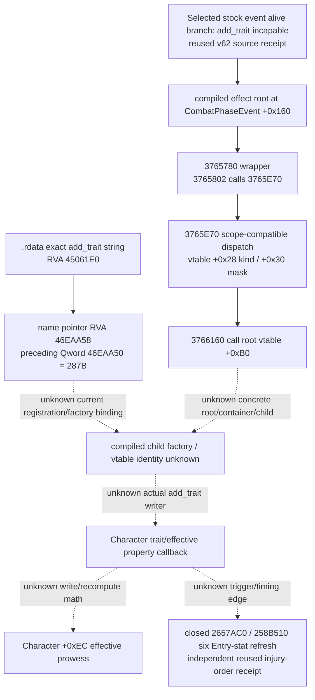
```mermaid
flowchart TD
    E["Selected stock event alive branch: add_trait incapable
reused v62 source receipt"] --> R["compiled effect root at CombatPhaseEvent +0x160" ]
    R --> W["3765780 wrapper
3765802 calls 3765E70"]
    W --> S["3765E70 scope-compatible dispatch
vtable +0x28 kind / +0x30 mask"]
    S --> V["3766160 call root vtable +0xB0"]
    N[".rdata exact add_trait string
RVA 45061E0"] --> P["name pointer RVA 46EAA58
preceding Qword 46EAA50 = 287B"]
    P -. "unknown current registration/factory binding" .-> F["compiled child factory / vtable identity unknown"]
    V -. "unknown concrete root/container/child" .-> F
    F -. "unknown actual add_trait writer" .-> C["Character trait/effective property callback"]
    C -. "unknown write/recompute math" .-> EC["Character +0xEC effective prowess"]
    I["closed 2657AC0 / 258B510 six Entry-stat refresh
independent reused injury-order receipt"]
    C -. "unknown trigger/timing edge" .-> I
```

`3765780..376587C` is 252 bytes; its call at `3765802` reaches `3765E70`. `3765E70..3766319` is 1,193 bytes and invokes the **generic root effect** virtual slot `+0xB0` at `3766160`. Scope slots `+0x28`/`+0x30` qualify that dispatch. The concrete root vtable, container, child constructor and actual trait writer are still unknown. The dispatcher also advances its context RNG counter before a compatible callback; this is not a trait-specific draw contract.

One authorized `.rdata` read searched only exact NUL-delimited `add_trait` and its same-section absolute pointer references. It read 17,123,840 bytes once, found one string at `45061E0` and one pointer at `46EAA58`, and retained a 224-byte reference window at `46EA9F8`. The preceding Qword at `46EAA50` equals `287B`. That observed value is **not** proof of an executable opcode, factory ID, class ID or writer address. The retained window is a value/name-pointer table, without a qualified factory or vtable target.

The next concrete source entry is the current registration/constructor cross-reference for `45061E0` / `46EAA50` / `46EAA58`, followed by the concrete root/container/child virtual target reached at `3766160`. No text-section search, live process read, memory callback research or whole executable hash was performed. The reused receipt supports `2657AC0`/`258B510` Entry refresh as a separate closure; it does not establish a trait callback edge or its timing. The earlier `2C06D30` label is removed because an exact pin for that label was not established in the referenced receipt. Character effective prowess remains a published observation and an unclosed callback output, rather than a getter address inferred from this packet.

No pure numeric API, module or test is released by this packet. Published current-person effective prowess and incapable presence remain current-frame observations. A trait flag cannot stand in for a computed `Character+0xEC` value, a completed callback, or refreshed battle Entry stats. `INPUT-CONTRACT.json` keeps these four concrete gaps visible and sets `SOURCE_READY=false`.

Evidence: `FROZEN-SOURCE-IDENTITY.json`, `function-03765780.{bin,asm,json}`, `function-03765E70.{bin,asm,json}`, `ADD-TRAIT-REGISTRATION-NEEDLE.json`, `add-trait-pointer-046EAA58.bin`, `NATIVE-SEAM-LEDGER.json`, `SOURCE-RECEIPT.json`.

The external source packet is `Z:/ck3_mod_rewrite_process_assets/g2-resume-20261005/battle-phase-event-trait-callback-v63/source/ROOT-DELIVERY.json`. The selected event's prior primary-request reader was adopted in commit `c5585c273573382c7881f7e57ed57acbed73e429`; this packet adds research evidence only.

## Current registration increment (2026-10-05, v64)

Status: **research**, 2026-10-05 / 2026-W41. Source-ready numeric trait writer remains **false**.

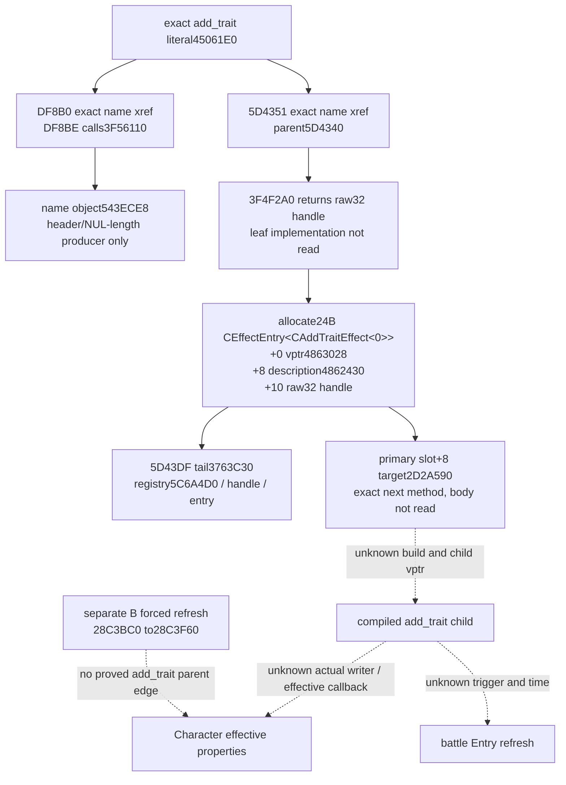
```mermaid
flowchart TD
    N["exact add_trait literal45061E0"] --> X["5D4351 exact name xref
parent5D4340"]
    N --> S["DF8B0 exact name xref
DF8BE calls3F56110"]
    S --> G["name object543ECE8
header/NUL-length producer only"]
    X --> H["3F4F2A0 returns raw32 handle
leaf implementation not read"]
    H --> E["allocate24B CEffectEntry&lt;CAddTraitEffect&lt;0&gt;&gt;
+0 vptr4863028
+8 description4862430
+10 raw32 handle"]
    E --> P["5D43DF tail3763C30
registry5C6A4D0 / handle / entry"]
    E --> T["primary slot+8 target2D2A590
exact next method, body not read"]
    T -. "unknown build and child vptr" .-> C["compiled add_trait child"]
    C -. "unknown actual writer / effective callback" .-> V["Character effective properties"]
    B["separate B forced refresh
28C3BC0 to28C3F60"] -. "no proved add_trait parent edge" .-> V
    C -. "unknown trigger and time" .-> K["battle Entry refresh"]
```

The one approved three-target static xref pass found four instruction-boundary-confirmed references to `45061E0`: `DF8B0`, `5D4351`, `2D2B310` and `2D2B789`. It found no code references to `46EAA50` or `46EAA58`; this does not imply absence of a factory. Only `5D4340` and the reachable `DF8BE` direct callee `3F56110` were captured as new bounded bodies. The large `DD2B0` initializer and the two funclet bodies were not captured.

`5D4340` passes the nine-byte name input through `3F4F2A0`, retains its raw32 return, allocates24 bytes, installs primary vptr `4863028`, description pointer `4862430`, and name handle at `+10`, then tail-calls `3763C30` with registry/handle/entry. Primary RTTI identifies `CEffectEntry<CAddTraitEffect<0>>`. Its primary table has only two methods, `+0=A03BD0` and `+8=2D2A590`; the next Qword is another RTTI COL. **The entry's `+8` field is a description string, not a second vptr; neither table nor field is the compiled child's `+B0` executor.**

`3F56110` is a58-byte string-object initializer: it zeros initial fields, writes15 at `+18`, computes the source NUL length, calls `855DB0`, and returns the destination. `DF8B0..DF8BE` binds that destination to `543ECE8`. No xref search of that new global was performed, and no trait/property writer is inferred.

Read costs are explicit: one authorized target-only `.text` read of71,141,888 bytes, four135-byte near windows, two bounded bodies totaling222 bytes with88 bytes reused from a near window and134 newly read, plus recorded `.pdata`/record metadata. The two-body budget is2/2. The metadata helper initially followed the description predecessor as a COL and read24 bytes at `2D25E60`, then failed its COL-signature assertion. That unintended text read and raw attempt are retained; its instructions were not decoded or used. Cached bytes corrected the field classification without another EXE read.

The next qualified source body is **`2D2A590`**, the current `CEffectEntry<CAddTraitEffect<0>>` primary virtual `+8` target. Its build role, actual child vptr/execute target, trait mutation operands and callback edges remain unknown. The separate B forced-refresh receipt does not establish an `add_trait` ancestor edge, numeric whole kernel, or knight Entry timing. There is no new model, test, game query or live claim.

External source packet: `Z:/ck3_mod_rewrite_process_assets/g2-resume-20261005/battle-phase-event-trait-callback-v64/registration-source/ROOT-DELIVERY.json`. The current mutation/forced-refresh sibling packet is `Z:/ck3_mod_rewrite_process_assets/g2-resume-20261005/battle-phase-event-trait-callback-v64/trait-caller-source/ROOT-DELIVERY.json`, SHA-256 `8bbb9fea208b45e861612bf508a6fac583cb68abc83e88ccece71c619249c3bc`, independently sealed and reused by metadata only.

## Independent Character refresh caller (v64 B, 2026-10-05)

The independent B result closes a real current-build **forced Character refresh caller and local cache-store order**. It gives the selected-trait research a qualified refresh target; the mutation-to-refresh ancestor remains unknown. The current-build cached skill research identifies `force_character_skill_recalculation` slot24 `2CECC20 -> 28C3BC0`. Original D: function transcripts were unavailable here, so B captured two bounded cached-lead windows from the frozen migration EXE: `28C3BC0..28C3E40` (640 B) and `28C3F60..28C4040` (224 B), totaling **864 B**. Their SHA-256 values are `7e4dc2592abb7f13702e5df5d357be5e60d03db84a9aa58d2afb11f71db92c2a` and `d3a373fa1c48bf4cbabbb3aa0f902979a14057baa42fdfcf0d20c0517ea7bc52`.

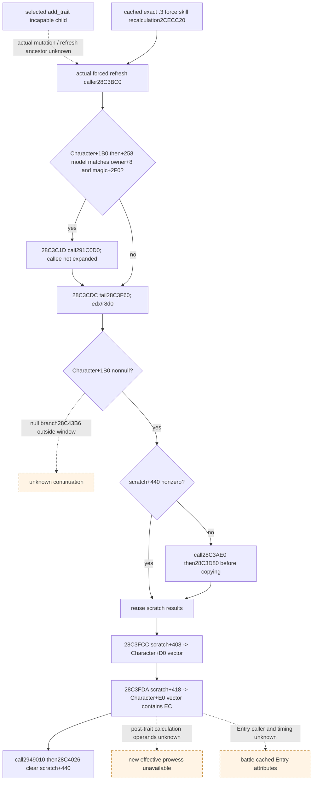
```mermaid
flowchart TD
    S["selected add_trait incapable child"] -. "actual mutation / refresh ancestor unknown" .-> R["actual forced refresh caller28C3BC0"]
    F["cached exact .3 force skill recalculation2CECC20"] --> R
    R --> M{"Character+1B0 then+258 model matches owner+8 and magic+2F0?"}
    M -->|yes| C["28C3C1D call291C0D0; callee not expanded"]
    C --> J["28C3CDC tail28C3F60; edx/r8d0"]
    M -->|no| J
    J --> P{"Character+1B0 nonnull?"}
    P -. "null branch28C43B6 outside window" .-> U["unknown continuation"]
    P -->|yes| Q{"scratch+440 nonzero?"}
    Q -->|no| K["call28C3AE0 then28C3D80 before copying"]
    Q -->|yes| W["reuse scratch results"]
    K --> W
    W --> D["28C3FCC scratch+408 -> Character+D0 vector"]
    D --> E["28C3FDA scratch+418 -> Character+E0 vector contains EC"]
    E --> Z["call2949010 then28C4026 clear scratch+440"]
    E -. "post-trait calculation operands unknown" .-> N["new effective prowess unavailable"]
    E -. "Entry caller and timing unknown" .-> B["battle cached Entry attributes"]
    classDef unknown stroke-dasharray:6 4,fill:#fff4e5,stroke:#b36b00;
    class U,N,B unknown;
```

The caller resolves `Character+1B0 -> +258` and tests model owner `+8` and magic `+2F0=43684D64`. Its matching branch calls `291C0D0` at `28C3C1D` before the tail; bypass branches also reach `28C3CDC`. B's caller interpretation stops at the tail instruction ending `28C3CE1`. Adjacent bytes within that first retained window are not another closed function.

In the second window, null scratch branches to `28C43B6`, outside the capture. For nonnull scratch, a zero `+440` byte causes calls to `28C3AE0` and `28C3D80`; otherwise the window reuses scratch results. The vector store at `28C3FCC` writes Character `+D0` through `+DC`, including total diplomacy/martial. The store at `28C3FDA` writes Character `+E0/+E4/+E8/+EC`, including effective prowess. The window then calls `2949010` and clears scratch `+440` at `28C4026`. That is local synchronous write order; later continuation and these callees' mutation-dependent operands are not closed by the two windows.

Effective skill fields are **signed32 integer points**, not Q100000 or trait booleans. Zero remains legal. The separately pinned current skill-getter identity is `2B68870`; this increment does not use `2C06D30` as a skill getter. Observed current prowess is not automatically a post-trait value.

Concrete remaining seams are: actual compiled add_trait executor -> Character mutation -> this refresh caller or its dirty/schedule primitive; post-mutation base/modifier/percentage/boundary inputs for the scratch kernel; and the subsequent battle Entry caller/time with its six actual cached attributes. A registered entry plus B's independent cache writer cannot compose those unknown ancestor edges into a causal trait-stat chain. **SOURCE_READY remains false**, with no numeric module, case, live credit, complete horizon, Monte Carlo or win odds. A separate v65 source increment follows the qualified `2D2A590` target; its future findings are outside this v64 publication.

B evidence is [trait-caller-source/ROOT-DELIVERY.json](Z:/ck3_mod_rewrite_process_assets/g2-resume-20261005/battle-phase-event-trait-callback-v64/trait-caller-source/ROOT-DELIVERY.json), 3980 B, SHA-256 `8bbb9fea208b45e861612bf508a6fac583cb68abc83e88ccece71c619249c3bc`. Its `INPUT-AND-TYPED-GAPS.json`, `TREE.md` and `BOUNDED-CAPTURE-RECEIPT.json` bind the two raw/disassembly windows and the reused current-build skill research. A evidence is [registration-source/ROOT-DELIVERY.json](Z:/ck3_mod_rewrite_process_assets/g2-resume-20261005/battle-phase-event-trait-callback-v64/registration-source/ROOT-DELIVERY.json), 3428 B, SHA-256 `89d56bd41b2908f1c0bfa50d5b6cb7d212946767edacc300fb49af77ff2135ed`, binding `SOURCE-RECEIPT.json` (12374 B, SHA-256 `2cff0d5cf28a49216b36c0b3e816b0047c63077f3b74f34b54100689ab6bf92e`).

## v64 publication qualification and retained attempts

The research increment is complete and useful: exact registration type/next target plus a separate real Character-cache refresh caller. The selected trait feedback feature remains partial. C delivered no numeric model and D executed no case; no test GREEN or capability RED is claimed. A's retained COL-signature assertion RED came from misclassifying the description pointer as a second vptr, including the disclosed 24 B text read; cached metadata corrected that interpretation without a third decoded body. It is a source-helper attempt, not a failed trait capability test.

Root also retained ordinary pure-data read failures: two source Markdown/JSON read commands lacked their read helper and produced Markdown SyntaxError/JSON false NameError, then were corrected; a requested v61 source path was absent. These commands executed no business code and wrote no files. They do not add test attempts, capability failures or an audit prerequisite. This publishing lane only copied sealed A candidate bytes and appended this sealed B result; it performed no new EXE read, source lookup, test, SDK, game, window, shared write or Git operation. The one MOD topic patch is based on the already corrected v63 topic (4127 B, SHA-256 `de8d70d5d3d0d1b218bd8898694902d7007e00558c7887d2fa080d47fba7f5fa`), whose current g38 equality Root already confirmed. Root owns adoption, shared Oct5/W41 reports and commit/push.

## Compiled add_trait factory increment (2026-10-05, v65)

Status: **research**, 2026-10-05 / 2026-W41. Factory identity/order is source-closed; numeric trait writer source-ready remains **false**.

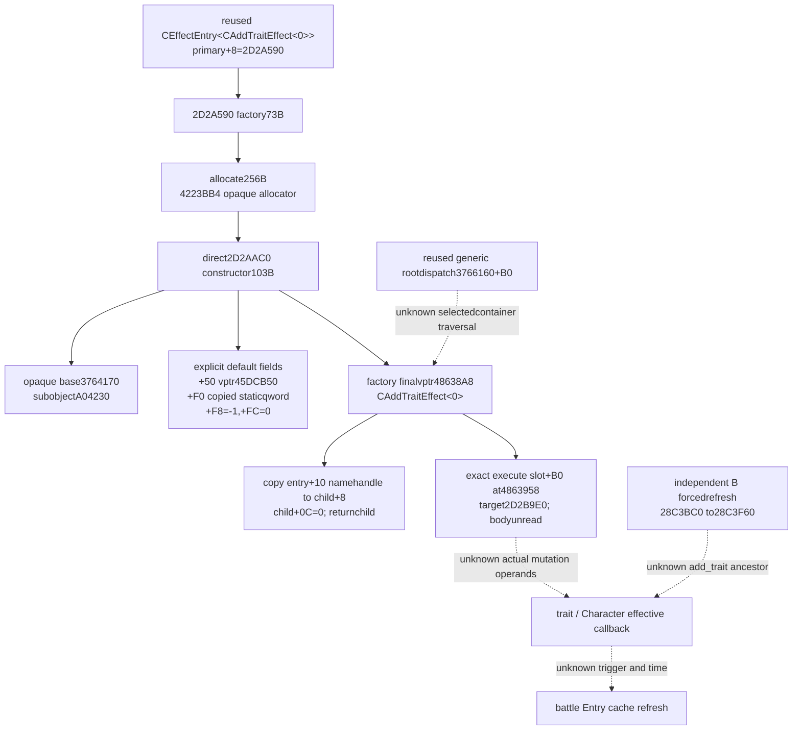
```mermaid
flowchart TD
    R["reused CEffectEntry&lt;CAddTraitEffect&lt;0&gt;&gt;
primary+8=2D2A590"] --> F["2D2A590 factory73B"]
    F --> A["allocate256B
4223BB4 opaque allocator"]
    A --> C["direct2D2AAC0 constructor103B"]
    C --> O["opaque base3764170
subobjectA04230"]
    C --> D["explicit default fields
+50 vptr45DCB50
+F0 copied staticqword
+F8=-1,+FC=0"]
    C --> V["factory finalvptr48638A8
CAddTraitEffect&lt;0&gt;"]
    V --> N["copy entry+10 namehandle to child+8
child+0C=0; returnchild"]
    V --> X["exact execute slot+B0 at4863958
target2D2B9E0; bodyunread"]
    P["reused generic rootdispatch3766160+B0"] -. "unknown selectedcontainer traversal" .-> V
    X -. "unknown actual mutation operands" .-> T["trait / Character effective callback"]
    B["independent B forcedrefresh
28C3BC0 to28C3F60"] -. "unknown add_trait ancestor" .-> T
    T -. "unknown trigger and time" .-> E["battle Entry cache refresh"]
```

The qualified registration-entry virtual method `2D2A590` allocates256 bytes, directly calls constructor `2D2AAC0`, then installs final vptr `48638A8`, copies the entry raw32 name handle from `+10` to child `+8`, writes zero at child byte `+0C`, and returns the child. Constructor `2D2AAC0` calls two opaque initializers, writes its explicit subobject/default fields, and returns. Its temporary vptr `4863978` is overwritten by the factory's final vptr.

Validated final RTTI identifies `CAddTraitEffect<0>`. The exact final `+B0` qword at `4863958` points to **`2D2B9E0`**, now a qualified next execute entry. Scope slots `+28=A02D00` and `+30=2D29890` are addresses only; their bodies were not read. The name handle is a name-key bit pattern, not a selected trait ID or a prowess scalar. The constructor's `+F0` static qword and `+F8=-1` are not assigned guessed TraitDefinition semantics.

This increment contains two new bounded bodies totaling176 bytes,384 bytes of individually recorded `.pdata` lookup rows, and168 bytes of final vptr/COL/type/slot metadata. No new xref scan, whole executable hash, prior body/needle reread, third function body, game/SDK/liveRPM/window action or test was performed. The v64 metadata-read mistake belongs to its preserved prior packet; v65 metadata pointers were classified into backed noncode sections before following them.

The actual `2D2B9E0` execution body, parsed trait binding, selected loaded root/container-to-child edge, Character effective recompute arithmetic, and battle Entry timing remain typed gaps. The independent forced-refresh chain cannot establish an `add_trait` ancestor edge. This package releases no numeric model/API or fixture. The next source work should read `2D2B9E0` and a necessary actual mutation/callback target, within a separately authorized bounded package.

Sealed source: `Z:/ck3_mod_rewrite_process_assets/g2-resume-20261005/battle-phase-event-compiled-trait-factory-v65/source/ROOT-DELIVERY.json`, SHA-256 `7a735ca40bdb6c17715e249e6b33054e9d499b80e824eb968d1e2f3b31f8cfdb`. No model or fixture is released by this factory-only increment.

## Actual trait mutation and refresh-request increment (2026-10-05, v66)

Status: **research**, 2026-10-05 / 2026-W41. The actual trait mutation/request ancestry is source-closed; numeric effective callback readiness remains **false**.

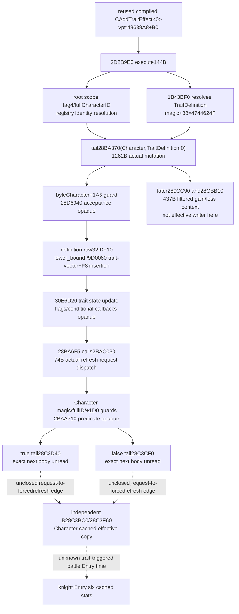
```mermaid
flowchart TD
    F["reused compiled CAddTraitEffect&lt;0&gt;
vptr48638A8+B0"] --> X["2D2B9E0 execute144B"]
    X --> C["root scope tag4/fullCharacterID
registry identity resolution"]
    X --> D["1B43BF0 resolves TraitDefinition
magic+38=4744624F"]
    C --> A["tail28BA370(Character,TraitDefinition,0)
1262B actual mutation"]
    D --> A
    A --> G["byteCharacter+1A5 guard
28D6940 acceptance opaque"]
    G --> T["definition raw32ID+10
lower_bound /9D0060 trait-vector+F8 insertion"]
    T --> O["30E6D20 trait state update
flags/conditional callbacks opaque"]
    O --> R["28BA6F5 calls2BAC030
74B actual refresh-request dispatch"]
    R --> Q["Character magic/fullID/+1D0 guards
2BAA710 predicate opaque"]
    Q --> Y["true tail28C3D40
exact next body unread"]
    Q --> N["false tail28C3CF0
exact next body unread"]
    Y -. "unclosed request-to-forcedrefresh edge" .-> B["independent B28C3BC0/28C3F60
Character cached effective copy"]
    N -. "unclosed request-to-forcedrefresh edge" .-> B
    A --> P["later289CC90 and28CBB10
437B filtered gain/loss context
not effective writer here"]
    B -. "unknown trait-triggered battle Entry time" .-> K["knight Entry six cached stats"]
```

The actual compiled execution target resolves the root Character full ID using scope tag4 and the current registry, resolves the trait definition through `1B43BF0`, checks the returned definition magic, and tail-calls **`28BA370(Character,TraitDefinition,0)`**. The Character method checks its byte `+1A5` and an opaque acceptance gate `28D6940`, computes the sorted insertion position, and calls the container insertion into its trait vector at `+F8`. New trait raw32 definition ID comes from definition `+10`, not from a guessed string-to-stat map.

After insertion, helper/flag callbacks precede the call at **`28BA6F5 -> 2BAC030`**. That74-byte request dispatcher checks Character magic at `+1C`, full ID at `+18`, and qword `+1D0`, then calls predicate `2BAA710(fullID)`. The true branch tail-calls **`28C3D40`**; the false branch tail-calls **`28C3CF0`**. Both are qualified next entries. This is an actual `add_trait` refresh-request ancestor edge, while the target bodies and their connection to the independently sealed forced effective-cache writer remain unclosed.

`28CBB10` was followed because it is the actual post-insertion direct callback under the compiled executor's zero third parameter. Its437-byte body filters on a definition list and current global full Character ID, chooses gain/loss context, constructs a Character scope, and invokes context helpers. It is not a Character effective-cache writer in this body. The other conditional definition-flag, role, registry and opaque callbacks remain visible in `EXECUTION-AND-CALLBACK-ORDER.json`; their semantics are not guessed from the name `incapable`.

Four new bounded bodies total1917 bytes, plus804 bytes of recorded12-byte `.pdata` lookup reads. No new xref/whole-text scan, metadata repetition, fifth body, old test, game/SDK/liveRPM/window action or whole EXE hash was performed. There was no v66 harness failure. Current published incapable presence and effective prowess remain observations, not proof of callback completion or a pure native effective-stat calculation.

The next work is the actual `28C3D40`/`28C3CF0` request tails and, if needed, their direct cache-refresh caller. Until that edge and required operands are closed, the existing B `28C3BC0 -> 28C3F60` copied effective values cannot be composed as this trait callback, and battle Entry timing remains unknown. The whole event's memory branch is outside this writer work. No new numeric module/API or fixture is released.

Sealed source: `Z:/ck3_mod_rewrite_process_assets/g2-resume-20261005/battle-phase-event-trait-writer-v66/source/ROOT-DELIVERY.json`, SHA-256 `944502f01b1377105ca3fe5c50251ff5dc6df22347042f1cd8be49e186b323f8`. No new numeric module or fixture is released.

## Actual trait refresh-request targets from cached bytes (v67, 2026-10-05)

The v66 actual mutation/request path now reaches source-closed model-request tails: `2BAA710=False -> 28C3CF0 -> 2A3E140`, and `True -> 28C3D40 -> 2A3E220`. Only the two actual target functions, 69+64=**133 B**, were interpreted from B's already sealed 640 B window. **New EXE/header/pdata/xref reads: 0.** This does not add a fifth v66 body or modify any sealed source.

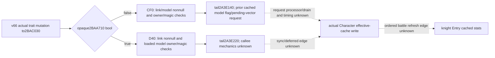
```mermaid
flowchart LR
    R["v66 actual trait mutation to2BAC030"] --> P{"opaque2BAA710 bool"}
    P -->|false| F["CF0: link/model nonnull and owner/magic checks"]
    P -->|true| T["D40: link nonnull and loaded model owner/magic checks"]
    F --> Q["tail2A3E140; prior cached model flag/pending-vector request"]
    T --> U["tail2A3E220; callee mechanics unknown"]
    Q -. "request processor/drain and timing unknown" .-> C["actual Character effective-cache write"]
    U -. "sync/deferred edge unknown" .-> C
    C -. "ordered battle refresh edge unknown" .-> E["knight Entry cached stats"]
```

Both matched branches pass the current model in RDX and `[[slot5C68C50]+A0]+CBD8` in RCX; failed owner/magic/link guards return without local writes. CF0 additionally checks the loaded model pointer for null; D40 has no separate model-null test. Neither leaf writes Character+EC, scratch+440 or Entry stats, nor directly calls the independently closed `28C3BC0/28C3F60` synchronous copy chain. Its scratch-ready condition cannot be attributed to these request leaves.

The [current-build skill-cache research](character-skill-trigger-readback-1.20.0.3-2026-10-04.md), previously pinned by B at SHA-256 `dac0f0c4d392fcc50a92074a16a2c48f838aeaf9979f2e4de860cb2929da00bf`, describes `2A3E140` setting model+2F4 and adding the model to a pending vector. That existing source fact is reused, without reading its body again. `2A3E220`, the actual request-processing/drain caller and opaque predicate meaning remain specific next seams. They do not prove post-trait effective prowess or the Entry update day.

Evidence: [v67 source ROOT](Z:/ck3_mod_rewrite_process_assets/g2-resume-20261005/battle-trait-refresh-request-v67/source/ROOT-DELIVERY.json), 3927 B, SHA-256 `0772760f449eb93dff2689e2d3630375628ee63a6d7362a4db24d8e52e1217d4`, binds both cached target slices, the Mermaid tree, typed inputs and gaps. **Actual request targets ready=true; numeric SOURCE_READY=false.** Research increment complete, selected feature partial; no numeric model, case, live, full horizon, Monte Carlo or odds credit. `v67` names this work package; runtime adoption and commit/push require Root's separate actual receipt.

## Actual request queue transition increment (2026-10-05, v68 A)

Status: **research**, 2026-10-05 / 2026-W41. Queue core control/field writes are source-closed; numeric callback readiness remains **false**.

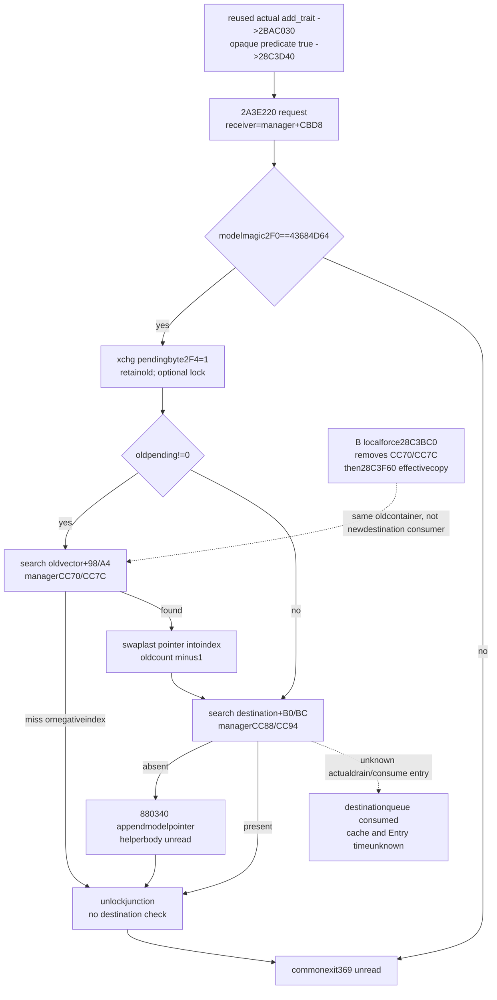
```mermaid
flowchart TD
    T["reused actual add_trait ->2BAC030
opaque predicate true ->28C3D40"] --> R["2A3E220 request
receiver=manager+CBD8"]
    R --> M{modelmagic2F0==43684D64}
    M -->|yes| P["xchg pendingbyte2F4=1
retainold; optional lock"]
    M -->|no| E["commonexit369 unread"]
    P --> O{oldpending!=0}
    O -->|yes| F["search oldvector+98/A4
managerCC70/CC7C"]
    F -->|miss ornegativeindex| U["unlockjunction
no destination check"]
    F -->|found| S["swaplast pointer intoindex
oldcount minus1"]
    O -->|no| D["search destination+B0/BC
managerCC88/CC94"]
    S --> D
    D -->|absent| A["880340 appendmodelpointer
helperbody unread"]
    D -->|present| U
    A --> U
    U --> E
    B["B localforce28C3BC0
removes CC70/CC7C
then28C3F60 effectivecopy"] -. "same oldcontainer, not newdestination consumer" .-> F
    D -. "unknown actualdrain/consume entry" .-> C["destinationqueue consumed
cache and Entry timeunknown"]
```

The actual request has two adjacent PE unwind fragments: `2A3E220..240` (32 bytes) and `2A3E240..369` (297 bytes). The second's `UNW_FLAG_CHAININFO` links the first, so this is one logical request core with two physical code reads. The shared exit at `2A3E369` is not read, and this packet does not claim a complete function body. No direct helper body was read.

With model magic valid, the core exchanges its pending byte at `+2F4` with1. When the old byte is nonzero it first searches the receiver's old vector `+98/+A4`; a miss exits before considering the destination. A found model is removed by replacing its slot with the last pointer and decrementing the count. Oldzero, or completed removal, proceeds to destination vector `+B0/+BC`; the append helper is called only when the search result represents absence. Both vectors contain model pointers with stride8 and signed32 counts. Optional lock-like indirect calls use receiver `+C8` under byte `+D8`.

The receiver is the manager at `[[slot5C68C50]+A0]` plus `CBD8`. Its old vector therefore maps exactly to manager `CC70/CC7C`, the same container removed by B's independently sealed local forced-refresh path. The **destination** is manager **`CC88/CC94`**. B's `28C3BC0` removal of the old vector does not prove consumption of this destination. The opaque `2BAA710` predicate is not labeled fast, delayed or immediate.

Read cost: two physical code fragments329 bytes,408 bytes of recorded `.pdata` reads, and36 bytes of new necessary chained-unwind metadata,773 bytes total. No generic/xref scan, old body/test reread, third physical code span, helper body, game/SDK/liveRPM/window action or full EXE hash was performed. There was no harness failure.

Exact helper next entries are `A11F60` (pointer search) and `880340` (append). The highest-value remaining seam is the actual consumer of destination vector `CC88/CC94` and its cache-refresh callback/frame. No pending flag or enqueue operation stands in for completed Character effective stats, a knight Entry refresh, or an observable current MCP queue field. No numeric module/API or fixture is released.

Sealed request source: `Z:/ck3_mod_rewrite_process_assets/g2-resume-20261005/battle-trait-refresh-queue-v68/request-source/ROOT-DELIVERY.json`, SHA-256 `195522878ed84fe3570d640232eed2c00504a63dada86be68efcab57707ddaa7`. Independent B local removal source: `Z:/ck3_mod_rewrite_process_assets/g2-resume-20261005/battle-trait-refresh-queue-v68/drain-source/ROOT-DELIVERY.json`, SHA-256 `6258c204ee56640faed443e54305a7ee79fee15930103e0dbd576687bfbdc4e9`. This candidate appends A only; parent publication joins the B increment into one MOD path.

## Local old-queue consumer and remaining destination drain (v68 B)

The independently sealed B source identifies **`28C3BC0` as a local old-vector removal consumer**, using only the existing v64 cache/disassembly and no new EXE/header/pdata/xref read or body decode. On its matched-model path it calls `291C0D0`, searches manager `CC70/CC7C`, compacts later pointers other than the current model in original order, adjusts the tail storage/count, then tail-calls `28C3F60`. This is the explicit forced-refresh path's local order; it is not an automatic drain invocation.

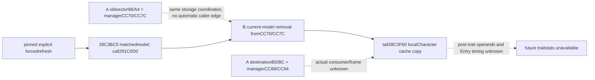
```mermaid
flowchart LR
    A["A oldvector98/A4 = managerCC70/CC7C"] -. "same storage coordinates; no automatic caller edge" .-> O["B current-model removal fromCC70/CC7C"]
    F["pinned explicit forcedrefresh"] --> C["28C3BC0 matchedmodel; call291C0D0"]
    C --> O
    O --> W["tail28C3F60 localCharacter cache copy"]
    N["A destinationB0/BC = managerCC88/CC94"] -. "actual consumer/frame unknown" .-> W
    W -. "post-trait operands and Entry timing unknown" .-> E["future traitstats unavailable"]
```

A's final core now proves the old-container binding that B had left provisional at its earlier seal. Its conditional old-queue swap removal and unique destination append are distinct from B's ordered local compaction. B has **no cached consumer pin for destination `CC88/CC94`**, nor an automatic parent/tick that invokes this forced path. The next high-value source seam is that destination's actual processing caller and admission/frame; a pending byte or queue move cannot stand in for completed effective prowess or six knight Entry attributes. Current effective integer0 remains legal; no predicted EC is derived from trait=True.

B [ROOT source](Z:/ck3_mod_rewrite_process_assets/g2-resume-20261005/battle-trait-refresh-queue-v68/drain-source/ROOT-DELIVERY.json):2612 B, SHA-256 `6258c204ee56640faed443e54305a7ee79fee15930103e0dbd576687bfbdc4e9`. Original A/B source bytes remain sealed. **QUEUE_CORE_CONTROL_SOURCE_READY=true; LOCAL_MODEL_VECTOR_CONSUMER_SOURCE_READY=true; numeric SOURCE_READY=false.** This research increment is complete and the feature remains partial, with no numeric model/API, case, live, complete horizon, MC or odds credit. Root adoption64–67 is independently recorded; this v68 publication has no supplied commit/push and claims no runtime change.

## v69 — actual modifier manager identity and initialization (2026-10-05 / W41)

Source status: **research**. `OWNER_TYPE_AND_INIT_SOURCE_READY=true`; destination drain, numeric callback and knight Entry timing remain partial. Exact build is CK3 **1.20.0.3**, frozen EXE SHA-256 `94B55397ABB687A3DCD436805A5D885E6BE90FA6C693FEB44A9E3BBEEADE02A6`.

Root adopted v68 at commit `8e723751bcf2bcbb2a4ad4406a612aa60dd63fb2`. This EOF increment preserves that source projection's exact 30,409-byte prefix (`43e632335cf50bea18c1d714cf4a7250f8774fa600282320d472116f34a642d6`).

One authorized instruction-boundary pass compared only exact memory displacements `CC88` and `CC94`. It found one matching store, `2ADCA38: mov [R15+CC88], R12`, inside `2ADC3D0..2ADE503`. The selected 8,499-byte body establishes `R15=RCX`, `R12=0` and storage initialization: old queue qwords `CC70/CC78` and destination qwords `CC88/CC90` are cleared. The `CC90` qword store also clears count `CC94`; direct `CC94` operand hits were zero. The body initializes mutex/flag storage as well. These are initialization effects. Relative subobject `+B0/+BC` consumers are outside this pass's exact targets, so zero further direct hits carries no broader absence conclusion.

The initializer installs primary vptr `47807A0` at its owner argument `+CBD8` (`2ADC97E`) and secondary vptr `4780670` at `+CBE0` (`2ADC98C`). Reachable COL metadata closes offsets 0 and 8 (`4E48C28` and `4E48C78`) and shared type descriptor `5A33B50`, literal `.?AVCModifierManager@@`. The actual manager class is **CModifierManager**. Its initialized queue coordinates match the existing request receiver's `+CBD8` / destination relative `+B0/+BC` layout. This package does not independently capture the initializer's caller binding its first argument to the live global owner.

Only table slot 0 targets were retained: primary `2AE2480`, secondary `2AE8088`. Their roles remain unestablished and their bodies were not read. No tick, destructor or queue consumer role is inferred from an address.

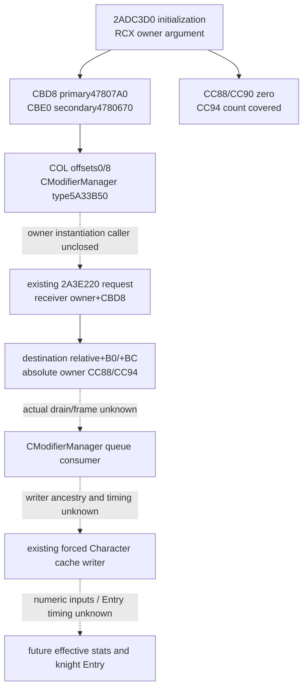
```mermaid
flowchart TD
    R["existing 2A3E220 request
receiver owner+CBD8"] --> Q["destination relative+B0/+BC
absolute owner CC88/CC94"]
    I["2ADC3D0 initialization
RCX owner argument"] --> V["CBD8 primary47807A0
CBE0 secondary4780670"]
    V --> T["COL offsets0/8
CModifierManager type5A33B50"]
    I --> Z["CC88/CC90 zero
CC94 count covered"]
    T -. "owner instantiation caller unclosed" .-> R
    Q -. "actual drain/frame unknown" .-> D["CModifierManager queue consumer"]
    D -. "writer ancestry and timing unknown" .-> C["existing forced Character cache writer"]
    C -. "numeric inputs / Entry timing unknown" .-> E["future effective stats and knight Entry"]
```

The calendar lane reused the sealed `battle-calendar-admission-v57/manager-source` receipt and source pins. That cache closes CombatManager's `22A1D75 -> 2AD8000` date edge and separate `2AD7F00 -> 258B510/264D480` preparation edge. It contains no concrete admission/consumer pin for this CModifierManager primary/secondary table. No additional calendar body or EXE span was read and no daily modifier-drain claim follows from the CombatManager evidence.

Evidence: `Z:/ck3_mod_rewrite_process_assets/g2-resume-20261005/battle-trait-refresh-queue-consumer-v69/xref-source/{ROOT-DELIVERY.json,SOURCE-RECEIPT.json,TREE.md,INPUT-CONTRACT.json,ACTUAL-OWNER-AND-XREF-LEDGER.json,QUEUE-OWNER-IDENTIFIERS.json,ACTUAL-READ-COST.json}`; cached-calendar boundary under the same package's `calendar-source/{ROOT-DELIVERY.json,CALENDAR-METADATA-AND-GAPS.json,TREE.md,SOURCE-PINS.json}`.

Actual cost: one exact-target `.text` instruction pass, 71,141,888 bytes in 16.169 seconds, plus 216 bytes of `.pdata`; one selected body, 8,364 newly read bytes plus 135 retained near-window bytes; 256 new reachable identifier metadata bytes. Total newly read EXE bytes: **71,150,724**. The second permitted body was unused. Calendar source added zero EXE/header/pdata/xref/body bytes. No full EXE hash, whole-text dump, generic callgraph, model, test, SDK, live RPM, game/window action or shared/Git mutation occurred.

Next source construction entry: finite method metadata at the now identified primary `47807A0` / secondary `4780670`, reusing slot 0 and RTTI. Root authorized up to 8 slots per table and at most two actual candidate bodies with existing relative `+B0/+BC` queue-use or forced-writer ancestry evidence. No further absolute `CC88` scan is planned. Numeric callback readiness remains false until actual destination consumption and attribute-input values are proved; no trait boolean is converted into an EC value.

## v70 — bounded CModifierManager method address map (2026-10-05 / W41)

Root adopted v69 at `99cf4f2d0c4888c8e2f07338369f6f07c87343ed`. This EOF source increment preserves its exact 35,040-byte projection prefix (`7cbd3c4d1fffeb9e7891586ae656ddb360af537ecc4850261fd34c2c2c3b28ad`). Exact CK3 **1.20.0.3** / frozen EXE SHA `94B55397ABB687A3DCD436805A5D885E6BE90FA6C693FEB44A9E3BBEEADE02A6` remains the source identity.

The finite metadata task read only the seven qwords after each known slot0: two 56-byte spans, **112 new EXE bytes** total. Prior cached heads supplied slot0, the image base and COL pointers. No PE header, new RTTI, executable section, xref or function body was read. `METHOD_ADDRESS_METADATA_READY=true`; consumer and numeric `SOURCE_READY=false`.

| Slot / offset | Primary `47807A0` | Secondary `4780670` |
| --- | --- | --- |
| 0 / `+00` (reused) | `2AE2480` | `2AE8088` |
| 1 / `+08` | `3F7E2D0` | `2A3D3C0` |
| 2 / `+10` | `2A3D370` | `9D09F0` |
| 3 / `+18` | `3F7E350` | `2A3DB50` |
| 4 / `+20` | `8522C0` | `1A2E130` |
| 5 / `+28` | `8522C0` | `855AB0` |
| 6 / `+30` | metadata boundary candidate `4E48908` | `8522C0` |
| 7 / `+38` | raw following value `2AE8124`, table assignment withheld | `2A3D380` |

The primary `+30` value points into metadata and is retained as an adjacent table-head candidate. Its COL was not read, and the following qword is not assigned to this primary table. Secondary continuation beyond slot7 is unread. All retained method roles remain unknown. Slot numbers and addresses establish neither admission, drain, tick nor destructor behavior.

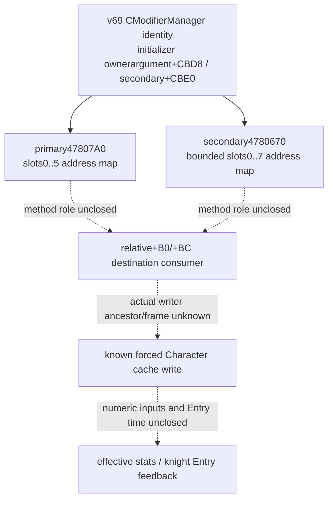
```mermaid
flowchart TD
    T["v69 CModifierManager identity
initializer ownerargument+CBD8 / secondary+CBE0"] --> P["primary47807A0
slots0..5 address map"]
    T --> S["secondary4780670
bounded slots0..7 address map"]
    P -. "method role unclosed" .-> Q["relative+B0/+BC destination consumer"]
    S -. "method role unclosed" .-> Q
    Q -. "actual writer ancestor/frame unknown" .-> W["known forced Character cache write"]
    W -. "numeric inputs and Entry time unclosed" .-> E["effective stats / knight Entry feedback"]
```

Evidence: `Z:/ck3_mod_rewrite_process_assets/g2-resume-20261005/battle-modifier-manager-consumer-v70/method-metadata/{ROOT-DELIVERY.json,BOUNDED-QWORD-CAPTURE.json,METHOD-ADDRESS-MAP.json,TREE.md,SOURCE-PINS.json,ACTUAL-READ-COST.json,EXACT-NEXT-PIN-RECIPE.json}`. The metadata packet's qualified consumer targets list is empty. A separate source lane is comparing these exact addresses with existing exact-build cached queue/forced-writer evidence; this metadata delivery supplies no result for that ongoing lookup.

The next bounded body recipe requires an actual receiver-relative `+B0/+BC` queue-use or existing forced-writer ancestor edge before promoting a target to consumer status. At most two qualified actual bodies are allowed. The constructor-to-live-global binding and calendar admission remain open as recorded in v69. No further absolute `CC88` scan, calendar search, numerical module, empty fixture, test, live RPM, SDK, game/window action, shared mutation or Git operation was performed for this packet.

## v71 — reachable method roles and direct primary helper (2026-10-05 / W41)

Root adopted v70 at `4850873e489ba92053ced5cb00ac03eea339f22c`. This source increment preserves its exact 38,196-byte projection prefix (`b269c64e820fbc41606b84855f1041c92f2bcb7435d71d7f281c9506712a84fc`). Exact CK3 **1.20.0.3**, frozen EXE SHA `94B55397ABB687A3DCD436805A5D885E6BE90FA6C693FEB44A9E3BBEEADE02A6` remains the identity.

A narrow lookup found no exact-RVA matches for the 10 new unique method targets in 18 specified exact-build cached text/pin files. Root explicitly authorized the now proved class/vtable-reachable targets as sufficient construction inputs for bounded body research. `.pdata` extents selected the two shortest exact-entry reachable methods: `1A2E130` (30 B) and `2A3D380` (34 B). Other pinned extents remain unread. No third body was captured.

`1A2E130`, registered at secondary table `4780670` slot4, preserves the incoming receiver, calls `[incoming vptr+38]` at `1A2E13C`, reloads the receiver's vptr, restores that receiver, then tail-jumps `[post-call vptr+48]` at `1A2E14A`. The first dispatch binds to `2A3D380` when the incoming vptr is the identified secondary table. This is source-closed two-stage virtual dispatch order; the body performs no direct queue, Character EC or Entry stat read/write.

The separately interpreted cached `2A3D380` body adjusts `RCX` from secondary to primary (`RCX-=8` at `2A3D389`), directly calls **`2A3E380`** at `2A3D38D`, and on normal return writes DWORD zero to `secondary+88` at `2A3D392`. That coordinate is `primary+90` (owner `CC68` under the identified embedding), distinct from destination queue `primary+B0/+BC`. The local field's meaning remains unknown. This body closes the direct primary-helper edge and reset order, with no direct queue consumption or `28C3BC0/28C3F60` call.

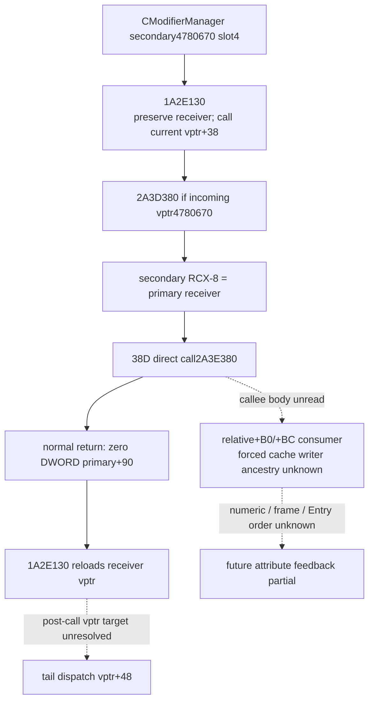
```mermaid
flowchart TD
    V["CModifierManager secondary4780670 slot4"] --> W["1A2E130
preserve receiver; call current vptr+38"]
    W --> B["2A3D380 if incoming vptr4780670"]
    B --> P["secondary RCX-8 = primary receiver"]
    P --> C["38D direct call2A3E380"]
    C --> Z["normal return: zero DWORD primary+90"]
    Z --> R["1A2E130 reloads receiver vptr"]
    R -. "post-call vptr target unresolved" .-> T["tail dispatch vptr+48"]
    C -. "callee body unread" .-> Q["relative+B0/+BC consumer
forced cache writer ancestry unknown"]
    Q -. "numeric / frame / Entry order unknown" .-> E["future attribute feedback partial"]
```

The direct next source entry is **`2A3E380` with primary CModifierManager receiver**. The generic wrapper's later `+48` slot is a secondary, conditional entry: `47806B8` only if the reloaded vptr retains `4780670`. Neither body directly stores a vptr, but the unread direct helper prevents a preservation claim. Its actual body is a more concrete next seam than assigning a calendar or consumer role to the unknown virtual slot.

Evidence: `Z:/ck3_mod_rewrite_process_assets/g2-resume-20261005/battle-modifier-manager-method-role-v71/source/{ROOT-DELIVERY.json,SOURCE-RECEIPT.json,TREE.md,A-FIRST-METHOD-ROLE.json,INPUT-CONTRACT.json,READ-COST.json}` and `cached-second-role/{ROOT-DELIVERY.json,README.md,OCT5-W41-FIELDS.json}`. The preceding scoped cached lookup receipt is under `battle-modifier-manager-consumer-v70/source-qualification`.

Actual new EXE reads total **1,124 B**: 1,044 B `.pdata`, 64 B unique code, 16 B unwind. Two functions shared an 8-byte unwind record which the capture script actually read twice; this repeated read remains recorded. B analyzed only A's cached 34-byte second body, adding zero EXE reads. `WRAPPER_ROLE_SOURCE_READY=true`, call/reset order is source-closed; destination drain, numeric callback, native date admission and Entry timing remain partial. No numerical module, fixture, test, SDK, live RPM, game/window action, shared mutation or Git operation was performed.

## v72 — direct helper reaches the existing Character cache writer (2026-10-05 / W41)

Sequential source base is the v71 EOF projection, 42,092 B, SHA `a73200bcf3dd95735fe6aa0470a469f3b37804c9c640a336d692b90313b7e9a1`; this increment preserves its exact prefix. The v71 adoption receipt was not supplied when this packet was sealed. Latest confirmed Root source commit is v70 `4850873e489ba92053ced5cb00ac03eea339f22c`. Exact CK3 **1.20.0.3**, frozen EXE SHA `94B55397ABB687A3DCD436805A5D885E6BE90FA6C693FEB44A9E3BBEEADE02A6` remains the identity.

The now direct primary helper `2A3E380..2A3E62A` is a complete 682-byte body. It preserves primary CModifierManager in `R12`; the global slot `5C68C50` supplies the separate owner through `+A0`. Three pointer inventories are traversed at owner `+140/+14C`, `+100B0/+100BC` and `+2EE60/+2EE6C`. These are owner coordinates, distinct from manager-relative destination `+B0/+BC`.

The third inventory uses 8-byte pointer rows. At `2A3E5B3`, the row pointer is passed in `RCX` to **`28C3F60`**, with raw `EDX=1` and `R8B=1`. The optional row `+1B0` / nested `+258` model-association block precedes that call; the direct call follows regardless of that block. Argument semantic names and the broader global model-pointer role remain unassigned.

This closes the source call chain **`2A3D380 -> 2A3E380 -> 28C3F60`** from a registered manager method to the existing conditional Character cache writer. Reuse v64's sealed `28C3F60` evidence: its non-null scratch preparation path copies scratch `+408` to Character `+D0` and scratch `+418` to Character `+E0`, including Character `+EC`. The writer and preparation kernel were not recaptured or redecoded. The new caller edge supplies no numeric future EC value or calendar admission proof.

The main body has no direct manager `+B0/+BC` operand, no model `+2F4` access and no queue search, deduplication or per-entry removal. It does not directly read old manager `+98` data. At the end it calls `22C0C20` with manager `+60/+6C`, then clears DWORD manager `+6C/+A4/+104/+EC`. The known old-queue count `+A4` is thus zeroed. **Manager `+EC` is a different object field from Character `+EC`**; this ending reset is not a prowess-value write. Owner `+100B0/+100BC` similarly is not the pending destination queue merely because the suffix resembles `B0/BC`.

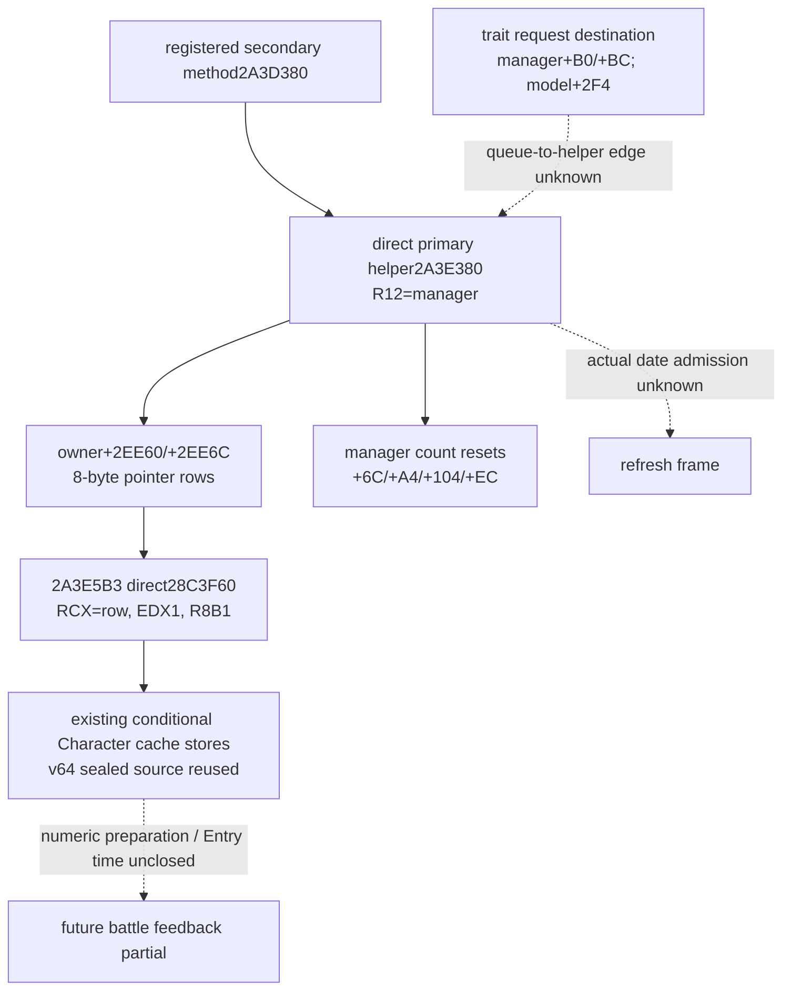
```mermaid
flowchart TD
    S["registered secondary method2A3D380"] --> H["direct primary helper2A3E380
R12=manager"]
    H --> I["owner+2EE60/+2EE6C
8-byte pointer rows"]
    I --> W["2A3E5B3 direct28C3F60
RCX=row, EDX1, R8B1"]
    W --> C["existing conditional Character cache stores
v64 sealed source reused"]
    H --> Z["manager count resets
+6C/+A4/+104/+EC"]
    Q["trait request destination
manager+B0/+BC; model+2F4"] -. "queue-to-helper edge unknown" .-> H
    H -. "actual date admission unknown" .-> D["refresh frame"]
    C -. "numeric preparation / Entry time unclosed" .-> E["future battle feedback partial"]
```

Evidence: `Z:/ck3_mod_rewrite_process_assets/g2-resume-20261005/battle-modifier-manager-direct-helper-v72/source/{ROOT-DELIVERY.json,SOURCE-RECEIPT.json,TREE.md,A-CONTROL-ROLE.json,INPUT-CONTRACT.json,READ-COST.json}` and `cached-queue-role/{ROOT-DELIVERY.json,README.md,OCT5-W41-FIELDS.json}`. Existing writer source receipt: `battle-phase-event-trait-callback-v64/trait-caller-source/ROOT-DELIVERY.json`, SHA `8bbb9fea208b45e861612bf508a6fac583cb68abc83e88ccece71c619249c3bc`.

Actual new EXE reads total **770 B**: 682 B code, 60 B `.pdata`, 28 B unwind; 13 previously sealed `.pdata` rows were reused. B analyzed only the cached main ASM, adding zero EXE reads. The optional direct-callee body budget was unused because the actual writer target already had sealed evidence. `FORCED_CACHE_CALL_EDGE_SOURCE_READY=true`; destination consumption, trait-request-to-refresh timing, numeric preparation and Entry order remain partial. No model, fixture, test, current EC prediction, Entry-day claim, SDK, live RPM, game/window action, shared mutation or Git operation was performed.

Next source construction remains the actual relative destination `+B0/+BC` consumer and its admission. Registered, unread manager methods from v70 still provide bounded concrete entry points (`2A3D3C0`, `2A3DB50` with v71 pinned extents), without assigning a tick or consumer role in advance. The known reset helper's direct writer edge is adopted source knowledge rather than a guessed queue-drain completion.

## v73 — destination admission and old-pending processing (2026-10-05 / W41)

Sequential source base is v72's 46,564-byte EOF projection (`45b8e0112ce4bdcfacb44dd98bf103ed77072683cf680baee657f6779eb374f7`), preserved exactly. Root supplied v71 adoption prefix `5c1dc646` and reviewed/queued v72 adoption; no full or later commit is invented. Exact CK3 **1.20.0.3**, frozen EXE SHA `94B55397ABB687A3DCD436805A5D885E6BE90FA6C693FEB44A9E3BBEEADE02A6` remains the identity.

Two registered entries were uniquely captured using existing v71 `.pdata` pins: `2A3D3C0..2A3D52F` (367 B) and `2A3DB50..2A3DF6E` (1054 B). The first range is a **runtime fragment**, not a complete logical method: final `3D529` branches to uncaptured `3D5F5`, while fallthrough `3D52F` is also uncaptured. No return was captured. `WHOLE_FIRST_METHOD_SOURCE_READY=false`.

In the first fragment, the incoming receiver is secondary CModifierManager. Secondary `+A8/+B4` resolves to primary destination `+B0/+BC`, and secondary `+90/+9C` to old primary `+98/+A4`. At `2A3D41C`, direct helper **`9CE070`** receives `RCX=old vector descriptor`, `EDX=old count`, `R8=destination begin`, `R9=destination begin+sign_extend32(count)*8`. On normal return, `2A3D424` clears destination count `primary+BC`. The helper's range-transfer semantics are unread, so the argument/count-clear proof does not assert a completed copy.

The following captured old-vector pass stably compacts rows using model `+8` owner, owner magic `+1C=43686172`, full ID `+18!=-1`, and qword `+1D0=0`. The qword's meaning is unassigned; no alive, incapable, prowess or knight-detach predicate is proved. The fragment then starts bounded progress setup and exits the captured range through the two explicit continuations above.

The second body is an actual old-pending processing wrapper. It reads old primary `+98/+A4`. A saved prefix N from primary `+84`, paired with 16-byte rows at primary `+78`, drives `291CF50(model, paired argument)` calls for the first N old models. After paired dispatch/cleanup (`2A40E60`, `22C0C20`, paired count zero), remaining models N..M-1 reach **`291C0D0`**. The current old vector is then passed to **`2A41170`**. These workers remain unread. Later post-helpers run, primary `+EC/+104/+A4` are zeroed and the function tail-jumps to `2A3D630(primary)`.

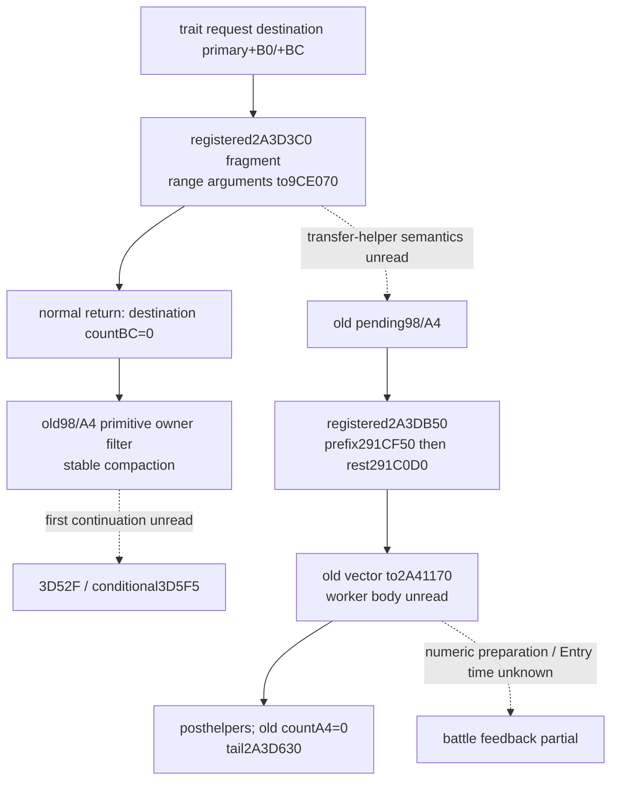
```mermaid
flowchart TD
    Q["trait request destination primary+B0/+BC"] --> A["registered2A3D3C0 fragment
range arguments to9CE070"]
    A --> Z["normal return: destination countBC=0"]
    Z --> F["old98/A4 primitive owner filter
stable compaction"]
    F -. "first continuation unread" .-> C["3D52F / conditional3D5F5"]
    A -. "transfer-helper semantics unread" .-> O["old pending98/A4"]
    O --> P["registered2A3DB50
prefix291CF50 then rest291C0D0"]
    P --> W["old vector to2A41170
worker body unread"]
    W --> R["posthelpers; old countA4=0
tail2A3D630"]
    W -. "numeric preparation / Entry time unknown" .-> E["battle feedback partial"]
```

All normal conditional branches in the second captured body stay within its extent; its final tail target is an explicit external callee. Cached unwind flags2 identify handler `4225A84`, which was not followed; there is no CHAININFO. Neither captured body directly accesses model `+2F4`, and the second has no direct destination `+B0/+BC` or `28C3BC0/28C3F60` operand. Counter clears and model-worker calls do not prove the entire trait-to-numeric/cache/Entry transition or daily admission.

Evidence: `Z:/ck3_mod_rewrite_process_assets/g2-resume-20261005/battle-modifier-manager-pending-consumer-v73/source/{ROOT-DELIVERY.json,SOURCE-RECEIPT.json,TREE.md,A-FIRST-ADMISSION-ROLE.json,INPUT-CONTRACT.json,READ-COST.json}` and `cached-pending-role/{ROOT-DELIVERY.json,README.md,OCT5-W41-FIELDS.json}`. Actual new EXE reads: **1477 B = 1421 B code + 56 B necessary unwind**, with zero new `.pdata` search/read; cached row pins were reused. B interpreted only cached second-body ASM, with zero additional EXE read. The two-body budget was exhausted without following other bodies.

Source-ready components now include destination argument admission, destination count clear and old-pending wrapper order. Full range-transfer semantics, first-method continuations, pending worker effects, calendar timing, future numeric values and Entry order remain partial. Concrete next source entries are `9CE070`, reachable continuations `2A3D52F/2A3D5F5`, and old-queue worker `2A41170`; these are actual calls/branches, not a generic search plan. No model, test, SDK, live RPM, game/window action, shared mutation, Git operation, current EC prediction or Entry-day claim was produced.

## v74 — concrete destination transfer and invocation progress (2026-10-05 / W41)

Sequential source base is v73's 51,218-byte EOF projection (`7e02654f6abaea66a16065b46b128a1e3483556331fc7310b19d8eb9f3556666`), preserved exactly. Root supplied actual v72 adoption/push `753c617cf35c12f6c8e4e39fbe555feeddcdef78`; v73 adoption was queued at this seal. Exact CK3 **1.20.0.3**, frozen EXE SHA `94B55397ABB687A3DCD436805A5D885E6BE90FA6C693FEB44A9E3BBEEADE02A6` remains the identity.

Two logical source scopes were read: the actual range helper `9CE070`, and continuations of registered manager method `2A3D3C0`. Necessary `.pdata`/CHAININFO pins prove physical fragments belong to those same logical functions. The helper has four fragments, `9CE070..9CE08B` (27 B), `9CE08B..9CE187` (252 B), `9CE187..9CE1CE` (71 B), and `9CE1CE..9CE1CF` (1 B). The first-method continuations are `2A3D52F..2A3D5F5` (198 B) and `2A3D5F5..2A3D623` (46 B). Their CHAININFO points to the existing first fragment `2A3D3C0..2A3D52F`; its 367 B source is reused without recapture. `FIRST_LOGICAL_NORMAL_CONTROL_READY=true` now resolves v73's two uncaptured normal continuations; it does not close the called bodies.

The range helper orchestrates an 8-byte pointer-vector insertion. An empty incoming range returns immediately. Otherwise incoming count is the arithmetic shift `wrap64(end-begin)>>3`, and new count is `wrap32(old_count+incoming_count)`. At the actual `2A3D41C` callsite, insertion position equals old queue count. The growth branch calls allocator interfaces and copy-shaped `4226880` for prefix, incoming range and suffix, then writes vector data/capacity/count. Here suffix length is zero. The capacity-sufficient branch calls `4226880(destination=old_end,source=incoming_begin,bytes=range_bytes)`, updates count, and calls `86E500(first=insertion_position,middle=old_end,last=new_end)`; this callsite has `first==middle`. Allocator, `4226880`, `86E500` and float growth-coefficient leaf `49F6400` were not followed. Helper normal control and vector-write orchestration are closed; those primitive implementations remain explicit leaves.

Consequently the first method's existing destination `primary+B0/+BC` input has a concrete range-insertion call into old `primary+98/+A4`, followed by the already captured destination count clear at `2A3D424`. The old-vector primitive owner filter and stable compaction are reused. This is an actual admission operation when the registered method runs; its external invocation frequency is not proved.

The newly captured continuation operates on **16-byte pairs** at secondary `+58/+64 = primary+60/+6C`. Progress is secondary `+88 = primary+90 = GameData+CC68`. Initial carry `R12D=0` and invalid counter `R15D=0` come from the existing first-fragment pins. The scan starts at `wrap32(min_signed32(wrap32(progress+1000),count)-1)` and descends while the index is at least reloaded signed progress. Each row uses model-to-Character primitive checks: a non-null model, owner magic `+1C=43686172`, full ID `+18!=-1`, and qword `+1D0=0`. No alive, incapable, death, prowess or knight-detach interpretation is assigned to these checks.

An invalid row increments the counter, calls `2A3FEA0` with current/last 16-byte pair addresses, makes opaque object callbacks (`vptr[0]` with `EDX=0`, and another object's `vptr+10` with `R8D=8`), then decrements pair count. The final progress candidate is `wrap32(latest_progress-invalid_count+1000)`; signed candidate greater than or equal to current pair count selects zero. Progress is stored before the actual final tail **`2A3EF00(primary)`**. These called targets remain unread.

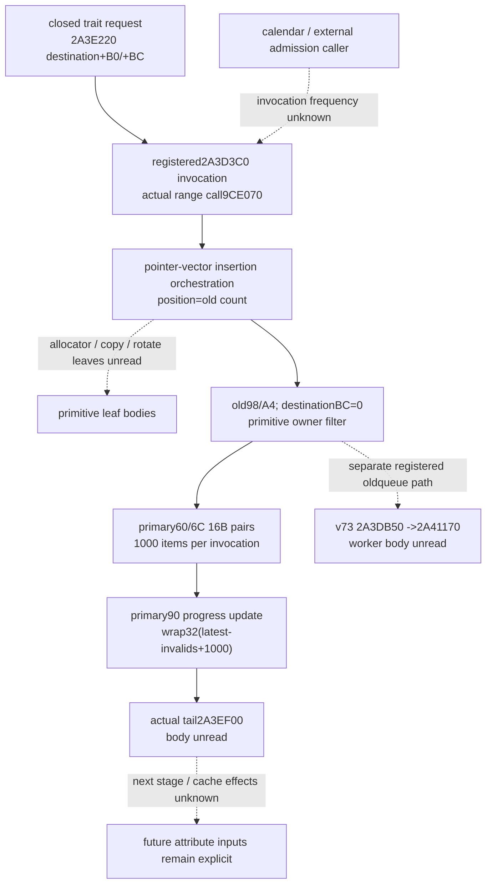
```mermaid
flowchart TD
    T["closed trait request
2A3E220 destination+B0/+BC"] --> I["registered2A3D3C0 invocation
actual range call9CE070"]
    I --> H["pointer-vector insertion orchestration
position=old count"]
    H -. "allocator / copy / rotate leaves unread" .-> L["primitive leaf bodies"]
    H --> O["old98/A4; destinationBC=0
primitive owner filter"]
    O --> B["primary60/6C 16B pairs
1000 items per invocation"]
    B --> P["primary90 progress update
wrap32(latest-invalids+1000)"]
    P --> R["actual tail2A3EF00
body unread"]
    R -. "next stage / cache effects unknown" .-> E["future attribute inputs remain explicit"]
    C["calendar / external admission caller"] -. "invocation frequency unknown" .-> I
    O -. "separate registered oldqueue path" .-> W["v73 2A3DB50 ->2A41170
worker body unread"]
```

The earliest closed cadence input is **1000 items per invocation**, together with progress/count integers. No GameDate, day/hour delta or call frequency was observed in this method, so this is not proof of a daily refresh. Neither continuation directly reads model `+2F4` or invokes the forced Character cache writer. The separate v72 `2A3D380 ->2A3E380 ->28C3F60` edge remains valid cached knowledge; no new causal edge from this admission tail to that writer, numeric attribute result or knight Entry-day update is claimed.

Evidence: `Z:/ck3_mod_rewrite_process_assets/g2-resume-20261005/battle-modifier-manager-destination-admission-v74/source/{ROOT-DELIVERY.json,SOURCE-RECEIPT.json,TREE.md,READ-COST.json}` and `cached-admission-role/{ROOT-DELIVERY.json,TREE.md,ROLE.json,OCT5-W41-FIELDS.json}`. Actual new EXE reads: **851 B = 595 B code + 132 B exact `.pdata` rows + 124 B necessary unwind**, across two logical bodies and six physical code fragments. B interpreted cached continuations only, with zero new EXE read. An attempted cached-row lookup raised FileNotFound before any EXE read; the corrected single 12 B metadata read is included in the cost and the attempt is retained by source A.

Readiness advances to range-insertion orchestration, complete first-method normal control and concrete invocation progress. Primitive leaf implementations, actual `2A3EF00` next-stage effects, old worker `2A41170`, external calendar admission, future numeric values and Entry update order remain partial. Those two direct targets are concrete next source entries. No numerical module, test, SDK, live RPM, game/window action, shared mutation, Git operation, current EC prediction, native date or Entry-day claim was produced.

## v75 — pending-object preparation and actual range dispatch (2026-10-05 / W41)

Sequential source base is v74's 57,430-byte EOF projection (`c55df0cbb0409f79574fb143dfbd747d0d941c6930d2cc8719426e0c6155314c`), preserved exactly. Root supplied actual v74 adoption/push `cd0acf19a68cdbc42ce20deed226e53e9e7b8c84`; the frozen G71 source includes it. Exact CK3 **1.20.0.3**, frozen EXE SHA `94B55397ABB687A3DCD436805A5D885E6BE90FA6C693FEB44A9E3BBEEADE02A6` remains the identity.

The two proven direct targets were captured once: primary-manager tail `2A3EF00..2A3F2D8` (984 B), and v73 old-pending worker `2A41170..2A41560` (1008 B). Both necessary unwind records have flags2 and handler `4225A84`; there is no CHAININFO. The handler and all called bodies remain unread. No further logical body, class scan or library leaf was followed.

The first body snapshots old pending count `primary+A4`, ensures 16-byte pair-vector capacity at `primary+78/+80`, and for each pending item allocates a `0x2F8` object through the primary `+20` allocator and calls actual initializer **`291BE30`**. It appends an `(allocator pointer, object pointer)` pair to `primary+78/+84`. The objects' full type and initializer effects are unassigned. The resulting pair count is **existing pair count plus pending count**; existing pairs are not assumed zero. This is concrete source-record construction before the following dispatches, rather than proof of a numeric attribute cache update.

It then calls **`2A3FCE0`** with old vector descriptor `primary+98`, and invokes two actual stages **`2A41560`** and **`2A41960`**. Native partition inputs are pair count `n=primary+84` and raw global integer `w=[5CBF1A8]+AC`, with divisor `wrap32(w+1)`. Each stage rereads its own current `n` and `w`; equality or constancy across the two calls is not assumed. Signed division truncates toward zero. Stage one uses `max_signed32(1,trunc0(trunc0(n/divisor)/3))` and raw flag1; stage two uses `max_signed32(1,trunc0(n/divisor))` and raw flag0. Raw `primary+10` is another opaque context input. The global integer's semantic role and these stage bodies remain unproved. This method has no direct destination `+B0/+BC`, progress `+90`, model `+2F4`, Character EC or Entry write, and no native date input.

The second body is an actual range-dispatch framework: incoming `RCX` is range context and `RDX` is the old-vector closure. It reads context start/end at `+8/+C`; equality returns. Native chunk count is `trunc_signed32(wrap32(chunk-start-1+end)/chunk)` and chosen workers are `min_signed32(context+10,chunk_count)`, with chunk from `context+14`. Mode `context+18==3` or chosen workers equal1 calls concrete serial target **`2A42110(original_closure,&[start,end])`**. Other paths copy the closure/context, including closure old-vector descriptor at `+40`, into a job capture with vptr **`4778480`**, then call **`3F91AF0`** through global `5CBF1A8` with the chosen worker argument and result storage. Its sixth argument is this dispatcher's incoming fifth argument at `[entryRSP+28]`, not saved incoming R9; its meaning and scheduler R8 are unassigned. The job's execute slot is not captured.

After dispatch, result records contain a controller at `+18` and payload at `+20`. With non-null controller and `DWORD[controller+60]==0`, the captured calls reach **`3F90A10(controller,payload+1C0)`**; subsequent **`3F5A090(controller)`** also has unknown effects. The observed resets concern capture ownership flags/pointers and temporary result counts; they do not directly reset manager queue count, model `+2F4` or Character EC. The old pending count clear in v73's separate registered processing wrapper remains cached evidence. No new callsite proves those result callbacks are attribute writers.

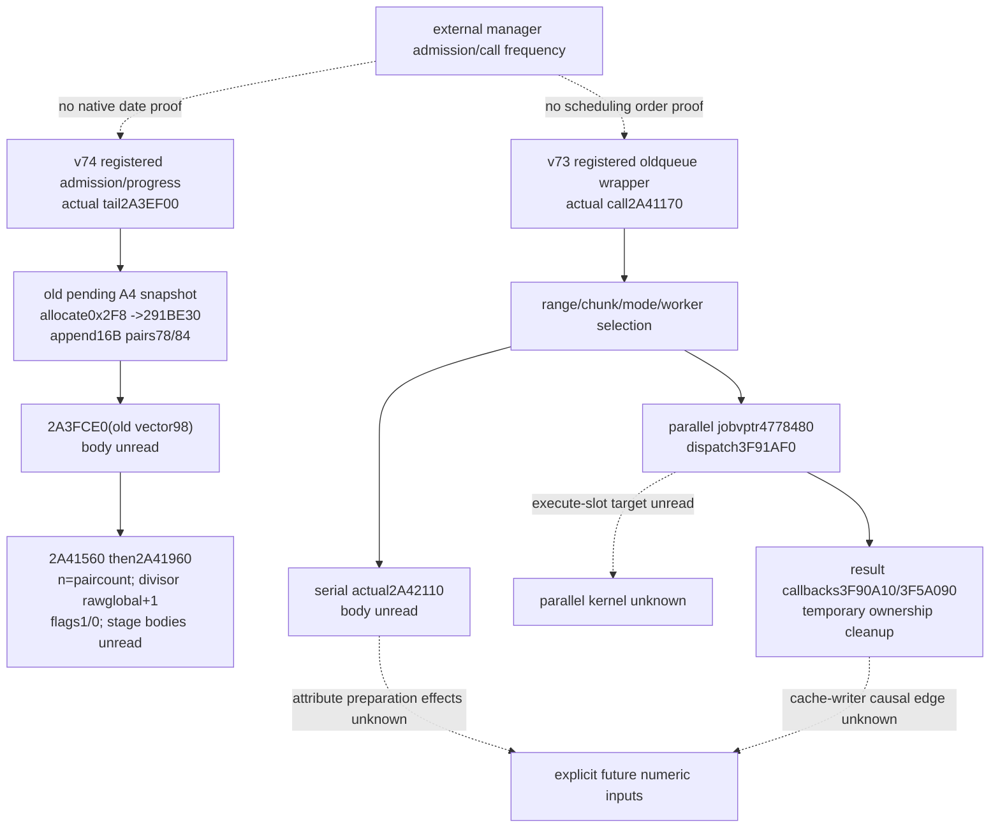
```mermaid
flowchart TD
    A["v74 registered admission/progress
actual tail2A3EF00"] --> P["old pending A4 snapshot
allocate0x2F8 ->291BE30
append16B pairs78/84"]
    P --> F["2A3FCE0(old vector98)
body unread"]
    F --> S["2A41560 then2A41960
n=paircount; divisor rawglobal+1
flags1/0; stage bodies unread"]
    O["v73 registered oldqueue wrapper
actual call2A41170"] --> D["range/chunk/mode/worker selection"]
    D --> K["serial actual2A42110
body unread"]
    D --> J["parallel jobvptr4778480
dispatch3F91AF0"]
    J -. "execute-slot target unread" .-> X["parallel kernel unknown"]
    K -. "attribute preparation effects unknown" .-> N["explicit future numeric inputs"]
    J --> R["result callbacks3F90A10/3F5A090
temporary ownership cleanup"]
    R -. "cache-writer causal edge unknown" .-> N
    C["external manager admission/call frequency"] -. "no native date proof" .-> A
    C -. "no scheduling order proof" .-> O
```

This advances the real pending-object and execution-dispatch source chain. Source-record construction, partition arguments and conditional serial/parallel entry selection are closed components. Their actual attribute preparation kernels, cache commit effects and external invocation cadence remain partial. The earliest cadence input remains v74's 1000-item per-invocation budget; this package adds integer range/chunk/partition inputs, not a day or hour. Current EC getters remain existing observations; no new freshness protocol or numeric inference is introduced.

Evidence: `Z:/ck3_mod_rewrite_process_assets/g2-resume-20261005/battle-modifier-manager-pending-dispatch-v75/source/{ROOT-DELIVERY.json,SOURCE-RECEIPT.json,TREE.md,READ-COST.json}` and `cached-worker-role/{ROOT-DELIVERY.json,TREE.md,ROLE.json,OCT5-W41-FIELDS.json}`. Actual new EXE reads: **2168 B = 1992 B code + 108 B exact `.pdata` rows + 68 B necessary unwind**, across two logical bodies and two physical code regions. A uniquely extracted both bodies; B interpreted only cached worker ASM with zero additional EXE read. No called body was followed.

Concrete next entries are **`2A42110`** for the old-queue serial kernel, **`291BE30`** for pending-object initialization, **`2A3FCE0`**, and stage entries **`2A41560/2A41960`**. The parallel job vptr `4778480` is a proven metadata entrance, with no execute-slot target invented. A future bounded scope can choose the kernel or constructor to reach the actual updater; these are actual source entrances rather than a generic scan. No numerical module, test, SDK, live RPM, game/window action, shared mutation, Git operation, current EC prediction or Entry-day claim was produced.

## v76 — actual serial callback and payload provenance (2026-10-05 / W41)

Sequential source base is v75's 63,838-byte EOF projection (`3fdbec4e130eefa4c976954fd957b086a1c2ae93afc5c3cf71390dad18d41869`), preserved exactly. Root supplied actual v75 adoption/push `b9d8f0607fc08d206f031a5dc30d6d961471beec`. Exact CK3 **1.20.0.3**, frozen EXE SHA `94B55397ABB687A3DCD436805A5D885E6BE90FA6C693FEB44A9E3BBEEADE02A6` remains the identity.

The proven v75 serial edge `2A41544 ->2A42110` was followed to exact body `2A42110..2A42291` (385 B). Its normal return is `2A42290`; all normal branches remain inside this range. Necessary unwind flags2 identify handler `4225A84`, unread, with no CHAININFO. The second conditional target `291BE30` was not read: this body does not dereference the allocated `0x2F8` objects, so their initializer does not resolve its current receiver.

The body is a **per-index callback wrapper**. Incoming RCX is the original closure, preserved in R13; RDX points to signed DWORD start/end. It returns when start equals end. Otherwise EBX is the current index, incremented with wrap32 after each iteration until equality with end. There is no less-than termination check. This is the observed native loop, with no replacement model or new guard.

Each iteration reloads qword `[original_closure+40]` as a captured-vector pointer. The callable header contains a payload pointer and the actual code address **`2A43CA0`**. That code address is produced by `LEA` at **`2A4214E`** (`nextIP2A42155 + displacement1B4B`). The three-qword payload is precise:

| Payload offset | Actual value | Proven dereference / meaning |
|---|---|---|
| `+0` | address of a local pointer | local pointer value is **the address `original_closure+48`**, rather than the qword stored there; property meaning unknown |
| `+8` | qword `[original_closure+40]` | captured-vector pointer; element semantics unread |
| `+10` | address of local signed32 index | current EBX index |

At **`2A42224`**, `3978C20` receives the copied callable header `{&payload, code=2A43CA0}`. That generic invocation interface was not followed; the callback's actual code address and inputs are already concrete without tracing framework bodies. The target `2A43CA0` itself remains unread.

The body also saves, installs and restores opaque scope state. Three separate `3978850` observations supply flag `+30` bit0; `397C0B0` returns opaque objects whose `+1C` fields receive the current index, sentinel `-1` and restored index. These receiver objects have not been bound to Character, so those writes are not Character magic or effective attribute cache writes. No attribute multiply/add, model `+2F4`, Character EC, knight Entry update or native date operand was found in this body.

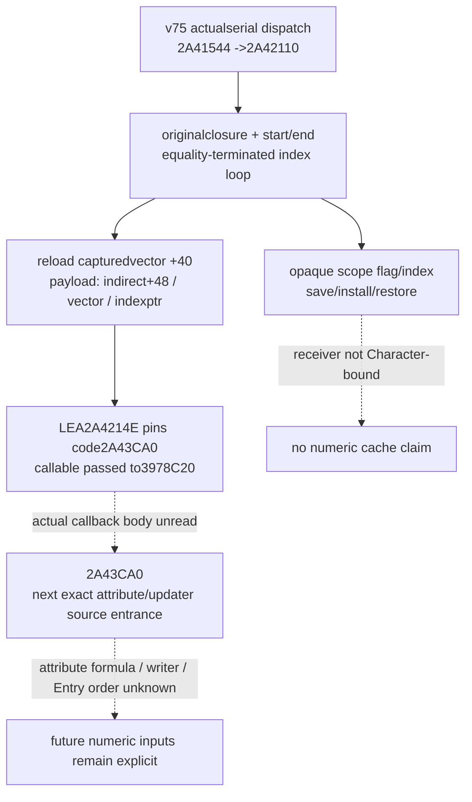
```mermaid
flowchart TD
    D["v75 actualserial dispatch
2A41544 ->2A42110"] --> R["originalclosure + start/end
equality-terminated index loop"]
    R --> P["reload capturedvector +40
payload: indirect+48 / vector / indexptr"]
    P --> C["LEA2A4214E pins code2A43CA0
callable passed to3978C20"]
    C -. "actual callback body unread" .-> W["2A43CA0
next exact attribute/updater source entrance"]
    R --> S["opaque scope flag/index
save/install/restore"]
    S -. "receiver not Character-bound" .-> U["no numeric cache claim"]
    W -. "attribute formula / writer / Entry order unknown" .-> F["future numeric inputs remain explicit"]
```

Evidence: `Z:/ck3_mod_rewrite_process_assets/g2-resume-20261005/battle-modifier-manager-attribute-kernel-v76/source/{ROOT-DELIVERY.json,SOURCE-RECEIPT.json,TREE.md,A-RECEIVER-CALLBACK-PINS.json,INPUT-CONTRACT.json,READ-COST.json}` and `cached-kernel-role/{ROOT-DELIVERY.json,TREE.md,ROLE.json,OCT5-W41-FIELDS.json}`. Actual new EXE reads: **441 B = 385 B code + 24 B exact `.pdata` rows + 32 B necessary unwind**, across one logical body and one physical region. Fifteen cached `.pdata` consults were reused. A uniquely captured the body and pinned receiver/callback ancestry; B interpreted only cached kernel ASM, with zero new EXE read. No other callee or framework body was read.

Readiness advances to a complete normal index wrapper and exact callback payload/code provenance. Real attribute preparation, numeric formulas, cache commit, calendar cadence and Entry update order remain partial. The preferred next source entrance is **`2A43CA0`**, proven by the captured code-address producer and callable descriptor. No numerical API plan is supplied because the attribute formula is not yet observed. No model, test, SDK, live RPM, game/window action, shared mutation, Git operation, current EC prediction or Entry-day claim was produced.

## v77 — queued trait callback to current effective-attribute numeric inputs (2026-10-05)

This source increment closes the actual queued callback receiver and the six-skill numeric operation on native prepared inputs. It does not turn a trait Boolean into future modifier rows. The frozen input remains CK3 1.20.0.3 / Steam 25652598, EXE SHA-256 `94B55397ABB687A3DCD436805A5D885E6BE90FA6C693FEB44A9E3BBEEADE02A6`. All new work was offline; current CK3, the bridge, public models and tests were unchanged.

### Actual receiver and context

- The serial callback `2A43CA0` dereferences the actual old-vector index to its pending model, reads `model+8` as Character, and tail-calls `28C3F60`. It supplies **DL=1**, with upper RDX bits still carrying index bits, and R8D=0; whole EDX=1 is not the contract.
- The existing cached writer slice now proves the new context question: `28C3F9B -> 28C3AE0(Character)`, then `28C3FA0 MOV RDX,RAX`, then `28C3FA6 -> 28C3D80(Character, context)`. The raw callback flag/index is not the D80 context.
- `28C3AE0` reads Character+1B0 scratch, scratch+258 model. A nonnull model whose +8 matches Character returns the **address** model+10. Otherwise it returns the initialized fallback context at RVA5D67B90; fallback initialization was not replaced by empty or zero properties.
- Context+0/+C are a source-ordered vector/count of 16-byte `{PropertyContainer*, Q100000 weight}` rows. Its aggregate PropertyContainer is embedded at context+68. A PropertyContainer has sorted U16 keys at +0, signed32 count at +C and parallel signed64 Q100000 values at +68. `2303700` implements native lower-bound lookup; an actual missing key is zero, while an unread input is still missing.

### Numeric contract

The full integer and fixed-point contract is sealed in [v77 ROLE.json](Z:/ck3_mod_rewrite_process_assets/g2-resume-20261005/battle-trait-effective-attribute-callback-v77/cached-writer-role/ROLE.json). Its plain component multiplication wraps signed64 before truncation, while percentage scaling uses the source fast/decomposed fixed multiply; the two operations must not be conflated. All points and cap comparisons are signed32, sums wrap32, and Q100000 conversion truncates toward zero.

For skill i=0..5, actual base points are Character+C0/C4/C8/CC/D0/D4. Components consume key i, category keys20+i/26+i/32+i/38+i, and factor key48+i; prowess additionally consumes key6. Absolute key13+i selects aggregate mode0 or the positive/negative weighted combination. Percentage key7+i then scales the wrapped base-plus-component value, with percentage<=-100000 yielding zero. Valid skill key mapper `291D0B0` preserves the incoming mode register.

Four ordinal multiplier getters read scratch metrics118/138/158/178 and overrides120/140/160/180, count the source threshold prefix, and apply the native nonnegative-override minimum. Their literal category meanings and threshold metric units remain unnamed. The factor getter reads signed32 scratch2F8 and denominator slot5C68CE8. Its **denominator-zero branch produces multiplier42949**, from zero-extended R11D=FFFFFFFF followed by native /100000; it is not -1 or an invented zero. Null-scratch factor supplies zero.

`28C3D80` computes skills in ascending order and writes scratch410+4*i. The runtime signed32 caps are, in skill order, slots **5C6A0D8 / 5C6A0D4 / 5C6A0BC / 5C6A0B8 / 5C6A0C0 / 5C6A0C4**. Each first stage is `raw<0 ? 0 : signed_min(raw, cap)`; there is no post-min zero clamp. For prowess, nonzero signed32 Character+F0 is wrap32-added **after this first clamp**, then the same signed branch and capC4 run again. A single clamp of raw5+F0 is a different operation. The existing writer copies the prepared six effective points to Character **D8/DC/E0/E4/E8/EC**. Auxiliary scratch430/438 and its opaque helpers remain outside this numeric subset.

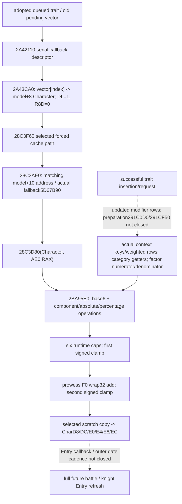
```mermaid
flowchart TD
  Queue["adopted queued trait / old pending vector"] --> Serial["2A42110 serial callback descriptor"]
  Serial --> Callback["2A43CA0: vector[index] -> model+8 Character; DL=1, R8D=0"]
  Callback --> Writer["28C3F60 selected forced cache path"]
  Writer --> Context["28C3AE0: matching model+10 address / actual fallback5D67B90"]
  Context --> D80["28C3D80(Character, AE0.RAX)"]
  D80 --> Raw["2BA95E0: base6 + component/absolute/percentage operations"]
  Inputs["actual context keys/weighted rows; category getters; factor numerator/denominator"] --> Raw
  Raw --> Caps["six runtime caps; first signed clamp"]
  Caps --> F0["prowess F0 wrap32 add; second signed clamp"]
  F0 --> Copy["selected scratch copy -> CharD8/DC/E0/E4/E8/EC"]
  Trait["successful trait insertion/request"] -. "updated modifier rows: preparation291C0D0/291CF50 not closed" .-> Inputs
  Copy -. "Entry callback / outer date cadence not closed" .-> Future["full future battle / knight Entry refresh"]
```

### Existing observation and concrete next interface

The current published `ck3_query_battle_terminal_transition_v1` already exposes `character_observations[*].current_person_state.effective_prowess.points` from signed32 Character+EC, including legal zero and negative values. That observed clipped value cannot recover base points, raw skill values, modifiers, caps or F0, and is not evidence of a same-frame queued callback.

The source-only [API plan](Z:/ck3_mod_rewrite_process_assets/g2-resume-20261005/battle-trait-effective-attribute-callback-v77/cached-writer-role/API-PLAN.json) proposes `compute_six_skill_cache_from_native_inputs_12003(inputs)`, yielding raw6, first_clipped6 and finalcache6 from explicit actual operands. The [same-query raw-input producer plan](Z:/ck3_mod_rewrite_process_assets/g2-resume-20261005/battle-trait-effective-attribute-callback-v77/observed-input-ledger/ACTUAL-RAW-NUMERIC-INPUT-PRODUCER-PLAN.json) uses an optional `current_person_state.raw_numeric_inputs` bundle with actual base6, context aggregate/weighted rows, ordinal getter outputs, numerator/denominator, six caps and F0. Both remain plans: no new producer, native field, public API, numeric model or focused test is implemented in this package.

Given an actual refreshed context, the bounded numeric operation is source-ready. A hypothetical newly added trait still needs its actual resulting context or a separately closed preparation implementation; freezing the old context does not complete future battle prediction. The next concrete preparation entrances are the already pinned `291C0D0` and `291CF50`. Parallel dispatch, full callbacks/lifecycle/memory, fallback initialization, auxiliary writes, Entry update timing and calendar frequency remain partial.

### Artifacts, cost and report status

- [A source receipt](Z:/ck3_mod_rewrite_process_assets/g2-resume-20261005/battle-trait-effective-attribute-callback-v77/source/numeric-chain/ROOT-DELIVERY.json): source receipt SHA `f2c7af12e852e3e4f5d90a4d35a640f9be100732e8326b5cbbd601d73caa9c75`; input contract SHA `0c6b1360094fdb1d01e318a76754b3c0c834c763af5878d747d52845826e3f74`.
- [B numeric/math receipt](Z:/ck3_mod_rewrite_process_assets/g2-resume-20261005/battle-trait-effective-attribute-callback-v77/cached-writer-role/ROOT-DELIVERY.json): ROLE SHA `d81b1584229e5111eb38b1587aa41aa442172c17d6cf9006eed582022043e4aa`; API-plan SHA `89a778c3b5ec8099a6d92b341c958ae14b8821323148103706028b486b60f2a7`.
- [C raw observer plan receipt](Z:/ck3_mod_rewrite_process_assets/g2-resume-20261005/battle-trait-effective-attribute-callback-v77/observed-input-ledger/ACTUAL-RAW-NUMERIC-INCREMENT-ROOT.json): producer-plan SHA `a9990ac41f6d5406573ed69f7d0d595144b907a1718459ea90018ffa9e1a2dd1`.
- [D sole affected-case plan](Z:/ck3_mod_rewrite_process_assets/g2-resume-20261005/battle-trait-effective-attribute-callback-v77/focused-fixture/CASE-PLAN.json) is unexecuted; it predates the final raw-input closure and retains that historical dependency state. No synthetic value is presented as a native parity sample.
- New frozen EXE input: **16 logical entries / 26 physical code captures / 4956 bytes** =3432 code windows +132 exact operand data +1032 pdata +360 unwind. Cached D80 reuse192 bytes; embedded24-byte cap table is already counted in code. No repeated EXE reads, whole scan or full hash. An earlier logical-count17 was corrected to16 with its attempt metadata retained.
- Oct5/W41: completed bounded current numeric source and input/API plans; readiness remains **research with this source unit ready**, with no implementation/static-ready/live upgrade. Tests0, old cases0, native parity0, game days0, SDK/RPM/window/Git0. Adoption/push belongs to Root after this EOF increment, sequential to adopted v76 `80f281b86ce47b606ec88dbb26f6b6a59337875a`.

## v79 — actual native-input numeric primitive and same-query reader (2026-10-05)

The v77 source contract now has a callable pure implementation and an external native-reader/wire candidate. `compute_six_skill_cache_from_native_inputs_12003` accepts `NativeSkillCacheInputs12003` or the normalized `current_person_state.raw_numeric_inputs` mapping. It returns six raw points, first-clipped points and final cache points, preserving signed native arithmetic and explicit partial inputs. Null scratch is the named source no-op, not a performed refresh. This package does not insert the primitive into a horizon or execute a Character/Entry write.

The existing `ck3_query_battle_terminal_transition_v1` gains an optional leaf at `character_observations[*].current_person_state.raw_numeric_inputs`. The external reader copies actual Character signed32 bases C0/C4/C8/CC/D0/D4, six bound runtime caps, F0, scratch factor numerator/current denominator, four source-closed readonly category getter outputs, and source-ordered aggregate/weighted property data. Matching-owner model+10 is an address; otherwise current fallback contents are copied. The fallback lazy initializer is not executed. Legal zero/negative values remain values, and unavailable nonempty storage remains partial. The tool name, existing current EC field, and public normalizer signature remain the same.

The source-only trait preparation work also made an independent local advance. Actual `291C0D0 -> 291D460` traverses Character trait IDs at F8/104, obtains resolved definitions and growth metadata, composes properties through `30E49F0 -> 30E7A30`, retains the composed container at model+248 and appends its weighted row through `2438850`. That writer updates aggregate context+68 through `2303120`. Unit-Q contributions to existing keys are native wrap64 additions. Selector A/B are bound to actual Character+B4/B0 ID reads; their business names are not inferred. Growth selection, extra classification, paired preparation, generic new-key storage/copy postimages and other preparation sources are still partial. No trait name or Boolean supplies an invented numeric effect.

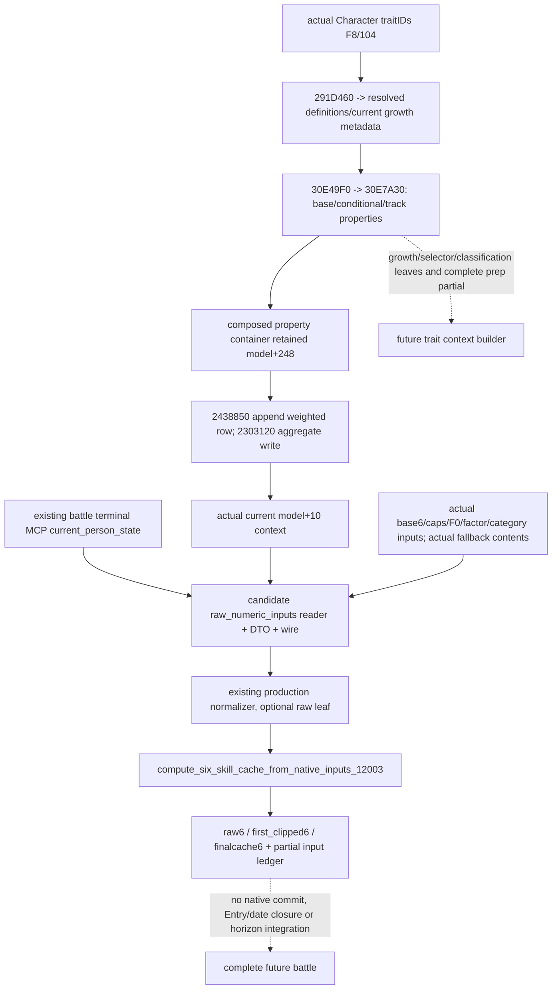
```mermaid
flowchart TD
  Traits["actual Character traitIDs F8/104"] --> TraitLeaf["291D460 -> resolved definitions/current growth metadata"]
  TraitLeaf --> Definition["30E49F0 -> 30E7A30: base/conditional/track properties"]
  Definition --> Store["composed property container retained model+248"]
  Store --> Append["2438850 append weighted row; 2303120 aggregate write"]
  Append --> Context["actual current model+10 context"]
  Definition -. "growth/selector/classification leaves and complete prep partial" .-> FutureContext["future trait context builder"]
  Query["existing battle terminal MCP current_person_state"] --> Reader["candidate raw_numeric_inputs reader + DTO + wire"]
  Context --> Reader
  Operands["actual base6/caps/F0/factor/category inputs; actual fallback contents"] --> Reader
  Reader --> Normalize["existing production normalizer, optional raw leaf"]
  Normalize --> Numeric["compute_six_skill_cache_from_native_inputs_12003"]
  Numeric --> Result["raw6 / first_clipped6 / finalcache6 + partial input ledger"]
  Result -. "no native commit, Entry/date closure or horizon integration" .-> Horizon["complete future battle"]
```

Exactly one new production-path test method was executed once: existing selected incapable request and independent current-person reader -> same-query production normalizer -> pure numeric primitive. Source-shaped synthetic inputs yield `raw=(-3,7,4,9,8,200)`, `first=(0,-5,4,9,8,120)`, `final=(0,-5,4,9,8,100)`. This distinguishes negative-raw zero from nonnegative-raw/negative-cap output, and the two prowess clamp stages from a single clamp. Current observed EC0/-3 is retained independently; failed current EC and a null raw prowess operand remain partial while five known modeled slots survive. Actor/date/revision and remaining Primary/Entry gaps are preserved. The case is not native parity or a fresh observed frame.

Validation: **GREEN 1/1**, 0 failures/errors/skips, elapsed **2.2829933s** including external overlay/import. First attempt was an import harness RED (`build_release` missing, tests0, 1.081532s); only the owned runner's readonly g72/tools path was corrected. B/C/test bytes were unchanged. No old case, SDK, RPM, window, game day, native build or horizon was executed by this pod.

Readiness: the pure carrier primitive is **static-ready** after that focused case. Native reader/serializer candidates require Root's native build and a real paused observation before any production-live claim. Current actual-input calculations do not construct hypothetical future trait context. Full callbacks/lifecycle/memory, Entry refresh timing, outer calendar cadence, fallback initialization and complete battle/Monte Carlo remain partial.

Delivery is eight repository paths: one new pure module, five reader/DTO/binding/wire/normalizer modifications, one new test, and this canonical EOF append. Code preimages are readonly g72 head `56423709cc9608f0b3b2e1b9533207f35622146b`; this topic follows v77 adopted commit `be347e99fb897f4af5c6c6adb525b964f048fba6` with its 77145-byte prefix preserved. Source A read **9 logical /16 physical /7921 new frozen EXE bytes** (7053 code+528 pdata+340 unwind), with no repeated EXE reads/whole scan/full hash.

Artifact entries:

- [A local trait source receipt](Z:/ck3_mod_rewrite_process_assets/g2-resume-20261005/battle-trait-native-input-primitive-v79/context-source/ROOT-DELIVERY.json); source SHA `c889894f2af3b27605f8df60d0334ca1110260703c818a110a5bdd504c082a66`, TREE SHA `9f6d7ef44a2b6ae76ba78cb12f28cbf0e271dd354465c7bd159a24455ae686d5`.
- [B primitive qualification](Z:/ck3_mod_rewrite_process_assets/g2-resume-20261005/battle-trait-native-input-primitive-v79/pure-numeric/QUALIFICATION-DELIVERY.json); module SHA `ae974dd51678fec9f05ea40c4991de30678ca356d30df298b97b88bb92a1810a`.
- [C observer qualification](Z:/ck3_mod_rewrite_process_assets/g2-resume-20261005/battle-trait-native-input-primitive-v79/raw-input-observer/QUALIFICATION-ROOT.json); normalizer SHA `500db71a844e8689dd859bf2d7371195275ca26de5b1e3c0902a5b048e2b2b60`.
- [D sole production case receipt](Z:/ck3_mod_rewrite_process_assets/g2-resume-20261005/battle-trait-native-input-primitive-v79/focused-fixture/ROOT-DELIVERY.json); execution receipt SHA `3afe297d45cc0ecbb40b859f4a4b1a48efaf90c8ebd37bf39053065e8209344c`.
- [Joint publication and Oct5/W41 fields](Z:/ck3_mod_rewrite_process_assets/g2-resume-20261005/battle-trait-native-input-primitive-v79/publication/ROOT-DELIVERY.json). Root owns adoption/build/paused verification/Git; this pod used external projections only.

## v80 — trait preparation inputs, sequential feedback and current-only query recipe (2026-10-05)

This is a source/API-plan increment after v79 adopted `64c1a452756a82c7c0085e87cb1f04c6950437e2`. The existing current-input primitive remains qualified; no new model, case, import, native build or SDK/game/window operation was run here. The pending g73 native build and paused read belong to Root and do not block this offline source work.

### Reset, transfer and growth input now have actual roles

Three independently sealed v79 continuations are incorporated as new source knowledge:

- `291C010` conditionally clears model+1C/+84/+EC counts when weighted-row count+1C is nonzero, then clears pending byte+2F4 with XCHG. It is not an unconditional empty-context constructor. Owned-container cleanup remains opaque. Source input:197 new frozen-file bytes.
- `291CF50` swaps two models' Character owners+8 and pending bytes+2F4, swaps context/keys/values storage under +238 locks, swaps allocator+240, then transfers owned-container storage. `2439690` has a source-closed direct weighted-row header branch (data+0/count+C/capacity+8 swap); other storage branches remain opaque. This function transfers models and does not recompute traits or attributes. Source input:979 bytes.
- The actual `28BB0F0` ABI is **RCX=Character, RDX=output header, R8=TraitDef**, correcting the earlier shorthand that omitted the hidden output argument. Character byte1A5!=0 or Def trackcount29C<=0 yields an empty header. Otherwise the matched trait's XP offset is the wrap32 sum of preceding resolved definitions' track counts in Character F8/104 order (`28BA230`), and the XP span comes from Character140/14C, bounded by the selected Def count. Source input:788 bytes. Search/registry utility leaves and future mutation of that vector remain separate gaps.

The former extra-8 address label `28BD84A0` is corrected to actual **2BD84A0**. Its existing exact .3 religion proof is reused: kind0 neutral, kind1 virtue, kind2 sin in the effective Rite map. The newly read `291B690` contributes the actual provider+1620/+1630 owner block at +40 with unit-Q weight; record_out is null and this path does not multiply by religious record18/20 weights. `2549810` now has a closed signed32 membership predicate: a hit in the primary sorted keyset or any secondary sorted keyset returns true. Actual selector objects/keys remain bound to their caller operands; this does not turn selector offsets into guessed Character fields. These two functions cost1065 new frozen-file bytes, with the old classifier untouched.

### Six-skill preparation has ordered context feedback

The newly consumed cached `291C0D0` tail proves an additional dependency. For i=0..5 it calls `2BA95E0(Character, current_context, i)`, then conditionally appends two derived blocks from provider **08FD4E0**:

1. First definition comes from the provider's F08 table, block at Def+40, with native guard **DWORD[Def+4C]!=0** and raw_i!=0; append weight is raw_i*100000.
2. Second block comes from the F58 table, with native guard **DWORD[block+C]!=0** and wrap32(raw_i+DWORD[5C69D1C])!=0; its weight uses that same raw_i plus the signed runtime offset.
3. Only then increment i. Each next raw skill sees both preceding context updates. The final completed context feeds v79's six-skill cache primitive; intermediate loop raw_i values are not its final raw6.

The guards are **!=0**, not >0; first Def+4C is not block+4C. C's already sealed observer blueprint retains its historical earlier wording, with the authoritative additive [predicate correction](Z:/ck3_mod_rewrite_process_assets/g2-resume-20261005/battle-trait-future-context-inputs-v80/observer-recipe/DERIVED-PREDICATE-CORRECTION.json) SHA `ac8f57f65a614b175596c99946b8ccf9abbe559e63ff48db111571ac76789a7d`. No code was generated from that earlier wording.

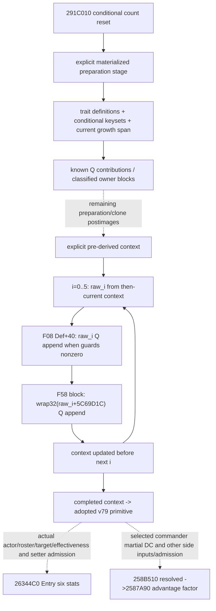
```mermaid
flowchart TD
  Reset["291C010 conditional count reset"] --> Base["explicit materialized preparation stage"]
  Base --> Traits["trait definitions + conditional keysets + current growth span"]
  Traits --> Local["known Q contributions / classified owner blocks"]
  Local -. "remaining preparation/clone postimages" .-> Pre["explicit pre-derived context"]
  Pre --> Raw["i=0..5: raw_i from then-current context"]
  Raw --> First["F08 Def+40: raw_i Q append when guards nonzero"]
  First --> Second["F58 block: wrap32(raw_i+5C69D1C) Q append"]
  Second --> Next["context updated before next i"]
  Next --> Raw
  Next --> Final["completed context -> adopted v79 primitive"]
  Final -. "actual actor/roster/target/effectiveness and setter admission" .-> Entry["26344C0 Entry six stats"]
  Final -. "selected commander martial DC and other side inputs/admission" .-> Advantage["258B510 resolved ->2587A90 advantage factor"]
```

The future `compose_trait_context_from_native_inputs_12003` [API blueprint](Z:/ck3_mod_rewrite_process_assets/g2-resume-20261005/battle-trait-future-context-inputs-v80/cached-future-context-role/API-PLAN.json) is unimplemented. It requires source-staged materialized baselines, actual definitions/selected rows/growth data, other preparation postimages, both six-block tables and runtime5C69D1C. Current final rows already contain old derived contributions; they cannot be carried as a pre-loop baseline. Conditional Character D8/DC/E0/E4/E8/EC values alone neither refresh Entry six stats nor resolve commander advantage. Their actor/target/effectiveness/context/setter dependencies are explicitly retained in [the source ledger](Z:/ck3_mod_rewrite_process_assets/g2-resume-20261005/battle-trait-future-context-inputs-v80/cached-future-context-role/DERIVED-LOOP-AND-DEPENDENCIES.json).

### Existing MCP works without a battle or terminal journal

The source-closed [current-query recipe](Z:/ck3_mod_rewrite_process_assets/g2-resume-20261005/battle-trait-future-context-inputs-v80/observer-recipe/CURRENT-QUERY-RECIPE.json) uses existing `ck3_take_snapshot({include_native_command_history:false})`, then existing `ck3_query_battle_terminal_transition_v1` with `prior_combat_id=null`, `subject_public_cunit_id=null`, `after_terminal_sequence=null`, `character_ids=[29829]` and `expected_revision` bound to the actual public snapshot revision integer. No live BattleID, CUnitID or old terminal scope is required. Other actual full CharacterIDs may be supplied. The [offline JSON argument renderer](Z:/ck3_mod_rewrite_process_assets/g2-resume-20261005/battle-trait-future-context-inputs-v80/observer-recipe/render_existing_query_arguments.py) only binds a saved public snapshot to arguments; no new tool or SDK action is introduced.

Read `battle_terminal_transition.character_observations[*].current_person_state.raw_numeric_inputs`; top-level character_observations mirrors the same rows. In character-only scope, `battle_terminal_transition_ready=false` is normal and is not a raw-input failure. Match the actual CharacterID and preserve source identities, signed zero/negative values, null/read-unavailable distinction and null-scratch no-op. Current EC versus computed final prowess may be reported as an actual comparison; equality is not assumed from unclosed cache/publication timing and does not create an Entry/date gate.

Root performs the fresh deployment and actual query. C is assigned the **sole original third MAIN consumer** after Root supplies its exact artifact path; it extracts raw inputs/current EC/source once and shares selected cached rows with A/B/D for pure comparisons. No old MAIN was reread and no actual SDK/RPM operation was delegated in this package.

### Readiness and delivery

v80 remains **research/source-ready local inputs and an actionable existing-query recipe**; v79's qualified current-input primitive is unchanged. Complete future context, Entry/advantage timing, lifecycle/callbacks, battle horizon and Monte Carlo remain partial. No new tests or live credit; v79's single GREEN case is reused by receipt. This EOF increment preserves the adopted83866-byte prefix. Additional frozen-file input totals **3029 bytes** (reset197+paired979+growth788+new classified/selector1065); no whole scan, full hash or repeated EXE capture.

The [joint receipt and Oct5/W41 fields](Z:/ck3_mod_rewrite_process_assets/g2-resume-20261005/battle-trait-future-context-inputs-v80/publication/ROOT-DELIVERY.json) link all source continuations, A/B/C contracts, the C predicate correction and D's sole necessary unexecuted plan. Root owns Git and real paused validation. Next source entrances are the explicit remaining preparation producers in B's ledger; next observable value is the g73 current raw-input frame through the existing recipe.

## v81: paused current numeric-input observation and one cached computation

This is the first actual paused current-input readback for the adopted v79 numeric observer. Root's existing character-only query selected Robert 29829 with both battle/unit scopes null; C alone read the original query artifact once, then A/B/D used C's extracted cache. No new SDK call, game day, window action, model change or fixture execution was performed by this package.

Observed native input leaf: `current_person_state.raw_numeric_inputs.status=available`, ready=true, scratch present=true, context source=`model_inline`. Base skills are `[4,9,6,6,10,6]`; all six loaded caps are 100; F0 adjustment is -9; category operands are `[1,3,1,0]`; ratio operands are 0/100. The current container supplies 71 ordered weighted rows and 160 aggregate keys. This frame is not the native null-scratch no-op branch.

The public response preserves snapshot `native:3`, public revision 2, native revision 3, date raw 53262000, paused=true and backend `native-headless`. Its version and EXE-SHA fields are null and remain null in the extracted evidence. Root's separately supplied deployment/build context is g73/454e, exact 1.20.0.3 frozen EXE SHA94B55397ABB687A3DCD436805A5D885E6BE90FA6C693FEB44A9E3BBEEADE02A6; it is not a value read from those null response fields. Root reported the native build GREEN (572 TUs, 64 jobs, 87 seconds), CI run37249487804 SUCCESS and the existing SDK56730 query bundle CLOSED0GREEN.

### Current arithmetic and observed scope

B called the adopted `compute_six_skill_cache_from_native_inputs_12003` once on C's cached public leaf: computed=true, no missing inputs, elapsed 0.0135913 seconds. Raw and first-clipped skill points are `[5,23,9,12,12,17]`; final points are `[5,23,9,12,12,8]`. The prowess component is positive11 plus `min(negative-2 + absolute5,0)`, yielding11; base6 produces raw17. The signed F0=-9 transforms first-clipped prowess17 to final prowess8. The actually observed Character EC is available8, giving a diagnostic difference of0. This comparison is evidence for this one current prowess pair, not a new equality gate.

Only Character EC was observed as a final native skill cache in this artifact. The remaining five final values are source-defined computation from actual input operands, not observed six-skill native parity. The current final container can include prior derived-loop contributions; these71 rows are not a pre-trait or pre-derived-loop baseline. F08/F58 provider contribution identity, future trait context construction, injury/health auxiliary writers, Entry six-stat setters and their date/admission timing remain separate dependencies.

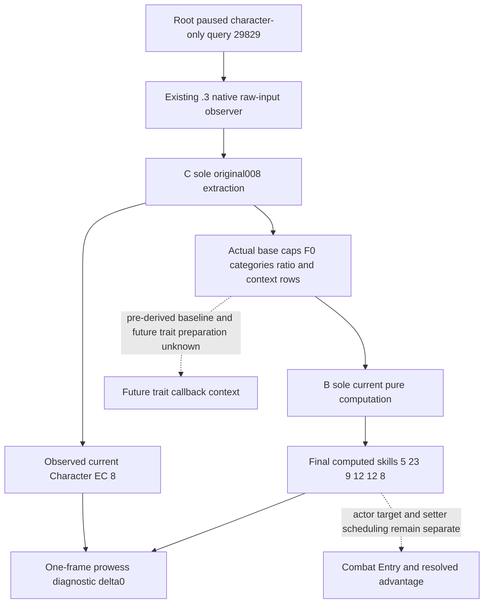
```mermaid
flowchart TD
  R[Root paused character-only query 29829] --> O[Existing .3 native raw-input observer]
  O --> C[C sole original008 extraction]
  C --> N[Actual base caps F0 categories ratio and context rows]
  N --> B[B sole current pure computation]
  B --> V[Final computed skills 5 23 9 12 12 8]
  C --> E[Observed current Character EC 8]
  V --> D[One-frame prowess diagnostic delta0]
  E --> D
  N -. pre-derived baseline and future trait preparation unknown .-> F[Future trait callback context]
  V -. actor target and setter scheduling remain separate .-> S[Combat Entry and resolved advantage]
```

### Artifacts and readiness

- Original Root artifact, consumed only by C: `Z:/ck3_mod_rewrite_process_assets/g2-resume-20261003/runtime-preparation/v68/root-results/actual-main-readback-01/008-ck3_query_battle_terminal_transition_v1.json`.
- Extracted complete cached rows: `Z:/ck3_mod_rewrite_process_assets/g2-resume-20261005/v81-actual-current-numeric/cache/SELECTED-CHARACTER-ROWS.json`,47355B,SHA818543c2c7d3e395c1a35ae674d4971e3acea0246d4c2e4486af322cb9817f9d.
- C extraction receipt: same directory `EXTRACTION-RECEIPT.json`,2538B,SHAb541b5db77ae0c9bef84ce043da0d688669625575d4314db969e795491039db1.
- Cached arithmetic and full component ledger: `Z:/ck3_mod_rewrite_process_assets/g2-resume-20261005/v81-actual-current-numeric/numeric-comparison/ACTUAL-CURRENT-COMPUTATION.json`.
- Joint publication/source and Oct5/W41 fields: `Z:/ck3_mod_rewrite_process_assets/g2-resume-20261005/v81-actual-current-numeric/publication/ROOT-DELIVERY.json`.

Readiness changes to **production-live primitive** for the current raw-numeric-input observation and one actual paused prowess diagnostic. The v79 prepared-input pure function remains static-ready with its already sealed focused case; no old case was rerun. This package does not make a production-live future trait transition, automatic Combat Entry refresh, six-skill parity, health callback, future-date horizon, win odds or complete battle claim. No source no-op frame was observed; the old focused source no-op contract remains the existing static evidence.

Root's actual checkpoint context is h8578/rawdate53262000,98380683B,SHA8ad3ef74f933dc42ce0e1f0db4bfeb85301954a19a0ee00bc231498ad771dfeb; actor alive, event null, same episode,0 new days, count4903. Source v80 was already adopted as5a9193d0; this package is a single EOF after its unchanged canonical postimage. Root remains the sole shared/Git/native-build/game operator.

Next value-bearing work keeps the current observed numeric primitive and the separate Entry observer available while closing exact trait-preparation source inputs. Existing source entrances are291D1D0/291E210/291D7E0/291DED0/291DCE0; no extra callback or future numerical effect is inferred from the current prowess match.

## v82: native preparation branch291D1D0 operands and bounded composition

The newly usable seam is the deterministic context contribution branch called at291C204. Its643-byte291D1D0 body was already frozen in v79; v82 reuses it and the exact .3 government/tier/provider bindings to publish a precise input contract. The actual caller passes RCX=model, RDX=Character[model+8]; its target context is model+10, after earlier preparation and before trait helper291D460 at291C28D. Source TREE and INPUT were sealed before the new model and observer were written.

### Native contributions and readonly input recipe

Initial government getter28C2E10 returns an actual object or actual fallback; its low32 flags at+40 bit14 control the initial contribution. When true, native signed index28AC6B0 chooses `qword[qword[provider+FA8]+8*sext32(index)]+40`, which is appended with Q weight100000. When false, this contribution is skipped; group counts are independently collected.

The object-ID header is `Character+1C0` carrier+1E0, or actual static header5439C88 when that carrier is null: data+0, signed count+C, DWORD FullIDs in native order. Registry5D1DAF8 resolves low24 index through its+20 16-byte rows/+2C capacity and checks record+10 FullID; failures use the actual fallback pointer at5D1DAE0. The associated objects are not given guessed business names.

For each object, native qualifiers require U8 record+1D8=0, U8+130=0, signed32+12C=-1, then a fresh government getter's bit14=true. Category is signed32 at `qword[record+48]+64`; native increments that counter with wrap32. Native does not clamp category. The bounded seven-counter projection supports contributing categories0..6; an observed category outside that range makes prepared counts unknown instead of silently dropping or clamping the object.

Groups0..6 contribute in order only when signed count>0. Source block is `qword[qword[provider+1000]+8*group]+40`, weight is sext32(count)*100000. Nonpositive counts skip; a valid empty property block produces no context row. U16 property keys and signed Q64 values preserve source order and legal zero/negative values. Existing property-container layout is data+0/count+C/values-pointer+68. Neither the new observer nor pure model calls291D1D0 or writer2438850.

```mermaid
flowchart TD
  A[291C204 model and actual Character] --> B[Cached291D1D0 branch]
  B --> G[Initial government flags40 bit14]
  G -->|true| S[Native tier index and providerFA8 selected block]
  S --> Q[Selected contribution weight100000]
  B --> H[Actual native FullID census and fallback records]
  H --> F[Three raw qualifiers and fresh government bit14]
  F --> C[Seven wrap32 counters]
  C --> P[Positive counts in group0..6 native order]
  P --> R[Provider1000 group blocks count times100000]
  Q --> W[Ordered weighted property contributions]
  R --> W
  W --> M[compose_context_branch_12003]
  M --> E[Existing-key fold with explicit pre291C204 context]
  M -. earlier preparation baseline absent .-> U[Contribution projection only]
  E -. new-key postimage and other preparation unknown .-> X[Full future context remains partial]
  M -. separately owned .-> K[Entry and advantage timing]
```

### Public seam and focused qualification

The existing `ck3_query_battle_terminal_transition_v1` publishes optional `current_person_state.context_branch_inputs`: actor/status/ready/reason, flag14, selected index and block, seven signed counts and seven actual blocks. Existing raw_numeric_inputs14 fields and readiness remain unchanged. The readonly producer follows actual FullID fallback and per-eligible-object government reads; missing source inputs stay null/partial. It does not publish a guessed prebranch baseline, add a tool, or turn a current count into a guaranteed future count.

New `battle_trait_context_branch_12003.py` exposes `compose_context_branch_12003(ContextBranchInputs12003|Mapping|None, *, prior_context=None)`. It computes selected then positive-group weighted contributions from native primitives, preserving independently known rows when other inputs are missing. A missing baseline is a separate context gap. Only an explicitly supplied materialized pre291C204 context can be folded; existing keys use the already closed native Q and wrap64 helpers. Unknown new-key storage postimages remain partial. Current final71 rows/160 aggregate keys are never a default baseline. The module does not repeat six-skill computation or claim complete future context.

D's sole new test method passed on its first execution:1/1 GREEN,0 errors/failures/skips,2.0041236000251956 seconds including the readonly g74 overlay/import. The production path imports C's new normalizer and B's new composer. Source-shaped synthetic inputs cover selectedQ/group0 2Q/group6 3Q order, zero and negative values, nonpositive count and positive-empty-block skips, explicit existing-key aggregate[-100000,-200000]/four weighted rows, independent missing-baseline gap, initial false flag with independently supplied groups, and out-of-range-category prepared counts retaining known selected contribution. Actor/date/EC metadata from v81 is a fixture anchor, not a new observed native frame. Native collector/serializer/counter wrap were not executed by this test; no old case or current six-skill calculation was rerun.

Readiness: **static-ready** for this bounded preparation contribution and its Python normalization/composition seam; native producer is CODE_READY pending Root's build and paused verification. The previously observed v81 current raw-numeric-input primitive remains production-live primitive. Future mutation/stability of branch operands, other preparation branches, observed prebranch baseline, new-key postimages, complete future six-skill cache, health/RNG and full battle/odds remain partial. Entry receiver and scheduling are separately owned by the casualty pod.

### Source, candidate and report receipts

External package is `Z:/ck3_mod_rewrite_process_assets/g2-resume-20261005/battle-trait-future-context-branch-v82/`. Source `source-lane/ROOT-DELIVERY.json` f576b6aa references INPUTcd1a0e9b/TREE5772a266/source receiptcab81894. Model `context-model/ROOT-DELIVERY.json`93624c2f pins module0f6ed58d and API; wire `context-wire/ROOT-DELIVERY.json`afa3d593 pins five existing-file candidates and normalizer4a4a4f52; focused `focused-fixture/ROOT-DELIVERY.json`1c869458 pins the single actual attempt and new test3795b343. Parent joint publication and Oct5/W41 fields are in `publication/ROOT-DELIVERY.json`.

Five existing wire files use readonly g74 HEAD1d8e8d3435b12f9eb3520b35be88efe8b80d9e44/attemptv69 preimages. Source-topic EOF uses the unchanged Root-adopted v81 canonical98048B/SHAf10ee3cb392a57a785f8809bfd0acba25d8f4bbf58c80b18d09bb9185e4fdbe3. The eight-path standard Git LF patch contains only those five files, the new composer, the one new test and this topic EOF; Root alone applies, commits, pushes, builds or queries CK3.

Retained actual costs/failures: A's cache lookup and getter capture ran concurrently, causing245 bytes of avoidable duplicate government evidence; no new getter capability is counted. Existing643-byte branch and tier/provider caches were reused. C's first projection-builder syntax harness RED occurred before script execution or candidate writes; the corrected second metadata attempt succeeded. D's new case had no RED. No safety audit or extra gate was introduced. Package operations are0 SDK/RPM/window/game/Git/shared edits/native builds/original008 rereads, with one new focused test and0 old tests.

Next concrete source work is another actual preparation caller291C282→291E210 (or the remaining291D7E0/291DED0/291DCE0 dependencies), after reusing any existing exact cache. This new branch contributes useful known input rather than freezing the old whole context or marking its missing earlier stage complete.

## v71/R44: actual paused qualification of the v82 context branch

Root's CLOSED0GREEN MAIN query observed Robert29829 alive and paused at date53262888, under its frozen g76 HEADcd14f96 / game1.20.0.3 deployment. Both published `current_person_state.context_branch_inputs` copies are identical and available/ready=true: flag14=true, selected_index=3, selected property count7, seven signed group counts `[0,0,5,1,0,0,0]`, seven group blocks with non-null blocks2 and3, and unavailable_reason=null. The selected U16 keys are `[76,156,159,192,209,375,591]`, with signed Q64 values `[-30000,200000,2000000,200000,10000,-1000000,100000]`. Group2 contains `111:5000,515:15000`; group3 contains `111:20000`. This qualifies the new current branch inputs as a **production-live readonly primitive**, rather than the earlier source-shaped fixture.

The frozen production `compose_context_branch_12003` was called once on this actual carrier, without prior_context. It returned three known contribution rows, in selected/group2/group3 order, with Q64 weights100000/500000/100000; one necessary integer row-weight result check passed. Their derived Q64 totals are `76:-30000,111:45000,156:200000,159:2000000,192:200000,209:10000,375:-1000000,515:75000,591:100000`. These are actual-derived contributions from the returned rows, not observed native context mutation. Production returns contributions_ready=true, aggregate_updates=[], combined_context=null and context_combination_ready=false, with `context_missing_inputs=[prior_context_pre291C204]`. Current/final context was not supplied as that prebranch baseline. No old case or six-skill computation was repeated; full future context, Entry, native writer and health/MC remain unqualified.

The packet exposes game_version/executable_sha256=null. The exact game SHA `94B55397ABB687A3DCD436805A5D885E6BE90FA6C693FEB44A9E3BBEEADE02A6`, episode `native-29829-2bc2d599f7f9`, R44/PID54844 and .3 identity come from Root's already frozen deployment environment, not an independent fingerprint in this domain packet. Root independently closed normal checkpoint h8713 at the same date, SHA `dfbb55ca31ad04cc65c55be21eb3ec58460017996e3acb0456cf020cbabe003e`,98360917 bytes, with0 additional simulation days for this query cut. That is a historical anchor: its normal save path was later overwritten, so the h8713 hash must not be asserted as the current file's hash.

Actual domain receipt: `Z:/ck3_mod_rewrite_process_assets/g2-resume-20261005/battle-trait-future-context-branch-v82/battle-context-v71-r44-actual-01/ROOT-DELIVERY.json`, SHAe015d2db6d3b8a74479a70fb3850d1c19196938313d72808097f9409a2eaa5d6. The sole original211083-byte read was sealed as `Z:/ck3_mod_rewrite_process_assets/g2-resume-20261005/battle-trait-future-context-branch-v82/battle-context-v71-r44-actual-01/FULL-CACHE.json`, SHA278494071d5f7e51b2fc8b78685ef3c6448b7e8949690be8ef3e942934297934; each of two useful cached lanes read it once. Root retains TOP/save ownership. This domain performed0 SDK/process/window/native-write/simulation/Git/shared edits; its source observation and actual-derived-contribution qualification do not close the missing prior baseline. Independent v83 prior-context source work remains separate.
