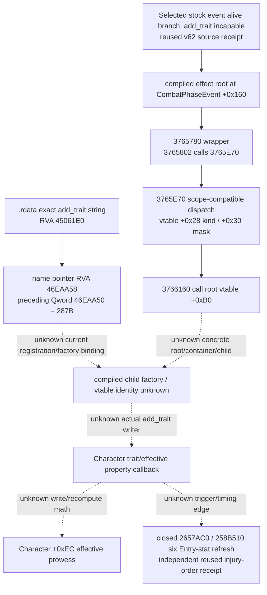
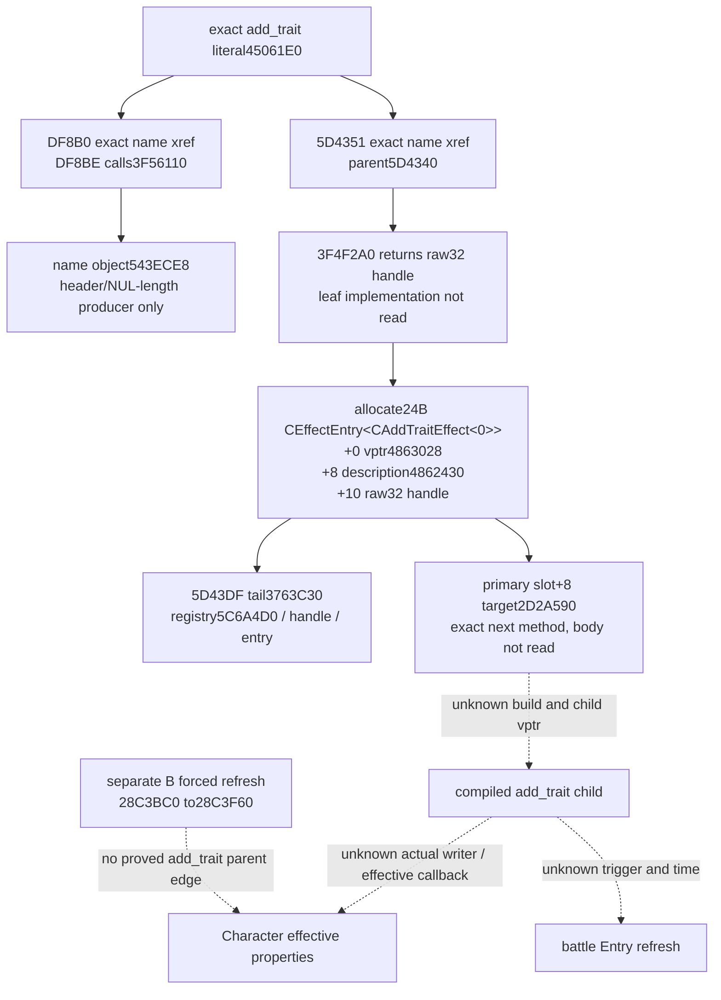
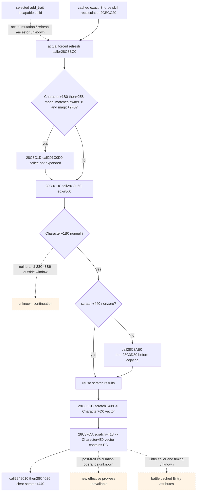
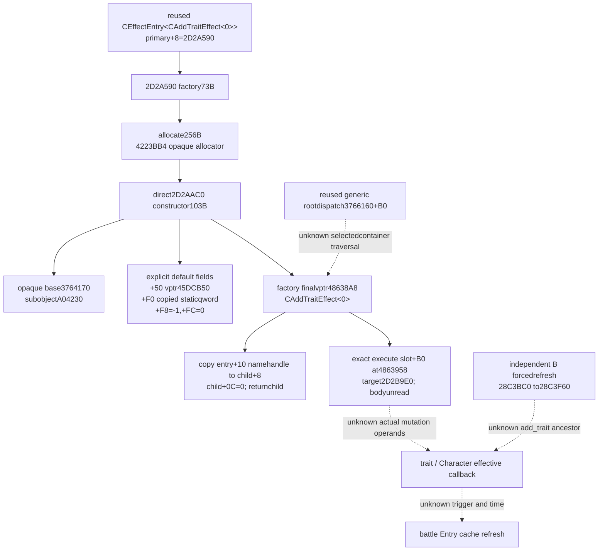
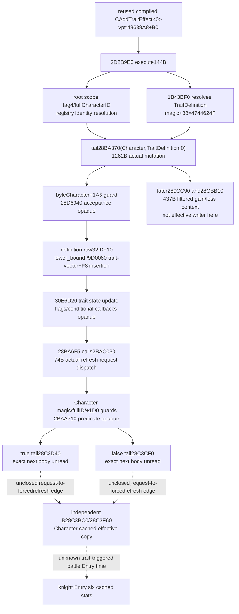
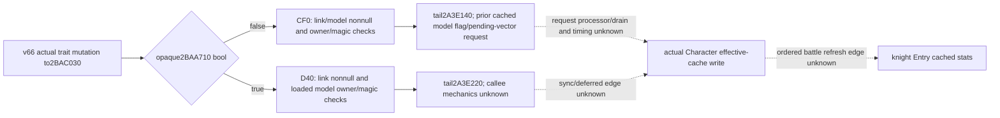
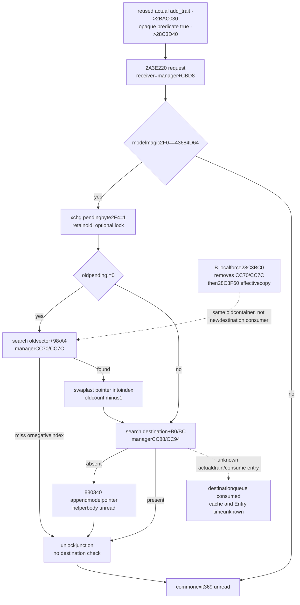
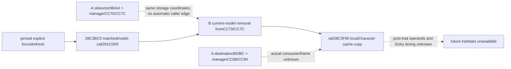
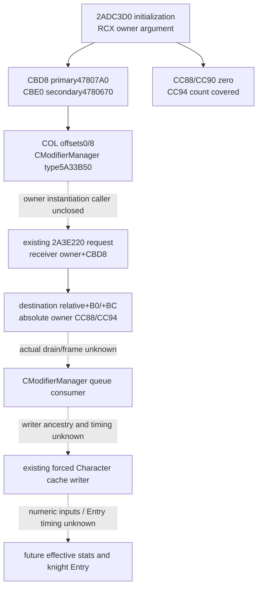
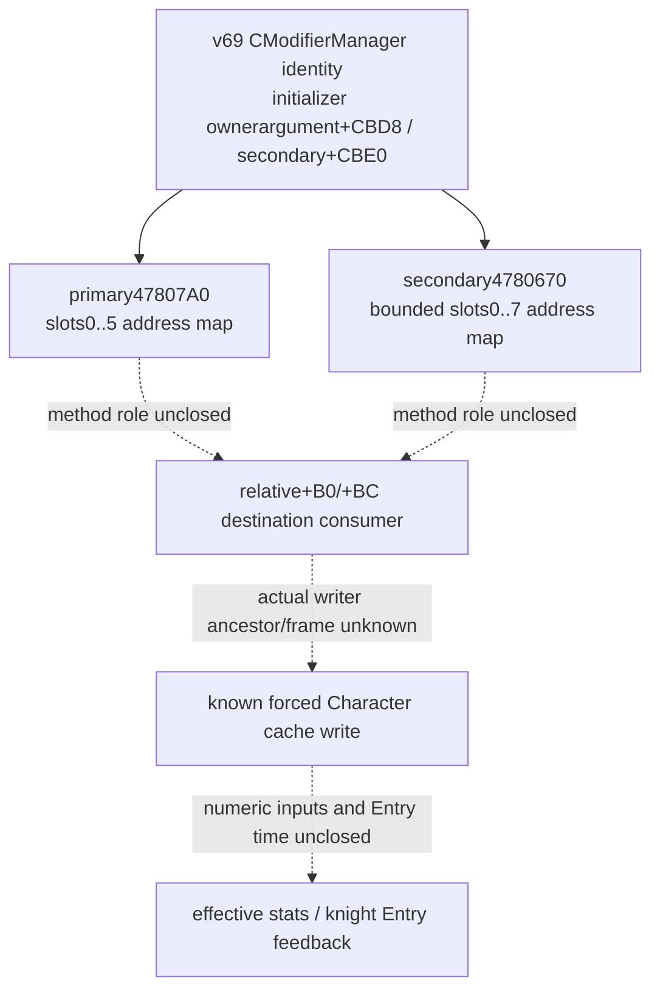

# Battle phase event trait callback — 1.20.0.3

Status: **research**, CK3 1.20.0.3, Steam build 25652598; frozen EXE SHA-256 `94B55397ABB687A3DCD436805A5D885E6BE90FA6C693FEB44A9E3BBEEADE02A6`. Day 2026-10-05 / ISO week 2026-W41.

The selected seam is the existing `knight_becomes_incapable` alive branch's compiled `add_trait` callback. This increment identifies current-build generic dispatch and the exact `add_trait` name-table location. It does not identify the concrete child writer or compute a new effective property.

`3765780..376587C` is 252 bytes; its call at `3765802` reaches `3765E70`. `3765E70..3766319` is 1,193 bytes and invokes the **generic root effect** virtual slot `+0xB0` at `3766160`. Scope slots `+0x28`/`+0x30` qualify that dispatch. The concrete root vtable, container, child constructor and actual trait writer are still unknown. The dispatcher also advances its context RNG counter before a compatible callback; this is not a trait-specific draw contract.

One authorized `.rdata` read searched only exact NUL-delimited `add_trait` and its same-section absolute pointer references. It read 17,123,840 bytes once, found one string at `45061E0` and one pointer at `46EAA58`, and retained a 224-byte reference window at `46EA9F8`. The preceding Qword at `46EAA50` equals `287B`. That observed value is **not** proof of an executable opcode, factory ID, class ID or writer address. The retained window is a value/name-pointer table, without a qualified factory or vtable target.

The next concrete source entry is the current registration/constructor cross-reference for `45061E0` / `46EAA50` / `46EAA58`, followed by the concrete root/container/child virtual target reached at `3766160`. No text-section search, live process read, memory callback research or whole executable hash was performed. The reused receipt supports `2657AC0`/`258B510` Entry refresh as a separate closure; it does not establish a trait callback edge or its timing. The earlier `2C06D30` label is removed because an exact pin for that label was not established in the referenced receipt. Character effective prowess remains a published observation and an unclosed callback output, rather than a getter address inferred from this packet.

No pure numeric API, module or test is released by this packet. Published current-person effective prowess and incapable presence remain current-frame observations. A trait flag cannot stand in for a computed `Character+0xEC` value, a completed callback, or refreshed battle Entry stats. `INPUT-CONTRACT.json` keeps these four concrete gaps visible and sets `SOURCE_READY=false`.

Evidence: `FROZEN-SOURCE-IDENTITY.json`, `function-03765780.{bin,asm,json}`, `function-03765E70.{bin,asm,json}`, `ADD-TRAIT-REGISTRATION-NEEDLE.json`, `add-trait-pointer-046EAA58.bin`, `NATIVE-SEAM-LEDGER.json`, `SOURCE-RECEIPT.json`.

The external source packet is `Z:/ck3_mod_rewrite_process_assets/g2-resume-20261005/battle-phase-event-trait-callback-v63/source/ROOT-DELIVERY.json`. The selected event's prior primary-request reader was adopted in commit `c5585c273573382c7881f7e57ed57acbed73e429`; this packet adds research evidence only.

## Current registration increment (2026-10-05, v64)

Status: **research**, 2026-10-05 / 2026-W41. Source-ready numeric trait writer remains **false**.

The one approved three-target static xref pass found four instruction-boundary-confirmed references to `45061E0`: `DF8B0`, `5D4351`, `2D2B310` and `2D2B789`. It found no code references to `46EAA50` or `46EAA58`; this does not imply absence of a factory. Only `5D4340` and the reachable `DF8BE` direct callee `3F56110` were captured as new bounded bodies. The large `DD2B0` initializer and the two funclet bodies were not captured.

`5D4340` passes the nine-byte name input through `3F4F2A0`, retains its raw32 return, allocates24 bytes, installs primary vptr `4863028`, description pointer `4862430`, and name handle at `+10`, then tail-calls `3763C30` with registry/handle/entry. Primary RTTI identifies `CEffectEntry<CAddTraitEffect<0>>`. Its primary table has only two methods, `+0=A03BD0` and `+8=2D2A590`; the next Qword is another RTTI COL. **The entry's `+8` field is a description string, not a second vptr; neither table nor field is the compiled child's `+B0` executor.**

`3F56110` is a58-byte string-object initializer: it zeros initial fields, writes15 at `+18`, computes the source NUL length, calls `855DB0`, and returns the destination. `DF8B0..DF8BE` binds that destination to `543ECE8`. No xref search of that new global was performed, and no trait/property writer is inferred.

Read costs are explicit: one authorized target-only `.text` read of71,141,888 bytes, four135-byte near windows, two bounded bodies totaling222 bytes with88 bytes reused from a near window and134 newly read, plus recorded `.pdata`/record metadata. The two-body budget is2/2. The metadata helper initially followed the description predecessor as a COL and read24 bytes at `2D25E60`, then failed its COL-signature assertion. That unintended text read and raw attempt are retained; its instructions were not decoded or used. Cached bytes corrected the field classification without another EXE read.

The next qualified source body is **`2D2A590`**, the current `CEffectEntry<CAddTraitEffect<0>>` primary virtual `+8` target. Its build role, actual child vptr/execute target, trait mutation operands and callback edges remain unknown. The separate B forced-refresh receipt does not establish an `add_trait` ancestor edge, numeric whole kernel, or knight Entry timing. There is no new model, test, game query or live claim.

External source packet: `Z:/ck3_mod_rewrite_process_assets/g2-resume-20261005/battle-phase-event-trait-callback-v64/registration-source/ROOT-DELIVERY.json`. The current mutation/forced-refresh sibling packet is `Z:/ck3_mod_rewrite_process_assets/g2-resume-20261005/battle-phase-event-trait-callback-v64/trait-caller-source/ROOT-DELIVERY.json`, SHA-256 `8bbb9fea208b45e861612bf508a6fac583cb68abc83e88ccece71c619249c3bc`, independently sealed and reused by metadata only.

## Independent Character refresh caller (v64 B, 2026-10-05)

The independent B result closes a real current-build **forced Character refresh caller and local cache-store order**. It gives the selected-trait research a qualified refresh target; the mutation-to-refresh ancestor remains unknown. The current-build cached skill research identifies `force_character_skill_recalculation` slot24 `2CECC20 -> 28C3BC0`. Original D: function transcripts were unavailable here, so B captured two bounded cached-lead windows from the frozen migration EXE: `28C3BC0..28C3E40` (640 B) and `28C3F60..28C4040` (224 B), totaling **864 B**. Their SHA-256 values are `7e4dc2592abb7f13702e5df5d357be5e60d03db84a9aa58d2afb11f71db92c2a` and `d3a373fa1c48bf4cbabbb3aa0f902979a14057baa42fdfcf0d20c0517ea7bc52`.

The caller resolves `Character+1B0 -> +258` and tests model owner `+8` and magic `+2F0=43684D64`. Its matching branch calls `291C0D0` at `28C3C1D` before the tail; bypass branches also reach `28C3CDC`. B's caller interpretation stops at the tail instruction ending `28C3CE1`. Adjacent bytes within that first retained window are not another closed function.

In the second window, null scratch branches to `28C43B6`, outside the capture. For nonnull scratch, a zero `+440` byte causes calls to `28C3AE0` and `28C3D80`; otherwise the window reuses scratch results. The vector store at `28C3FCC` writes Character `+D0` through `+DC`, including total diplomacy/martial. The store at `28C3FDA` writes Character `+E0/+E4/+E8/+EC`, including effective prowess. The window then calls `2949010` and clears scratch `+440` at `28C4026`. That is local synchronous write order; later continuation and these callees' mutation-dependent operands are not closed by the two windows.

Effective skill fields are **signed32 integer points**, not Q100000 or trait booleans. Zero remains legal. The separately pinned current skill-getter identity is `2B68870`; this increment does not use `2C06D30` as a skill getter. Observed current prowess is not automatically a post-trait value.

Concrete remaining seams are: actual compiled add_trait executor -> Character mutation -> this refresh caller or its dirty/schedule primitive; post-mutation base/modifier/percentage/boundary inputs for the scratch kernel; and the subsequent battle Entry caller/time with its six actual cached attributes. A registered entry plus B's independent cache writer cannot compose those unknown ancestor edges into a causal trait-stat chain. **SOURCE_READY remains false**, with no numeric module, case, live credit, complete horizon, Monte Carlo or win odds. A separate v65 source increment follows the qualified `2D2A590` target; its future findings are outside this v64 publication.

B evidence is [trait-caller-source/ROOT-DELIVERY.json](Z:/ck3_mod_rewrite_process_assets/g2-resume-20261005/battle-phase-event-trait-callback-v64/trait-caller-source/ROOT-DELIVERY.json), 3980 B, SHA-256 `8bbb9fea208b45e861612bf508a6fac583cb68abc83e88ccece71c619249c3bc`. Its `INPUT-AND-TYPED-GAPS.json`, `TREE.md` and `BOUNDED-CAPTURE-RECEIPT.json` bind the two raw/disassembly windows and the reused current-build skill research. A evidence is [registration-source/ROOT-DELIVERY.json](Z:/ck3_mod_rewrite_process_assets/g2-resume-20261005/battle-phase-event-trait-callback-v64/registration-source/ROOT-DELIVERY.json), 3428 B, SHA-256 `89d56bd41b2908f1c0bfa50d5b6cb7d212946767edacc300fb49af77ff2135ed`, binding `SOURCE-RECEIPT.json` (12374 B, SHA-256 `2cff0d5cf28a49216b36c0b3e816b0047c63077f3b74f34b54100689ab6bf92e`).

## v64 publication qualification and retained attempts

The research increment is complete and useful: exact registration type/next target plus a separate real Character-cache refresh caller. The selected trait feedback feature remains partial. C delivered no numeric model and D executed no case; no test GREEN or capability RED is claimed. A's retained COL-signature assertion RED came from misclassifying the description pointer as a second vptr, including the disclosed 24 B text read; cached metadata corrected that interpretation without a third decoded body. It is a source-helper attempt, not a failed trait capability test.

Root also retained ordinary pure-data read failures: two source Markdown/JSON read commands lacked their read helper and produced Markdown SyntaxError/JSON false NameError, then were corrected; a requested v61 source path was absent. These commands executed no business code and wrote no files. They do not add test attempts, capability failures or an audit prerequisite. This publishing lane only copied sealed A candidate bytes and appended this sealed B result; it performed no new EXE read, source lookup, test, SDK, game, window, shared write or Git operation. The one MOD topic patch is based on the already corrected v63 topic (4127 B, SHA-256 `de8d70d5d3d0d1b218bd8898694902d7007e00558c7887d2fa080d47fba7f5fa`), whose current g38 equality Root already confirmed. Root owns adoption, shared Oct5/W41 reports and commit/push.

## Compiled add_trait factory increment (2026-10-05, v65)

Status: **research**, 2026-10-05 / 2026-W41. Factory identity/order is source-closed; numeric trait writer source-ready remains **false**.

The qualified registration-entry virtual method `2D2A590` allocates256 bytes, directly calls constructor `2D2AAC0`, then installs final vptr `48638A8`, copies the entry raw32 name handle from `+10` to child `+8`, writes zero at child byte `+0C`, and returns the child. Constructor `2D2AAC0` calls two opaque initializers, writes its explicit subobject/default fields, and returns. Its temporary vptr `4863978` is overwritten by the factory's final vptr.

Validated final RTTI identifies `CAddTraitEffect<0>`. The exact final `+B0` qword at `4863958` points to **`2D2B9E0`**, now a qualified next execute entry. Scope slots `+28=A02D00` and `+30=2D29890` are addresses only; their bodies were not read. The name handle is a name-key bit pattern, not a selected trait ID or a prowess scalar. The constructor's `+F0` static qword and `+F8=-1` are not assigned guessed TraitDefinition semantics.

This increment contains two new bounded bodies totaling176 bytes,384 bytes of individually recorded `.pdata` lookup rows, and168 bytes of final vptr/COL/type/slot metadata. No new xref scan, whole executable hash, prior body/needle reread, third function body, game/SDK/liveRPM/window action or test was performed. The v64 metadata-read mistake belongs to its preserved prior packet; v65 metadata pointers were classified into backed noncode sections before following them.

The actual `2D2B9E0` execution body, parsed trait binding, selected loaded root/container-to-child edge, Character effective recompute arithmetic, and battle Entry timing remain typed gaps. The independent forced-refresh chain cannot establish an `add_trait` ancestor edge. This package releases no numeric model/API or fixture. The next source work should read `2D2B9E0` and a necessary actual mutation/callback target, within a separately authorized bounded package.

Sealed source: `Z:/ck3_mod_rewrite_process_assets/g2-resume-20261005/battle-phase-event-compiled-trait-factory-v65/source/ROOT-DELIVERY.json`, SHA-256 `7a735ca40bdb6c17715e249e6b33054e9d499b80e824eb968d1e2f3b31f8cfdb`. No model or fixture is released by this factory-only increment.

## Actual trait mutation and refresh-request increment (2026-10-05, v66)

Status: **research**, 2026-10-05 / 2026-W41. The actual trait mutation/request ancestry is source-closed; numeric effective callback readiness remains **false**.

The actual compiled execution target resolves the root Character full ID using scope tag4 and the current registry, resolves the trait definition through `1B43BF0`, checks the returned definition magic, and tail-calls **`28BA370(Character,TraitDefinition,0)`**. The Character method checks its byte `+1A5` and an opaque acceptance gate `28D6940`, computes the sorted insertion position, and calls the container insertion into its trait vector at `+F8`. New trait raw32 definition ID comes from definition `+10`, not from a guessed string-to-stat map.

After insertion, helper/flag callbacks precede the call at **`28BA6F5 -> 2BAC030`**. That74-byte request dispatcher checks Character magic at `+1C`, full ID at `+18`, and qword `+1D0`, then calls predicate `2BAA710(fullID)`. The true branch tail-calls **`28C3D40`**; the false branch tail-calls **`28C3CF0`**. Both are qualified next entries. This is an actual `add_trait` refresh-request ancestor edge, while the target bodies and their connection to the independently sealed forced effective-cache writer remain unclosed.

`28CBB10` was followed because it is the actual post-insertion direct callback under the compiled executor's zero third parameter. Its437-byte body filters on a definition list and current global full Character ID, chooses gain/loss context, constructs a Character scope, and invokes context helpers. It is not a Character effective-cache writer in this body. The other conditional definition-flag, role, registry and opaque callbacks remain visible in `EXECUTION-AND-CALLBACK-ORDER.json`; their semantics are not guessed from the name `incapable`.

Four new bounded bodies total1917 bytes, plus804 bytes of recorded12-byte `.pdata` lookup reads. No new xref/whole-text scan, metadata repetition, fifth body, old test, game/SDK/liveRPM/window action or whole EXE hash was performed. There was no v66 harness failure. Current published incapable presence and effective prowess remain observations, not proof of callback completion or a pure native effective-stat calculation.

The next work is the actual `28C3D40`/`28C3CF0` request tails and, if needed, their direct cache-refresh caller. Until that edge and required operands are closed, the existing B `28C3BC0 -> 28C3F60` copied effective values cannot be composed as this trait callback, and battle Entry timing remains unknown. The whole event's memory branch is outside this writer work. No new numeric module/API or fixture is released.

Sealed source: `Z:/ck3_mod_rewrite_process_assets/g2-resume-20261005/battle-phase-event-trait-writer-v66/source/ROOT-DELIVERY.json`, SHA-256 `944502f01b1377105ca3fe5c50251ff5dc6df22347042f1cd8be49e186b323f8`. No new numeric module or fixture is released.

## Actual trait refresh-request targets from cached bytes (v67, 2026-10-05)

The v66 actual mutation/request path now reaches source-closed model-request tails: `2BAA710=False -> 28C3CF0 -> 2A3E140`, and `True -> 28C3D40 -> 2A3E220`. Only the two actual target functions, 69+64=**133 B**, were interpreted from B's already sealed 640 B window. **New EXE/header/pdata/xref reads: 0.** This does not add a fifth v66 body or modify any sealed source.

Both matched branches pass the current model in RDX and `[[slot5C68C50]+A0]+CBD8` in RCX; failed owner/magic/link guards return without local writes. CF0 additionally checks the loaded model pointer for null; D40 has no separate model-null test. Neither leaf writes Character+EC, scratch+440 or Entry stats, nor directly calls the independently closed `28C3BC0/28C3F60` synchronous copy chain. Its scratch-ready condition cannot be attributed to these request leaves.

The [current-build skill-cache research](character-skill-trigger-readback-1.20.0.3-2026-10-04.md), previously pinned by B at SHA-256 `dac0f0c4d392fcc50a92074a16a2c48f838aeaf9979f2e4de860cb2929da00bf`, describes `2A3E140` setting model+2F4 and adding the model to a pending vector. That existing source fact is reused, without reading its body again. `2A3E220`, the actual request-processing/drain caller and opaque predicate meaning remain specific next seams. They do not prove post-trait effective prowess or the Entry update day.

Evidence: [v67 source ROOT](Z:/ck3_mod_rewrite_process_assets/g2-resume-20261005/battle-trait-refresh-request-v67/source/ROOT-DELIVERY.json), 3927 B, SHA-256 `0772760f449eb93dff2689e2d3630375628ee63a6d7362a4db24d8e52e1217d4`, binds both cached target slices, the Mermaid tree, typed inputs and gaps. **Actual request targets ready=true; numeric SOURCE_READY=false.** Research increment complete, selected feature partial; no numeric model, case, live, full horizon, Monte Carlo or odds credit. `v67` names this work package; runtime adoption and commit/push require Root's separate actual receipt.

## Actual request queue transition increment (2026-10-05, v68 A)

Status: **research**, 2026-10-05 / 2026-W41. Queue core control/field writes are source-closed; numeric callback readiness remains **false**.

The actual request has two adjacent PE unwind fragments: `2A3E220..240` (32 bytes) and `2A3E240..369` (297 bytes). The second's `UNW_FLAG_CHAININFO` links the first, so this is one logical request core with two physical code reads. The shared exit at `2A3E369` is not read, and this packet does not claim a complete function body. No direct helper body was read.

With model magic valid, the core exchanges its pending byte at `+2F4` with1. When the old byte is nonzero it first searches the receiver's old vector `+98/+A4`; a miss exits before considering the destination. A found model is removed by replacing its slot with the last pointer and decrementing the count. Oldzero, or completed removal, proceeds to destination vector `+B0/+BC`; the append helper is called only when the search result represents absence. Both vectors contain model pointers with stride8 and signed32 counts. Optional lock-like indirect calls use receiver `+C8` under byte `+D8`.

The receiver is the manager at `[[slot5C68C50]+A0]` plus `CBD8`. Its old vector therefore maps exactly to manager `CC70/CC7C`, the same container removed by B's independently sealed local forced-refresh path. The **destination** is manager **`CC88/CC94`**. B's `28C3BC0` removal of the old vector does not prove consumption of this destination. The opaque `2BAA710` predicate is not labeled fast, delayed or immediate.

Read cost: two physical code fragments329 bytes,408 bytes of recorded `.pdata` reads, and36 bytes of new necessary chained-unwind metadata,773 bytes total. No generic/xref scan, old body/test reread, third physical code span, helper body, game/SDK/liveRPM/window action or full EXE hash was performed. There was no harness failure.

Exact helper next entries are `A11F60` (pointer search) and `880340` (append). The highest-value remaining seam is the actual consumer of destination vector `CC88/CC94` and its cache-refresh callback/frame. No pending flag or enqueue operation stands in for completed Character effective stats, a knight Entry refresh, or an observable current MCP queue field. No numeric module/API or fixture is released.

Sealed request source: `Z:/ck3_mod_rewrite_process_assets/g2-resume-20261005/battle-trait-refresh-queue-v68/request-source/ROOT-DELIVERY.json`, SHA-256 `195522878ed84fe3570d640232eed2c00504a63dada86be68efcab57707ddaa7`. Independent B local removal source: `Z:/ck3_mod_rewrite_process_assets/g2-resume-20261005/battle-trait-refresh-queue-v68/drain-source/ROOT-DELIVERY.json`, SHA-256 `6258c204ee56640faed443e54305a7ee79fee15930103e0dbd576687bfbdc4e9`. This candidate appends A only; parent publication joins the B increment into one MOD path.

## Local old-queue consumer and remaining destination drain (v68 B)

The independently sealed B source identifies **`28C3BC0` as a local old-vector removal consumer**, using only the existing v64 cache/disassembly and no new EXE/header/pdata/xref read or body decode. On its matched-model path it calls `291C0D0`, searches manager `CC70/CC7C`, compacts later pointers other than the current model in original order, adjusts the tail storage/count, then tail-calls `28C3F60`. This is the explicit forced-refresh path's local order; it is not an automatic drain invocation.

A's final core now proves the old-container binding that B had left provisional at its earlier seal. Its conditional old-queue swap removal and unique destination append are distinct from B's ordered local compaction. B has **no cached consumer pin for destination `CC88/CC94`**, nor an automatic parent/tick that invokes this forced path. The next high-value source seam is that destination's actual processing caller and admission/frame; a pending byte or queue move cannot stand in for completed effective prowess or six knight Entry attributes. Current effective integer0 remains legal; no predicted EC is derived from trait=True.

B [ROOT source](Z:/ck3_mod_rewrite_process_assets/g2-resume-20261005/battle-trait-refresh-queue-v68/drain-source/ROOT-DELIVERY.json):2612 B, SHA-256 `6258c204ee56640faed443e54305a7ee79fee15930103e0dbd576687bfbdc4e9`. Original A/B source bytes remain sealed. **QUEUE_CORE_CONTROL_SOURCE_READY=true; LOCAL_MODEL_VECTOR_CONSUMER_SOURCE_READY=true; numeric SOURCE_READY=false.** This research increment is complete and the feature remains partial, with no numeric model/API, case, live, complete horizon, MC or odds credit. Root adoption64–67 is independently recorded; this v68 publication has no supplied commit/push and claims no runtime change.

## v69 — actual modifier manager identity and initialization (2026-10-05 / W41)

Source status: **research**. `OWNER_TYPE_AND_INIT_SOURCE_READY=true`; destination drain, numeric callback and knight Entry timing remain partial. Exact build is CK3 **1.20.0.3**, frozen EXE SHA-256 `94B55397ABB687A3DCD436805A5D885E6BE90FA6C693FEB44A9E3BBEEADE02A6`.

Root adopted v68 at commit `8e723751bcf2bcbb2a4ad4406a612aa60dd63fb2`. This EOF increment preserves that source projection's exact 30,409-byte prefix (`43e632335cf50bea18c1d714cf4a7250f8774fa600282320d472116f34a642d6`).

One authorized instruction-boundary pass compared only exact memory displacements `CC88` and `CC94`. It found one matching store, `2ADCA38: mov [R15+CC88], R12`, inside `2ADC3D0..2ADE503`. The selected 8,499-byte body establishes `R15=RCX`, `R12=0` and storage initialization: old queue qwords `CC70/CC78` and destination qwords `CC88/CC90` are cleared. The `CC90` qword store also clears count `CC94`; direct `CC94` operand hits were zero. The body initializes mutex/flag storage as well. These are initialization effects. Relative subobject `+B0/+BC` consumers are outside this pass's exact targets, so zero further direct hits carries no broader absence conclusion.

The initializer installs primary vptr `47807A0` at its owner argument `+CBD8` (`2ADC97E`) and secondary vptr `4780670` at `+CBE0` (`2ADC98C`). Reachable COL metadata closes offsets 0 and 8 (`4E48C28` and `4E48C78`) and shared type descriptor `5A33B50`, literal `.?AVCModifierManager@@`. The actual manager class is **CModifierManager**. Its initialized queue coordinates match the existing request receiver's `+CBD8` / destination relative `+B0/+BC` layout. This package does not independently capture the initializer's caller binding its first argument to the live global owner.

Only table slot 0 targets were retained: primary `2AE2480`, secondary `2AE8088`. Their roles remain unestablished and their bodies were not read. No tick, destructor or queue consumer role is inferred from an address.

The calendar lane reused the sealed `battle-calendar-admission-v57/manager-source` receipt and source pins. That cache closes CombatManager's `22A1D75 -> 2AD8000` date edge and separate `2AD7F00 -> 258B510/264D480` preparation edge. It contains no concrete admission/consumer pin for this CModifierManager primary/secondary table. No additional calendar body or EXE span was read and no daily modifier-drain claim follows from the CombatManager evidence.

Evidence: `Z:/ck3_mod_rewrite_process_assets/g2-resume-20261005/battle-trait-refresh-queue-consumer-v69/xref-source/{ROOT-DELIVERY.json,SOURCE-RECEIPT.json,TREE.md,INPUT-CONTRACT.json,ACTUAL-OWNER-AND-XREF-LEDGER.json,QUEUE-OWNER-IDENTIFIERS.json,ACTUAL-READ-COST.json}`; cached-calendar boundary under the same package's `calendar-source/{ROOT-DELIVERY.json,CALENDAR-METADATA-AND-GAPS.json,TREE.md,SOURCE-PINS.json}`.

Actual cost: one exact-target `.text` instruction pass, 71,141,888 bytes in 16.169 seconds, plus 216 bytes of `.pdata`; one selected body, 8,364 newly read bytes plus 135 retained near-window bytes; 256 new reachable identifier metadata bytes. Total newly read EXE bytes: **71,150,724**. The second permitted body was unused. Calendar source added zero EXE/header/pdata/xref/body bytes. No full EXE hash, whole-text dump, generic callgraph, model, test, SDK, live RPM, game/window action or shared/Git mutation occurred.

Next source construction entry: finite method metadata at the now identified primary `47807A0` / secondary `4780670`, reusing slot 0 and RTTI. Root authorized up to 8 slots per table and at most two actual candidate bodies with existing relative `+B0/+BC` queue-use or forced-writer ancestry evidence. No further absolute `CC88` scan is planned. Numeric callback readiness remains false until actual destination consumption and attribute-input values are proved; no trait boolean is converted into an EC value.

## v70 — bounded CModifierManager method address map (2026-10-05 / W41)

Root adopted v69 at `99cf4f2d0c4888c8e2f07338369f6f07c87343ed`. This EOF source increment preserves its exact 35,040-byte projection prefix (`7cbd3c4d1fffeb9e7891586ae656ddb360af537ecc4850261fd34c2c2c3b28ad`). Exact CK3 **1.20.0.3** / frozen EXE SHA `94B55397ABB687A3DCD436805A5D885E6BE90FA6C693FEB44A9E3BBEEADE02A6` remains the source identity.

The finite metadata task read only the seven qwords after each known slot0: two 56-byte spans, **112 new EXE bytes** total. Prior cached heads supplied slot0, the image base and COL pointers. No PE header, new RTTI, executable section, xref or function body was read. `METHOD_ADDRESS_METADATA_READY=true`; consumer and numeric `SOURCE_READY=false`.

| Slot / offset | Primary `47807A0` | Secondary `4780670` |
| --- | --- | --- |
| 0 / `+00` (reused) | `2AE2480` | `2AE8088` |
| 1 / `+08` | `3F7E2D0` | `2A3D3C0` |
| 2 / `+10` | `2A3D370` | `9D09F0` |
| 3 / `+18` | `3F7E350` | `2A3DB50` |
| 4 / `+20` | `8522C0` | `1A2E130` |
| 5 / `+28` | `8522C0` | `855AB0` |
| 6 / `+30` | metadata boundary candidate `4E48908` | `8522C0` |
| 7 / `+38` | raw following value `2AE8124`, table assignment withheld | `2A3D380` |

The primary `+30` value points into metadata and is retained as an adjacent table-head candidate. Its COL was not read, and the following qword is not assigned to this primary table. Secondary continuation beyond slot7 is unread. All retained method roles remain unknown. Slot numbers and addresses establish neither admission, drain, tick nor destructor behavior.

Evidence: `Z:/ck3_mod_rewrite_process_assets/g2-resume-20261005/battle-modifier-manager-consumer-v70/method-metadata/{ROOT-DELIVERY.json,BOUNDED-QWORD-CAPTURE.json,METHOD-ADDRESS-MAP.json,TREE.md,SOURCE-PINS.json,ACTUAL-READ-COST.json,EXACT-NEXT-PIN-RECIPE.json}`. The metadata packet's qualified consumer targets list is empty. A separate source lane is comparing these exact addresses with existing exact-build cached queue/forced-writer evidence; this metadata delivery supplies no result for that ongoing lookup.

The next bounded body recipe requires an actual receiver-relative `+B0/+BC` queue-use or existing forced-writer ancestor edge before promoting a target to consumer status. At most two qualified actual bodies are allowed. The constructor-to-live-global binding and calendar admission remain open as recorded in v69. No further absolute `CC88` scan, calendar search, numerical module, empty fixture, test, live RPM, SDK, game/window action, shared mutation or Git operation was performed for this packet.
