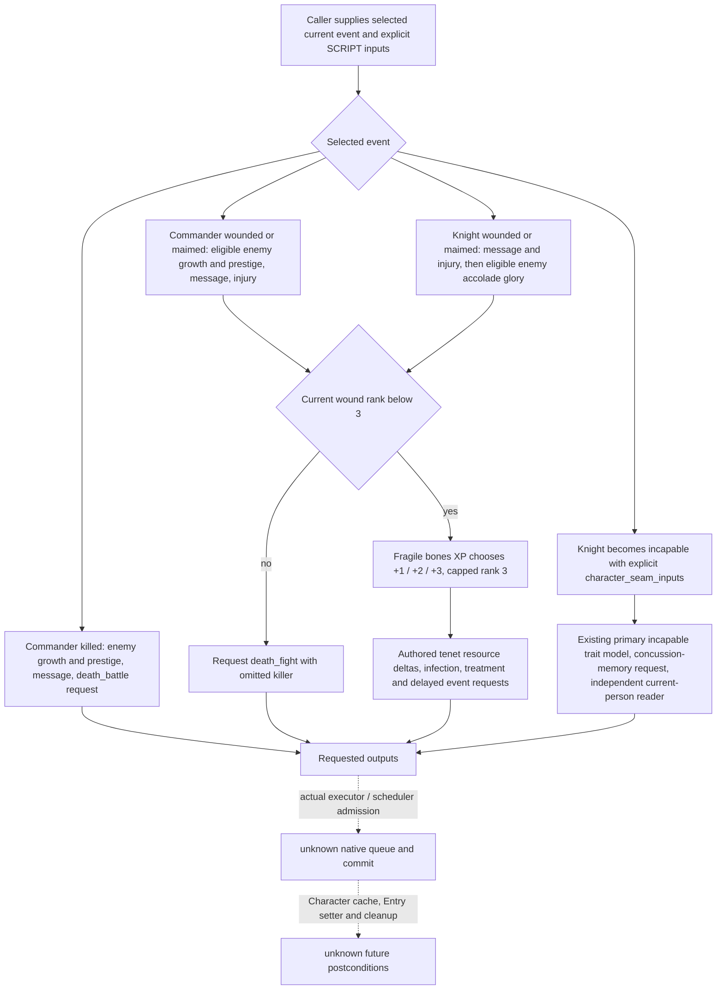

# Battle phase injury effects: exact 1.20.0.3 source and conditional requests (2026-10-05)

Status: **static-ready / production-path offline fixture**. This increment completes five previously partial authored injury/death request paths and exposes the existing selected-incapable character seam through the public feedback wrapper. It adds no paused-game evidence, game days, native queue admission or committed effects. Existing 13/13 selected-event request coverage remains distinct from full native execution.

## Exact source and ownership

CK3 1.20.0.3, Steam build 25652598, EXE SHA-256 `94B55397ABB687A3DCD436805A5D885E6BE90FA6C693FEB44A9E3BBEEADE02A6`. Producer preimages are frozen `Z:/g75` (Root supplied `cd14f96c`). Four independent lanes covered commander/common source, knight source, three producer projections and the sole new public-wrapper case. Dynamic v83 owns future Character context preparation and new-key/eligible-count numeric inputs; this increment does not infer them from script requests.

Source ledger: `Z:/ck3_mod_rewrite_process_assets/g2-resume-20261005/battle-phase-leaf-effect-fidelity-v83/stock-source/ROOT-DELIVERY.json` (`603416d0f5cdef773697b0d61f2eb763be5a23748a8c89398f44380b9157bf1d`) and `knight-source/ROOT-DELIVERY.json` (`d8533f264141af016a73e20acc61d686b39fc8c1ecd342eac89e490f113dc931`). Selected source blocks reuse the already frozen current original-script cache. Only missing physician helper bodies required reconstruction of the health file from the frozen reference and current delta; reconstructed 107548 bytes matched the pinned current SHA once: `ABEFA738C913C660A52FA747BCC92FCA2F57D77A0F47D903BEDC2882F3D5A9DB`. No installed script, whole EXE or actual response was reread.

Current commander file SHA is `1A6EAC4A0714C947A822193E60AF589AEC31FA92857558DF0616A45317654871`; current basic values SHA is `C379CC0C58ED1574033F0E07A58697DFC6F8475C26AA4B117F2332008D4A27EF`. Source APIs and ordered ASTs are sealed under `stock-source/` and `knight-source/`; they precede producer implementation.

## Authored decision tree

The five new full request helpers are `commander_wounded`, `commander_maimed`, `commander_killed`, `knight_wounded` and `knight_maimed`. The sixth gap is public routing of already implemented `knight_becomes_incapable`, not a missing generic AST. No authored alive guard is inserted into wound/maim helpers. Eligible enemy selection uses authored prowess threshold and only consumes a target choice when at least one candidate exists; an empty set consumes no target draw. This source correction was made before the first fixture run, with the original projection preserved under `implementation/receipt-history/pre-first-run-target-draw/`.

Wound helpers project a requested rank increase of 1, 2 or 3, capped at 3, using fragile-bones presence and XP>=50. Normalized rank values use SCRIPT Q100000. A legal maimed event reaching rank 3 requests `death_fight` without a killer; commander-killed independently requests `death_battle` and may supply the selected enemy killer. Maim random-list weights remain 4/2/4/4; branches request one-legged, disfigured, one-eyed or maimed, including the authored epilepsy/injury helpers and recently-maimed years=1 modifier. Infection requests health.0201 days=30..60; epilepsy requests trait_specific.2001 days=30..300. Physician selection, growth XP, success/failure weights and health follow-ups retain authored scope/order and caller-selected outcomes.

Commander enemy prestige uses the original victim-root title/lowborn metadata: wounded/maimed base 75, killed base 150, multiplied by positive title tier (otherwise 1), halved for lowborn. Commander paths have no accolade glory; knight wound/maim paths request the authored minimal glory 10 under their respective acclaimed/accolade tests. Rootlocation remains a Province scope for concussion memory, independently of Combat province.

## Public producer interface and units

`execute_selected_phase_event_12003` consumes the frozen v7 manifest and emits ordered requests plus `requested_resource_projections`. `run_selected_phase_feedback_horizon_12003` retains existing selected ordering and adds optional `SelectedPhaseEventInput12003.character_seam_inputs`. Non-null inputs for incapable route into the existing `execute_selected_character_phase_event_12003(...).execution`; absent inputs keep the generic AST. Existing `one_seam_inputs` and pre-date knight preparation remain intact. Independent current-person, memory and callback-gap records are preserved in `feedback.ledger.character_seam_projections`.

Resource deltas are authored SCRIPT Q100000 amounts. If the caller explicitly supplies a current resource before-value in that unit, the model can project `before + requested literal delta`; otherwise before/after remain null. Reached runtime aliases such as minor_stress_loss and spiritual-fulfillment values require current caller-resolved inputs. These projections do not claim native Character storage units, modifier-adjusted balances, actual after observations or effect commit. Traits, deaths, memories, modifiers and event schedules remain separately requested; local primary trait projection does not rewrite independent observation, detach a knight, refresh Entry caches or prove native callback admission.

Manifest version: `ck3-1.20.0.3-caller-selected-primary-and-requested-effects-v7`; canonical SHA `DC36E5D33D5369B6E6F8408A34DB13674B7CAF6B735FF87A3BDEAB5BA2A086A7`.

## Sole new production-path scenario

One new integrated scenario selected commander_wounded, knight_maimed and knight_becomes_incapable through the existing public wrapper in source side order 0/1/1. Corrected attempt 02 passed **25 Require checks**. The original attempt 01 passed its first 14 business checks, then failed because the fixture referenced nonexistent `primary_deltas`; the correction uses the actual `character_numeric_deltas` field. Both attempts and their inputs/outputs are retained; production was unchanged for this Harness RED. Total wrapper invocations=2, new scenarios=1, selected rows per invocation=3; no old cases were rerun.

Verified conditional requested values: fragile-bones rank 0 to rank_raw=200000; spiritual fulfillment 200000 + 700000 = 900000; piety 10000000 + 5000000 = 15000000; stress 2000000 - 1000000 = 1000000. Legal knight-maimed at rank_raw=300000 requests one_legged and death_fight with omitted killer. The incapable primary model becomes true while the independent synthetic current observation remains false with effective prowess 7. Its memory request uses rootlocation2630 rather than Combat2695, with no native memory ID or commit. Requests stop the public path before main rolls and damage; caller observations, Entry caches, quantities, hard/soft ledgers, backing and DrawState stay unchanged.

Receipt: `fixture/ROOT-DELIVERY.json`, SHA `ce2913933043f9e507b9c4bc6992ac186e0d9d4134eedd34b97fa280d1212e1d`. GREEN result: `fixture/attempt-02/RESULT.json`, SHA `e5351ef9e24d776ac612268ee53c7f0301d8456fc31d4fb0c812239d6c30ce76`. Original Harness RED: `fixture/attempt-01/RESULT.json`, SHA `cb5e1f4e5d9f17da93a5196f47c965ed4821bede2c0569b9640ac05781343046`. Other injury leaves and helper choices are source-qualified implementations, not additional runtime-GREEN claims.

## Remaining concrete entry points

Actual primary writes use the selected compiled-effect child under executor `0x3765780` / `0x264E680`; native resource modifier/writer chains, queued health-event scheduling and memory creation/alias/variable storage remain separate dependencies. Character numeric context and the manager-preparation Entry setter remain independently sourced capabilities. No complete future battle, Monte Carlo, native RNG trace, complete OODA or new live claim follows from these selected requests.

Root-only package index: `Z:/ck3_mod_rewrite_process_assets/g2-resume-20261005/battle-phase-leaf-effect-fidelity-v83/root-packet/ROOT-DELIVERY.json`. Oct5/W41 fields: `ROOT-DAY-WEEK-FIELDS.json`. This work added zero actual game days and used no SDK, pipe, live memory, window, shared checkout writes, Git operation or full native build.
