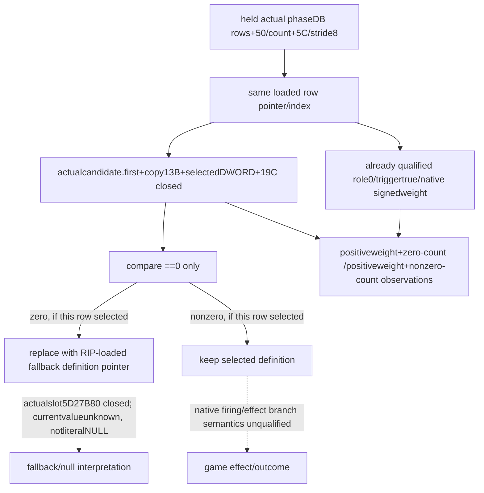

# Loaded battle phase effect emptiness, CK3 1.20.0.4

Source32 records the native operand that distinguishes an empty compiled effect from a selected definition kept by the selector. Exact target CK3 1.20.0.4 / Steam25734779 / EXE SHA256 `98702F88A547CDE2EAF29A85F93B85F68EE4CF8148336A4F7AFAEB75319DD518`; sourcepin `284b49ea00758608ae3baee3930386c40bf2e780`. This tree is authored before Main code. State **research/SOURCE_CLOSED operand/provenance, frame/FIRST NOTRUN**. Prior source31 chance/weight Native/Service GREEN is parent-reported reused qualification, not rerun.

Existing loaded registry receiver source is phaseDBslot5D27B90→DBrows+50/signedcount+5C/stride8; original rowindex identifies each actual definition pointer. Same-frame current Commander physicalSide equality,role0 compatibility,triggerbool and native signed weight are independent already qualified leaves. This package can attach an observed DWORD at **that same loaded row+19C** without typed event key, selection, RNG, firing or effect evaluation.

The held old selector32B [3299143,3299163) loads the selected definition pointer from either the chosen pointer-address or local fallback-address, compares DWORD[definition+19C] to0 and uses CMOVE to replace its candidate with a RIP-loaded fallback definition pointer. The historical slot is5D27B80. **This is a loaded pointer, not a literal null.** Actual4 slot and branch await this32B mapping; its current pointer value is a separate frame input. The new candidate [3299123,3299143) comes solely from held actualselector3298EC0+offset611, not a global -20 rule. Only RIPdisp[24,28) may relocate.

Main forwarded actual343 identity witnesses once:3298FF2 `MOV RBX,[RDI]` bytes488b1f and3298FF5 `MOV[RBP+430],RBX` bytes48899d30040000. Thus the candidate's firstQWORD is the exact loaded row pointer, preceding roleCMP3298FFC. A second19B window old[329906C,329907F),candidate[329904C,329905F),knowncalleeoffset396, passes this candidate-address inRDX and pointer-array address[RBP+A0] inRCX to the returned appendcallee. [51B/2read manifest](Z:/ck3_mod_rewrite_process_assets/g2-background-20261007/upstream-build-migration/g2-combat-forecast-12004/commander-effect-emptiness-source32/native-tree/ROOT-FINITE-PHASE-EFFECT-EMPTY51-MANIFEST.json) supersedes the32-only proposed plan for this stage; both authors remain immutable. Only CALLrel[15,19) relocates in the19B row. Do not claimcompletecandidatecopy merely fromCALL arguments.

Existing actual880340 prefix62B saves inputRDX inR14 at88035F, reads pointer-arraycount+0C/capacity+08, and actualJNE880364 returns8803ED. Its prefix has no firstQWORD copy instruction; it is not a fullappend closure. Main actual51B/2reads is GREEN0.6470993s, returning append880340 and unchanged fallbackslot5D27B80. A separate [actual-only16B plan](Z:/ck3_mod_rewrite_process_assets/g2-background-20261007/upstream-build-migration/g2-combat-forecast-12004/commander-effect-emptiness-source32/native-tree/ROOT-FINITE-POINTER-APPEND-COPY16-ACTUAL-ONLY-MANIFEST.json) starts at that closedbranch8803ED. Cached NEWruntime metadata identifies [8803ED,880423),54B; only thefirst16B are requested to see QWORDload[R14]/destinationstore. Decode completeinstructions only; if an instruction provingcopy ends beyond thecap, report its exactmissingtail separately. No grow/allocator/return/RNG/fullroutine expansion, oldEXE or fulloldbody read is authorized by this plan.

Main subsequently chose one [actual-only32B copy cap](Z:/ck3_mod_rewrite_process_assets/g2-background-20261007/upstream-build-migration/g2-combat-forecast-12004/commander-effect-emptiness-source32/native-tree/ROOT-FINITE-POINTER-APPEND-COPY32-ACTUAL-ONLY-MANIFEST.json), [8803ED,88040D), to retrieve the necessaryload/store inone read. It supersedes the unexecuted16B plan; no16B attempt occurred. Targetpacketbudget83B/3reads includes alreadyGREEN51B/2reads. Use only decodedneededcopyinstructions,retaintrailingdata ifanunneededinstructioniscut; no return/grow/fullroutine claim.

Main's sole actualcopy32B/1read completed0.6810366s, closing the necessary first13B copyinstructions:8803ED loadsarraybase[RBX],8803F0 savesoldindexRAX→RDX,8803F3 loadsRAX=QWORD[R14] candidate.first,8803F6 storesunchangedpointer[base+index*8]. Combined with actual343 preparation and actual19args, this closes the loadedrow→candidatepointerarray provenance required by the selecteddefinition+19C operand. Thecap decoded30/32; its final2B are an incomplete followinginstruction retained asdata. Neededcopyinstructions are complete; no extra read/RET/fullgrow claim. [SOURCE-CLOSED](Z:/ck3_mod_rewrite_process_assets/g2-background-20261007/upstream-build-migration/g2-combat-forecast-12004/commander-effect-emptiness-source32/native-tree/SOURCE-CLOSED.json) and [clips](Z:/ck3_mod_rewrite_process_assets/g2-background-20261007/upstream-build-migration/g2-combat-forecast-12004/commander-effect-emptiness-source32/native-tree/SOURCECLIPS.md) seal83B/3reads; allauthorplans remain unchanged.

Count0 is native zero/empty discrimination; any nonzero bit pattern takes the keep-candidate path. The DWORD comparison supplies no signed negative-count rejection. Publish **rawu32bits** and `native_effect_count_is_zero` only for existing nativepositiveweight observedrows; preserve legal0 versus read failure. A local countfailure does not downgrade the existingnumeric observation. Nonzero does not predict whether an effect condition will execute or whether it helps/hurts a participant.

For a trigger-true, positive native weight row: count0 means that **if this same row is selected**, the native code substitutes the fallback pointer afterward; nonzero keeps the selected definition at this check. Do not exclude empty positiveweight rows before weighting or renormalize remaining rows. The observed branch is after native weighted choice; this observer does not call or reproduce that choice. Rowidentity here is the existing loaded row pointer/index, not a fabricated selected current row.

Old source also ends at3299238 `MOV RAX,RSI` throughRET3299255; the held final15-line source confirms old returned register. An independent optional30B witness [3299238,3299256),candidate[3299218,3299236),offset856 can close the actualreturn if Root needs that claim. It is **not part of the minimum32B manifest**. The independent scalarcount observer does not require middle cleanup or a native selector call.

[32B finite manifest](Z:/ck3_mod_rewrite_process_assets/g2-background-20261007/upstream-build-migration/g2-combat-forecast-12004/commander-effect-emptiness-source32/native-tree/ROOT-FINITE-PHASE-EFFECT-EMPTY32-MANIFEST.json), [TREE](Z:/ck3_mod_rewrite_process_assets/g2-background-20261007/upstream-build-migration/g2-combat-forecast-12004/commander-effect-emptiness-source32/native-tree/TREE.md), [ledger](Z:/ck3_mod_rewrite_process_assets/g2-background-20261007/upstream-build-migration/g2-combat-forecast-12004/commander-effect-emptiness-source32/native-tree/INPUT-LEDGER.json) and [Oct8/W41](Z:/ck3_mod_rewrite_process_assets/g2-background-20261007/upstream-build-migration/g2-combat-forecast-12004/commander-effect-emptiness-source32/native-tree/OCT8-W41-FIELDS.json) are authored. Main owns final optional row fields/collector/hooks/commit; all child EXE/native/Game/SDK/process/window/import/build/test operations0. Base completeness and MC remain unchanged.
