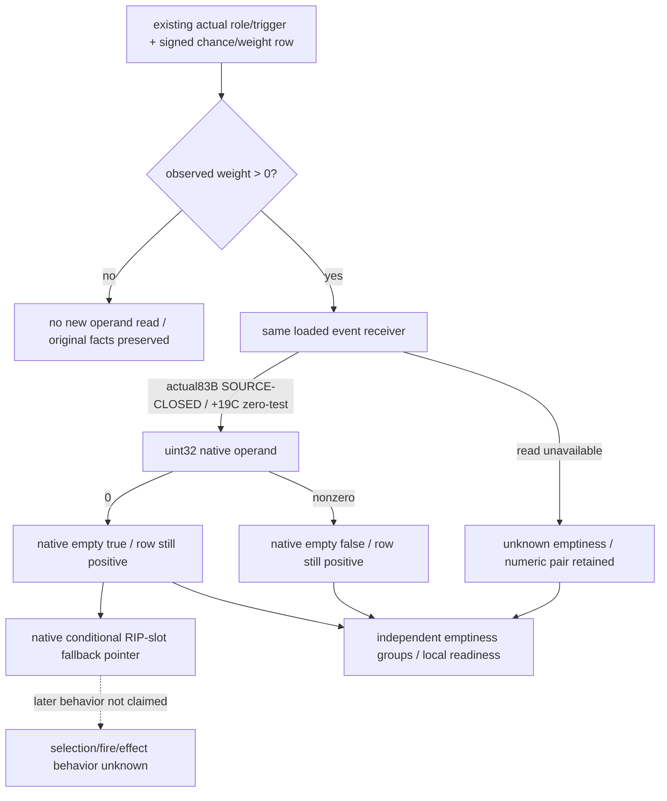

# Loaded native effect emptiness inputs — CK3 1.20.0.4

This source32 package proposes a narrow readonly extension to current Commander chance/weight observations. It splits observed positive-weight loaded rows into native empty, native nonempty and unknown emptiness groups. Positive weighted rows remain in the original numerical set regardless of the new operand. It does not classify harm, calculate damage, execute effects, choose an event, draw RNG or change forecast/MC readiness.

## Qualified baseline and exact source frontier

The new isolated tree is `C:/codex-ck3-background/g2-phase-effect-emptiness-source32`, based on Root commit `284b49ea00758608ae3baee3930386c40bf2e780`. It includes the qualified Source31 chance/weight implementation and its five shared hooks. Root reported candidate484 native/registered-service GREEN; this child reuses that result without reading a saved whole artifact or rerunning a compound. The result is source-qualified synthetic software DTO/collector/production serializer/registered-service evidence, not an actual live effect value.

Target is CK3 1.20.0.4 / Steam build 25734779, SHA-256 `98702F88A547CDE2EAF29A85F93B85F68EE4CF8148336A4F7AFAEB75319DD518`. Source31 already publishes signed64 `chance_raw` and the signed32 native `trunc0(/100000)` / low32 weight, with current role/trigger and actual physical Commander context.

Main reported source32 actual closure: **83 bytes / three reads**, consisting of 51 bytes in two known selector windows and 32 bytes at the returned copy fast path. The actual comparison tests DWORD `[RSI+0x19C]` against zero and conditionally selects the alternative pointer from slot **`0x5D27B80`**. This is a **fallback pointer**, not literal NULL. The admitted append call is `0x880340`; the necessary 13-byte writer inside the 32-byte window is `0x8803ED` load RCX from `[RBX]`, `0x8803F0` index RDX from RAX, `0x8803F3` load candidate first QWORD from `[R14]`, `0x8803F6` store it to `[RCX+RDX*8]`. Combined with the existing selector343 loaded-row pointer to stack-input proof and append arguments, this closes the same loaded-event receiver for the zero test. This child reuses Main's closure without reading EXE bytes or source receipts. No event key, typed array length or effect execution behavior follows from it.

The input proposal uses an unsigned32 raw operand to preserve exact DWORD zero/nonzero semantics. A typed signed count interpretation may be documented later if the actual source proves it; negative/large bit patterns are not coerced to empty. Reading the raw operand and evaluating its source-closed zero comparison does not require publishing or dereferencing a fallback pointer. It also does not prove how later code uses that fallback.

## Accepted smallest optional extension

The existing leaf remains `phase_event_commander_chance_weights_v1`, scope `v2_current_physical_side_commander_loaded_role_trigger_chance_weights`, schema 1. Its nine base root keys, seventeen occurrence keys and five condition keys retain their existing meaning. No occurrence field is added. The accepted extension is:

| Location | Optional field | Meaning |
| --- | --- | --- |
| Root | `effect_emptiness_source_closed: bool` | Exact4 loaded-event receiver and native zero-test operand/comparison have been qualified for this observation. |
| Every condition when extension is emitted | `effect_empty_operand_raw: uint32 or null` | Exact observed native DWORD used by the empty comparison. |
| Same condition | `native_effect_empty: bool or null` | True exactly for observed raw0, false for observed nonzero; unknown when unobserved. |
| Same condition | `effect_emptiness_unavailable_reason: string or null` | Nonempty local reason for a demanded unknown read; null for an observed result or an intentionally undemanded row. |

Absence of the extension preserves old frames unchanged. With the extension emitted, each existing condition receives all three fields. Only an already observed final signed `selection_weight_raw > 0` demands the new read. Role/trigger false, unknown chance and known nonpositive weight rows receive null operand/empty/reason and perform no new operand read. Known raw zero is not a read failure; unavailable positive rows retain null operand/empty and a reason. Observed booleans require source closure and match `raw == 0`.

The original chance fields, source flag, numerical admitted/evaluated/not-admitted/unknown counts, occurrence/root status and `chance_weight_observation_ready` remain unchanged even if every demanded emptiness read fails. In particular, a positive weighted empty row is not removed from the positive chance set. The new projection derives its own local ready/partial/unknown state instead of adding a gate to a base or numerical field.

Malformed optional extension data is isolated to emptiness after validating the base numerical observation once. It cannot turn a known positive weight into zero/unknown, erase a current trigger result or introduce an MC gate. Root/condition fields outside the explicit extension remain governed by the existing strict base contract.

## Reused DTO and consumer seams

| Existing input / implementation | Planned use after source closure |
| --- | --- |
| Same-query `phase_event_role_compatibility_v1.loaded_registry` | Loaded row order and pointers remain the source identity; no stock names or row-key lookup. |
| Current Commander trigger and chance leaves | Reuse sparse occurrence indices, full Character/Combat IDs, physical Side context and observed signed chance/weight. |
| Existing native chance collector | Main extends only positive demanded rows using an already qualified loaded-event receiver; no duplicated Army/Side observer or phase manager query. |
| Existing chance DTO and serializer | Main conditionally emits the optional root flag and three condition fields. Old emission remains available when the extension is absent. |
| `phase_event_commander_chance_weights_contract.py` | Future optional extension handling around the existing strict base normalizer; no new MCP or combat root attachment. |

Proposed pure consumer `current_commander_positive_weight_effect_emptiness_sets(occurrence)` returns ordered `empty_positive_rows`, `nonempty_positive_rows` and `unknown_positive_rows`, preserving row indices and the known chance/weight pair. It also derives local emptiness readiness independently of numerical readiness. With a legacy frame, known positive rows remain positive but their emptiness is unknown. A complete observed no-positive set has no demanded operands and is a legal empty result.

The join remains by same-query `loaded_row_index`, retaining each roster occurrence and source row order. Repeated CharacterIDs or eventual duplicated event names are not merged. Names, probabilities and actual selected/fired effects are outside the result.

## Unique future whole FIRST and Oct8 / W41 delivery

Accepted future scene names are `positive_empty_nonempty`, `effect_operand_unavailable`, `no_positive_weight_rows`. Each full-V2 body uses the integrated production serializer and the qualified Root31 shared-hook baseline. Each will traverse one real registered-service/MCP call, retain the entire query cache/JSON result and keep base model gaps/MC unchanged. No old GREEN compound is rerun.

In the first scene, positive rows0/5 have native operands0/2 and report empty true/false. The unavailable scene refuses row5's operand only after its role/trigger and positive numerical value are known; row5 stays positive with unknown emptiness. The no-positive scene keeps four admitted/evaluated chance rows, with raw values `99999,-199999,0,99999` yielding weights `0,-1,0,0`: the numerical observation remains available and new operand reads are zero. Per-scene old chance counts stay complete; raw numbers need not be equal between scenes.

Root's new native callback receipt will qualify exact source receiver/operand width and demanded read counts. The consumer compound only reuses helper constants, issues exactly three fresh queries and performs optional-absence/malformed isolation on cached new samples without another query. Synthetic operands do not receive actual live value or effect-fire credit.

The source frontier is now **SOURCE-CLOSED**, and Main authorized the minimal Python optional extension, new consumer and unique FIRST source. Their state remains authored-NOTRUN until Root qualification. External `commander-effect-emptiness-source32/input-layer/{INPUT-LEDGER.json,FIRST-RECIPE.md,OCT8-W41-FIELDS.json}` records delivery. This child touches no old tree, shared native header/CMake/report or combat attachment and executes no game, SDK, process/window, import, build, test, EXE read or git operation. Main owns staging/commit and Root owns the sole subsequent FIRST.

The implementation retains public `normalize_phase_event_commander_chance_weights_v1` and validates its old numerical field view once before attaching the optional emptiness fields. `current_commander_positive_weight_effect_emptiness_sets` projects the three groups and independent local readiness. The new CLI source is `tests/unit/test_phase_event_effect_emptiness_registered_service_12004.py`, with `--source-root`, `--wire`, `--output-dir`. It saves whole caches/round-trips for three fresh scenes and includes pure legacy9/5-shape and malformed-local-extension checks without additional queries. No old chance/trigger test class is run.
