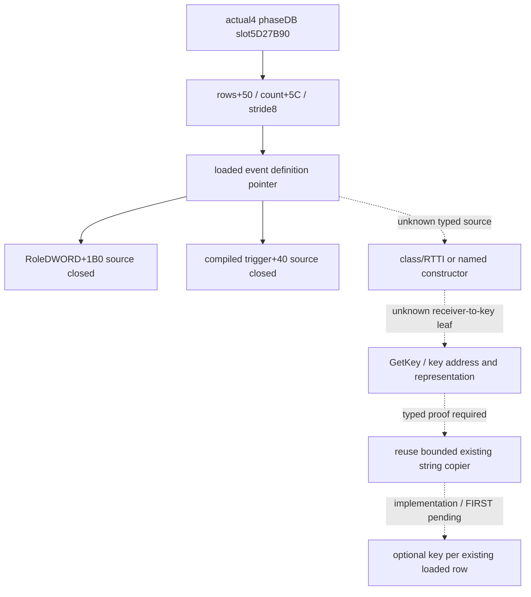

# Battle phase loaded definition key, CK3 1.20.0.4

This source30 topic records the typed-source dependency for naming already observed loaded battle phase rows. The new source pin is `896719b1363050644e90f1c747ce1510b4d0a475`; target Steam25734779, EXE SHA256 `98702F88A547CDE2EAF29A85F93B85F68EE4CF8148336A4F7AFAEB75319DD518`. State remains **research**. RootRuntime29 is a parent-reported frozen candidate and its FIRST was pending when this packet was authored; it is not replayed here.

The held actual4 [admission tree](battle-phase-admission-cached-stage-12004.md) proves the singleton `5D27B90`, database rows `+50/+5C` with8-byte pointer stride, loaded row role `+1B0`, and trigger receiver `row+40`. Reuse these receipts without rereading selector343, Commander47, old schedule774 or earlier GREEN outputs.

The historical [phase event topic](combat-phase-events.md) uses the type name `CCombatPhaseEventType` for11906. Historical [trace ABI](../../ck3_autonomous_player/native_bridge/research/combat_phase_event_trace_v1_abi.json) records a stable MSVC string at `event+18`. These are locator hints only. The finite inputs inspected for source30 have not supplied an actual4 typed construction/GetKey/RTTI record for this loaded receiver; no current key offset is authorized by a cross-type string copier.

Main supplied one concrete typed-database construction/registration locator: the old getter87B suffix. Existing actual getter entry2653860 and its11B prefix are held source-closed. Root authorized only samecallee suffix[265386B,26538B7), **76B/1newread**; the manifest uses known actualcallee+11, with cached old76B beginning265388B. Child performed fresh EXE cost remains **0B/0reads**. Actual returned literal/initializer targets from this single suffix are the next typed name/constructor inputs; no guessed key offset or broadscan is used.

The intended seam extends existing `loaded_registry` with optional `event_key_source_closed` and each row's `event_key`/unavailable reason. Preserve source order and duplicate keys; copy failure stays local to naming. Current role/trigger observations and base completeness retain their existing meaning. Named rows do not prove calendar success, chance, weighted selection, native admission, fire or effects.

Old source facts are Main-forwarded without a body reread: literalLEA2653898(next265389F→old448D008,length30), initializerCALL26538C6→old3F8B660, singletonreload26538CB(next26538D2→old5D27B90). The suffix allowance ranges are JNErel[4,5), literalRIP[16,20), CALLrel[60,64), reloadRIP[67,71); other bytes stay exact. The initializer target and literal address must come from actual returned operands. A later name read is bounded separately to31B len+1 after address proof; inspect only the necessary returned initializer key/receiver prefix.

The [76B mapper manifest](Z:/ck3_mod_rewrite_process_assets/g2-background-20261007/upstream-build-migration/g2-combat-forecast-12004/commander-loaded-key-source30/native-tree/ROOT-FINITE-PHASE-DATABASE-TYPED-REGISTRATION76-MANIFEST.json) is immutable author history. Main's sole actual76B/1read is GREEN, with decoded76B and normalized equality. Actual LEA2653878 returns448D018, CALL26538A6 returns3F8B640, reload26538AB returns unchanged singleton5D27B90. The separate sole31B read returns **`Instance has not been created!\0`**. ECX1/R8D0/R9D100 and a diagnostic-span RDX supply no event receiver: this is a diagnostic path, not typed registration/construction. The original manifest's registration/initializer wording is superseded by this actual result; its record stays unchanged. Do not expand the703B diagnostic helper.

The finite held exact3 fire source [264E680,264EA0A) also provides no selected-event key+18 address. Commander pointer `[Side+F0]` flows at264E963→264E96A `+160`→264E976 CALL3765780, the compiled effect receiver. The tail virtual calls use an array element from[RBP+40] with stride48, allocator[RBP+50], and stack-vector allocator[RSP+68], respectively; they do not receive the selected event. This is an old3 source exclusion, not actual4 fire qualification.

The next positive entry is now precisely a **named definition-creation/parser/store chain for actual singleton5D27B90, or a concrete loaded-row type/vtable/GetKey/constructor record**. No exact function RVA or window for that entry is held in the finite phase files inspected, so a further capture row cannot yet name an address. Class name/key+18 remain unknown; the useful actual76B+31B negative narrows the required locator and prevents expanding the unrelated diagnostic body. [SOURCE-CLOSED](Z:/ck3_mod_rewrite_process_assets/g2-background-20261007/upstream-build-migration/g2-combat-forecast-12004/commander-loaded-key-source30/native-tree/SOURCE-CLOSED.json) and [clips](Z:/ck3_mod_rewrite_process_assets/g2-background-20261007/upstream-build-migration/g2-combat-forecast-12004/commander-loaded-key-source30/native-tree/SOURCECLIPS.md) preserve these operands. Existing runtime29 remains frozen; key extension belongs to the next package.

Author artifacts: [TREE](Z:/ck3_mod_rewrite_process_assets/g2-background-20261007/upstream-build-migration/g2-combat-forecast-12004/commander-loaded-key-source30/native-tree/TREE.md), [SOURCE-INVENTORY](Z:/ck3_mod_rewrite_process_assets/g2-background-20261007/upstream-build-migration/g2-combat-forecast-12004/commander-loaded-key-source30/native-tree/SOURCE-INVENTORY.json), [INPUT-LEDGER](Z:/ck3_mod_rewrite_process_assets/g2-background-20261007/upstream-build-migration/g2-combat-forecast-12004/commander-loaded-key-source30/native-tree/INPUT-LEDGER.json), [Oct8/W41](Z:/ck3_mod_rewrite_process_assets/g2-background-20261007/upstream-build-migration/g2-combat-forecast-12004/commander-loaded-key-source30/native-tree/OCT8-W41-FIELDS.json). No game, SDK, process/window, native call, import, build, test, new EXE read/hash, shared header or CMake change was executed.
