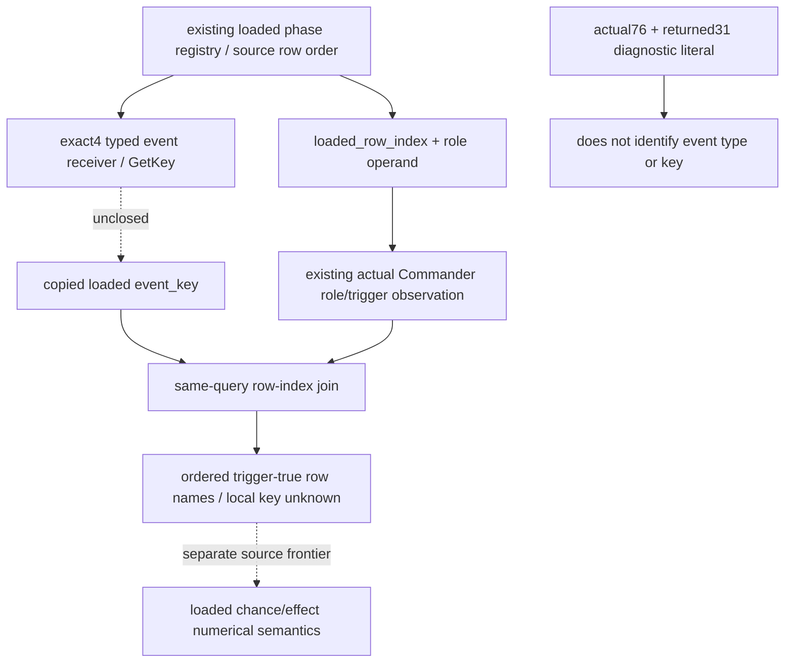

# Loaded phase-event key inputs — CK3 1.20.0.4

This source30 input package prepares a typed loaded-event key extension for the existing readonly phase-event role registry. A concrete loaded key will let the current Commander trigger consumer attach a name to each passed row. It will not establish that an effect fired, identify a probability, execute an effect, or close a numerical phase transition.

## Source baseline and current boundary

The private source tree is `C:/codex-ck3-background/g2-phase-admission-source24`, parent-owned branch `g2-phase-loaded-event-key-source30`, baseline `896` with the Root29 shared-hook dependency explicit. Target is CK3 1.20.0.4 / Steam build 25734779, executable SHA-256 `98702F88A547CDE2EAF29A85F93B85F68EE4CF8148336A4F7AFAEB75319DD518`.

The existing actual selector prefix closes the loaded phase database singleton slot `0x5D27B90`, row-pointer array `database+0x50`, signed count `+0x5C`, pointer stride 8, row role DWORD `+0x1B0`, and trigger receiver `row+0x40`. It does not read or type a key member at `row+0x18`. The phase database getter's initialization suffix was the authorized finite source30 entry; Main reported the actual 76-byte suffix and 31-byte returned literal. That literal is the diagnostic **`Instance has not been created!`**, not a phase-event type name or event key. It does not close a typed event constructor, common definition base, GetKey receiver or key offset.

Typed key source therefore remains **unknown**. Native ownership is currently checking only the already-cached fire receiver at `0x264E680` for a source-linked key address. This input package requests no new EXE read, assumes no cached result, and implements no unknown offset. The separate native source tree records any later receiver/GetKey closure.

Existing exact4 CString readers can copy a source-proven string address. For example, `ReadPlayerLifestyleMsvcStableKey12004V1` reads the 32-byte MSVC string header, size `+0x10`, capacity `+0x18`, and its inline/heap storage. That decoding knowledge does not prove that a `CCombatPhaseEventType` receiver has a CString at `+0x18`. A direct typed GetKey result can be reused only after its receiver, return representation and exact4 source are closed. No phase key is inferred from the diagnostic literal, a stock row ordinal or a generic definition layout.

## Existing publication and minimal extension

The existing key is `phase_event_role_compatibility_v1`, schema 1, scope `v2_roster_loaded_event_role_condition`. Root, occurrence and condition keys retain their current meaning. `loaded_registry.rows[]` currently publishes only `loaded_row_index`, nullable `role_operand_raw`, `status` and `unavailable_reason`. Its status/reason describe role observation. This is a precontact-capable role observation and requires no current CombatSide.

The accepted future extension is limited to:

| Location | Planned optional field | Meaning |
| --- | --- | --- |
| `.loaded_registry` | `event_key_source_closed: bool` | The exact4 typed receiver/GetKey and returned key representation have been source-qualified. This is separate from role comparison source closure. |
| `.loaded_registry.rows[]` | `event_key: string or null` | Copied full loaded event key for this row. An observed key is a nonempty string; no stock-name fallback or invented name is used. |
| `.loaded_registry.rows[]` | `event_key_unavailable_reason: string or null` | Null for an observed key; a nonempty local reason for an unreadable/unqualified key or unavailable row receiver. |

When the registry extension is absent, row extensions are absent and legacy frames remain unchanged. When the extension is emitted, both key fields are emitted for each existing row. Key availability is independent of role availability: a role member may be unreadable while the typed key remains observable, or the key may fail while a role condition remains known. A key failure does not change registry/row role status, role conditions, current trigger booleans, trigger counts, Commander identity facts, base completeness or MC readiness.

The strict optional normalizer will validate the old role fields once, then normalize the key extension. An invalid extension is isolated to key observations and retains valid old role facts; it does not erase role or trigger observation merely because naming failed. Unknown top-level/base role fields remain subject to the existing contract. No new root key, MCP, Army/Side observer or role gate is required.

## Concrete DTO and serializer seams

| Existing file / function | Planned delta after typed source closure |
| --- | --- |
| `native_bridge/include/xar_bridge/phase_event_role_compatibility_v1.hpp` / `PhaseEventLoadedRoleRegistryV1`, `PhaseEventLoadedRoleRowV1` | Optional extension metadata and per-row copied key/reason; default omission preserves legacy emission. |
| `native_bridge/include/xar_bridge/ck3_12004_phase_event_role_compatibility.hpp` / `ReadPhaseEventRoleInputs12004` | Reuse the already-read loaded event pointer and invoke only the newly qualified typed key reader. Do not guess a member offset or call database initialization. |
| `native_bridge/include/xar_bridge/phase_event_role_compatibility_v1_serializer.hpp` / `AppendPhaseEventRoleCompatibilityV1` | Emit registry metadata and paired row key fields only when the extension is present. Existing role fields remain unchanged. |
| `src/xar_autoplayer/bridge/phase_event_role_compatibility_contract.py` / `normalize_phase_event_role_compatibility_v1` | Accept the explicit optional field set and preserve absence; local key failures retain valid role values. |
| Existing `combat_contract.py` optional role attachment | Already reaches the same query output; no new root key or attachment hook is needed. |

Main owns future native bindings, DTO, collector, serializer and fixture integration. This package changes no production file. The exact binding signature and storage representation remain pending typed source closure rather than being invented here.

## Consumer join and duplicate keys

The proposed pure consumer signature is `current_commander_admitted_event_keys(role_leaf, trigger_occurrence)`. It selects only conditions whose `role_and_trigger_valid` is true and joins them to the same-query registry row by `loaded_row_index`. Its ordered result is `[{loaded_row_index, event_key, event_key_unavailable_reason}]`. A true row with an unavailable key stays in the result with null key/reason; naming failure never becomes trigger false or removes the passed row.

Duplicate event keys are preserved as distinct source rows. The consumer never builds a key-to-single-row dictionary, deduplicates names, changes load order or sums rows as a probability. A key shared by a rejected and passed row does not transfer the rejection or admission between them. Roster occurrences also remain separate when full CharacterIDs repeat. The existing actual Commander/Side context scope is preserved; hypothetical encounter orientation does not become actual context.

For legacy frames without the extension, the consumer retains passed row indices and reports no observed event key. A complete named result means only that all these passed rows have observed keys. It does not mean selected event, positive native chance, fired effect, complete phase effects or forecast readiness.

## Unique future FIRST and Oct8 / W41 delivery

The future sole new whole registered-service compound has exactly `named_rows`, `key_read_failure`, `duplicate_keys`. Each new whole-V2 sample will be serialized by the integrated production serializer and traverse one real `create_server(driver).call_tool("ck3_query_combat_simulation_inputs", arguments)`. Root will retain the whole cache/JSON result, source-qualified fixture receipt and native typed-reader callback receipt. Only reusable endpoint/snapshot constants may be imported from the old helper module; no old test class or GREEN compound is rerun.

All three scenes preserve the same role0/role1 catalog and actual Commander trigger observations. `named_rows` exposes concrete synthetic keys for current passed rows. `key_read_failure` keeps a passed row admitted while its key is null with a local reason. `duplicate_keys` has separate loaded rows with the same key and proves that passed-row reporting preserves source indices/order without merging. Fixture names are authored synthetic values after closure and carry no stock or live identity credit.

The exact future observer and FIRST recipe is recorded in external `commander-loaded-key-source30/input-layer/DTO-HOOKS.json` and `FIRST-RECIPE.md`, with Oct8/W41 fields in `OCT8-W41-FIELDS.json`. Current state is **research / planned-NOTRUN**; no new key readiness is claimed. Existing calendar, role, actual Commander trigger, identity and forecast readiness are preserved. This child has performed no game, SDK, process/window, import, build, test, EXE read, cached whole read or git operation. Main stages only this new topic; future implementation waits for source closure and an explicit follow-up.
