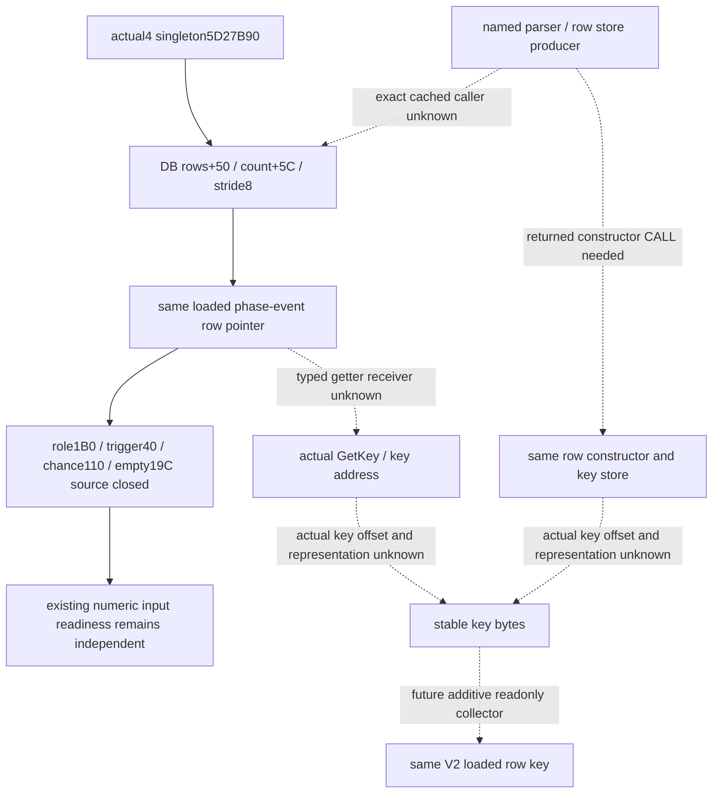

# Actual4 phase-event typed stable-key receiver entry

October 8 / ISO 2026-W41. Source33 is an independent cache-first receiver
locator. Source base is `f3fd6098fa45fa34c1294facf638ae3208b92118`;
CK3 1.20.0.4, Steam25734779, EXE SHA256
`98702F88A547CDE2EAF29A85F93B85F68EE4CF8148336A4F7AFAEB75319DD518`.
State is **research**. No new fixture, import, executable capture, native
call, game, SDK, compilation or test has run for this package.

The decision value is to associate current native-admitted event row
weights with a real loaded event definition. A typed stable key permits
selected script-effect families to be joined without replacing actual
loaded chance with stock values. It does not identify a chosen event or
prove that effects fired. Source31 numerical observations and Source32
positive-row effect-empty operands remain independent of this name.

## Source chain and concrete next input

The actual loaded singleton slot is module+5D27B90. Its database rows use
+50, count+5C and pointer stride8. Existing source proves role+1B0,
trigger+40, chance+110 and the same selected row's effect-empty DWORD+19C.
The getter2653860 is already closed; its error suffix calls3F8B640 with
`Instance has not been created!`, not a typed constructor. Existing
postselection fallback slot5D27B80 does not identify a key receiver.
Neither the diagnostic helper nor adjacent runtime functions are useful
next captures for naming these rows.

A new exact-operand cache lookup searched only previously parsed
`function-match-core/new-*-INSTRUCTIONS.json` for actual singleton5D27B90
(hex and decimal97680272). It found no cached operand hit. Shared-span
JSON holds capture metadata rather than decoded instruction operands;
its filename inventory supplies no producer pin. This result is scoped
to those cache formats and is not an executable or type absence claim.
No binary cache or executable was scanned. Prior seven manifest/type-name
negatives are reused, not requalified.

The missing positive pin is one same-receiver source: a parser/store
producer for database+50 whose incoming row's constructor/key store is
identified, or an exact typed GetKey receiver bound to a row from this
database. Class text alone and a generic string getter for another type
do not provide that row-to-key edge. Historical1.19 event+18 remains only
that build's fact. The actual3/actual4 member offset and representation
remain unknown.

Root owns selection of the next executable file capture. The external
`ROOT-MINIMAL-TYPED-KEY-ENTRY.json` deliberately contains no executable
row while an actual source RVA is unlocated. Supply a concrete cached
caller/type receiver, its returned actual CALL or RIP, and the reused
metadata interval. Then select only the shortest necessary instruction
prefix proving the same row receiver and key address/store; the initial
proposal is at most64B/1read, or a smaller cached extent. Literal-only
bytes are requested only after that prefix returns their exact address
and length. No global scan, neighboring ordinal inference, whole
function expansion or diagnostic helper capture is part of this recipe.

battle_entry owns the distinct authored `combat_phase_events`
registration/parser-literal cached lane. This package owns the
getter/selector/database-pointer receiver lane. Root's Runtime31
integration consumes Source32's committed delta separately and does not
wait for this name branch. Further source and observer implementation
remain pending the positive receiver pin; no null-valued key schema is
introduced as a completed observation.

## Distinct cached registration lane result

battle_entry's sole new cached decode of retained exact3 startup[8000,A000)
finds0 authored `combat_phase_events` length19 constructor operands and
0 exact5D27B90 operands. Its2133 decoded instructions stop at9FFC; the
remaining window-tail bytes are not claimed complete instructions.
Existing99C0 initializes named `combat_side` for5D4BD6C, a separate
registry. This supplies no actual4 typed caller, literal or constructor
address. The new result is [preserved here](Z:/ck3_mod_rewrite_process_assets/g2-background-20261008/phase-event-parser-caller-frontier/CACHED-STARTUP-CALLER-RESULT.json).
It is not repeated, expanded or converted into an executable absence claim.

The two distinct cache lanes now both lack a positive producer pin.
Root must select a concrete retained parser/store/GetKey receiver from
another source path before requesting fresh bytes. The next capture row
therefore remains empty, and no function-size or address is invented.
Once that exact entry exists, the same private tree can implement the
additive loaded-row key observer and author its unique FIRST. No new
schema-only null key is published in this source package.
