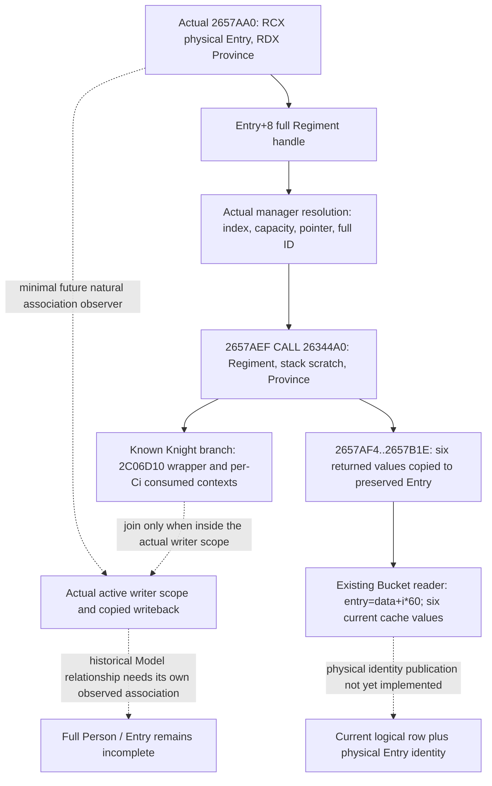

# Actual4 physical Entry cache writer

The exact 1.20.0.4 writer at `0x02657AA0` associates a physical Entry receiver with the six cached stats returned by `0x026344A0`. This closes the native writeback edge. It does not make an arbitrary output scratch pointer a physical Entry, and it does not establish a historical Person Model association by itself.

The frozen executable is Steam build `25734779`, SHA-256 `98702F88A547CDE2EAF29A85F93B85F68EE4CF8148336A4F7AFAEB75319DD518`. Root captured one new 136-byte span `[0x02657AA0,0x02657B28)` on October 10, 2026 at 06:36 CST (`2026-10-09T22:36:18.635665Z`). All 136 bytes decode into 39 instructions, ending at `RET 0x02657B27`. The earlier cached runtime-index correspondence was only a candidate; these actual instructions establish its role.

The immutable original evidence is [SOURCE-CAPTURE.json](Z:/ck3_mod_rewrite_process_assets/g2-background-20261010/person-physical-entry-frontier/actual-entry-writer01/SOURCE-CAPTURE.json) and [2657AA0.asm](Z:/ck3_mod_rewrite_process_assets/g2-background-20261010/person-physical-entry-frontier/actual-entry-writer01/2657AA0.asm). No previous body, PE metadata or hash was replayed.

| Actual instruction | Consumed or produced value |
| --- | --- |
| `2657AAD MOV R9,RDX` | Preserve the original Province argument. |
| `2657AB0 MOV RBX,RCX` | Preserve the original physical Entry receiver. |
| `2657AB8 MOV EDX,[RCX+8]` | Read the full Regiment handle from Entry. |
| `2657ABD..2657ADE` | Mask the low 24-bit index, check unsigned capacity, load the 16-byte table row, check pointer and full ID at Regiment+10. |
| `2657AE0` | Use the actual RIP-selected fallback when the manager or full-ID resolution fails. |
| `2657AE7 MOV R8,R9` | Pass the original Province to the stat producer. |
| `2657AEA LEA RDX,[RSP+20]` | Supply a stack output scratch record. |
| `2657AEF CALL 26344A0` | Evaluate the resolved Regiment at the Province; return to `2657AF4`. |
| `2657AF4/2657AF7` | Copy returned DWORD+8 to Entry DWORD+30 (max size). |
| `2657AFA/2657AFE` | Copy returned QWORD+10 to Entry QWORD+38 (siege). |
| `2657B02/2657B06` | Copy returned QWORD+18 to Entry QWORD+40 (damage). |
| `2657B0A/2657B0E` | Copy returned QWORD+20 to Entry QWORD+48 (toughness). |
| `2657B12/2657B16` | Copy returned QWORD+28 to Entry QWORD+50 (pursuit). |
| `2657B1A/2657B1E` | Copy returned QWORD+30 to Entry QWORD+58 (screen). |

The stat record returned in RAX is distinct from RBX, the preserved Entry. The final QWORD load also replaces RAX, so the writer's eventual return value must not be labeled as an Entry pointer.

The existing `ck3_12002_battle.cpp::Bucket` reader already computes `entry=data+i*0x60`, reads the same six inline cache offsets and calls `get_combat_regiment_strength(entry)`. Actual4 battle-control dispatch uses that reader with actual4 bindings. The current normalized row retains logical bucket/index, Army, Regiment and Character fields, but omits the physical Entry address. A current-row publication can therefore reuse that exact local pointer; it needs no new native getter. Such a current read cannot establish which historical preparation Model produced the values.

The smallest natural association is a scoped observer around this proven writer: retain its actual Entry and Province arguments, run the original once, and preserve the six writeback values. A nested Knight wrapper event can inherit Entry identity only while this actual writer scope is active. A direct `26344A0` query, including the existing query scratch path, stays a query computation. An unclassified natural wrapper call stays unclassified.

The independent Knight consumption package remains useful without that additional writer observer: it copies the nine actually consumed contexts and the actual numeric output, and compares their arithmetic. It grants no physical Entry association. There is no new bridge implementation, build, FIRST or live qualification for the physical writer in this source-evidence delivery. FullPerson, FullEntry and G2 credit remain false.
