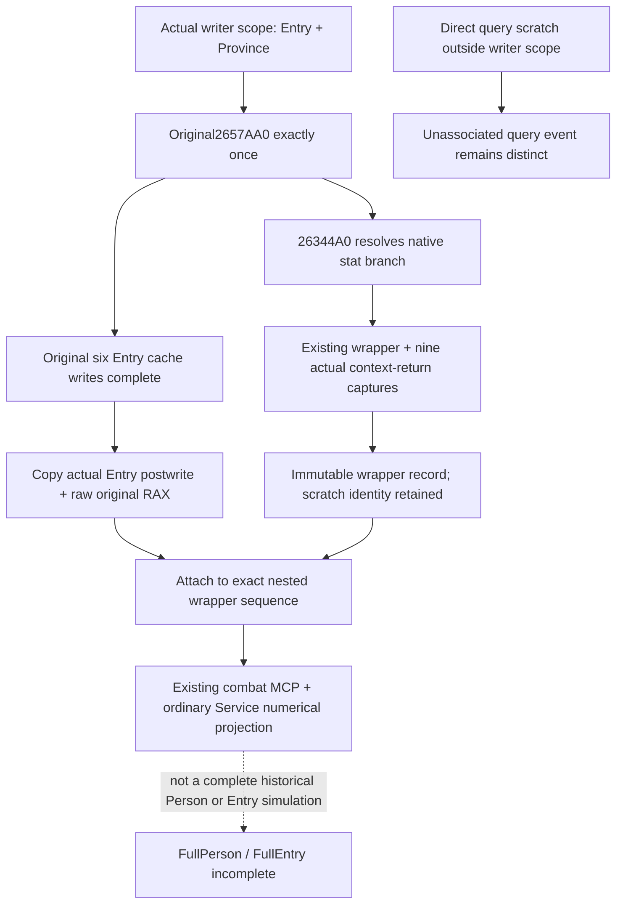

# Physical Entry association at actual writeback

The exact-build function `2657AA0` is the physical Entry cache writer. Its original RCX is retained in RBX; original RDX is Province. It resolves the full Regiment ID at Entry+8, calls `26344A0` at `2657AEF`, and copies the returned six stats to Entry+30/+38/+40/+48/+50/+58 before RET2657B27. Root's single 136B capture is [the actual source evidence](Z:/ck3_mod_rewrite_process_assets/g2-background-20261010/person-physical-entry-frontier/actual-entry-writer01/SOURCE-CAPTURE.json). The frozen build is 1.20.0.4/25734779, SHA `98702F88A547CDE2EAF29A85F93B85F68EE4CF8148336A4F7AFAEB75319DD518`.

This source package adds a scope around that actual writer and reuses the existing two Knight consumption observers. Nested wrapper records retain their original output scratch identity and independently copied Ci contexts. After the original writer returns once, the scope attaches an owned copy of the actual Entry identity, Province, full Regiment handle, six postwrite cache fields and raw unsigned RAX return to the exact nested wrapper sequences. Current query pointers are never substituted for that historical writeback.

The original writer return is the last loaded screen Q64 bits, not an Entry pointer. The detour therefore has a `uint64_t` return and preserves it unchanged. Its displaced 16-byte prefix includes a RIP-relative load. The 36-byte trampoline preserves the first six push/sub bytes, expands the load into `mov r8,base+5D1F340; mov r8,[r8]`, preserves `mov r9,rdx`, and jumps to `base+2657AB0`. The expansion uses only R8, already overwritten by the original instruction, and adds no call, stack adjustment or flag change.

The physical association does not depend on equality of the copied numeric fields. A mismatch is published as a comparison result; an auxiliary copy failure preserves the association and precise unavailable fields. Neither case suppresses the original native operation. A direct `26344A0` query remains `bridge_query_scratch`; an unclassified wrapper remains unclassified. Only a completed actual writer scope grants `native_physical_entry_writer` provenance.

The optional per-event writeback preserves old packets and the existing MCP arguments. It makes current native cache production observable and allows the exact per-Ci arithmetic projection to be compared with both wrapper output and physical postwrite. It does not grant complete Person, Entry, battle outcome, ordinary action or G2 milestone credit. Source and the one new whole/registered consumer remain AUTHORED_NOTRUN until Root executes them.

The sole synthetic fixture deliberately supplies max17/siege-111/pursuit222/screen-333 in its typed original callback. These test signed cache transfer and the unsigned return bit pattern, not the native Knight branch's ancillary arithmetic (which remains zero in the source-derived projector). Its damage/toughness follow the actual Ci calculation. The expected four numerical mismatches remain visible while all six wrapper-to-Entry copies match. No comparison mismatch is converted into a loss of physical association.
