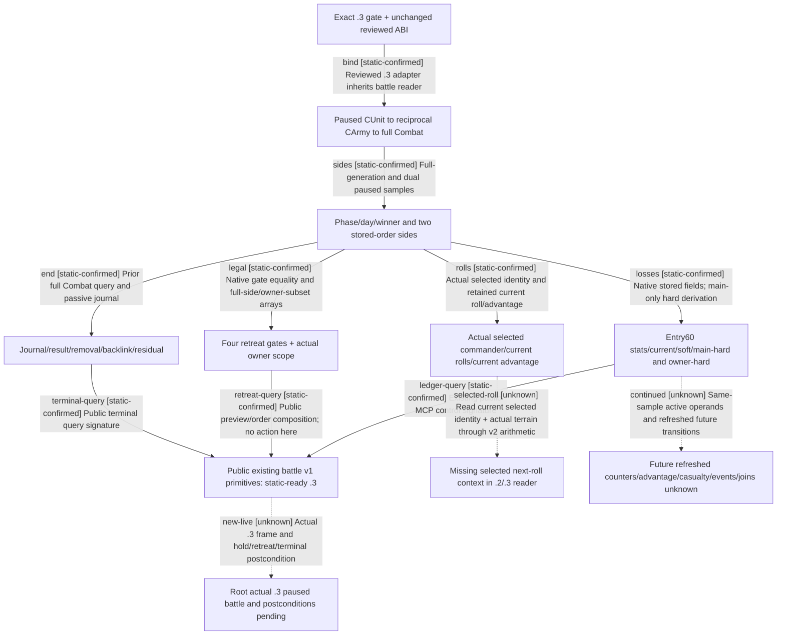

# Research plan: battle-readiness-12003-20261003

GENERATED from the supplied research plan; no native semantics are inferred.

Question: Which existing exact .3 native observations can drive the current Robert battle loop, and which concrete missing fields prevent contextual commander assessment and resumed forecast?



| Edge | Declared status | Evidence IDs | Open question |
|---|---|---|---|
| bind | static-confirmed | adapter3, adapter2, reuse, core-comparison, battle |  |
| sides | static-confirmed | battle, semantic-ledger |  |
| losses | static-confirmed | battle, semantic-ledger |  |
| rolls | static-confirmed | battle, semantic-ledger |  |
| legal | static-confirmed | battle, semantic-ledger |  |
| end | static-confirmed | battle, semantic-ledger |  |
| ledger-query | static-confirmed | public-mcp, adapter2 |  |
| retreat-query | static-confirmed | public-mcp, semantic-ledger |  |
| terminal-query | static-confirmed | public-mcp, adapter2 |  |
| new-live | unknown |  | Root&#x27;s current Robert .3 actual battle artifact and desired primitive have not been supplied to this child. |
| selected-roll | unknown | battle, combat, contract | Existing next-roll DTO remains not_sampled in the .2/.3 battle reader; candidate v2 bounds cannot substitute selected combat context. |
| continued | unknown | battle, semantic-ledger | Active resume richer leaves, complete phase/event feedback, future actual join and exact resumed trace are not supplied; existing current ledger is sufficient only for observed comparison and primitives. |

| Observation design | Value |
|---|---|
| mode | offline-only |
| actor_kind | engine |
| owner_scope | File-only preparation for root-owned Robert29829 campaign; actual full CUnit/Combat/Province identities must come from root&#x27;s current paused frame. |
| identity_kind | generation-id |
| identity_lifetime | One actual paused native/public revision, current exact build and session; reload, deletion, changed date, route or membership invalidates comparison. |
| producer_trigger | not-applicable |
| producer | This package reads pinned producer/reader sources and existing ABI comparison only; it neither waits for daily production nor connects to CK3. |
| caller | Root&#x27;s existing public battle v1/combat v2 MCP methods, only when advertised by its actual loaded .3 hello; no child runtime call. |
| consumer | Root tactical readiness/query preparation; no child counter-policy or new gameplay command. |
| cache_lifetime | Frozen file pins only; root live values are separately bound to their actual frame and never copied from historical episode IDs. |
| expected_signal | Current advertised query signatures, full battle phase/loss/commander/retreat/terminal projections, and explicit absent selected-next-roll/active-resume/full-phase operands. |
| zero_sample_meaning | No new live sample in this offline package does not imply no battle, no candidate or a zero casualty/roll/event probability. Core ABI GREEN is not .3 live. |
| stop_condition | One source review and existing result reuse, one record render; root-owned current query is the next live step, not a child sampling loop. |
| runtime_window_ref | Root delegation 2026-10-03; root sole game/SDK/pipe/Git owner. This package authorizes and performs no runtime observation. |

| Evidence ID | Declared layer | File | SHA-256 | Supports |
|---|---|---|---|---|
| adapter3 | source-contract | Z:\ck3_mod_rewrite_process_assets\g2-resume-20261003\war-battle-phase\evidence\adapter3.cpp | f255c46744b7fc4cfd591b664ce791a4b78a0aa97ff06e132336602e935d2559 | Independent exact .3 SHA gate and inherited .2 production capability descriptor. |
| adapter2 | source-contract | Z:\ck3_mod_rewrite_process_assets\g2-resume-20261003\war-battle-phase\evidence\adapter2.cpp | 73d66ca49908aeabc9a172fe61214da797465bfa5b8a790c2573c73d4a37b38e | Advertised battle v1/combat v2 primitives, and non-advertised full v3 despite its adapter method. |
| battle | source-contract | Z:\ck3_mod_rewrite_process_assets\g2-resume-20261003\war-battle-phase\evidence\battle.cpp | ae42c96618abd2a074b08e4757c5d735ebc10baafcadeb55d5afc3452eec6922 | Manual source review of full IDs, phases, side Entry60/owner loss ledgers, current rolls/advantage, native four-gate legality, terminal and reinforcement readers. |
| combat | source-contract | Z:\ck3_mod_rewrite_process_assets\g2-resume-20261003\war-battle-phase\evidence\combat.cpp | 3181428b014f85a3c0780f3ed53a920225febbc2bffcf9438669a875f02d6818 | Candidate commander and contextual roll bounds arithmetic; distinguishes hypothetical army commander from actual selected combat commander. |
| combat-header | source-contract | Z:\ck3_mod_rewrite_process_assets\g2-resume-20261003\war-battle-phase\evidence\combat-header.hpp | 2e61eacd566150578ff4b4d1641ea3c7b3a2350f5ea5594a31cc72ebe47d5e28 | Existing modifier/terrain/define bindings for explicit observation construction entry. |
| contract | source-contract | Z:\ck3_mod_rewrite_process_assets\g2-resume-20261003\war-battle-phase\evidence\contract.hpp | 4f21ec25e9a15b956c0c3a6a12981d427709125332a3e4a3fa9006c16258939f | Existing version-neutral next-roll DTO and battle/counter fields, with unavailable defaults not claimed observed. |
| public-mcp | source-contract | Z:\ck3_mod_rewrite_process_assets\g2-resume-20261003\war-battle-phase\evidence\public-mcp.py | eb01ef4704914ec5f207065712a6d3c8a01423c77c049681c9f02edb59d61158 | Exact public MCP method names and argument signatures; Python method existence does not prove native advertisement or a live result. |
| reuse | source-contract | Z:\ck3_mod_rewrite_process_assets\g2-resume-20261003\war-battle-phase\evidence\reuse.json | ff7a5b1a8208d7ce0358be3cd2fec9f455a4ba116ccf1b25c4ccf0f0b64dd119 | Permanent exact .3 mapping of reviewed .2 battle/combat/phase/advantage/definitions contracts. |
| core-comparison | offline-fixture | Z:\ck3_mod_rewrite_process_assets\g2-resume-20261003\war-battle-phase\evidence\core-comparison.json | 5bd80588c3021bf300edda12a63b8d96fbefdb484f0d869ee129d0fc5a81876d | Reuse existing .3 unchanged ABI comparison for battle/combat/phase/advantage/definitions; no new ABI scan or live credit. |
| stock-defines | source-contract | Z:\ck3_mod_rewrite_process_assets\g2-resume-20261003\war-battle-phase\evidence\stock-defines.txt | 8e430d77eb6e8767030f34b1c53d5dae84277fb354bd73cc42f93dc500be8982 | Current installed NCombat constants and comments; file values are distinct from actual runtime playset values. |
| stock-commander-events | source-contract | Z:\ck3_mod_rewrite_process_assets\g2-resume-20261003\war-battle-phase\evidence\stock-commander-events.txt | 1a6eac4a0714c947a822193e60af589aec31fa92857558df0616a45317654871 | Current installed commander event source; runtime loaded evaluator and future selected row remain unobserved. |
| stock-knight-events | source-contract | Z:\ck3_mod_rewrite_process_assets\g2-resume-20261003\war-battle-phase\evidence\stock-knight-events.txt | 6307140e6f0543d9c44cacf40771710032a050279b82b0074a86df7b68e3cadf | Current installed knight event source; separates character events from numeric troop casualty ledger. |
| semantic-ledger | source-contract | Z:\ck3_mod_rewrite_process_assets\g2-resume-20261003\war-battle-phase\evidence\semantic-ledger.md | cad760c96f89f99d5e60fe90ca0c892a23bc7e4e34a5ca34422eaa05af1458fa | Manually authored .3 observation interpretation, candidate/selected distinction, actual missing fields and next construction entries; no future odds or new live claim. |

Check result (file integrity and declarations only):

```json
{
  "schema": "xar.native-research-plan-check.v1",
  "result": "plan-consistent",
  "proof_layer": "record-structure-and-file-integrity",
  "semantic_correctness_verified": false,
  "live_execution_performed": false,
  "observation_plan_issues": [
    "offline-only plan does not define a live observation window",
    "the real producer trigger must be located before live sampling"
  ],
  "declared_edges_by_status": {
    "counter-policy": 0,
    "inference": 0,
    "live-confirmed": 0,
    "static-confirmed": 9,
    "unknown": 3
  },
  "enumerated_native_edges": 12,
  "declared_cases_by_status": {
    "pending": 2,
    "observed": 0,
    "not-applicable": 1
  },
  "checked_evidence_files": 13,
  "limitations": [
    "Evidence layers and conclusions are author declarations; hashes bind bytes, not their truth.",
    "Counts cover this enumerated graph only, not all CK3 branches.",
    "A consistent observation plan is not authorization to run or manipulate CK3."
  ],
  "plan_sha256": "22a6274519a659c22fe8c5e24b138f2f8874451e79940c20b2d99a20c354c4eb"
}
```
