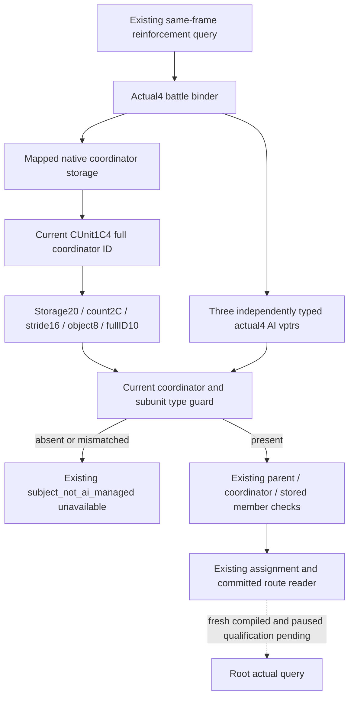

# Actual4 reinforcement AI binding restoration

The R0054 existing reinforcement query returned `subject_not_ai_managed` for
Robert's moving army. That is a legitimate result for a player-controlled scene,
but the actual4 binder also omitted four existing AI fields. A null coordinator
binding forces the same guard to reject every otherwise resolvable subject, so
this response cannot prove that its actual coordinator or subunit was absent.

`BindBattleForQuery12004` supplies actual Combat/Army/Province dependencies to
`ck3_12004::BindBattleImage`. Neither the dependency bundle nor another caller
fills the AI coordinator storage or the three expected AI vptrs. The shared
`ReinforcementSample` resolves current CUnit and CArmy backlink, then reads
`CUnit+1C4` and `CUnit+1D0`; its current `subject_not_ai_managed` guard combines
absent coordinator, coordinator vptr mismatch, absent subunit and subunit vptr
mismatch. The later parent/coordinator guard remains distinct.

## Source-first finite plan

The existing Army and Battle actual4 owners returned scoped held misses for
these four operands. Root authorized only their finite exact3-to-exact4 source
mapping. Four independent entries reuse cached PE/runtime-function metadata and
the sole finite mapper; no whole-image scan, PE/pdata re-read, EXE hash, native
callback, current object read or game operation is performed.

The complete 69-byte actual4 instruction span at `1A07710..1A07755` matches
the persisted exact3 lookup at `1A07730..1A07775` after separating relative
addressing, retaining concrete member operands, local branches and ordered RIP
roles. Both actual guard/load instructions select storage
`5D20550`; the actual fallback remains `5D20560`. The fallback does not establish
AI membership. All old bytes are reconstructed verbatim from the previously
pinned `war-native-target-ai/slice-01a070f0.asm.txt`; only the 69 new bytes are read.

Actual `CAISubunitStack` vptr `45AB4C0` is selected by destructor LEA `1A19C2A`
and stored at `1A19C34`. Its new COL `4BEEAD0` names TypeDescriptor `5818498`,
`.?AVCAISubunitStack@@`, and first slot `1A19BE0`. Complete 52-byte deleting
destructor and 269-byte producer match concrete instructions across builds,
including size58, ID vector10/count1C/stride4 and CUnit backlink write1D0.

Actual `CAIWarCoordinator` vptr `45AB0C8` is selected by constructor LEA `19FC7BA`
and stored at `19FC7C1`. Its new COL `4BEE5B8` names TypeDescriptor `5817C58`,
`.?AVCAIWarCoordinator@@`. The reused old constructor prefix retains full ID10
initialization and type tag14; the mapped deleting destructor retains size1B88.
These are distinct actual producer proofs, not a uniform vtable address shift.

Actual `CAIUnitStack` vptr `45AA618` is selected by main-destructor LEA
`19EF7EA` and stored at `19EF7F4`. The matched complete 52-byte deleting
destructor at `19EF6F0` calls this producer at `19EF7E0`; its size98 and receiver
data28/count34 operands remain exact. Its independent COL/type-name proof is
retained with the UnitStack source receipt: primary COL offset0/self is verified
and both build names are `.?AVCAIUnitStack@@`. Only the required 31 complete
producer-prefix bytes are decoded from a 32-byte read; its whole main destructor
is not expanded.

| Existing field | Actual4 RVA | Concrete source |
| --- | --- | --- |
| `ai_war_coordinator_storage_slot` | `5D20550` | Guard/load RIP at `1A07710/1A07721` |
| `ai_unit_stack_vtable` | `45AA618` | LEA/store at `19EF7EA/19EF7F4` |
| `ai_subunit_stack_vtable` | `45AB4C0` | LEA/store at `1A19C2A/1A19C34` |
| `ai_war_coordinator_vtable` | `45AB0C8` | LEA/store at `19FC7BA/19FC7C1` |

## Scope and qualification

Only the four existing assignments inside the actual4 factory CPP are changed;
all public and profile headers remain byte-identical.
There is no new flag, capability, DTO, unavailable reason, query or policy.
The existing player-scene and type/membership rejection semantics stay intact.
No actual AI member, route, reinforcement arrival or battle action is inferred
from static addresses. This package is source-only until Root centrally compiles
and consumes a fresh existing query. Zero tests, builds, production imports,
SDK calls and game operations are performed by this lane.

Old source locator reuse and finite per-entry read ledgers are retained under
`Z:/ck3_mod_rewrite_process_assets/g2-background-20261007/upstream-build-migration/reinforcement-ai-binding-review/`.

The four lanes read **1,509 finite EXE bytes in 30 reads**: storage69/1,
UnitStack318/10, SubunitStack818/10, Coordinator304/9. Physical old/new totals
are716/793 bytes; the persisted old storage69B and coordinator constructor24B
are reused separately. The four source receipts are
`coordinator-storage/SOURCE-PROOF.json`,
`unit-stack/AI-UNIT-STACK-VTABLE-MAP.json`,
`subunit-stack/ROOT-DELIVERY.json`, and
`coordinator-vtable/CAIWARCOORDINATOR-SOURCE-PROOF.json`.

Root adopts only the child source commit, compiles `ck3_12004_battle.cpp` once
against the unchanged header set, and qualifies the existing query on a fresh
same-frame subject. Public/profile headers, shared reader/serializer, flags and
command-entry trace are unchanged. Receipt and Oct7/W41 fields are in the
packet's `ROOT-DELIVERY.json` and `OCT7-W41-FIELDS.json`.
