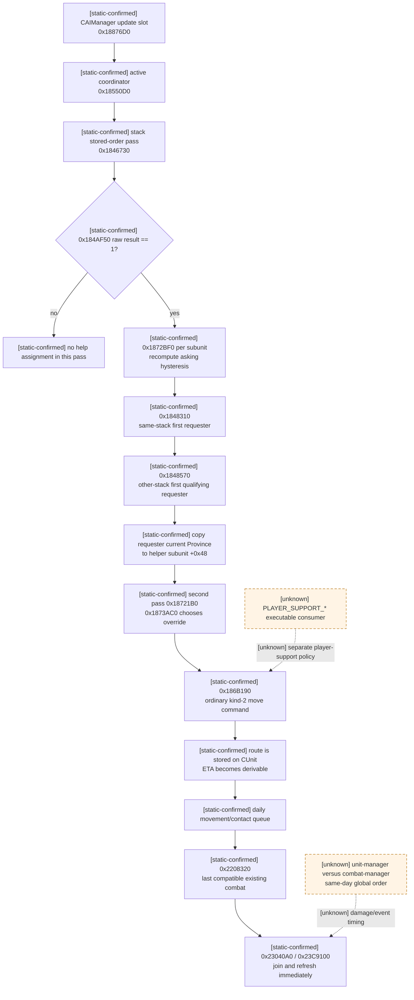
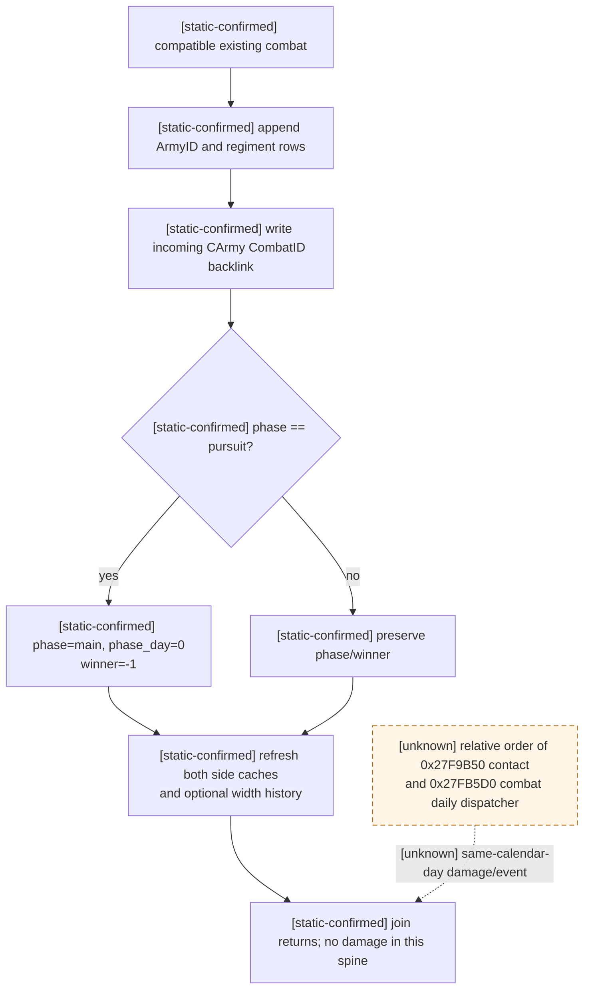

# CK3 1.19.0.6 原生 AI 战斗增援、到达与加入既有战斗

## 范围、版本与证据边界

- [static-confirmed] 本文只绑定 CK3 `1.19.0.6` 的
  `Crusader Kings III/binaries/ck3.exe`，SHA-256 为
  `2D00FF3101EF70B566F2FCBAE292F09263199C80E9DC8F139B82D7D96F83DB86`；所有地址均为 RVA。
- [static-confirmed] 原版 AI define 来自
  `game/common/defines/ai/00_ai.txt`，SHA-256 为
  `C78F9CD8DF9938CC9F38E817BCB6E32CD13720B5BD9DE077B85E3E1C6F030293`。
- [static-confirmed] 本轮只做冻结 EXE 的静态反汇编、RTTI、direct xref 与原版数据互证。没有启动 CK3，
  没有 live snapshot，也没有调用任何 AI update、移动提交、战斗加入或战斗构造函数。
- [static-confirmed] 本页研究的是普通 AI-to-AI 求援链。`PLAYER_SUPPORT_*` 是另一套“AI 支援玩家军队”数据；
  其 define 已确认加载，但本轮没有闭合它们的生产消费者，不能混入普通 `0x1848310/0x1848570` 树。
- [static-confirmed] 配套机器账本为
  `ck3_autonomous_player/native_bridge/research/battle_reinforcement_and_join_v1_abi.json`。
  它仍是 `research_static_only`，不是已发布 query、command 或 live capability。

证据标签遵循 [README.md](README.md)：`static-confirmed` 是 frozen data 或 exact-build 指令直接支持，
`bridge-design` 是在该证据上定义的最小只读投影，`unknown` 是尚不能据此实现原生行为的缺口。所有 Mermaid
未闭合分支均为虚线。

## 先给结论

1. [static-confirmed] 求援状态属于 **`CAISubunitStack+0x50`**，不是旧文曾写的
   `CAIUnitStack+0x50`。bit `0/1/4` 分别是当前 asking、assigned-to-help、最近一次求援求值是否翻转。
2. [static-confirmed] `0x1872BF0` 用 `0x19186E0` 的 deterministic power-share ratio 做滞回：未求援时
   严格 `<0.66` 才开始；已经求援时严格 `<0.75` 才继续。它还读取当前 route 首边剩余 duration，
   但没有计算“helper 到战斗的完整 ETA”。
3. [static-confirmed] 同一个 `CAIUnitStack` 内由 `0x1848310` 按 subunit stored order 取第一个 requester；
   其它 stack 由 `0x1848570` 按 `Province*` 搜索表 stored order、再按 Province 内 unsigned full CUnitID
   数值序取第一个满足者。没有 ETA 最短、CombatID、objective score 或 request timestamp 排序。
4. [static-confirmed] 分配结果只把 requester **当时的 current Province 指针**复制进 helper 的
   `CAISubunitStack+0x48`；不保存 requester 指针，也不保存未来 CombatID。`0x1873AC0` 让该省份覆盖普通
   campaign target，随后走普通 kind-2 AI move command。
5. [static-confirmed] 因此未来 ETA 必须在 move route 已经与 `+0x48` 对齐后，从 `CUnit` route 重新计算；
   `CArmy+0x128` 在实际接触前仍无 CombatID。目标省当前存在的 compatible combat 只能称为
   present-time candidate，不能称为 assigned combat。
6. [static-confirmed] 抵达时 `0x2208320` 才扫描目标省的既有 CCombat，并选择 stored order 中最后一个
   forward-XOR-compatible active combat；随后按反向关系判 side。它不再读取求援 ratio、ETA、距离或 campaign score。
7. [static-confirmed] 加入操作在返回前就 tail-append ArmyID、按 incoming regiment stored order 建立新战斗条目、
   刷新双方 current/fighting cache，并在 pursuit 中把 phase 重开为 main、`phase_day=0`、winner 重置为 `-1`。
   [unknown] unit-manager contact pass 与 combat-manager 当日伤害/phase event 的全局先后仍未闭合，所以不能声称
   新加入者一定会或一定不会在同一 calendar day 承受一次 main-phase damage。

## 原生总树



## 冻结 define：哪些属于本链，哪些不属于

| define | stock value | 本轮闭合边界 |
|---|---:|---|
| `ASK_FOR_HELP_COMBAT_PREDICTION_RATIO` | `0.66` | [static-confirmed] `0x1873027..0x187303E` 未 asking 时使用 |
| `STOP_ASKING_FOR_HELP_COMBAT_PREDICTION_RATIO` | `0.75` | [static-confirmed] 同一分支在 prior asking 时使用 |
| `ASK_FOR_HELP_OTHER_STACK_TROOPS_RATIO` | `1.5` | [static-confirmed] `0x1848570` 普通 helper threshold |
| `ASK_FOR_HELP_OTHER_STACK_TROOPS_BREAK_SIEGE_RATIO` | `1.7` | [static-confirmed] 高进度 siege 时替代 `1.5` |
| `BREAK_SIEGE_TO_HELP_PROGRESS_THRESHOLD` | `0.6` | [static-confirmed] `0x1848659..0x184867D` threshold 选择 |
| `UPDATE_TARGETS_TICK` / `_LOPSIDED` | `7` / `14` | [static-confirmed] 本链没有读取；不能作为求援重算 cadence |
| `PLAYER_SUPPORT_WANTED_COMBAT_RATIO` | `5.0` | [unknown] 普通 helper 两函数未读取；专用消费者未闭合 |
| `PLAYER_SUPPORT_ATTACK_TARGET_MAX_DISTANCE` | `400` | [unknown] 同上 |
| `PLAYER_SUPPORT_ATTACK_MAX_ARRIVAL_DELAY` | `45` days | [unknown] 同上；不得给普通求援补一个 45-day gate |
| `PLAYER_SUPPORT_IGNORE_BAD_SUPPLY_WITHIN_STEPS` | `4` | [unknown] 同上 |
| `PLAYER_SUPPORT_ENEMY_POWER_MULTIPLIER` | `1.5` | [unknown] 同上 |
| `PLAYER_SUPPORT_MIN_SIEGE_STRENGTH` | `1.25` | [unknown] 同上 |
| `TARGET_SCORE_SUPPORT_PLAYER_ONE/TWO/THREE_STEP` | `1000/500/250` | [unknown] 属于 player-support target score；本轮没有闭合执行 caller |

EXE 中对应 `PLAYER_SUPPORT_*` ASCII 名位于 `0x4196198/0x4196168/0x4196398/0x4196368/0x4196340/0x4196318`；
当前 xref 只闭合 define 注册/反射，不能用字符串存在代替决策消费者。

## 对象所有权与最短稳定根

### RTTI 与对象大小

| 类型 | RTTI / vtable RVA | exact size / 用途 |
|---|---|---|
| `CAIUnitStack` | RTTI `0x52F9638`, vtable `0x4191870` | deleting destructor `0x18452C0` 显示 size `0x98` |
| `CAISubunitStack` | RTTI `0x52FC278`, vtable `0x4192778` | deleting destructor `0x186F180` 显示 size `0x58`；destructor `0x186F1C0` 清 backlink |
| `CAIWarCoordinator` | RTTI `0x52FB408`, vtable `0x41923B0` | CUnit 的 full coordinator ID 解析目标 |
| `CAIManager` secondary interface | RTTI `0x52FEBE8`, vtable `0x4193898` | slot `+0x30` 指向 `0x18876D0` |

### exact layout

`CAIUnitStack`：

| offset | [static-confirmed] 含义 |
|---:|---|
| `+0x08/+0x14` | `Province*` support-search candidate data/count；`0x1848570` 按 stored order 扫描 |
| `+0x28/+0x34` | full CUnitID data/count |
| `+0x40/+0x4C` | `CAISubunitStack*` data/count，保持 native stored order |
| `+0x58` | parent `CAIWarCoordinator*` |
| `+0x60` | campaign/assignment target-like pointer；正式业务类型未闭合 |
| `+0x6C` | countdown raw |
| `+0x74/+0x78/+0x79` | assignment/state raw |
| `+0x7C/+0x80` | cooldown raw |
| `+0x90` | flags raw |

`CAISubunitStack`：

| offset | [static-confirmed] 含义 |
|---:|---|
| `+0x10/+0x1C` | full CUnitID data/count |
| `+0x28` | same-coordinator `request_power_basis_raw`；只有 asking bit 为真时才有当前语义 |
| `+0x34` | cross-coordinator request-valid raw byte；生产者和正式业务名仍 unknown |
| `+0x38` | cross-coordinator request power raw；仅 `+0x34 != 0` 时由 `0x1848570` 消费 |
| `+0x40` | parent `CAIUnitStack*` |
| `+0x48` | support target override `Province*`；分配时复制 requester 的 current Province |
| `+0x50 bit0` | `asking_for_help` |
| `+0x50 bit1` | `assigned_to_help` |
| `+0x50 bit4` | prior bit0 XOR new bit0；最近一次 `0x1872BF0` 的 transition 标志 |

`CUnit/CArmy`：

| object | offset | [static-confirmed] 含义 |
|---|---:|---|
| `CUnit` | `+0x20` | current `Province*` |
| `CUnit` | `+0x30` | direct native movement-target `Province*` slot；不是 remaining-route final 的语义投影 |
| `CUnit` | `+0x38/+0x44` | active route row data/count |
| `CUnit` | `+0x168` | current-edge progress raw |
| `CUnit` | `+0x170` | movement/retreat state raw；`==3` 令 `0x1872BF0` 清 asking |
| `CUnit` | `+0x178` | full internal CArmyID |
| `CUnit` | `+0x190` | cached movement speed raw |
| `CUnit` | `+0x1C4` | full CAIWarCoordinator component ID |
| `CUnit` | `+0x1D0` | live `CAISubunitStack*` backlink |
| `CArmy` | `+0x124` | full backing public CUnitID |
| `CArmy` | `+0x128` | full active CCombatID；实际 join 前没有 future assignment |

[static-confirmed] `0x186F1C0` 遍历 subunit `+0x10/+0x1C` 的 full CUnitIDs，逐个 generation-resolve 后清
`CUnit+0x1D0`，独立证明 backlink 所有权。`0x184875D` 从 `CUnit+0x1C4` 解析 coordinator：storage root
为 `module+0x57C07A8`，fallback/null object 为 `module+0x57C0798`，并要求
`CAIWarCoordinator+0x10 == full coordinator ID`。这是最短可施工只读根。

严格 reader 还必须验证：

1. `CUnit+0x1D0` 是 exact `CAISubunitStack` vtable；
2. subunit `+0x10/+0x1C` 确实包含 subject full CUnitID；
3. parent `+0x40/+0x4C` 确实包含该 subunit，且 `parent+0x58` 等于 generation-valid coordinator；
4. 两次同 paused revision 采样的 full IDs、counts、pointer membership 与 route 完全一致；任何失配返回
   `state_changed`，绝不使用 fallback object 的字段。

## `0x1872BF0`：什么时候发出或停止求援

### 输入与 ratio

- [static-confirmed] `0x1848310` 在 `0x1848358..0x1848367` 对 parent 的每个 subunit 调一次
  `0x1872BF0(CAISubunitStack*)`。
- [static-confirmed] `0x1872C12` 经 `0x1871D20` 取 representative `CUnit`。identity invalid 或
  `CUnit+0x170 == 3` 时，`0x1872C28..0x1872C3C` 清 bit0，并把 prior/new transition 写入 bit4。
- [static-confirmed] `0x1872C5D..0x1872CC1` 从 `CUnit+0x20` current Province 读取
  `Province+0x760/+0x76C` 的**第一项** full CCombatID，并 generation-resolve/active-check。它没有像 contact resolver
  那样扫描并评分多个 combat。
- [static-confirmed] 有有效 combat 时，`0x18506A0` 的 relation raw 分支决定使用哪一侧；
  `0x23CDE50` 遍历 side CUnitID rows，再遍历各 CArmy 的 `+0x38/+0x44` regiment IDs，只累加 active
  `CRegiment+0x40` qword power。
- [static-confirmed] `0x19179E0` 以当前 Province、raw options `1/1` 收集 `0x38`-byte
  `SAIPowerAndStrengthEntry`；选中的 relation classes 把 entry `+0x10` base power 加进 demand basis。
  `0x1873003` 随后以 raw `mode=0`、`flags=3` 调 `0x19186E0`。arg5 的正式业务名和 relation lane 枚举仍 unknown。
- [static-confirmed] `0x19186E0` 的返回仍是 [combat-prediction.md](combat-prediction.md) 定义的
  deterministic power share，**不是胜率**。

### 到达相关输入的准确边界

[static-confirmed] `0x1872E31..0x1872E54` 在 subject 已有 route 且 state raw 不为 `1` 时，调用：

```cpp
int64_t* ReadRouteEdgeDuration(
    CUnit* unit, int64_t* out_q100000_days, int32_t route_index);
// RVA 0x22475E0; caller passes route_index = 0
```

`0x22475E0` 验证 index，解析该 row 与前一 Province 的 exact adjacency，调用 `0x23C45B0`，对首边扣
`CUnit+0x168` 已走 progress，再按 land/naval speed 换算，输出该 route edge 的剩余 Q100000-day duration。
`0x1872F64..0x1872F72` 把它与所选 `SAIPowerAndStrengthEntry+0x28` 作比较，从而影响进入 predictor 前的
临时过滤布尔。

这证明 arrival-like timing **参与求援判定**，但边界必须保守：

- 它只读取 subject 当前 route 的**首边剩余 duration**，不是 helper 到 `+0x48` assignment target 的完整 ETA；
- `SAIPowerAndStrengthEntry+0x28` 的正式业务名、比较所代表的 arrival window 仍 unknown；
- `0x22475E0` 对无效 index 写 `0`，零 speed 分支可写 raw `0x00000000FFFFFFFF`；查询必须先做 route、adjacency、
  speed gate，不能把特殊值当合法 ETA；
- 普通求援链没有读取 `PLAYER_SUPPORT_ATTACK_MAX_ARRIVAL_DELAY=45`。

### 精确滞回与 demand field

`0x1872E07` 读取 prior bit0，`0x1873027..0x187303E` 选择 define 并执行 signed strict `setl`：

| prior state | 精确条件 | new state |
|---|---|---|
| not asking | `native_ai_prediction_ratio < 0.66` | asking |
| not asking | `ratio >= 0.66` | not asking |
| asking | `ratio < 0.75` | keep asking |
| asking | `ratio >= 0.75` | stop asking |

[static-confirmed] `0x1873041..0x187305A` 写 bit0 和 bit4；bit4 恰为 prior bit0 XOR new bit0。
若 new bit0 为真，`0x1873062..0x1873086` 把 accumulated demand basis 向零截断到 `100000` 的整数倍并写
`CAISubunitStack+0x28`。bit0 为假时这条路径不保证清 `+0x28`，所以 wire 必须令
`request_power_basis_raw=null`；不得发布一个看似当前、实则 stale 的正值。

## 重算 cadence 与同一 manager pass 的先后

- [static-confirmed] `CAIManager` secondary vtable `0x4193898` 的 slot `+0x30` 指向 `0x18876D0`。
  `0x18878F1` 对 manager `+0x40/+0x4C` 的 active coordinator stored order 调 `0x18550D0`。
- [static-confirmed] `0x18550D0` 开头会递减 coordinator timer fields，但
  `0x1855324..0x185534F` 对 coordinator `+0x50/+0x5C` stack stored order 调 `0x1846730` 的循环本身不受
  `UPDATE_TARGETS_TICK=7/14` gate 控制。
- [static-confirmed] `0x1846730` 先做 subunit upkeep，再在 `0x184681F` 调 `0x184AF50`；只有 raw result
  恰为 `1` 才依次进入 `0x1846A60`、`0x1848310` 与 `0x1848570`。因此准确 cadence 是：
  **每次 `0x18876D0` lifecycle slot 被调用时，每个 active coordinator 内、每个返回 raw `1` 的 stack 至多
  重算一次每个 subunit**。本轮不额外给 `0x18876D0` 杜撰正式“daily”接口名。
- [static-confirmed] coordinator 第一遍按 stack stored order逐个执行完整 `0x1846730`。因此 earlier stack 搜索
  later stack 时可见的是后者上一次保存的 asking bit；later stack 搜索 earlier stack 时可见的是本 pass 刚重算的值。
  没有看到同一 pass 末尾再做一次全局 help matching。
- [static-confirmed] 第一遍所有 stack 完成后，`0x1855380..0x18553B4` 才做第二遍：按 stack stored order，
  再按 subunit stored order 调 `0x18721B0` 与 `0x18726C0`。所以 newly assigned helper 可在同一
  coordinator update invocation 提交 move command。

```mermaid
flowchart LR
    A["[static-confirmed] stack i<br/>recompute own asking"] --> B["[static-confirmed] stack i<br/>search requester and assign"]
    B --> C["[static-confirmed] stack i+1<br/>recompute own asking"]
    C --> D["[static-confirmed] stack i+1<br/>search requester and assign"]
    D --> E["[static-confirmed] all-stack decision pass ends"]
    E --> F["[static-confirmed] second stored-order pass<br/>dispatch subunit moves"]
    U["[unknown] manager slot formal daily/event cadence"] -. "[unknown] invocation source" .-> A
    classDef unknown stroke-dasharray: 6 4,fill:#fff4e5,stroke:#b36b00;
    class U unknown;
```



## 怎样挑 requester、怎样决定是否去救

### 同一个 `CAIUnitStack`：`0x1848310`

1. [static-confirmed] parent subunit count 必须 `>1`，coordinator inactive-like flag 必须为 false；否则函数清理
   asking/assigned state，不做 matching。
2. [static-confirmed] 先对所有 subunit 调 `0x1872BF0`。
3. [static-confirmed] `0x1848370..0x18483AE` 按 `parent+0x40/+0x4C` stored order，冻结第一个
   `bit0=1 && bit1=0` 的 requester。没有 request date、ratio 最低或 demand 最大比较。
4. [static-confirmed] requester 的 `+0x28` 进入 power gate。`0x1847D40(parent)` 与
   `0x18742C0(first_subunit)` 共同形成 native reserve calculation，比较均为严格 `>`；其完整业务名未恢复，
   不能简化成裸 soldiers。
5. [static-confirmed] `0x1848464..0x18484B4` 再按 stored order 扫 helper，排除 requester、busy/unavailable
   (`0x1871F80`)、自身也在 asking 的 subunit，以及 native reserve 分支保留的 first subunit。其余符合者都写
   bit1，并把 requester representative CUnit 的**当前 Province**写入 `+0x48`。
6. [static-confirmed] 没有 requester 时，`0x18484C2..0x18484ED` 清所有旧 bit1 与 `+0x48`。

这不是“从多个友军中挑 ETA 最短的一支”：一次 matching 可把多个 subunit 指向同一 captured Province，而 direct
assignment 没有保存 requester identity。

### 其它 `CAIUnitStack`：`0x1848570`

`0x1848570` 的唯一 direct caller 是 `0x184684D`。它返回第一个 qualifying requester `CAISubunitStack*`：

1. [static-confirmed] 根据 native siege branch 选择 Q100000 ratio：普通 `1.5`；siege progress `>=0.6`
   时 `1.7`。
2. [static-confirmed] 按 helper parent `CAIUnitStack+0x08/+0x14` 的 Province pointer stored order 扫描；
   每个 Province 再按 `Province+0x748/+0x754` 的 unsigned full CUnitID 数值升序扫描。
3. [static-confirmed] generation-resolve candidate `CUnit`、`CUnit+0x1C4` coordinator、
   `CUnit+0x1D0` subunit，并要求 `0x18506A0` relation raw `<=1`。正式 relation enum 名仍 unknown。
4. [static-confirmed] same coordinator candidate 要求 subunit bit0 asking，并取 `+0x28`；cross-coordinator
   candidate 要求 `+0x34 != 0`，并取 `+0x38`。后者信号的生产 caller尚未闭合。
5. [static-confirmed] `0x1847F70(requester_parent,...,false)` 给出 available-power raw；native fixed-point
   multiply 后再按 `100000` 量化 threshold。`0x18488A2..0x18488A5` 只有
   `available_power_raw > quantized(request_power_raw * selected_ratio)` 才通过；相等仍拒绝。
6. [static-confirmed] 第一个通过者立即返回。未见 ETA、route distance、CombatID、objective score、request age
   或随机 tie-break。

caller `0x1846866..0x18468FD` 随后取 requester representative CUnit 的 current Province，再按 local subunit
stored order 排除 requester、busy、asking 与 already-same-target；其余写 bit1 与 `+0x48`。

### 已闭合的 avoid 条件与 campaign 边界

[static-confirmed] ordinary help matching 的直接 avoid 信号包括：

- helper busy/unavailable (`0x1871F80`)；
- helper 自身正在 asking；
- requester 已 assigned-to-help；
- same target 无需重写；
- power 必须严格越过 native threshold；
- 高进度 siege 把 threshold 从 `1.5` 提高到 `1.7`；
- parent `0x184AF50` 必须返回 raw `1`。

[unknown] `CAIUnitStack+0x08` Province candidate vector 的生产函数、距离/补给/campaign objective 对其内容和顺序的
完整影响尚未闭合。因此可以证明 `0x1848570` **自身**没有 ETA/best-route 排序，却不能反推上游 candidate vector
完全不含 campaign 筛选。`CAIUnitStack+0x60` 的正式 mission/target 类型也仍 unknown；已证明的只有有效 `+0x48`
在 `0x1873AC0` 中优先覆盖它。

## 分配后：普通行军，而不是“加入 CombatID”命令

### exact native action spine

- [static-confirmed] `0x1873AC9..0x1873AD7` 验证 `CAISubunitStack+0x48`，有效时直接返回它；无效才走
  parent/campaign fallback。
- [static-confirmed] subunit dispatcher `0x18721B0` 在 `0x18722A5/0x18722B9` 取该 target；若不同于
  current/effective target，`0x187235D` 调 `0x186B190`。
- [static-confirmed] `0x186B190` 先调 `0x26B51B0(CUnit,target,1)` 取得 move mode，再调
  `0x26B4610(command_kind=2,CUnit,move_mode)` 的完整 can-move gate；成功后构造含 full public CUnitID、
  target ProvinceID、raw move mode、`route_kind=2`、`direct_target=1` 的普通 AI move command，并在
  `0x186B2C5` 以 flags `7` 交给 `0x973E00`。
- [static-confirmed] 这条 spine 中没有 `join combat` command。未来 contact 是 movement placement 后由
  `0x2208320` 自动发生。

查询不得调用 `0x1873AC0` 之前的 update helpers，也不得调用 `0x186B190/0x973E00`；它们是 mutation/action
证据，不是只读 API。自动玩家若未来需要复现该动作，应复用现有玩家 `SubmitMoveArmy` command spine，并把
`+0x48` 的 generation-valid ProvinceID 当 observation，而不是直接篡改 AI object。

### future assignment 与 ETA 从哪里读

分配后可读状态分三层：

| 层 | [static-confirmed] 只读来源 | 能证明什么 |
|---|---|---|
| intent | `CAISubunitStack+0x50 bit1`, `+0x48 Province*` | native helper assignment 当前存在，目标是 captured Province |
| route | `CUnit+0x20/+0x30/+0x38/+0x44/+0x168/+0x190` | 已提交 route、当前边 progress/speed 与 final Province |
| combat | `CUnit+0x178 -> CArmy+0x128` | 只有 actual contact 后才有 generation-valid active CombatID |

[static-confirmed] exact full-route duration helper仍是：

```cpp
int64_t* ReadRouteTravelDuration(
    CUnit* unit,
    int64_t* out_q100000_days,
    const MovePath* path,
    const CProvince* origin);
// RVA 0x2247320
```

它按 route stored order 逐 edge 调 `0x23C45B0`，并对匹配的现行首边扣 progress。到达日必须完全复用
`0x2947A60` 的换算：

```text
days = trunc_toward_zero((q >= 0 ? q + 50000 : q - 50000) / 100000)
arrival_date_raw = base_date_raw + days * 24
```

[bridge-design] 只有以下全部成立才发布 `assignment_eta_date_raw`：

1. bit1 已设且 `+0x48` 是 generation-valid Province；
2. `CUnit+0x30` 等于该 assignment Province；
3. route 非空时 final row ProvinceID 等于 assignment Province；
4. 每个 row ProvinceID、adjacency、land/naval speed 与 duration 均通过现有 route-timeline strict gate；
5. 两次同 revision 采样完全相等。

不满足时 `route_alignment=not_aligned` 或 `timeline_unavailable`，不能从距离/步数猜 ETA。即使 target Province
当前有一个 compatible battle，也只可输出 `combat_binding_status=unbound_until_contact`。

### `CUnit+0x30` 与语义 army target 的边界

- [static-confirmed] `BattleReinforcementAssignmentV1.route.move_target_province_id` 直接读取并
  generation-validate `CUnit+0x30`。普通 `ArmySnapshot.move_target_province_id` 则由 `CUnit+0x38/+0x44`
  remaining-route 的最后一行投影；两者不是同一字段，也不能互相归一化。
- [bridge-design] 有 help assignment 时，`CUnit+0x30 == assignment target` 与
  `route.back() == assignment target` 仍是两个独立 alignment gate；没有 assignment 时，不要求 direct slot
  等于 route final。跨查询一致性只比较 current Province、完整 remaining-route stored order，并单独验证
  semantic army target 等于该 route final。
- [live-confirmed 2026-08-26] managed paused v2 在 active combat 中 GREEN：full `CUnitID=357` 的 direct
  `+0x30` 为 Province `2579`，remaining route 与 semantic army target 均为 `2581`；相邻 query sequence
  `1 -> 2` 的 frame 完全相同，frame SHA-256
  `F410E1A5F19BF16F5C8AE34B62E69A10DAA0B7C55E178E16749EE27003DE5023`。artifact
  `xar-battle-reinforcement-assignment-live-v2.json`，size `36470`，SHA-256
  `F0A6F3C73D49AE93CC20680E23E787F28B54CA086DAD80392E27651DAB1DB9C6`。这证明 active combat 中合法不同，
  但不进一步命名 `+0x30` 在所有 combat 生命周期阶段的业务含义。

## 抵达时怎样加入既有战斗

完整 movement/contact 顺序沿用 [army-contact-resolution.md](army-contact-resolution.md)：

- [static-confirmed] `0x27F9B50` 按 unit-manager stored order 完成本轮所有 normal movement；成功 placement 的
  CArmyID tail-append contact queue；所有 movement 完成后才由 `0x27C0E90` 按 queue order 调 `0x2208320`。
- [static-confirmed] target `Province+0x748/+0x754` 的 CUnitID 表由 `0x220BAA0` 按 unsigned full ID
  lower-bound 维护，不是 arrival order。
- [static-confirmed] `0x2208320` 总是先扫 `Province+0x760/+0x76C` CCombatID 表。对每个 active candidate，
  分别计算 `0x2900470(incoming_owner,side0_representative,false)` 与 side1；恰好一个为 true 才 compatible。
- [static-confirmed] 每遇到一个 compatible row 就覆盖 remembered pointer，故最后选择 stored order **最后一个**。
  在已证明的正常维护路径中 Province combat rows 按 unsigned full CombatID 数值升序插入，所以等价于当前
  compatible rows 中数值最大的 full CombatID。
- [static-confirmed] `0x2208641` 对选中 combat 调 `0x23040A0`。若没有 compatible combat，才进入新 opponent
  搜索与 constructor path；paused query 永远不得调用这一 resolver，因为它既能加入也能新建战斗。

### side / coalition / order

[static-confirmed] contact candidate 用 forward 方向 `incoming -> side representative` 做 XOR compatibility；真正加入时
`0x23040A0` 又以 reverse 方向分类：

- `0x2900470(side0 representative,incoming_owner,false) == true`：incoming 走 `0x23044F0`，加入
  side1 defender `CCombat+0x368`；
- 否则若 `0x2900470(side1 representative,incoming_owner,false) == true`：走 `0x23043F0`，加入
  side0 attacker `CCombat+0x20`。

[static-confirmed] 没有读取一个显式“future coalition ID”。side 由接触时 owner 与双方 representative 的 exact
relation query决定；relation 的正式外交枚举与复杂多战争语义仍 unknown。

[static-confirmed] `0x23C9100` 先在 selected side `+0x10/+0x1C` ArmyID stored array 查重；新 ArmyID 唯一时
tail-append，保持 first-seen order。随后按 incoming `CArmy+0x38/+0x44` regiment stored order建条目。因此：

1. 哪个 arriving army 先被 contact queue 处理，会改变后续 row 可见的已有 combat；
2. 多个 compatible combat 时取 Province combat stored order 的最后一个；
3. combat 内 ArmyID 顺序保留实际 join 顺序；
4. 同一 incoming ArmyID 重复加入是 no-op，不会重排。

## same-tick join 对 phase、winner 与战斗池的反馈

### wrapper 与 phase 写入顺序

- [static-confirmed] `0x23043F0`/`0x23044F0` 先清 incoming backing `CUnit+0x168` qword，再分别调用
  `0x23C9100(CCombat+0x20,CArmy)` / `0x23C9100(CCombat+0x368,CArmy)`，随后更新 battle-result observer/side
  bookkeeping。
- [static-confirmed] wrapper 返回后，`0x230422A..0x230422D` 立刻写
  `incoming CArmy+0x128 = CCombat+0x08 full CombatID`。
- [static-confirmed] 若 `CCombat+0x6B0 phase == 2` pursuit，`0x230423C` 对 `+0x6B0` 做 qword store `1`：
  lower dword phase 变 main `1`，upper dword `+0x6B4 phase_day` 同时归零；`0x2304247` 再写
  `CCombat+0x6E0 winner=-1`。
- [static-confirmed] `0x2304251/0x230425A` 无条件对 side0/side1 调 `0x23CB840`，在函数返回前刷新双方
  current/fighting aggregates。若 `CCombat+0x6C0 base_width >0`，`0x230426F` 还调 `0x2305580` 更新 width
  history/cache；通知/UI 在这些状态写入之后。

### soft / hard pool

`0x23C9100` 的 exact append 行为：

- [static-confirmed] 对 incoming 每个 generation-valid active CRegiment，基础 soldiers raw 为
  `CRegiment+0x38 * 100000`；
- [static-confirmed] levy bucket 位于 side `+0x28/+0x34`，MAA-like bucket 位于 `+0x40/+0x4C`；新 row
  通过 `0x23CEFC0` 插入，后者在 `0x23CF03D/0x23CF083` 调 entry constructor `0x23D0520`；
- [static-confirmed] 新 entry 的 starting pool `+0x10` 写基础值，soft-loss `+0x20` 初始化为 `0`；
  对 native main-participant type，current pool `+0x18` 初始化为 starting，否则保持 `0` 作为 reserve；
- [static-confirmed] `0x23D2CE0` 在插入后复制 effective stats；side aggregate `+0xA8/+0xB0` 在 append
  中增量更新，随后又由 `0x23CB840` 统一刷新；
- [static-confirmed] 该 spine只追加 incoming rows，不重置既有 rows 的 starting/current/soft pools，也没有清
  既有 owner hard-casualty ledger。join 本身不执行 `0x2309E80` 的 daily damage。



`0x27FB5D0` 的 combat daily dispatcher 会在 `0x27FB683/0x27FB6A2` 刷两侧、`0x27FB6C6` 增
phase_day，并在 main 分支调用 `0x2309E80`；`0x27FB4D0` 是 side phase-event schedule pass。RTTI/vtable 只能证明
它们各自属于生命周期入口，尚未证明其与 CUnit manager 的全局调用先后。该 unknown 不影响读取 join 后立即可见的
phase/winner/pool 状态，但阻止我们预测当日还会不会再打一轮。

## 已实现：第一只读投影

[production] 已落地的独立只读入口是：

```cpp
BattleReinforcementAssignmentStatus ReadBattleReinforcementAssignmentV1(
    const Bindings& bindings,
    const Snapshot& same_frame_world,
    std::int32_t selected_public_cunit_id,
    BattleReinforcementAssignmentSnapshot& output) noexcept;
```

它通过现有 paused application-main mailbox 执行，并只观察 **native AI-managed CUnit**；Python driver、service
与 MCP 均暴露同一个 typed query，不调用任何 AI decision function。production wire 与配套 JSON 完全一致：

| group | 字段 | 来源 / 语义 |
|---|---|---|
| identity | `selected_public_cunit_id`, `selected_native_carmy_id`, `coordinator_id` | full-generation IDs；逐项回读 identity |
| identity | `unit_stack_stored_index`, `subunit_stored_index` | coordinator/parent native stored order；不是创建时间 |
| signal | `asking_for_help`, `assigned_to_help`, `asking_changed_last_evaluation` | `CAISubunitStack+0x50` bits `0/1/4` |
| signal | `request_power_basis_raw` | bit0 true 才发布，否则 `null` |
| signal | `cross_coordinator_request_valid_raw`, `cross_coordinator_request_power_raw` | `+0x34/+0x38`；保留 raw 名，不猜 producer |
| assignment | `assignment_target_province_id` | bit1 true且 `+0x48` generation-valid才发布 |
| assignment | `combat_binding_status` | `already_in_active_combat` 或 `unbound_until_contact`；绝无 future CombatID |
| route | `current_province_id`, `move_target_province_id`, `route_province_ids` | `move_target_province_id` 是 direct `CUnit+0x30`；route 是 remaining rows，原 order/duplicates 全保留；不得与 semantic route-final target 强制相等 |
| route | `route_alignment` | `aligned_to_assignment`, `not_aligned`, `no_assignment`, `timeline_unavailable` |
| route | `arrival_date_raws`, `assignment_eta_date_raw` | 复用现有 strict `0x2247320` timeline；仅 aligned 时可用 |
| order | `support_search_province_ids_in_stored_order` | parent `+0x08/+0x14`，不可声称 distance sorted |
| order | `parent_subunits_in_stored_order` | 每项 full CUnitIDs 与 bits，供 first-requester/eligibility 解释 |
| contact | `current_target_compatible_combat_ids_in_stored_order` | 仅 present-time read-only mirror；不能调用 `0x2208320` |
| contact | `contact_if_now_selected_combat_id` | 上述列表最后一项；必须标 `present_time_only_not_future_binding` |

### C++ 落点与 binding

1. 在 `game_contract.hpp` 新增独立 `BattleReinforcementAssignmentSnapshot`，不要塞进 battle-control frame：它的
   subject 是 AI-managed CUnit，生命周期与 player battle-control identity 不同。
2. 在 `ck3_11906.cpp` 复用现有 generation-safe CUnit/CArmy/Province resolver 与 route timeline。新增最小 binding：

   ```cpp
   using ReadRouteEdgeDurationFn = std::int64_t* (__fastcall *)(
       void* cunit, std::int64_t* out_q100000_days, std::int32_t route_index);
   // exact RVA 0x22475E0
   ```

   `0x2247320` 已有 binding；首边 raw 只为解释 native asking 输入，assignment ETA 仍用完整 timeline。
3. contact-if-now projection 必须 instruction-mirror `0x2208320` 的 read half，或在 paused main thread 仅调用
   已证明只读的 `0x2900470` relation predicate；**绝不能调用 `0x2208320` 本身**。若 relation callability fixture
   尚未闭合，该 nested group 返回 `unavailable`，不能阻断 assignment/route 主价值。
4. DTO fixture 至少覆盖：full ID 高 8-bit generation、count/pointer 上界、bit0 false 时 stale `+0x28` 必须变
   `null`、bit1 target invalid、route final mismatch、同 target 多 compatible combats 选择 stored-order last、
   两次采样间 coordinator/subunit/route 漂移。
5. production-live 用 paused AI army snapshot证明 `CUnit -> coordinator -> subunit -> parent` 全链；若场景中尚无
   bit1=true，可发布 `not_assigned` 的身份链，但不能把 assignment/ETA 标成 live ready，下一次验收必须捕获真实
   native help assignment。

### production-live readiness（2026-08-26）

- [live-confirmed] exact build、capability advertisement、paused main-thread generation、相邻双采样、semantic route
  对账、active `CombatID=335544325` 对账、只读边界与 managed cleanup 全部 GREEN；DLL SHA-256
  `E11AA8E91F055ECEB6FCF1F44770D33D48C9073115C923F84573F7F69DD70B40`，injector SHA-256
  `9AAD6499FE012F8692D9F570DE39027714AC86496C1EB909559A055E7283EAED`。
- [live-confirmed] subject `357` 为 `asking_for_help=true`、`assigned_to_help=false`，所以 query implementation 与
  production-live 已 ready；该帧没有 native assignment，也没有 aligned `assignment_eta_date_raw`。
- [readiness] `query_implementation_ready=true`、`query_production_live_ready=true`；
  `native_assignment_live_ready=false`、`aligned_assignment_eta_live_ready=false`，因此本专题总 `ready=false`。

这个 reader 解锁的是“原生盟友正在救谁、目的省与预计何时到达”的真实观察。它不声称预测未来世界状态，也不需要
构造 hypothetical CCombat。

## 严禁从查询调用的 RVA

以下函数只作为行为证据，query/fixture 均不得调用：

- `0x1872BF0`：重算并写 asking bits / demand；
- `0x1848310`：同 stack assignment mutator；
- `0x1848570`：虽然返回 requester，但依赖 mutable AI pass 状态，query 只镜像其结果和 scan law；
- `0x18721B0`：subunit action dispatcher；
- `0x186B190`：构造并提交 AI move command；
- `0x973E00`：command submission；
- `0x2208320`：可能加入既有 combat 或进入新 combat builder；
- `0x23040A0`、`0x23043F0`、`0x23044F0`、`0x23C9100`：combat join mutation；
- `0x23CB840`、`0x2305580`：combat cache/width mutation；
- `0x27FB7C0`：combat allocation/constructor path，永久禁止 query 调用。

## 仍未知、且下一轮应闭合的条目

- [unknown] `CAISubunitStack+0x34/+0x38` cross-coordinator request signal 的生产 caller、刷新 cadence 与正式语义。
- [unknown] `CAIUnitStack+0x08/+0x14` support-search Province vector 的 producer、排序来源，以及补给、距离与
  campaign objective 的完整筛选树。
- [unknown] `SAIPowerAndStrengthEntry+0x28` 的正式 arrival-like 语义；当前只证明它与 subject route 首边剩余
  Q100000 duration 比较。
- [unknown] `PLAYER_SUPPORT_*` define 的 executable decision consumer；它必须保持独立，不得拿普通求援链代替。
- [unknown] `CAIManager 0x18876D0` 的正式生命周期接口名及其所有触发源；已经证明的是每次 invocation 的内部顺序。
- [unknown] CUnit manager contact pass 与 CCombat daily dispatcher 的全局 same-day 顺序；这决定刚加入者是否在
  同 calendar day 参与随后 damage/event。
- [unknown] relation raw enum 的正式外交/coalition业务名及多战争第三方的完整语义。

下一轮静态研究优先级应是 `+0x34/+0x38` 的写 xref 与 `+0x08` Province vector producer；这两处直接决定
“跨 coordinator 谁会被看见、候选为何按当前顺序出现”。在它们闭合前，本页 reader仍可可靠发布实际已存 assignment
与 route ETA，但不能离线重演全部 helper candidate ranking。

## 可复现命令

```powershell
Get-FileHash -Algorithm SHA256 'Crusader Kings III/binaries/ck3.exe'
Get-FileHash -Algorithm SHA256 'Crusader Kings III/game/common/defines/ai/00_ai.txt'

& tools/.venv/Scripts/python.exe ck3_autonomous_player/native_bridge/research/find_rtti.py `
  'CAIUnitStack|CAISubunitStack|CAIWarCoordinator|CAIManager'

& tools/.venv/Scripts/python.exe ck3_autonomous_player/native_bridge/research/find_xrefs.py 0x18550D0
& tools/.venv/Scripts/python.exe ck3_autonomous_player/native_bridge/research/find_xrefs.py 0x1848570
& tools/.venv/Scripts/python.exe ck3_autonomous_player/native_bridge/research/find_xrefs.py 0x19186E0

& tools/.venv/Scripts/python.exe ck3_autonomous_player/native_bridge/research/disasm_ck3.py 0x18876D0 --size 0x250
& tools/.venv/Scripts/python.exe ck3_autonomous_player/native_bridge/research/disasm_ck3.py 0x18550D0 --size 0x390
& tools/.venv/Scripts/python.exe ck3_autonomous_player/native_bridge/research/disasm_ck3.py 0x1846730 --size 0x330
& tools/.venv/Scripts/python.exe ck3_autonomous_player/native_bridge/research/disasm_ck3.py 0x1848310 --size 0x260
& tools/.venv/Scripts/python.exe ck3_autonomous_player/native_bridge/research/disasm_ck3.py 0x1848570 --size 0x380
& tools/.venv/Scripts/python.exe ck3_autonomous_player/native_bridge/research/disasm_ck3.py 0x1872BF0 --size 0x4E0
& tools/.venv/Scripts/python.exe ck3_autonomous_player/native_bridge/research/disasm_ck3.py 0x22475E0 --size 0x290
& tools/.venv/Scripts/python.exe ck3_autonomous_player/native_bridge/research/disasm_ck3.py 0x18721B0 --size 0x230
& tools/.venv/Scripts/python.exe ck3_autonomous_player/native_bridge/research/disasm_ck3.py 0x186B190 --size 0x160
& tools/.venv/Scripts/python.exe ck3_autonomous_player/native_bridge/research/disasm_ck3.py 0x2208320 --size 0x930
& tools/.venv/Scripts/python.exe ck3_autonomous_player/native_bridge/research/disasm_ck3.py 0x23040A0 --size 0x340
& tools/.venv/Scripts/python.exe ck3_autonomous_player/native_bridge/research/disasm_ck3.py 0x23C9100 --size 0x310
```
