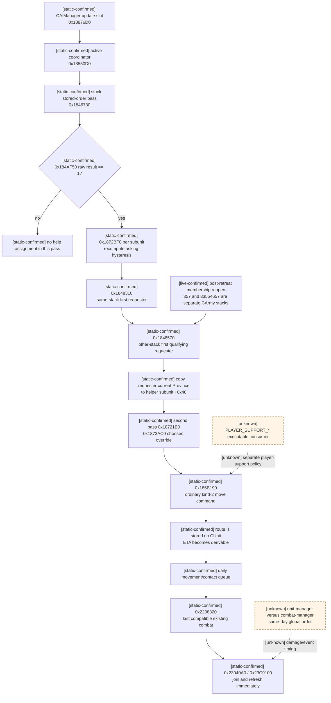
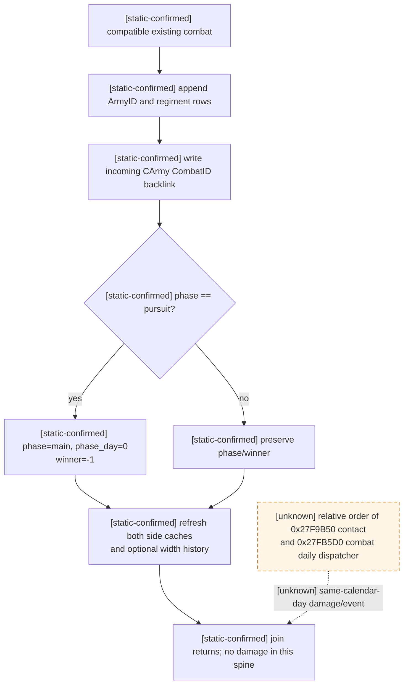

# CK3 1.19.0.6 原生 AI 战斗增援、到达与加入既有战斗

## 2026-09-27：AI 接管防守战后的独立逐日入列复测

[live-confirmed] 从第 6 日同源存档制备玩家切至战争防守方 Character `31549` 的不可变种子，再在新 production/non-debug 进程中逐日观察 `CombatID=16777218` 共 27 个暂停帧。战斗 side0 的原生 stored roster 在 date raw `53146368` 为 `[16777221,16777231,27]`；第 6 个观察日（raw `53146512`）尾插 `22`，第 16 个观察日（raw `53146752`）再尾插 `28`，直到第 26 日正常终局未移出；side1 始终为 `[18]`。两次加入均发生在同一旧 CombatID、正常终局前。入列前后 main-phase day 分别为 `7→8`、`17→18`，**这两次并未重置 phase day**；因此“新参战者必重启 main day”不是通用规则。pursuit 中增援重开 main 是另一条已研究的分支，不能由本例取代。

同一回放里，CUnit `18` 是非玩家控制的战争进攻方，直到终局才败退；这给真实增援与终局的同局时间轴，但仅凭 roster 尾插不能归因 `22/28` 的所有者、AI 求援分配、未来 ETA 或何时决定进场。[逐帧只读核验器与报告](active-combat-retreat.md#2026-09-27-普通战争-ai-接管后的完整战斗观察)已绑定源存档、每帧响应及清理，报告 SHA-256 `E504AAC6C9196E4AB26879EDE920DEB62DD93E627CAAA9DE699E2E3BEBC1C6BF`。`assignment-reopened → target → aligned ETA → same-Combat tail join` 的端到端独立门槛仍未关闭。

## 2026-09-26：骑士效能九项修正逐项回读，以及共用 modifier 读取器勘误

在第 11 日同一不可变梅西纳存档上，独立暂停实机 attempt `episode01-knight-components-live-attempt-033` 前后快照的日期与 revision 相同；原生 v2 和智能体实际消费的 v3 `base_inputs` 全对象相同，游戏进程清理已证明。[只读投影工具](../../ck3_autonomous_player/tools/project_native_knight_effectiveness_components.py)绑定存档、exact-build EXE、原始响应与历史第 11 日回执；[逐骑士机器报告](../../ck3_autonomous_player/src/xar_autoplayer/simulation/data/ck3_1_19_0_6_episode01_messina_knight_effectiveness_components_v1.json) SHA-256 `E842B4098CDDEBF78291E7E0B5CA26A4685862322DC021462C0A612A2E9CC04E`，`24/24` 名骑士的九项贡献之和与原生效能零差。

原版 `0x28FD990` 对 `0xB6–0xBE` 九项逐项读取，按有符号向零截断计算 `修正值 × 对应数值 / 100000`，再加基数 `100000`。首项是总倍率、对应数值 `100000`；后八项分别以效能上下文的恐惧、暴政、勇武、外交、谋略、学识、军事、管理作系数。**本例只有总倍率项非零**：两支进攻军分别是 `10000`（效能 `110000`，共 9 名骑士），另一支进攻军是 `85000`（效能 `185000`，4 名），守军是 `75000`（效能 `175000`，11 名）。例如 CharacterID `54144` 本人的有效勇武是 `2`，但九项修正的勇武系数来自原版选出的**效能上下文**，在该帧是 `17`；本例这一项修正值为零，故 `100000+85000=185000`，骑士有效伤害 `max(1,2)×185000×50=18500000`、坚韧 `max(1,2)×185000×10=3700000`。不能把效能上下文的 `17` 误称为该骑士自己的勇武，也不能因本例后八项为零断言其他角色或日期恒为零。

此次回读也查出桥接层实错：旧代码把 `0x26172C0` 返回的**外层聚合器**直接交给内部集合读取器 `0x20AB950`，九项被静默读成零。原版 `0x2940E80` 在此条件下先调用 `0x21D3F20`，后者用外层聚合器 `+0x68` 进入内部集合。桥已改用 `0x21D3F20` 的 `context_mode=0` 路径，共用它的反制和将领修正随之纠正。相对旧同源 v2，剥离新增诊断字段后**仅三项输入变化**：ArmyID `16777231` 将领有效掷骰下限 `0→2`、上限 `10→9`；ArmyID `18` 所有者反制效率原始值 `0→25000`。其余输入（含全部逐团有效伤害与坚韧）完全相同。旧回执保持历史原样，新读数只作用于使用修正后桥的未来查询；任何缓存的旧胜率估计必须按新 v3 输入重算，不能把旧百分比沿用到新输入。

失败 attempt `030`（误启用未编入的实验事件钩子）、`031`（Python 严格契约拒绝新增字段）、`032`（错误 modifier 入口产生 24 项残差）都保留为 RED，不混作 `033` 的成功轨迹。新桥 fresh build `D:\workspace\ck3_build_k033` 的 DLL SHA-256 为 `8C32267EAC691F48DB05DC73C9F6970E5E866277DA5972CB0FD03559E8BB0AC5`，离线测试 `168/168`；Python 契约兼容旧回执并校验新增九项数组，相关测试通过。本案已闭合的是同帧骑士效能拆解和共用读取器纠错；后八项非零的战例、效能上下文人物身份、未来逐日变化和事件写回仍需独立回读。

## 2026-09-26：两份暂停帧之间的原生有效属性稳定性

将同一梅西纳案例第 11 日和第 21 日的两份**直接原生求值**逐团对照，并分别从各自不可变源存档、隔离暂停查询和独立七边界回放重新生成原报告。[交叉日投影工具](../../ck3_autonomous_player/tools/project_native_cross_day_stat_stability.py)要求每一天的冻结报告与原始回执重算完全一致；[机器报告](../../ck3_autonomous_player/src/xar_autoplayer/simulation/data/ck3_1_19_0_6_episode01_messina_cross_day_stat_stability_v1.json) SHA-256 `38486D71F2466775C6D7EE4D96536046BFC97ECB17EFCE49F186FA8F15BB8DFF`。这不是比较旧战斗 entry 缓存，也没有把两次独立回放拼成同一随机轨迹。

两份名单共有 `51` 个相同 RegimentID、side 和原生 kind：征召兵 `19/19`、职业兵士 `8/8` 的有效伤害/坚韧完全相同；骑士 `22/24` 相同，另 `2/24` 的数值变了。骑士 CharacterID `32716`（RegimentID `59`）的有效勇武 `13→14`、效能仍 `175000`，有效伤害 `113750000→122500000`；CharacterID `54144`（RegimentID `220`）的有效勇武 `2→5`、效能仍 `185000`，有效伤害 `18500000→46250000`。两者的坚韧同步按原生骑士公式变化。这把本案跨十日的**端点差异**定位到两名骑士的有效勇武输入；未观察第 12–20 日每一个暂停帧，也未证明勇武变化的全部事件来源。

对智能体而言，当前帧仍取原生 v3 直接求值；这一例支持在**无外部状态改变的有界试算**中先沿用职业兵士和征召兵有效值，但不能把本案 `8/8`、`19/19` 的稳定性当作所有地形、驻扎、将领、文化或未来增援的通用恒定律。骑士的未来有效勇武可能改变；逐日事件/人物状态未进入 trial kernel 前，整场估计继续标记该风险。

## 2026-09-26：暂停帧直接查询可得到本案下一次 schedule 的有效属性

从同一第 11、21 日不可变原版存档，各另启一个**只读、隔离、未推进日期**的实机 attempt（外置 `episode01-daily-stats-live-attempt-028/029`），以当前战斗省份 `2633` 和完整交战军队集合调用原生 `ck3_query_combat_simulation_inputs` v2；前后快照仍是同一暂停日期及同一 revision，查询本身不消耗战斗日。各自再与先前独立完整七边界回放的当天首次 side0 schedule 入口对照。对应[第 11 日逐团报告](../../ck3_autonomous_player/src/xar_autoplayer/simulation/data/ck3_1_19_0_6_episode01_messina_paused_stat_eval_day11_v1.json) SHA-256 `70940B9F47392EEF8953014EC0095B2AD5F2BFF14B6B3679926CF10E01D35F98`、[第 21 日报告](../../ck3_autonomous_player/src/xar_autoplayer/simulation/data/ck3_1_19_0_6_episode01_messina_paused_stat_eval_day21_v1.json) SHA-256 `2A52B38050D1882FE5D4F34C0221B9A4FB5415C6B8D1BC19FF38879BE3A023DA`，均由[只读对拍工具](../../ck3_autonomous_player/tools/project_native_paused_stat_eval_parity.py)核对原始回执、源存档 SHA、exact-build 身份、逐团 ID/side 与游戏进程清理。

结果：第 11 日 `51/51`、第 21 日 `63/63` 团，暂停帧 **v2 直接求值**的有效伤害和坚韧与之后 schedule 入口逐项零差；同样两日的**旧战斗 entry 缓存**却分别有 `32/51`、`37/63` 团不同。第 11 日 CharacterID `54144` 的 RegimentID `220` 是最直观一例：旧缓存伤害 `20,000,000`，暂停帧直接求值 `18,500,000`，下一 schedule 也是 `18,500,000`；直接查询同时读取有效勇武 `2`、骑士效能 `185,000`，坚韧直接求值和 schedule 均为 `3,700,000`。第 21 日该团的直接值和 schedule 都是伤害 `46,250,000`、坚韧 `9,250,000`。两次新 attempt 均已退出、cleanup proven，未让 CK3 常驻。

智能体接战试算实际消费的是原生 v3 的 `base_inputs`；[v3/v2 精确对象对照](../../ck3_autonomous_player/src/xar_autoplayer/simulation/data/ck3_1_19_0_6_episode01_messina_paused_v3_stat_base_parity_v1.json) SHA-256 `3150223578A89947FC96DDF447292BC9C91BF0C17F46B9F963E8C921564E6F89`，由[对照工具](../../ck3_autonomous_player/tools/project_native_paused_v3_base_parity.py)验证两日同暂停 revision 的 v3 `base_inputs` 与 v2 全对象精确相等。因此当前帧的有效属性输入可以继续来自 v3 原生直接求值，**不应拿旧 `battle_control_snapshot` entry 的 `+0x40/+0x48` 当下一 schedule 输入**。这只证明两个保存状态的下一次 schedule 输入，不代表模型已经预测未来任意日期的人物、地形或 modifier 变化，也不等于整场胜率、事件效果或撤退转移已原生对拍。

## 2026-09-26：到达日首次安排事件前会重算兵团有效属性

两次 GREEN 回放还给出一个影响模拟输入的**日内属性刷新**。暂停时的 `battle_control_snapshot` 与原生日更 `0x27FB58F` 首次 side0 schedule **入口**都处在同一源日期、同一 CombatID，且参战兵团 ID 集合尚未变化；然而第 11 日已有 51 团中的 32 团、第 21 日已有 63 团中的 37 团，其有效伤害或有效坚韧已经变化。第 11 日 RegimentID `220` 从暂停控制快照的伤害 `20,000,000`、坚韧 `4,000,000`，变为 schedule 入口的 `18,500,000`、`3,700,000`（均为 Q100000）。[日 11 只读对照](../../ck3_autonomous_player/src/xar_autoplayer/simulation/data/ck3_1_19_0_6_episode01_messina_daily_stat_refresh_day11_v1.json) SHA-256 `E36224201492080046FE37E6C27653B6F38D8C7B97651BBEC86EC718A8A3AB06`；[日 21 对照](../../ck3_autonomous_player/src/xar_autoplayer/simulation/data/ck3_1_19_0_6_episode01_messina_daily_stat_refresh_day21_v1.json) SHA-256 `26569235A6B1507B6693E381335A46B56F632E2D6F9DD0B9D825A2C46F8833AE`，均由[只读投影](../../ck3_autonomous_player/tools/project_native_daily_stat_refresh.py)核对实机回执 SHA 和 exact-build 指令。历史另一 attempt 中 `220` 曾记录更早控制值 `7,400,000`→schedule `3,700,000`；其输入轨迹独立，不能与本次的 `4,000,000` 拼成同一变化链。

静态调用链把**刷新写入相对事件安排的先后**闭合：`CCombatManager` 日更循环在 `0x27FB57A` 调 `0x2308D50`，其对两侧先调 `0x23CBCE0`，再调 `0x23CC2B0`；后者逐个 entry 调 `0x23D2CE0`，其中调用 `0x239CAE0` 后明确写回 entry `+0x40` 有效伤害和 `+0x48` 有效坚韧。调用返回后，**同一个循环**才在 `0x27FB58F` 调 `0x23C8750` 开始 side0 schedule。故“暂停控制快照的有效属性可以原封不动用于下一日主阶段”已被两次实机对照否定；应取实际 schedule/phase 前刷新的属性，或在预测中显式标记该输入不确定。此链证明了写入时点及对象字段，**尚未证明每个数值变动来自哪项 trait、地形、将领或其他修正**，也未证明两个 manager 的全局调用顺序。

再把上述变化按原生名单分类：[第 11 日分类与公式见证](../../ck3_autonomous_player/src/xar_autoplayer/simulation/data/ck3_1_19_0_6_episode01_messina_daily_stat_source_day11_v1.json) SHA-256 `534907A0EC04359D00C40E86CAE86566C00B439F4795D758068F557159548B2A`、[第 21 日](../../ck3_autonomous_player/src/xar_autoplayer/simulation/data/ck3_1_19_0_6_episode01_messina_daily_stat_source_day21_v1.json) SHA-256 `1D0FB70E3032B2358C59C41E8BB234C7B1BE5EA3747E4C983A8DB593C20FE937`，由[只读分类工具](../../ck3_autonomous_player/tools/project_native_daily_stat_source.py)重算。第 11 日变化的 32 团为骑士 24、职业兵士 8、征召兵 0；第 21 日的 37 团为骑士 27、职业兵士 10、征召兵 0。两日**所有 51 个发生变化的骑士**，刷新后的伤害与坚韧都与原版库存常数 `50/10` 和已观察到的有效勇武满足 `伤害 = max(1,勇武) × 骑士效能(Q100000) × 50`、`坚韧 = max(1,勇武) × 骑士效能(Q100000) × 10`。例如第 11 日 RegimentID `220` 是 CharacterID `54144`，schedule 入口有效勇武 `2`，按刷新后伤害 `18,500,000` 反推效能 `185,000`，从而 `2×185,000×10=3,700,000` 与坚韧逐字相等。第 21 日同一人物有效勇武 `5`，`5×185,000×50=46,250,000`、坚韧 `9,250,000` 也逐字相等。这个效能是由刷新后的伤害**反推的公式见证**，并非这两次回执直接读取 `0x28FD990` 的返回；库存常数有先前独立研究，本次回执未重新读取运行时 define。因此仍不能由这些等式断言旧缓存为何变化，也不能把效能 `185,000` 归因到某项具体修正。职业兵士的 18 项变化及骑士效能的 modifier 来源继续列为待查。

骑士效能的**输入入口**已再向内闭合一层：[exact-build 静态索引—名称报告](../../ck3_autonomous_player/src/xar_autoplayer/simulation/data/ck3_1_19_0_6_knight_effectiveness_modifier_sources_v1.json) SHA-256 `07428FDB8A4CE7D0893C3A5C69BF802A613A3A60385D7A48DA01A29A8865D6D3`，由[只读投影工具](../../ck3_autonomous_player/tools/project_native_knight_effectiveness_sources.py)复核。`0x28FD990` 经 `0x26172C0` 取得人物 modifier set，再依次调用 `0x2940E80` 读取原生 enum `0xB6–0xBE`：骑士效能总倍率、每点恐惧、每点暴政、每点勇武、每点外交、每点谋略、每点学识、每点军事、每点管理。后八项对应人物或其军事状态中的相应数值；六项能力字段从 `CCharacter+0xD4` 的技能数组读取，勇武在 `+0xE8`。二进制元数据中九个命名指针连续相隔 `0x38`，其存储索引比原生读取 enum 小 1；反制效率/抵抗这组先前已核验的 enum `0x106/0x107` 在同一元数据表给出独立校准。**这里证明的是九个来源的身份和读取次序，没有这两次战斗中各项 modifier 的运行时值**；因此 `185,000` 仍不能拆成各项贡献，也不能直接移植为未来日期的常数。下一次实机采集应在同一暂停帧和 schedule 入口分别回读九项值、勇武与最终效能，并与 `0x28FD990` 输出对拍。

## 2026-09-26：两次自然增援的七边界身份、同日出伤与逐团写回闭合

从原案同一次 campaign 的第 11、21 日不可变存档各开一个隔离原版回放。研究用 DLL 在暂停时，把尚未参战、但已可用完整 generation 解析的候选军队、兵团及人物预登记；只允许**一个已由源存档和路线证明的候选 ArmyID**，进入原版日更时只读已绑定对象，不在 hook 内猜测新对象。开始前各自在当前会话生成原生检查点，推进严格一天；完整七边界均绑定 CombatID `16777218`、同一主线程、正确日期分界，捕获错误标志 `0`，结束后 detour 已卸载。原始 attempt 分别在 `D:/workspace/ck3_native_war_ai_promo_work/episode01-prearmed-join-live-attempt-026/` 和 `.../episode01-prearmed-join-live-attempt-027/`。只读投影工具为 [`project_native_join_full_day.py`](../../ck3_autonomous_player/tools/project_native_join_full_day.py)，两份冻结报告为[第 11→12 日](../../ck3_autonomous_player/src/xar_autoplayer/simulation/data/ck3_1_19_0_6_episode01_messina_join_full_day_v1.json)（SHA-256 `2BEA19218527FF7E9B35EFAF97543BDD6F168C99B99AE3CA8E88AD9699BF4983`）和[第 21→22 日](../../ck3_autonomous_player/src/xar_autoplayer/simulation/data/ck3_1_19_0_6_episode01_messina_join_full_day_day21_v1.json)（SHA-256 `0AC4D03A8796D279D2D43E107002E76778D8B600F576CFF33026C9B4FD5511B8`）；报告逐条绑定原始请求回执、源存档哈希、桥 DLL 哈希和会话清理结果。

| 源日 → 到达日 | 前一日 side0 schedule 后 | 到达日首次 side0 phase-fire **入口** | 新军逐团结算（Q100000） |
| --- | --- | --- | --- |
| 11→12，ArmyID `22` | 原有 `[16777221, 16777231, 27]`；27 个兵团，fighting `160,317,482` | 原顺序末尾追加 `22`；40 个兵团，fighting `410,690,163` | 新军 13 个兵团中 12 个参与主阶段，软伤 `2,603,650` + 硬伤 `1,197,289` = `3,800,939`，即 **38.00939 人当量**；一名非参战骑士兵团的硬伤字段为不可用，不伪装成 0 |
| 21→22，ArmyID `28` | 原有 `[16777221, 16777231, 27, 22]`；39 个兵团，fighting `368,409,866` | 原顺序末尾追加 `28`；44 个兵团，fighting `470,651,390` | 新军 5/5 兵团参与主阶段，软伤 `548,476` + 硬伤 `252,216` = `800,692`，即 **8.00692 人当量** |

两次回放在 schedule 边界均不含候选军队，而到达日**首次** side0 phase-fire 入口已有完整 ArmyID、RegimentID、有效属性；其后的七边界保持同一 generation。到下一个暂停查询，候选每个参战兵团都满足 `入口 current - 暂停 current = soft 增量 + hard 增量`；合计数与此前分别从存档、阶段回读得到的 `26.03650+11.97289` 和 `5.48476+2.52216` 完全一致。故本案中，增援在到达当天被纳入出伤、承伤和写回，策略模拟一旦显式安排当天到达的增援，就必须**先扩参战名单，再进行当天主阶段**。日更总控中 `CUnitManager` 与 `CCombatManager` 的全局调用先后仍未用被动时间戳直接记录；两次样本也不代表所有路线、同盟或撤退后重入分支。

这里的 `bounded_trace_available` 只证明七个指定原生边界与两个出伤对被完整采集；回执仍明确 `full_mutable_transition_bundle_complete=false`、`original_trace_ready=false`。因此尚不能把骑士效果全部写回、有效属性刷新原因、战宽与反制的内部刷新时点、以及任意增援预测写成已闭合。两份回执已由智能体代码的 [`load_episode01_join_full_day_boundaries`](../../ck3_autonomous_player/src/xar_autoplayer/simulation/native_battle_case.py) 按 SHA 和逐团旧证据交叉核验，供后续转移拟合和回归使用。智能体当前的有界整场估计仍在每个暂停帧重读真实名单，已加入者会进入下一帧输入；它的 trial kernel 仍把**未来途中加入**列为 `fixed_participants` 假设。后续应把本两日的入场时点/逐团账用于有条件 join-day kernel 回归，再接入有原生 route/ETA 证据的未来增援场景，而不是只在影片中使用这些数字。

## 2026-09-26：两种日更入口的 vtable 身份已核验，跨 manager 顺序仍待实测

对 exact-build EXE 的绝对函数指针、RTTI Complete Object Locator 和 vtable 地址点做[只读核验](../../ck3_autonomous_player/native_bridge/research/inspect_battle_daily_vtables.py)：`0x27F9B50` 位于 `CUnitManager` `+8` 子对象 vtable `0x43404A0` 的 slot 3（指针槽 `0x43404B8`），`0x27FB5D0` 位于 `CCombatManager` `+8` 子对象 vtable `0x43407A8` 的 slot 3（指针槽 `0x43407C0`）。两处都不是从邻近函数地址猜出的“同一个 manager”。提取结果原件在 `D:/workspace/ck3_native_war_ai_promo_work/daily-manager-vtables-20260926-r3.json`，SHA-256 `B478F53FA0EC94F370F5104D313AED2DB6D8A8CE0ADC0E5D9377A3EBABE99EF2`；EXE SHA 由工具逐字节验证。

这是下次被动观测日内顺序的**精确入口身份**，仍不足以从两个 vtable 槽推出全局调度先后。增援日 phase-fire 前出现新 ArmyID 的实机结论保持不变；原追踪器 RED 的技术原因也已定位在其暂停预备 plan：`BuildPlanUnsafe` 只从当时的两侧 ArmyID/RegimentID 建立指针表，进入原版阶段时 `ReadSide` 在新增 ID 的 `FindObject` 处失败。修复需要把未来入场者以 full generation 身份纳入有界表，或用独立的受限动态解析，并对新军/新兵团/新人物及容量分别设门禁；不能把失败行的 ArmyID `0` 当原版数据，也不能仅删除身份检查让 trace 变绿。

## 2026-09-26：两次自然增援已在首次 phase fire 前入场

对同一独立原版回放的第 11、21 源日 RED 七边界回执做[只读重投影 v2](../../ck3_autonomous_player/src/xar_autoplayer/simulation/data/ck3_1_19_0_6_episode01_messina_join_phase_order_partial_v2.json)（SHA-256 `0A59B57CC8AA2A97DA0FD6210179E400977512DF6C6153B12DB7B3CFA4116D33`；[工具](../../ck3_autonomous_player/tools/project_native_join_phase_order.py)绑定 finish、前后 snapshot 及到达日原生 control 的原始 SHA；v1 保留历史原样）。两天在 `0x27FB5AC` 完成 side1 schedule 的记录均捕获标志 0，side0 旧军分别有 3、4 支。下一日 `0x23C9900` **side0 phase-fire 入口**记录的 side0 军队容器长度已经分别扩成 4、5，`current_fighting_total_raw` 分别由 `160317482→410690163`、`368409866→470651390`。前后暂停快照只新增 ArmyID `22`、`28` 入战；到达日 control 同时证明同一 CombatID `16777218` 的 stored army 顺序分别为旧军后追加 `22`、`28`。

入口记录的最后一行是零值占位，捕获标志 `16`，因为日初预备的指针表没有新加入的 ArmyID；整条 trace 的失败标志 `1040`、状态 `trace_unavailable` 保持 RED。这个零值**不是原版 ArmyID 0**，不能拿它算人数或结算；它恰好定位到身份验证在新行处停止。由有效 schedule、实际 phase-fire 入口和前后名单可限定：**这两次加入发生在当天首次 side0 phase fire 之前**，与下一次可读阶段记录中新兵团已有软/硬伤亡互证。它不说明所有接触分支都采用同一日内顺序，也没有让当天七边界伤亡/事件树变成完整可回放；仍需动态指针采集器和独立战例。

## 2026-09-24：梅西纳同日增援伤亡实机观察

同一接战检查点的[独立原版回放](battle-simulation-episode01-live-case.md)提供了两次自然增援。对第 11、21 源日的不可变存档只读解码，按 RegimentID 与第 12、22 日第一次有效阶段记录逐项绑定；[智能体共用投影](../../ck3_autonomous_player/src/xar_autoplayer/simulation/data/ck3_1_19_0_6_episode01_messina_join_day_casualties.json) SHA-256 为 `C51A17070A66729C00B1BB1ADB40821CB61CAC1F7DF11155CE25FE0C5152EA72`，[只读重建工具](../../ck3_autonomous_player/tools/project_native_join_day_casualties.py)核对原始存档、解码文本、移动前后快照与阶段回执 SHA。两次增援在移动前均未入战、目标为梅西纳，推进恰好一天后已进入相同 CombatID。

| 增援 | 到达日 | 原存档入战前兵力 | 到达日阶段回读兵力 | 软伤亡 + 硬伤亡 | 逐兵团核对 |
| --- | ---: | ---: | ---: | ---: | --- |
| ArmyID `22` | 12 | 2560 | 2521.99061 | 26.03650 + 11.97289 | 12 个参战兵团逐项闭合；另 1 个非参战骑士兵团无战斗伤亡 |
| ArmyID `28` | 22 | 1058 | 1049.99308 | 5.48476 + 2.52216 | 5 个参战兵团逐项闭合 |

这些新入战兵团在到达日前的存档中 `cached.current` 全等于阶段记录的 `starting_raw`；到达日第一次有效阶段记录中，每个参战兵团的 `starting_raw - current_fighting_raw` 全等于软伤亡加硬伤亡，且都大于零。**这证明上述两次自然增援在抵达的同一日推进中已承受战斗伤亡**，不能再把“增援一律从次日才受伤”写成规则。第 11、21 源日的完整七边界 trace 仍因加入时的 side 身份变化为 `trace_unavailable`；证据只合并独立的移动快照、冻结存档与下一次有效阶段回读，尚未给出 unit-manager/contact/combat-manager 的全局调用顺序，也不推广到所有加入时点。独立回放从第 6 日起与首条原案数值分叉，不能混剪成同一轨迹。

用这两天**原版实测出伤与已观察到的入场名单**作为输入，把新增兵团先加入防守侧，再调用智能体现有的 `apply_main_phase_casualties`，[初次逐兵团对拍](../../ck3_autonomous_player/src/xar_autoplayer/simulation/data/ck3_1_19_0_6_episode01_messina_join_day_kernel_parity.json) SHA-256 `CCD25D31E068658A78603F772BCA57B6B657A5F3C72DD404808BE48BE5B648E0` 得到：第 12 日新增 12/12 精确，整侧 37/38 精确，原有 RegimentID `220` 的模拟 `current_raw` 比原版多 `214` 个 Q100000 单位；第 22 日新增 5/5、整侧 42/42 精确。[只读重算工具](../../ck3_autonomous_player/tools/compare_native_join_day_casualties.py)核对原生回执 SHA，并保留初次对拍报告。

追查该残差发现：第 11 日较早的 control 快照中，兵团 `220` 有效韧性为 `7400000`，但**同日期、side0 schedule 调用之前**的原版阶段记录已是 `3700000`；该阶段记录的捕获标志为 0，虽然后续整条 trace 因身份变化仍 RED。用这一更靠近伤亡计算的原版韧性重算，[刷新后条件对拍 v2](../../ck3_autonomous_player/src/xar_autoplayer/simulation/data/ck3_1_19_0_6_episode01_messina_join_day_kernel_parity_v2.json) SHA-256 `B3660C52B27FD6D2186E0AB7590CE64C24720262A1BCCB3DCA8F2FB622DA5571` 在第 12 日 38/38、第 22 日 42/42 全部精确。两份报告的差异定位为**日内有效属性刷新输入**；尚未重建刷新发生的原生调用原因和时点，更没有重建增援决策、出伤生成或完整胜率，`planner_usable=false`。视频[同源增援板 v3](../../promo/ck3_native_war_ai/episode-01-battle-win-probability/join-day-board-v3.json)同时引用观察、初次残差与刷新后条件对拍；[v1](../../promo/ck3_native_war_ai/episode-01-battle-win-probability/join-day-board.json)、[v2](../../promo/ck3_native_war_ai/episode-01-battle-win-probability/join-day-board-v2.json)保留为过程资产。

## 2026-09-23 勘误与研究增量

本页下文保留历史研究记录；跨 stack 比较的旧解释已被同一 EXE 的直接指令复查推翻。
`0x18488A2 cmp rdx,[r8]` 后的 `jge` 返回 requester：在前置条件成立时，
**量化需求 >= 请求方 parent 的 available power 即可匹配，等号通过**；该力量并非 helper 的力量。
旧文的 `available > required` 不能继续作为结论使用。六项 `PLAYER_SUPPORT_*` 的注册到消费边也已补齐，
仍未闭合的缓存来源、时间基准与 live 指派过程保持明确开放。
完整指令、修正树、三军实验结构门槛与证据见
[战争影片求援与玩家支援专题](war-film-reinforcement-policy-2026-09-23.md)。
本次是静态勘误，没有新增原生指派或同 CombatID 回归成功的实机证据。

## 范围、版本与证据边界

- [static-confirmed] 本文只绑定 CK3 `1.19.0.6` 的
  `Crusader Kings III/binaries/ck3.exe`，SHA-256 为
  `2D00FF3101EF70B566F2FCBAE292F09263199C80E9DC8F139B82D7D96F83DB86`；所有地址均为 RVA。
- [static-confirmed] 原版 AI define 来自
  `game/common/defines/ai/00_ai.txt`，SHA-256 为
  `C78F9CD8DF9938CC9F38E817BCB6E32CD13720B5BD9DE077B85E3E1C6F030293`。
- [static-confirmed] 本轮只做冻结 EXE 的静态反汇编、RTTI、direct xref 与原版数据互证。没有启动 CK3，
  没有 live snapshot，也没有调用任何 AI update、移动提交、战斗加入或战斗构造函数。
- [static-confirmed] 本页研究的是普通 AI-to-AI 求援链。`PLAYER_SUPPORT_*` 是另一套“AI 支援玩家军队”数据；
  其 define 已确认加载，但本轮没有闭合它们的生产消费者，不能混入普通 `0x1848310/0x1848570` 树。
- [static-confirmed] 配套机器账本为
  `ck3_autonomous_player/native_bridge/research/battle_reinforcement_and_join_v1_abi.json`。
  它仍是 `research_static_only`，不是已发布 query、command 或 live capability。

证据标签遵循 [README.md](README.md)：`static-confirmed` 是 frozen data 或 exact-build 指令直接支持，
`bridge-design` 是在该证据上定义的最小只读投影，`unknown` 是尚不能据此实现原生行为的缺口。所有 Mermaid
未闭合分支均为虚线。

## 先给结论

1. [static-confirmed] 求援状态属于 **`CAISubunitStack+0x50`**，不是旧文曾写的
   `CAIUnitStack+0x50`。bit `0/1/4` 分别是当前 asking、assigned-to-help、最近一次求援求值是否翻转。
2. [static-confirmed] `0x1872BF0` 用 `0x19186E0` 的 deterministic power-share ratio 做滞回：未求援时
   严格 `<0.66` 才开始；已经求援时严格 `<0.75` 才继续。它还读取当前 route 首边剩余 duration，
   但没有计算“helper 到战斗的完整 ETA”。
3. [static-confirmed] 同一个 `CAIUnitStack` 内由 `0x1848310` 按 subunit stored order 取第一个 requester；
   其它 stack 由 `0x1848570` 按 `Province*` 搜索表 stored order、再按 Province 内 unsigned full CUnitID
   数值序取第一个满足者。没有 ETA 最短、CombatID、objective score 或 request timestamp 排序。
4. [static-confirmed] 分配结果只把 requester **当时的 current Province 指针**复制进 helper 的
   `CAISubunitStack+0x48`；不保存 requester 指针，也不保存未来 CombatID。`0x1873AC0` 让该省份覆盖普通
   campaign target，随后走普通 kind-2 AI move command。
5. [static-confirmed] 因此未来 ETA 必须在 move route 已经与 `+0x48` 对齐后，从 `CUnit` route 重新计算；
   `CArmy+0x128` 在实际接触前仍无 CombatID。目标省当前存在的 compatible combat 只能称为
   present-time candidate，不能称为 assigned combat。
6. [static-confirmed] 抵达时 `0x2208320` 才扫描目标省的既有 CCombat，并选择 stored order 中最后一个
   forward-XOR-compatible active combat；随后按反向关系判 side。它不再读取求援 ratio、ETA、距离或 campaign score。
7. [static-confirmed] 加入操作在返回前就 tail-append ArmyID、按 incoming regiment stored order 建立新战斗条目、
   刷新双方 current/fighting cache，并在 pursuit 中把 phase 重开为 main、`phase_day=0`、winner 重置为 `-1`。
   [unknown] unit-manager contact pass 与 combat-manager 当日伤害/phase event 的全局先后仍未闭合，所以不能声称
   新加入者一定会或一定不会在同一 calendar day 承受一次 main-phase damage。

## 原生总树



## 冻结 define：哪些属于本链，哪些不属于

| define | stock value | 本轮闭合边界 |
|---|---:|---|
| `ASK_FOR_HELP_COMBAT_PREDICTION_RATIO` | `0.66` | [static-confirmed] `0x1873027..0x187303E` 未 asking 时使用 |
| `STOP_ASKING_FOR_HELP_COMBAT_PREDICTION_RATIO` | `0.75` | [static-confirmed] 同一分支在 prior asking 时使用 |
| `ASK_FOR_HELP_OTHER_STACK_TROOPS_RATIO` | `1.5` | [static-confirmed] `0x1848570` 普通 helper threshold |
| `ASK_FOR_HELP_OTHER_STACK_TROOPS_BREAK_SIEGE_RATIO` | `1.7` | [static-confirmed] 高进度 siege 时替代 `1.5` |
| `BREAK_SIEGE_TO_HELP_PROGRESS_THRESHOLD` | `0.6` | [static-confirmed] `0x1848659..0x184867D` threshold 选择 |
| `UPDATE_TARGETS_TICK` / `_LOPSIDED` | `7` / `14` | [static-confirmed] 本链没有读取；不能作为求援重算 cadence |
| `PLAYER_SUPPORT_WANTED_COMBAT_RATIO` | `5.0` | [unknown] 普通 helper 两函数未读取；专用消费者未闭合 |
| `PLAYER_SUPPORT_ATTACK_TARGET_MAX_DISTANCE` | `400` | [unknown] 同上 |
| `PLAYER_SUPPORT_ATTACK_MAX_ARRIVAL_DELAY` | `45` days | [unknown] 同上；不得给普通求援补一个 45-day gate |
| `PLAYER_SUPPORT_IGNORE_BAD_SUPPLY_WITHIN_STEPS` | `4` | [unknown] 同上 |
| `PLAYER_SUPPORT_ENEMY_POWER_MULTIPLIER` | `1.5` | [unknown] 同上 |
| `PLAYER_SUPPORT_MIN_SIEGE_STRENGTH` | `1.25` | [unknown] 同上 |
| `TARGET_SCORE_SUPPORT_PLAYER_ONE/TWO/THREE_STEP` | `1000/500/250` | [unknown] 属于 player-support target score；本轮没有闭合执行 caller |

EXE 中对应 `PLAYER_SUPPORT_*` ASCII 名位于 `0x4196198/0x4196168/0x4196398/0x4196368/0x4196340/0x4196318`；
当前 xref 只闭合 define 注册/反射，不能用字符串存在代替决策消费者。

## 对象所有权与最短稳定根

### RTTI 与对象大小

| 类型 | RTTI / vtable RVA | exact size / 用途 |
|---|---|---|
| `CAIUnitStack` | RTTI `0x52F9638`, vtable `0x4191870` | deleting destructor `0x18452C0` 显示 size `0x98` |
| `CAISubunitStack` | RTTI `0x52FC278`, vtable `0x4192778` | deleting destructor `0x186F180` 显示 size `0x58`；destructor `0x186F1C0` 清 backlink |
| `CAIWarCoordinator` | RTTI `0x52FB408`, vtable `0x41923B0` | CUnit 的 full coordinator ID 解析目标 |
| `CAIManager` secondary interface | RTTI `0x52FEBE8`, vtable `0x4193898` | slot `+0x30` 指向 `0x18876D0` |

### exact layout

`CAIUnitStack`：

| offset | [static-confirmed] 含义 |
|---:|---|
| `+0x08/+0x14` | `Province*` support-search candidate data/count；`0x1848570` 按 stored order 扫描 |
| `+0x28/+0x34` | full CUnitID data/count |
| `+0x40/+0x4C` | `CAISubunitStack*` data/count，保持 native stored order |
| `+0x58` | parent `CAIWarCoordinator*` |
| `+0x60` | campaign/assignment target-like pointer；正式业务类型未闭合 |
| `+0x6C` | countdown raw |
| `+0x74/+0x78/+0x79` | assignment/state raw |
| `+0x7C/+0x80` | cooldown raw |
| `+0x90` | flags raw |

`CAISubunitStack`：

| offset | [static-confirmed] 含义 |
|---:|---|
| `+0x10/+0x1C` | full CUnitID data/count |
| `+0x28` | same-coordinator `request_power_basis_raw`；只有 asking bit 为真时才有当前语义 |
| `+0x34` | cross-coordinator request-valid raw byte；生产者和正式业务名仍 unknown |
| `+0x38` | cross-coordinator request power raw；仅 `+0x34 != 0` 时由 `0x1848570` 消费 |
| `+0x40` | parent `CAIUnitStack*` |
| `+0x48` | support target override `Province*`；分配时复制 requester 的 current Province |
| `+0x50 bit0` | `asking_for_help` |
| `+0x50 bit1` | `assigned_to_help` |
| `+0x50 bit4` | prior bit0 XOR new bit0；最近一次 `0x1872BF0` 的 transition 标志 |

`CUnit/CArmy`：

| object | offset | [static-confirmed] 含义 |
|---|---:|---|
| `CUnit` | `+0x20` | current `Province*` |
| `CUnit` | `+0x30` | direct native movement-target `Province*` slot；不是 remaining-route final 的语义投影 |
| `CUnit` | `+0x38/+0x44` | active route row data/count |
| `CUnit` | `+0x168` | current-edge progress raw |
| `CUnit` | `+0x170` | movement/retreat state raw；`==3` 令 `0x1872BF0` 清 asking |
| `CUnit` | `+0x178` | full internal CArmyID |
| `CUnit` | `+0x190` | cached movement speed raw |
| `CUnit` | `+0x1C4` | full CAIWarCoordinator component ID |
| `CUnit` | `+0x1D0` | live `CAISubunitStack*` backlink |
| `CArmy` | `+0x124` | full backing public CUnitID |
| `CArmy` | `+0x128` | full active CCombatID；实际 join 前没有 future assignment |

[static-confirmed] `0x186F1C0` 遍历 subunit `+0x10/+0x1C` 的 full CUnitIDs，逐个 generation-resolve 后清
`CUnit+0x1D0`，独立证明 backlink 所有权。`0x184875D` 从 `CUnit+0x1C4` 解析 coordinator：storage root
为 `module+0x57C07A8`，fallback/null object 为 `module+0x57C0798`，并要求
`CAIWarCoordinator+0x10 == full coordinator ID`。这是最短可施工只读根。

严格 reader 还必须验证：

1. `CUnit+0x1D0` 是 exact `CAISubunitStack` vtable；
2. subunit `+0x10/+0x1C` 确实包含 subject full CUnitID；
3. parent `+0x40/+0x4C` 确实包含该 subunit，且 `parent+0x58` 等于 generation-valid coordinator；
4. 两次同 paused revision 采样的 full IDs、counts、pointer membership 与 route 完全一致；任何失配返回
   `state_changed`，绝不使用 fallback object 的字段。

## `0x1872BF0`：什么时候发出或停止求援

### 输入与 ratio

- [static-confirmed] `0x1848310` 在 `0x1848358..0x1848367` 对 parent 的每个 subunit 调一次
  `0x1872BF0(CAISubunitStack*)`。
- [static-confirmed] `0x1872C12` 经 `0x1871D20` 取 representative `CUnit`。identity invalid 或
  `CUnit+0x170 == 3` 时，`0x1872C28..0x1872C3C` 清 bit0，并把 prior/new transition 写入 bit4。
- [static-confirmed] `0x1872C5D..0x1872CC1` 从 `CUnit+0x20` current Province 读取
  `Province+0x760/+0x76C` 的**第一项** full CCombatID，并 generation-resolve/active-check。它没有像 contact resolver
  那样扫描并评分多个 combat。
- [static-confirmed] 有有效 combat 时，`0x18506A0` 的 relation raw 分支决定使用哪一侧；
  `0x23CDE50` 遍历 side CUnitID rows，再遍历各 CArmy 的 `+0x38/+0x44` regiment IDs，只累加 active
  `CRegiment+0x40` qword power。
- [static-confirmed] `0x19179E0` 以当前 Province、raw options `1/1` 收集 `0x38`-byte
  `SAIPowerAndStrengthEntry`；选中的 relation classes 把 entry `+0x10` base power 加进 demand basis。
  `0x1873003` 随后以 raw `mode=0`、`flags=3` 调 `0x19186E0`。arg5 的正式业务名和 relation lane 枚举仍 unknown。
- [static-confirmed] `0x19186E0` 的返回仍是 [combat-prediction.md](combat-prediction.md) 定义的
  deterministic power share，**不是胜率**。

### 到达相关输入的准确边界

[static-confirmed] `0x1872E31..0x1872E54` 在 subject 已有 route 且 state raw 不为 `1` 时，调用：

```cpp
int64_t* ReadRouteEdgeDuration(
    CUnit* unit, int64_t* out_q100000_days, int32_t route_index);
// RVA 0x22475E0; caller passes route_index = 0
```

`0x22475E0` 验证 index，解析该 row 与前一 Province 的 exact adjacency，调用 `0x23C45B0`，对首边扣
`CUnit+0x168` 已走 progress，再按 land/naval speed 换算，输出该 route edge 的剩余 Q100000-day duration。
`0x1872F64..0x1872F72` 把它与所选 `SAIPowerAndStrengthEntry+0x28` 作比较，从而影响进入 predictor 前的
临时过滤布尔。

这证明 arrival-like timing **参与求援判定**，但边界必须保守：

- 它只读取 subject 当前 route 的**首边剩余 duration**，不是 helper 到 `+0x48` assignment target 的完整 ETA；
- `SAIPowerAndStrengthEntry+0x28` 的正式业务名、比较所代表的 arrival window 仍 unknown；
- `0x22475E0` 对无效 index 写 `0`，零 speed 分支可写 raw `0x00000000FFFFFFFF`；查询必须先做 route、adjacency、
  speed gate，不能把特殊值当合法 ETA；
- 普通求援链没有读取 `PLAYER_SUPPORT_ATTACK_MAX_ARRIVAL_DELAY=45`。

### 精确滞回与 demand field

`0x1872E07` 读取 prior bit0，`0x1873027..0x187303E` 选择 define 并执行 signed strict `setl`：

| prior state | 精确条件 | new state |
|---|---|---|
| not asking | `native_ai_prediction_ratio < 0.66` | asking |
| not asking | `ratio >= 0.66` | not asking |
| asking | `ratio < 0.75` | keep asking |
| asking | `ratio >= 0.75` | stop asking |

[static-confirmed] `0x1873041..0x187305A` 写 bit0 和 bit4；bit4 恰为 prior bit0 XOR new bit0。
若 new bit0 为真，`0x1873062..0x1873086` 把 accumulated demand basis 向零截断到 `100000` 的整数倍并写
`CAISubunitStack+0x28`。bit0 为假时这条路径不保证清 `+0x28`，所以 wire 必须令
`request_power_basis_raw=null`；不得发布一个看似当前、实则 stale 的正值。

## 重算 cadence 与同一 manager pass 的先后

- [static-confirmed] `CAIManager` secondary vtable `0x4193898` 的 slot `+0x30` 指向 `0x18876D0`。
  `0x18878F1` 对 manager `+0x40/+0x4C` 的 active coordinator stored order 调 `0x18550D0`。
- [static-confirmed] `0x18550D0` 开头会递减 coordinator timer fields，但
  `0x1855324..0x185534F` 对 coordinator `+0x50/+0x5C` stack stored order 调 `0x1846730` 的循环本身不受
  `UPDATE_TARGETS_TICK=7/14` gate 控制。
- [static-confirmed] `0x1846730` 先做 subunit upkeep，再在 `0x184681F` 调 `0x184AF50`；只有 raw result
  恰为 `1` 才依次进入 `0x1846A60`、`0x1848310` 与 `0x1848570`。因此准确 cadence 是：
  **每次 `0x18876D0` lifecycle slot 被调用时，每个 active coordinator 内、每个返回 raw `1` 的 stack 至多
  重算一次每个 subunit**。本轮不额外给 `0x18876D0` 杜撰正式“daily”接口名。
- [static-confirmed] coordinator 第一遍按 stack stored order逐个执行完整 `0x1846730`。因此 earlier stack 搜索
  later stack 时可见的是后者上一次保存的 asking bit；later stack 搜索 earlier stack 时可见的是本 pass 刚重算的值。
  没有看到同一 pass 末尾再做一次全局 help matching。
- [static-confirmed] 第一遍所有 stack 完成后，`0x1855380..0x18553B4` 才做第二遍：按 stack stored order，
  再按 subunit stored order 调 `0x18721B0` 与 `0x18726C0`。所以 newly assigned helper 可在同一
  coordinator update invocation 提交 move command。

```mermaid
flowchart LR
    A["[static-confirmed] stack i<br/>recompute own asking"] --> B["[static-confirmed] stack i<br/>search requester and assign"]
    B --> C["[static-confirmed] stack i+1<br/>recompute own asking"]
    C --> D["[static-confirmed] stack i+1<br/>search requester and assign"]
    D --> E["[static-confirmed] all-stack decision pass ends"]
    E --> F["[static-confirmed] second stored-order pass<br/>dispatch subunit moves"]
    U["[unknown] manager slot formal daily/event cadence"] -. "[unknown] invocation source" .-> A
    classDef unknown stroke-dasharray: 6 4,fill:#fff4e5,stroke:#b36b00;
    class U unknown;
```



## 怎样挑 requester、怎样决定是否去救

### 同一个 `CAIUnitStack`：`0x1848310`

1. [static-confirmed] parent subunit count 必须 `>1`，coordinator inactive-like flag 必须为 false；否则函数清理
   asking/assigned state，不做 matching。
2. [static-confirmed] 先对所有 subunit 调 `0x1872BF0`。
3. [static-confirmed] `0x1848370..0x18483AE` 按 `parent+0x40/+0x4C` stored order，冻结第一个
   `bit0=1 && bit1=0` 的 requester。没有 request date、ratio 最低或 demand 最大比较。
4. [static-confirmed] requester 的 `+0x28` 进入 power gate。`0x1847D40(parent)` 与
   `0x18742C0(first_subunit)` 共同形成 native reserve calculation，比较均为严格 `>`；其完整业务名未恢复，
   不能简化成裸 soldiers。
5. [static-confirmed] `0x1848464..0x18484B4` 再按 stored order 扫 helper，排除 requester、busy/unavailable
   (`0x1871F80`)、自身也在 asking 的 subunit，以及 native reserve 分支保留的 first subunit。其余符合者都写
   bit1，并把 requester representative CUnit 的**当前 Province**写入 `+0x48`。
6. [static-confirmed] 没有 requester 时，`0x18484C2..0x18484ED` 清所有旧 bit1 与 `+0x48`。

这不是“从多个友军中挑 ETA 最短的一支”：一次 matching 可把多个 subunit 指向同一 captured Province，而 direct
assignment 没有保存 requester identity。

### 其它 `CAIUnitStack`：`0x1848570`

`0x1848570` 的唯一 direct caller 是 `0x184684D`。它返回第一个 qualifying requester `CAISubunitStack*`：

1. [static-confirmed] 根据 native siege branch 选择 Q100000 ratio：普通 `1.5`；siege progress `>=0.6`
   时 `1.7`。
2. [static-confirmed] 按 helper parent `CAIUnitStack+0x08/+0x14` 的 Province pointer stored order 扫描；
   每个 Province 再按 `Province+0x748/+0x754` 的 unsigned full CUnitID 数值升序扫描。
3. [static-confirmed] generation-resolve candidate `CUnit`、`CUnit+0x1C4` coordinator、
   `CUnit+0x1D0` subunit，并要求 `0x18506A0` relation raw `<=1`。正式 relation enum 名仍 unknown。
4. [static-confirmed] same coordinator candidate 要求 subunit bit0 asking，并取 `+0x28`；cross-coordinator
   candidate 要求 `+0x34 != 0`，并取 `+0x38`。后者信号的生产 caller尚未闭合。
5. [static-confirmed] `0x1847F70(requester_parent,...,false)` 给出 available-power raw；native fixed-point
   multiply 后再按 `100000` 量化 threshold。`0x18488A2..0x18488A5` 只有
   `available_power_raw > quantized(request_power_raw * selected_ratio)` 才通过；相等仍拒绝。
6. [static-confirmed] 第一个通过者立即返回。未见 ETA、route distance、CombatID、objective score、request age
   或随机 tie-break。

caller `0x1846866..0x18468FD` 随后取 requester representative CUnit 的 current Province，再按 local subunit
stored order 排除 requester、busy、asking 与 already-same-target；其余写 bit1 与 `+0x48`。

### 已闭合的 avoid 条件与 campaign 边界

[static-confirmed] ordinary help matching 的直接 avoid 信号包括：

- helper busy/unavailable (`0x1871F80`)；
- helper 自身正在 asking；
- requester 已 assigned-to-help；
- same target 无需重写；
- power 必须严格越过 native threshold；
- 高进度 siege 把 threshold 从 `1.5` 提高到 `1.7`；
- parent `0x184AF50` 必须返回 raw `1`。

[unknown] `CAIUnitStack+0x08` Province candidate vector 的生产函数、距离/补给/campaign objective 对其内容和顺序的
完整影响尚未闭合。因此可以证明 `0x1848570` **自身**没有 ETA/best-route 排序，却不能反推上游 candidate vector
完全不含 campaign 筛选。`CAIUnitStack+0x60` 的正式 mission/target 类型也仍 unknown；已证明的只有有效 `+0x48`
在 `0x1873AC0` 中优先覆盖它。

## 分配后：普通行军，而不是“加入 CombatID”命令

### exact native action spine

- [static-confirmed] `0x1873AC9..0x1873AD7` 验证 `CAISubunitStack+0x48`，有效时直接返回它；无效才走
  parent/campaign fallback。
- [static-confirmed] subunit dispatcher `0x18721B0` 在 `0x18722A5/0x18722B9` 取该 target；若不同于
  current/effective target，`0x187235D` 调 `0x186B190`。
- [static-confirmed] `0x186B190` 先调 `0x26B51B0(CUnit,target,1)` 取得 move mode，再调
  `0x26B4610(command_kind=2,CUnit,move_mode)` 的完整 can-move gate；成功后构造含 full public CUnitID、
  target ProvinceID、raw move mode、`route_kind=2`、`direct_target=1` 的普通 AI move command，并在
  `0x186B2C5` 以 flags `7` 交给 `0x973E00`。
- [static-confirmed] 这条 spine 中没有 `join combat` command。未来 contact 是 movement placement 后由
  `0x2208320` 自动发生。

查询不得调用 `0x1873AC0` 之前的 update helpers，也不得调用 `0x186B190/0x973E00`；它们是 mutation/action
证据，不是只读 API。自动玩家若未来需要复现该动作，应复用现有玩家 `SubmitMoveArmy` command spine，并把
`+0x48` 的 generation-valid ProvinceID 当 observation，而不是直接篡改 AI object。

### future assignment 与 ETA 从哪里读

分配后可读状态分三层：

| 层 | [static-confirmed] 只读来源 | 能证明什么 |
|---|---|---|
| intent | `CAISubunitStack+0x50 bit1`, `+0x48 Province*` | native helper assignment 当前存在，目标是 captured Province |
| route | `CUnit+0x20/+0x30/+0x38/+0x44/+0x168/+0x190` | 已提交 route、当前边 progress/speed 与 final Province |
| combat | `CUnit+0x178 -> CArmy+0x128` | 只有 actual contact 后才有 generation-valid active CombatID |

[static-confirmed] exact full-route duration helper仍是：

```cpp
int64_t* ReadRouteTravelDuration(
    CUnit* unit,
    int64_t* out_q100000_days,
    const MovePath* path,
    const CProvince* origin);
// RVA 0x2247320
```

它按 route stored order 逐 edge 调 `0x23C45B0`，并对匹配的现行首边扣 progress。到达日必须完全复用
`0x2947A60` 的换算：

```text
days = trunc_toward_zero((q >= 0 ? q + 50000 : q - 50000) / 100000)
arrival_date_raw = base_date_raw + days * 24
```

[bridge-design] 只有以下全部成立才发布 `assignment_eta_date_raw`：

1. bit1 已设且 `+0x48` 是 generation-valid Province；
2. `CUnit+0x30` 等于该 assignment Province；
3. route 非空时 final row ProvinceID 等于 assignment Province；
4. 每个 row ProvinceID、adjacency、land/naval speed 与 duration 均通过现有 route-timeline strict gate；
5. 两次同 revision 采样完全相等。

不满足时 `route_alignment=not_aligned` 或 `timeline_unavailable`，不能从距离/步数猜 ETA。即使 target Province
当前有一个 compatible battle，也只可输出 `combat_binding_status=unbound_until_contact`。

### `CUnit+0x30` 与语义 army target 的边界

- [static-confirmed] `BattleReinforcementAssignmentV1.route.move_target_province_id` 直接读取并
  generation-validate `CUnit+0x30`。普通 `ArmySnapshot.move_target_province_id` 则由 `CUnit+0x38/+0x44`
  remaining-route 的最后一行投影；两者不是同一字段，也不能互相归一化。
- [bridge-design] 有 help assignment 时，`CUnit+0x30 == assignment target` 与
  `route.back() == assignment target` 仍是两个独立 alignment gate；没有 assignment 时，不要求 direct slot
  等于 route final。跨查询一致性只比较 current Province、完整 remaining-route stored order，并单独验证
  semantic army target 等于该 route final。
- [live-confirmed 2026-08-26] managed paused v2 在 active combat 中 GREEN：full `CUnitID=357` 的 direct
  `+0x30` 为 Province `2579`，remaining route 与 semantic army target 均为 `2581`；相邻 query sequence
  `1 -> 2` 的 frame 完全相同，frame SHA-256
  `F410E1A5F19BF16F5C8AE34B62E69A10DAA0B7C55E178E16749EE27003DE5023`。artifact
  `xar-battle-reinforcement-assignment-live-v2.json`，size `36470`，SHA-256
  `F0A6F3C73D49AE93CC20680E23E787F28B54CA086DAD80392E27651DAB1DB9C6`。这证明 active combat 中合法不同，
  但不进一步命名 `+0x30` 在所有 combat 生命周期阶段的业务含义。

## 抵达时怎样加入既有战斗

完整 movement/contact 顺序沿用 [army-contact-resolution.md](army-contact-resolution.md)：

- [static-confirmed] `0x27F9B50` 按 unit-manager stored order 完成本轮所有 normal movement；成功 placement 的
  CArmyID tail-append contact queue；所有 movement 完成后才由 `0x27C0E90` 按 queue order 调 `0x2208320`。
- [static-confirmed] target `Province+0x748/+0x754` 的 CUnitID 表由 `0x220BAA0` 按 unsigned full ID
  lower-bound 维护，不是 arrival order。
- [static-confirmed] `0x2208320` 总是先扫 `Province+0x760/+0x76C` CCombatID 表。对每个 active candidate，
  分别计算 `0x2900470(incoming_owner,side0_representative,false)` 与 side1；恰好一个为 true 才 compatible。
- [static-confirmed] 每遇到一个 compatible row 就覆盖 remembered pointer，故最后选择 stored order **最后一个**。
  在已证明的正常维护路径中 Province combat rows 按 unsigned full CombatID 数值升序插入，所以等价于当前
  compatible rows 中数值最大的 full CombatID。
- [static-confirmed] `0x2208641` 对选中 combat 调 `0x23040A0`。若没有 compatible combat，才进入新 opponent
  搜索与 constructor path；paused query 永远不得调用这一 resolver，因为它既能加入也能新建战斗。

### side / coalition / order

[static-confirmed] contact candidate 用 forward 方向 `incoming -> side representative` 做 XOR compatibility；真正加入时
`0x23040A0` 又以 reverse 方向分类：

- `0x2900470(side0 representative,incoming_owner,false) == true`：incoming 走 `0x23044F0`，加入
  side1 defender `CCombat+0x368`；
- 否则若 `0x2900470(side1 representative,incoming_owner,false) == true`：走 `0x23043F0`，加入
  side0 attacker `CCombat+0x20`。

[static-confirmed] 没有读取一个显式“future coalition ID”。side 由接触时 owner 与双方 representative 的 exact
relation query决定；relation 的正式外交枚举与复杂多战争语义仍 unknown。

[static-confirmed] `0x23C9100` 先在 selected side `+0x10/+0x1C` ArmyID stored array 查重；新 ArmyID 唯一时
tail-append，保持 first-seen order。随后按 incoming `CArmy+0x38/+0x44` regiment stored order建条目。因此：

1. 哪个 arriving army 先被 contact queue 处理，会改变后续 row 可见的已有 combat；
2. 多个 compatible combat 时取 Province combat stored order 的最后一个；
3. combat 内 ArmyID 顺序保留实际 join 顺序；
4. 同一 incoming ArmyID 重复加入是 no-op，不会重排。

## same-tick join 对 phase、winner 与战斗池的反馈

### wrapper 与 phase 写入顺序

- [static-confirmed] `0x23043F0`/`0x23044F0` 先清 incoming backing `CUnit+0x168` qword，再分别调用
  `0x23C9100(CCombat+0x20,CArmy)` / `0x23C9100(CCombat+0x368,CArmy)`，随后更新 battle-result observer/side
  bookkeeping。
- [static-confirmed] wrapper 返回后，`0x230422A..0x230422D` 立刻写
  `incoming CArmy+0x128 = CCombat+0x08 full CombatID`。
- [static-confirmed] 若 `CCombat+0x6B0 phase == 2` pursuit，`0x230423C` 对 `+0x6B0` 做 qword store `1`：
  lower dword phase 变 main `1`，upper dword `+0x6B4 phase_day` 同时归零；`0x2304247` 再写
  `CCombat+0x6E0 winner=-1`。
- [static-confirmed] `0x2304251/0x230425A` 无条件对 side0/side1 调 `0x23CB840`，在函数返回前刷新双方
  current/fighting aggregates。若 `CCombat+0x6C0 base_width >0`，`0x230426F` 还调 `0x2305580` 更新 width
  history/cache；通知/UI 在这些状态写入之后。

### soft / hard pool

`0x23C9100` 的 exact append 行为：

- [static-confirmed] 对 incoming 每个 generation-valid active CRegiment，基础 soldiers raw 为
  `CRegiment+0x38 * 100000`；
- [static-confirmed] levy bucket 位于 side `+0x28/+0x34`，MAA-like bucket 位于 `+0x40/+0x4C`；新 row
  通过 `0x23CEFC0` 插入，后者在 `0x23CF03D/0x23CF083` 调 entry constructor `0x23D0520`；
- [static-confirmed] 新 entry 的 starting pool `+0x10` 写基础值，soft-loss `+0x20` 初始化为 `0`；
  对 native main-participant type，current pool `+0x18` 初始化为 starting，否则保持 `0` 作为 reserve；
- [static-confirmed] `0x23D2CE0` 在插入后复制 effective stats；side aggregate `+0xA8/+0xB0` 在 append
  中增量更新，随后又由 `0x23CB840` 统一刷新；
- [static-confirmed] 该 spine只追加 incoming rows，不重置既有 rows 的 starting/current/soft pools，也没有清
  既有 owner hard-casualty ledger。join 本身不执行 `0x2309E80` 的 daily damage。



`0x27FB5D0` 的 combat daily dispatcher 会在 `0x27FB683/0x27FB6A2` 刷两侧、`0x27FB6C6` 增
phase_day，并在 main 分支调用 `0x2309E80`；`0x27FB4D0` 是 side phase-event schedule pass。RTTI/vtable 只能证明
它们各自属于生命周期入口，尚未证明其与 CUnit manager 的全局调用先后。该 unknown 不影响读取 join 后立即可见的
phase/winner/pool 状态，但阻止我们预测当日还会不会再打一轮。

## 已实现：第一只读投影

[production] 已落地的独立只读入口是：

```cpp
BattleReinforcementAssignmentStatus ReadBattleReinforcementAssignmentV1(
    const Bindings& bindings,
    const Snapshot& same_frame_world,
    std::int32_t selected_public_cunit_id,
    BattleReinforcementAssignmentSnapshot& output) noexcept;
```

它通过现有 paused application-main mailbox 执行，并只观察 **native AI-managed CUnit**；Python driver、service
与 MCP 均暴露同一个 typed query，不调用任何 AI decision function。production wire 与配套 JSON 完全一致：

| group | 字段 | 来源 / 语义 |
|---|---|---|
| identity | `selected_public_cunit_id`, `selected_native_carmy_id`, `coordinator_id` | full-generation IDs；逐项回读 identity |
| identity | `unit_stack_stored_index`, `subunit_stored_index` | coordinator/parent native stored order；不是创建时间 |
| signal | `asking_for_help`, `assigned_to_help`, `asking_changed_last_evaluation` | `CAISubunitStack+0x50` bits `0/1/4` |
| signal | `request_power_basis_raw` | bit0 true 才发布，否则 `null` |
| signal | `cross_coordinator_request_valid_raw`, `cross_coordinator_request_power_raw` | `+0x34/+0x38`；保留 raw 名，不猜 producer |
| assignment | `assignment_target_province_id` | bit1 true且 `+0x48` generation-valid才发布 |
| assignment | `combat_binding_status` | `already_in_active_combat` 或 `unbound_until_contact`；绝无 future CombatID |
| route | `current_province_id`, `move_target_province_id`, `route_province_ids` | `move_target_province_id` 是 direct `CUnit+0x30`；route 是 remaining rows，原 order/duplicates 全保留；不得与 semantic route-final target 强制相等 |
| route | `route_alignment` | `aligned_to_assignment`, `not_aligned`, `no_assignment`, `timeline_unavailable` |
| route | `arrival_date_raws`, `assignment_eta_date_raw` | 复用现有 strict `0x2247320` timeline；仅 aligned 时可用 |
| order | `support_search_province_ids_in_stored_order` | parent `+0x08/+0x14`，不可声称 distance sorted |
| order | `parent_subunits_in_stored_order` | 每项 full CUnitIDs 与 bits，供 first-requester/eligibility 解释 |
| contact | `current_target_compatible_combat_ids_in_stored_order` | 仅 present-time read-only mirror；不能调用 `0x2208320` |
| contact | `contact_if_now_selected_combat_id` | 上述列表最后一项；必须标 `present_time_only_not_future_binding` |

### C++ 落点与 binding

1. 在 `game_contract.hpp` 新增独立 `BattleReinforcementAssignmentSnapshot`，不要塞进 battle-control frame：它的
   subject 是 AI-managed CUnit，生命周期与 player battle-control identity 不同。
2. 在 `ck3_11906.cpp` 复用现有 generation-safe CUnit/CArmy/Province resolver 与 route timeline。新增最小 binding：

   ```cpp
   using ReadRouteEdgeDurationFn = std::int64_t* (__fastcall *)(
       void* cunit, std::int64_t* out_q100000_days, std::int32_t route_index);
   // exact RVA 0x22475E0
   ```

   `0x2247320` 已有 binding；首边 raw 只为解释 native asking 输入，assignment ETA 仍用完整 timeline。
3. contact-if-now projection 必须 instruction-mirror `0x2208320` 的 read half，或在 paused main thread 仅调用
   已证明只读的 `0x2900470` relation predicate；**绝不能调用 `0x2208320` 本身**。若 relation callability fixture
   尚未闭合，该 nested group 返回 `unavailable`，不能阻断 assignment/route 主价值。
4. DTO fixture 至少覆盖：full ID 高 8-bit generation、count/pointer 上界、bit0 false 时 stale `+0x28` 必须变
   `null`、bit1 target invalid、route final mismatch、同 target 多 compatible combats 选择 stored-order last、
   两次采样间 coordinator/subunit/route 漂移。
5. production-live 用 paused AI army snapshot证明 `CUnit -> coordinator -> subunit -> parent` 全链；若场景中尚无
   bit1=true，可发布 `not_assigned` 的身份链，但不能把 assignment/ETA 标成 live ready，下一次验收必须捕获真实
   native help assignment。

### production-live readiness（2026-08-26）

- [live-confirmed] exact build、capability advertisement、paused main-thread generation、相邻双采样、semantic route
  对账、active `CombatID=335544325` 对账、只读边界与 managed cleanup 全部 GREEN；DLL SHA-256
  `E11AA8E91F055ECEB6FCF1F44770D33D48C9073115C923F84573F7F69DD70B40`，injector SHA-256
  `9AAD6499FE012F8692D9F570DE39027714AC86496C1EB909559A055E7283EAED`。
- [live-confirmed] subject `357` 为 `asking_for_help=true`、`assigned_to_help=false`，所以 query implementation 与
  production-live 已 ready；该帧没有 native assignment，也没有 aligned `assignment_eta_date_raw`。
- [readiness] `query_implementation_ready=true`、`query_production_live_ready=true`、
  `post_retreat_membership_reopen_live_ready=true`；`native_assignment_live_ready=false`、
  `aligned_assignment_eta_live_ready=false`，因此本专题总 `ready=false`。

### [live-confirmed negative] 预战路线不能假定为分离增援夹具

2026-08-26 从 immutable save
`5BA2136911EAD0CAF1F7D2F3DE02EAFBD8039861C46F01F35F698B3B5CFFFC5F`
开始的 managed production v4/v6 关闭了一个错误夹具假设：玩家 CUnit `83886341` 在 Province `2596`
成功用同省原生命令清空旧 route 后，AI CUnit `357` 与 `33554657` 的 parent 并不是固定的两个
subunit row。首个 paused query 的真实 parent 是一个 row：

```text
parent_subunits_in_stored_order = [[357, 33554657]]
selected subunit index          = 0 / 0
flattened native order          = [357, 33554657]
```

两次 subject query 的 coordinator、unit-stack、parent payload、revision 与顺序一致。验收器因此必须按每个
CUnit 在 parent rows 中的真实 occurrence/index 校验，不能硬编码 `357 -> row 0`、`33554657 -> row 1`。
v4 artifact SHA-256 为
`0D222C1A4C0676E63B0A775FCF3CE899D5483BBB96BD07125B421AD42736575E`；它是保留诊断的 RED，
不是 assignment readiness。

继续逐日推进后，v6 在 date raw `53177040` 观察到真实新战斗 `CombatID=436207632`、Province `2596`、
`maneuver/2`、winner `none`，但创建帧双方已经是 attacker `[83886341]`、defender
`[33554657,357]`。也就是说两个 AI CUnit 联合进入新战斗；`33554657` 没有经过可观测的
`assigned_to_help -> aligned ETA -> join` 中间态。该 active frame 的 positive `battle_result_id=436207632`
也证明 active lifecycle 验收不能要求 ResultID 为 null；active/terminal 应由 `finalized`、phase、winner 与
terminal journal 共同区分。v6 artifact SHA-256 为
`A87D2272095FE5BE931DF2FF9B3E1EC117A7A4860D51CB7FEF75C21335EAF757`；source hash、managed cleanup 与
disposable clone removal 均 GREEN，但业务结果明确 RED。

下一条可施工夹具改为复用已证明的 mixed-owner active combat：先通过 production owner-subset retreat 令一支
CUnit 离开、另一支留在同一 CombatID，再逐日观察离场单位是否由原生 AI 重开 help assignment、获得 aligned
ETA 并尾插回同一 roster。不得把上述联合创建帧改写成“增援加入”。

### [live-confirmed negative] 玩家控制的撤离单位不会重建 AI assignment

2026-08-26 的 owner-subset rejoin v1-v3 又关闭了一项夹具错误。immutable production canonical save
`81034D76C687F99A31BF887BD27B4B896445724517CDAD93A886E2C968CDF2DB` 在 date raw `53178624` 由
Character `36108` 控制 CUnit `357`；production retreat 只把 `357` 从 `CombatID=335544325` 的 defender stored
roster 移除，CUnit `33554657` 继续留战。v1 首次碰到 native 明确要求 “retry after heartbeat” 的只读 revision
窗口；runner 随后只对该精确 transient 做 bounded paused 重采样，并严格禁止跨 date、episode 或 unpaused 拼帧。
v1/v2 artifact SHA-256 分别是
`33D2A136ADB2909F2F19043234C073E831184061344BEE7F5A3EEA5994595107` 与
`F15EA207F3024FC60786A02BECB4B5CD321888E8F73A2C4AE9C46086F875629D`，均为保留的 RED。

带完整诊断帧的 v3 在 27 次严格一日推进中，从 `53178624` 走到 `53179272`。每一日 CUnit `357` 的
reinforcement query 都是 typed `unavailable/subunit_backlink_mismatch`；它在 Province `2581` 结束撤退后仍是
`controllable=true` 的玩家军，没有重新进入 AI coordinator/subunit membership，因而不可能产生原生 AI 的
`asking -> assigned -> ETA`。旧 CombatID 同期一直保留 `[83886341]` 对 `[33554657]`，最后进入
`pursuit/0`、winner=`attacker`；terminal journal 仍正确区分为 `active_not_terminal`。v3 artifact SHA-256 为
`33C65F95085718A120FFC2EB1BD766F3C37CC4C728B9BC77BBFCAC4D327F0F57`；source 不变、managed process tree 与
disposable clone cleanup 均 GREEN，但 assignment/rejoin readiness 保持 false。

因此下一夹具不能在撤退后继续让待观察 CUnit 属于玩家。固定施工路径改为：production 控制 `357` 完成撤离并同日
存档 -> 临时 seed bridge 同日把玩家切回 Character `29829` -> production-only cold reload 证明 `357` 已恢复 AI
控制且旧 CombatID 尚存 -> 才逐日观察 assignment、aligned ETA 与同 CombatID tail join。玩家切换只用于构造可重放
fixture，不是自动玩家的生产动作；最终观察阶段仍必须是无 debug/mod bridge 的 production native session。

### [live-confirmed negative] AI 接管与重新挂回 coordinator 不是同一帧

2026-08-26 的四阶段 v4 已经实证上述路径的前三段，但同时关闭了另一项过强门槛。artifact SHA-256 为
`E64CB22B4C4129C0DEF43CB463F1F9DA90BC38095E0706236CA35AC3796831A2`。production 撤退存档与 seed-only
同日切回 Character `29829` 均成立；随后 fresh production-only cold reload 的 date raw 仍为 `53178624`，CUnit
`357` 已经是 `controllable=false`，因此原玩家确实重新取得角色、AI 也已接管该军队。旧
`CombatID=335544325` 同时仍为 active `main/12`、winner=`none`、finalized=false，stored sides 保持
attacker `[83886341]`、defender `[33554657]`，terminal query 为 `active_not_terminal`。

这一 exact frame 上的 `357` 仍处于 native `retreating` state `6`，Province `2586`、remaining route `[2581]`、
`in_combat=false`；它尚未重新挂回 `CAIUnitStack -> CAISubunitStack`，所以 subject query 正确返回 typed
`unavailable/subunit_backlink_mismatch`，而仍留战的 anchor `33554657` 同帧为 `available`。这不是“AI 接管失败”，
而是两个真实生命周期阶段：**控制权先切换，AI coordinator membership 后重建**。v4 的 source hash、三个 managed
session cleanup 与 disposable root removal 都成立，但 runner 因错误要求 cold-reload 首帧 `pair.available_order_ready=true`
而保留为业务 RED。

固定验收门槛因此改为：stage 3 只要求同日 player return、`357.controllable=false`、typed retreat/backlink transient、
旧 Combat active；stage 4 才在单一 production PID 内逐日捕获 `subunit_backlink_mismatch -> native pair available ->
assigned target -> aligned ETA -> same-Combat rejoin`，或记录严格 typed terminal/drift 边界。不得把第一阶段的控制权切换
冒充 assignment readiness，也不得为了消除 transient 调用任何 AI mutator。

### [live-confirmed] 撤退单位会先重挂到独立 CArmy stack

四阶段 v5 在保持前三段 GREEN 后，又给出了比 runner 原假设更具体的原生所有权转换。artifact SHA-256 为
`88BF6AB94C1658B915F06C625CBAD6CAC46ADFD325F57BF978D4D902B217CA57`。最终 production PID 的初帧仍是
上述 `subunit_backlink_mismatch`；精确推进一天到 date raw `53178648` 后，CUnit `357` 的 query 已从 unavailable
转为完整 `available`：`selected_native_carmy_id=344`、`coordinator_id=33554513`、unit-stack index `1`、subunit index
`0`、parent stored rows `[[357]]`。同一暂停 binding 上，留战 anchor `33554657` 仍为 available，但属于另一
`CArmy=50331769`、同一 coordinator 的 unit-stack index `0`、parent rows `[[33554657]]`。两边还发布了相同的完整
support-search Province vector。

因此实际转换是 `no backlink -> own AI CArmy/stack -> other-stack matching`，不是直接并入 anchor 的 parent。v5 当天
`357` 仍为 retreating state `6`，其 asking/assigned 均为 false；旧 Combat 与 terminal 仍 active。runner 因把
“membership reopened”错误等同于“两个 subject 同 parent/order”而保留 typed
`ai_membership_transition_drift` RED；source、四个 managed sessions 与 disposable cleanup 均成立。

这条 live 证据直接互证上文 `0x1848570` 的 other-stack 分支。后续 gate 固定为：只要 `357` 自身具有完整、同帧、
generation-valid 的 CArmy/coordinator/subunit/parent membership，就算 membership reopen；anchor 只需独立保持 available
并绑定旧 Combat。assignment 阶段应观察 `357` 自身跨 stack 得到的 asking/assigned/target/route/ETA，不能要求两军先合并
到同一 parent；最终 rejoin 仍严格要求旧 CombatID roster tail append，绝不因 membership 可读而提前 GREEN。

### [live-confirmed negative] 两支同侧军的分离夹具无法产生 singleton requester assignment

修正 cross-stack gate 后的 v6 artifact SHA-256 为
`4AFE99B8F239871D3869D24E940AF4725E093352B715224DBECEFBB2D90EE248`。它首次关闭
`native_pair_reopened_after_retreat_live_ready=true`：初帧 mismatch，精确一天后 `357` 以独立 CArmy/stack 完整重挂；
source、四阶段 managed cleanup 与 disposable root removal 全 GREEN。

随后单一 production PID 连续观察 31 个 paused frame、执行 30 次严格一日 advance（date raw
`53178624 -> 53179344`）。`357` 在第 9 个观察日到达 Province `2581` 并由 retreating state `6` 转为 regular，
但从 membership reopen 到边界结束始终 `asking_for_help=false`、`assigned_to_help=false`、target `null`、
route alignment=`no_assignment`。旧 Combat 同期从 `main/12` 推到 `main/39`，随后为 `pursuit/0..2`、winner attacker；
每个 terminal boundary 都仍是 `active_not_terminal`。

这不是等待时长不足，而是当前两军 fixture 的结构性限制。`357` 分离后，留战 anchor `33554657` 的 parent 变成唯一 row
`[[33554657]]`；上文已由 `0x1848310` 静态证明 parent subunit count `<=1` 时清 asking/assigned state。live 帧恰好互证：
membership reopen 前 anchor 还在含空旧 row 的 parent 中并可 asking；重建完成后 singleton anchor asking 立即为 false，
同 coordinator 的 `other-stack` helper 因而没有 requester 可以匹配。v6 正确以
`assignment_not_observed_within_bound` 保留 RED，不能靠延长天数或放宽 target/ETA gate解决。

下一可施工夹具必须至少有三支同侧 CUnit：撤离一支后，旧 Combat 中仍保留两个有效 subunit，使 requester parent 的
count gate 保持 `>1`；再让撤离者以独立 stack 重挂，才有机会真实经过 other-stack asking -> assigned -> target -> aligned ETA
-> 同 Combat tail join。可用 seed-only/player-owned split 构造可重放源，但最终 matching/行军/rejoin 必须全部在无 fixture
mod 的 production AI session 中发生。

这个 reader 解锁的是“原生盟友正在救谁、目的省与预计何时到达”的真实观察。它不声称预测未来世界状态，也不需要
构造 hypothetical CCombat。

## 严禁从查询调用的 RVA

以下函数只作为行为证据，query/fixture 均不得调用：

- `0x1872BF0`：重算并写 asking bits / demand；
- `0x1848310`：同 stack assignment mutator；
- `0x1848570`：虽然返回 requester，但依赖 mutable AI pass 状态，query 只镜像其结果和 scan law；
- `0x18721B0`：subunit action dispatcher；
- `0x186B190`：构造并提交 AI move command；
- `0x973E00`：command submission；
- `0x2208320`：可能加入既有 combat 或进入新 combat builder；
- `0x23040A0`、`0x23043F0`、`0x23044F0`、`0x23C9100`：combat join mutation；
- `0x23CB840`、`0x2305580`：combat cache/width mutation；
- `0x27FB7C0`：combat allocation/constructor path，永久禁止 query 调用。

## 仍未知、且下一轮应闭合的条目

- [unknown] `CAISubunitStack+0x34/+0x38` cross-coordinator request signal 的生产 caller、刷新 cadence 与正式语义。
- [unknown] `CAIUnitStack+0x08/+0x14` support-search Province vector 的 producer、排序来源，以及补给、距离与
  campaign objective 的完整筛选树。
- [unknown] `SAIPowerAndStrengthEntry+0x28` 的正式 arrival-like 语义；当前只证明它与 subject route 首边剩余
  Q100000 duration 比较。
- [unknown] `PLAYER_SUPPORT_*` define 的 executable decision consumer；它必须保持独立，不得拿普通求援链代替。
- [unknown] `CAIManager 0x18876D0` 的正式生命周期接口名及其所有触发源；已经证明的是每次 invocation 的内部顺序。
- [unknown] CUnit manager contact pass 与 CCombat daily dispatcher 的全局 same-day 顺序；这决定刚加入者是否在
  同 calendar day 参与随后 damage/event。
- [unknown] relation raw enum 的正式外交/coalition业务名及多战争第三方的完整语义。

下一轮静态研究优先级应是 `+0x34/+0x38` 的写 xref 与 `+0x08` Province vector producer；这两处直接决定
“跨 coordinator 谁会被看见、候选为何按当前顺序出现”。在它们闭合前，本页 reader仍可可靠发布实际已存 assignment
与 route ETA，但不能离线重演全部 helper candidate ranking。

## 可复现命令

```text
py tools/file_sha256.py "Crusader Kings III/binaries/ck3.exe" "Crusader Kings III/game/common/defines/ai/00_ai.txt"

tools/.venv/Scripts/python.exe ck3_autonomous_player/native_bridge/research/find_rtti.py 'CAIUnitStack|CAISubunitStack|CAIWarCoordinator|CAIManager'

tools/.venv/Scripts/python.exe ck3_autonomous_player/native_bridge/research/find_xrefs.py 0x18550D0
tools/.venv/Scripts/python.exe ck3_autonomous_player/native_bridge/research/find_xrefs.py 0x1848570
tools/.venv/Scripts/python.exe ck3_autonomous_player/native_bridge/research/find_xrefs.py 0x19186E0

tools/.venv/Scripts/python.exe ck3_autonomous_player/native_bridge/research/disasm_ck3.py 0x18876D0 --size 0x250
tools/.venv/Scripts/python.exe ck3_autonomous_player/native_bridge/research/disasm_ck3.py 0x18550D0 --size 0x390
tools/.venv/Scripts/python.exe ck3_autonomous_player/native_bridge/research/disasm_ck3.py 0x1846730 --size 0x330
tools/.venv/Scripts/python.exe ck3_autonomous_player/native_bridge/research/disasm_ck3.py 0x1848310 --size 0x260
tools/.venv/Scripts/python.exe ck3_autonomous_player/native_bridge/research/disasm_ck3.py 0x1848570 --size 0x380
tools/.venv/Scripts/python.exe ck3_autonomous_player/native_bridge/research/disasm_ck3.py 0x1872BF0 --size 0x4E0
tools/.venv/Scripts/python.exe ck3_autonomous_player/native_bridge/research/disasm_ck3.py 0x22475E0 --size 0x290
tools/.venv/Scripts/python.exe ck3_autonomous_player/native_bridge/research/disasm_ck3.py 0x18721B0 --size 0x230
tools/.venv/Scripts/python.exe ck3_autonomous_player/native_bridge/research/disasm_ck3.py 0x186B190 --size 0x160
tools/.venv/Scripts/python.exe ck3_autonomous_player/native_bridge/research/disasm_ck3.py 0x2208320 --size 0x930
tools/.venv/Scripts/python.exe ck3_autonomous_player/native_bridge/research/disasm_ck3.py 0x23040A0 --size 0x340
tools/.venv/Scripts/python.exe ck3_autonomous_player/native_bridge/research/disasm_ck3.py 0x23C9100 --size 0x310
```
