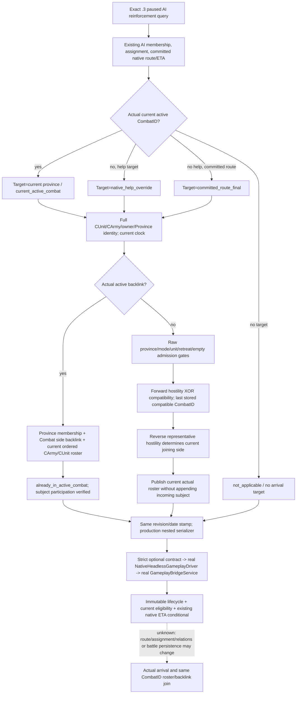

# 增援到达与当前既有战斗准入（1.20.0.3）

2026-10-06 / 2026-W41。原生树输入基线 `df87fd85`，实际接线基线 `be06a134b9a5472275e08ea452a8e3542b192fb8`。本包已接入现有增援只读查询，但首次编译、7 个新 whole-wire 场景和唯一完整 Service consumer **NOTRUN**；readiness 为 **research / source integrated**，没有 static-ready 或 live 信用。

目标仍为 CK3 **1.20.0.3 / Steam25652598**，EXE SHA-256 `94B55397ABB687A3DCD436805A5D885E6BE90FA6C693FEB44A9E3BBEEADE02A6`。采用现有 [reviewed .3 ABI reuse](../../ck3_autonomous_player/native_bridge/research/ck3_1_20_0_3_abi_reuse.json) 中 routes/battle 合同；本包没有读取 EXE/native body、重新 hash 或执行 verifier。上文旧版本自然增援证据仍留在[原生增援树](battle-reinforcement-and-join.md)，不作为本包 .3 live 证据。

Root 报告的当前 `h9593` paused 帧没有 active combat，两支军队 stationary。本 lane 没有打开该 raw cache，也没有追加查询。Robert CharacterID29829 原普通战役仍是唯一 live 入口；战争与宗教授权已开放。

## 原生输入与实际接线

现有 `ck3_query_battle_reinforcement_assignment_v1` 已发布 AI coordinator/subunit membership、asking/assigned、native help target、当前 CArmy combat link、完整 committed route/native arrival 日期和 aligned assignment ETA。真实缺口是：外来增援对目标省**当前**既有战斗是否能接敌、会加入哪一侧，以及目标当前实际名册。既有 projected-contact 公共入口要求 controllable player army，不能直接观察 foreign AI helper。

本包把独立 `arrival_admission` 挂在原查询的 `contact_projection` 内，不新增公开 query 或 route/ETA producer。现有 driver 和 Service 已复制、核验整个 contact group，实际 Python 改动只在旧 strict contract 的可选嵌套入口。Foreign CUnit 只增加 observation，移动、撤退和其他动作授权未改。



Solid edges are source-closed current observation and implemented candidate paths; they do not imply successful compilation or runtime qualification. The future transition remains dashed. `future_binding=false` and `temporal_semantics=present_time_only_not_future_binding` are explicit semantics, not null placeholders for completion.

The source inputs are the reviewed existing `ck3_12002_battle.cpp::ReinforcementSample` and `ck3_12002_routes.cpp::ResolveLocalContactDecision`/contact gates. Compatibility uses owner-to-representative hostility XOR and final stored compatible selection. Side selection uses representative-to-incoming-owner hostility. Admission reads Province `+0x20 -> +0x1B`, mode root `+0x1C0 -> +0x28`, CUnit `+0x18`, retreat `+0x170`, and the existing empty-army getter. The contact resolver itself is not invoked.

Actual participation requires current full CombatID, Province membership, side backpointer, ordered native armies/public CUnits, and matching CArmy `+0x128` / CUnit `+0x178` identities. The incoming candidate is never appended to a current roster. An active subject selects its actual current CombatID, rather than relabelling the final compatible candidate as an actual join.

The header-only getter samples current state twice and binds the paused clock. Its caller stamps nested revision/date with the existing query's transport scope. A negative observation preserves fields actually read before failure; the derived assessment does not use partial selection, side or roster as a successful admission. A negative nested group does not change the existing available assignment frame into an unavailable frame.

Native help uses the existing aligned assignment ETA; ordinary approach uses the existing final committed native arrival. Lifecycle distinguishes `already_participating`, `assigned_en_route`, `ordinary_en_route`, `assigned_eta_unavailable`, `arrived_not_yet_participating`, and `no_arrival_target`. Current rejection does not infer that the AI declined a request or will remain ineligible at ETA. Conditional arrival requires en-route lifecycle, current eligible gates, current selected existing CombatID/current side, and a native final ETA.

An existing `subject_not_ai_managed` result stays the legitimate old unavailable DTO. This package does not turn that result into a general foreign non-AI route query. The historical assigned stationary helper with native target=null / empty route remains the earlier consumer RED; the new arrived synthetic case supplies a consistent native slot and does not adopt the parked timing patch.

## FIRST qualification entry

The new target is `xar_ck3_reinforcement_arrival_first_12003`; its registered Ct is `xar_ck3_native_bridge_reinforcement_arrival_first_12003`. Root's next joint batch owns first compilation/run. Set `XAR_CK3_REINFORCEMENT_ARRIVAL_FIRST_OUTPUT_DIR` at configure time to a fresh output directory; otherwise its default is `<native build>/reinforcement-arrival-first-12003`.

```text
cmake --build <joint-build> --config Release --target xar_ck3_reinforcement_arrival_first_12003 --parallel 64
ctest --test-dir <joint-build> -C Release -R ^xar_ck3_native_bridge_reinforcement_arrival_first_12003$ --output-on-failure
```

The producer emits seven complete native JSON files, exercising the new reader on owned synthetic memory and the **integrated production** reinforcement/nested serializers. It does not splice serialized rows. Two link-only legacy reader stubs satisfy the established serializer TU and are not invoked. Route/ETA, AI membership, clock/revision and protocol hello inputs are synthetic; this qualifies the new admission/serialization/consumer path only, not the old route timing engine or live AI decisions.

| FIRST case | Current observation | Derived lifecycle / conditional arrival |
| --- | --- | --- |
| `help_attacker_en_route` | eligible / attacker | assigned en route / conditional |
| `help_defender_en_route` | eligible / defender | assigned en route / conditional |
| `ordinary_last_compatible` | eligible / defender / final stored combat | ordinary en route / conditional |
| `help_retreating_arrived` | ineligible, retreat raw1 / at target | arrived without participation / none |
| `help_empty_en_route` | ineligible, empty army | assigned en route / none |
| `already_participating` | actual current roster/backlink verified | already participating / none |
| `ordinary_no_compatible` | eligible, no current compatible battle | ordinary en route / none |

For the sole consumer, set `XAR_REINFORCEMENT_ARRIVAL_FIRST_WIRE_DIR` to that native output directory. Leave the optional `XAR_REINFORCEMENT_ARRIVAL_FIRST_CASE_FILTER` unset for all seven cases. From repository root, use Root's existing verified Python interpreter with this argv:

```text
<Root-verified-Python> -B -X utf8 ck3_autonomous_player/tests/unit/test_battle_reinforcement_arrival_first.py BattleReinforcementArrivalFirstTests.test_native_whole_wires_through_real_service_and_immutable_assessment -v
```

The test sends untouched native result objects through strict normalization, the real driver and the real Service, then checks immutable derived assessment. It uses an in-memory protocol endpoint; no real pipe, game, SDK or process is started. There is one new Python test method and no old matrix invocation.

No imports/tests/builds have run in this lane. Source integration alone does not establish static-ready, fixture-live, production-live primitive/loop, aligned ETA-to-join, or full future reinforcement forecast readiness. After first offline qualification, the next required evidence is a real approaching campaign candidate: paused admission/ETA observation, then an independent current roster/backlink observation if normal campaign progression reaches it. Existing `fixed_participants` forecast is unchanged.

[Oct6/W41 fields](battle-reinforcement-arrival-admission-12003-fields.json) are provided for Root's central reports. Root owns the joint FIRST batch, current game/SDK/process/Steam operations and publication; this isolated source handoff creates one English commit without push.
