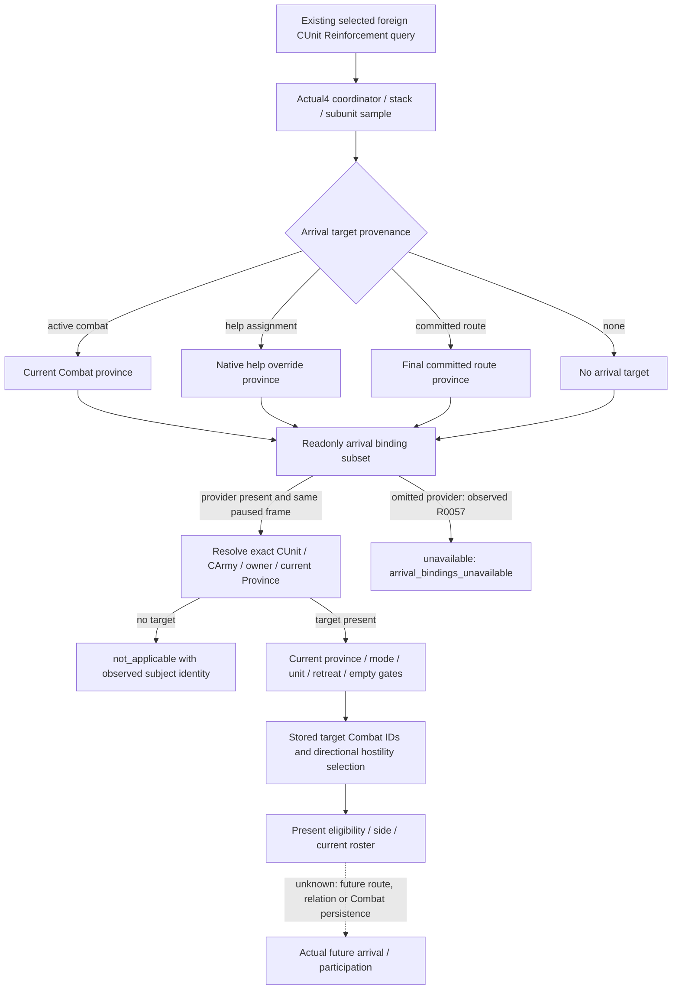

# Reinforcement arrival bindings migration to 1.20.0.4

The accepted R0057 enemy Reinforcement response exposes a real current AI
coordinator and stack, but its nested arrival admission reports
`arrival_bindings_unavailable`. This is an omitted dependency of the adopted
query. The earlier battle factory populated `route_bindings`, and the existing
reader attaches arrival admission on every available Reinforcement sample.
Current lack of an assignment does not excuse a missing provider.

The actual `.3` caller first matched its own `94B553...` descriptor, then used
the explicit reviewed ABI token from `ck3_12003_abi_profile.cpp`. The older
namespace factory itself only accepts `AE1BA...`; that compatibility mechanism
is not extended to `.4`. This is production source adoption evidence, without
an additional claim of an earlier paused positive arrival sample.

The source baseline is `a57a460dd7ab83d213357a7258ed1a1815ee70cd`. The frozen
image is CK3 `1.20.0.4`, Steam build `25734779`, SHA-256
`98702F88A547CDE2EAF29A85F93B85F68EE4CF8148336A4F7AFAEB75319DD518`.
This package changes the readonly dependency of the existing query; the player
actor, action authorization, schema and arrival assessment remain unchanged.

The production source seam is
`ck3_12002_battle.cpp::ReinforcementSample`: it passes `b.route_bindings` to the
existing memory reader and publishes the returned nested DTO. The legacy
factory assigns `b.route_bindings = BindRouteImage(base, sha)`. The actual4
factory omitted that field, and its Bridge dependencies contain only combat,
army fallback and province resolution. No new Bridge or CMake hook is needed
when the actual4 battle factory fills the subset directly.

The actual4 factory now fills that existing subset from its six already
qualified roots, the exact GUI-global slot and three independently proved
callbacks. Its existing actual4 SHA gate remains the identity authority.

The reader consumes only `enabled`, seven storage slots and three readonly
callbacks. It does not consume route speed, construction, command, holder or
defender-classifier fields.

| Dependency | Existing actual4 authority / remaining proof |
| --- | --- |
| GameState, Jomini, Character, Combat, CUnit, CArmy slots | Reuse the actual4 BattleBindings fields already supplied by Core, Army and GeneralCombat. |
| `is_army_in_combat` | Existing Army scoped ordered refill profile binds actual `0x24E8340`; `army-world-family/native-main/map05/active_combat_actual_leaf-DETAIL.json` retains the full 81-byte proof. |
| `is_character_hostile` | Actual `0x2C09620`, full 191-byte paired body. Character receivers use `+0x18`; native returns AL boolean. All existing contact/arrival callers pass literal `false`, corresponding to the native optional War null argument. No new meaning for a true argument is introduced. |
| `is_army_empty_for_contact` | Actual `0x24E83A0`, full logical 152-byte body across three metadata fragments (`32+106+14`). All reachable branches and returns are included. |
| Contact game-mode slot | Reuse actual4 `kGuiGlobalSlotRva12004V1` (`0x5CB87F8`) and `generic-gui-12004/COMMON-GUI-SOURCE-READY.json` global-slot proof. Actual contact prefix proves root `+0x1C0` into R8, then mode byte `+0x28`. |
| Pure subject and Combat fields | Reuse Army BASE-READER, sentinel `UnitDirectTargetSerializer` full 1377-byte proof, Holy `ho_0261D5F0` full 328-byte proof, and the Battle typed field ledger. |
| Province lookup | Reuse Province profile and Army/World BASE-READER `GameState+A0 -> GameData140/14C -> id*8 -> Province10/85C`. The exact contact prefix proves gate `20/1B` and current Combat list `758/764`. |

The contact field witness is only the first 292 bytes of actual
`0x2479160`, paired against old `0x2479180`. Its concrete member operands,
complete decode and ordered relative/RIP targets match. It proves the fields
read by this observer, and the native mutation resolver is neither bound nor
called. The full 1554-byte resolver is outside this package's qualification.

The proof packet is
`Z:/ck3_mod_rewrite_process_assets/g2-parallel-20261007/battle-pursuit/migration-steam25734779/arrival-readonly-migration/`:
`HOSTILE-SOURCE-RECEIPT.json`, `EMPTY-SOURCE-RECEIPT.json`, and
`contact-layout-map01/ARRIVAL-CONTACT-LAYOUT-SOURCE-CLOSED.json`. The physical
capture total is 1270 bytes in 10 bounded calls. Existing roots, inCombat and
other typed fields are reused without recapture. The empty prefix-only first
attempt and the contact extractor's initial register mismatch remain retained;
the necessary continuation and cache-only correction are separately recorded.

The existing frame repair stamps parent and nested DTO from the same captured
native revision and date. Binding this provider must preserve typed
`not_applicable` and unavailable outcomes; it must not invent a target,
assignment, eligibility or roster membership. R0057 independently confirms
enemy CUnit `134218098`, CArmy `167772499`, owner `31050`, current Province
`2606`, coordinator `100663363`, native revision `2`, public revision `3`,
paused raw date `53288256`, and Robert actor `29829`.

R0055 guard RED and R0056 strict-parser RED remain preserved. R0057 gives
positive current AI input observation credit, with nested arrival still a
migration gap at that attempt. This factory repair is source-ready. Build,
fixture, consumer replay and further live verification are owned by Root and
have not run in this source package. Root's next fresh same-scene query should
observe a typed `not_applicable` admission with the real subject identity if
the subject still has no target; a current assignment or target would instead
use the existing admission assessment. Neither expected outcome is claimed as
observed before that query.
