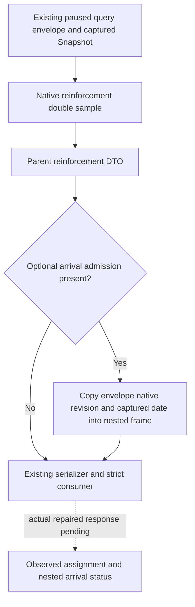

# Reinforcement nested arrival frame binding in CK3 1.20.0.4

The clean R0056 readonly enemy query reached the native provider, then the
existing Python parser rejected its nested arrival frame. This source repair
fills the nested revision and date from the same captured query frame as the
parent reinforcement DTO. Build and actual repaired-query qualification remain
Root-owned and NOTRUN for this commit.

The exact game is CK3 1.20.0.4, Steam build25734779, frozen executable SHA256
`98702F88A547CDE2EAF29A85F93B85F68EE4CF8148336A4F7AFAEB75319DD518`.
The isolated source base is `c0708a15a404a89133171b56cf9c257e760106a5`.

## Actual failure and source entry

R0056 used DLL7eed and Robert29829's original paused game. The existing tool
`ck3_query_battle_reinforcement_assignment_v1` selected enemy public CUnit134218098
with public revision3. Its response ran from
`2026-10-07T01:28:10.589788Z` to `01:28:36.247374Z` (25.657586s) and returned:

```text
native battle-reinforcement query returned a malformed frame: arrival_admission.snapshot_revision must be an integer in [1, 18446744073709551615]
```

The original response is retained at
[R0056 enemy005](Z:/ck3_mod_rewrite_process_assets/g2-background-20261007/upstream-build-migration/managed-full-h9613-dispatch05/operator/gameplay-responses/005-clean-enemy-reinforcement-bindings.json).
This is a production consumer RED. The public tool body contains no raw DTO,
so it gives no positive assignment, route, contact or arrival-admission credit.

The existing arrival DTO declares `snapshot_revision=0` and states that the
owning query supplies it after the native read. Its pure reader initializes
that DTO and publishes the observed date; it has no query revision input.
`ReadBattleReinforcementAssignmentV1` attaches this optional group to the
contact projection. The typed production executor in `bridge.cpp` filled only
the parent revision. The existing dedicated reinforcement mailbox already
fills both nested revision and date after its frame checks. The Python
`normalize_battle_reinforcement_arrival_admission_v1` requires a positive nested
revision equal to its outer native revision, regardless of nested availability.



## Minimal repair and qualification boundary

The typed reinforcement branch now stamps an existing nested admission with
`envelope->expected_snapshot_revision` and `snapshot.date_raw`, matching the
dedicated mailbox's established binding pattern. These fields identify the
already captured frame. Native status, reason, subject, assignment, eligibility,
route, contact and `future_binding=false` continue to come from the original
reader. Optional `.4` arrival-source availability is not promoted by this fix.
No Python schema, parser acceptance rule or AI command changes are needed.

The source diff receives one whitespace check. This task runs no build, tests,
imports, native fixture, SDK query, game action, EXE read or hash. Root next
recompiles the changed bridge TU and qualifies the existing readonly query once
from a fresh accepted paused Snapshot. Preserve R0056's malformed attempt and
R0055's earlier `state_changed`; a valid repaired payload must be reviewed before
any production-live reinforcement credit is added.
