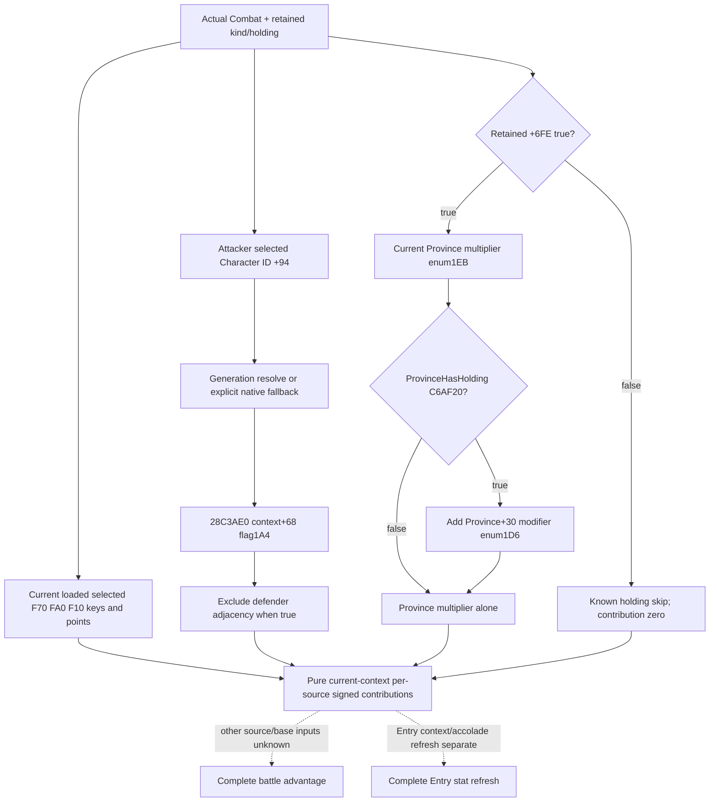

# Current contributions from retained battle rule selectors, exact 1.20.0.3

This source-first extension closes the holding multiplier and commander exclusion left explicit by the current loaded F70/FA0/F10 observer. It will expose current operands through the existing actual battle transition and owned control geography fragment, then compute three individually qualified current-context source contributions in an immutable pure model. These operands do not establish the historical battle constructor ledger, complete advantage, Entry refresh, forecast quality or a future contact.

Exact build: CK3 1.20.0.3 / Steam25652598 / EXE SHA256 `94b55397abb687a3dcd436805a5d885e6be90fa6c693feb44a9e3bbeeade02a6`. Frozen source packet: [retained-advantage](Z:/ck3_mod_rewrite_process_assets/g2-background-round4-20261005/retained-advantage/research-plan.json). The source and query plan were recorded before implementation. Root owns shared daily/weekly reporting and native compilation; current work is offline only.

## Native source tree and cost

The cached exact .3 caller `247AA34..247AAAD` loads the retained defender adjacency effect, validates effect magic, then resolves attacker selected Character full ID at actual `Combat+94`. Its generation resolver uses Character storage `5C67568` and canonical fallback `5C67570` (RIP operands at `247AA4B` and `247AA7D`). It calls `28C3AE0(Character)`, checks aggregator `+68` flag `1A4` through `23037B0`, and appends side 1 only when the flag is false. This is the selected attacker commander, not a candidate CArmy commander or side's primary participant. A native fallback is observed explicitly, including absence/stale IDs; it is not replaced by invented false.

The holding source was verified with one bounded frozen EXE seek `25874A6..2587563`: **189 code bytes**, span SHA256 `3832405e33c825f87b5351d33c562ab249a9fa5ff6e7584ac2c174f3af49d670`, plus only PE mapping headers. No whole EXE scan/hash or game/process read was performed. The caller's historical defender predicate `2C09D30` writes retained `Combat+6FE` when true. The new current diagnostic uses that retained byte directly and does not rerun the historical identity predicate.

When retained holding is true, read current actual Province through `Combat+6B8`; `2C23360(out,Province,1EB,0,null)` returns its Q100000 multiplier. If `C6AF20(Province)` indicates a holding, `2C4D550(out,Province+30,1D6,null,100000,0)` yields another Q100000 modifier, added with native signed64 arithmetic. Native `2587536..258754E` appends the loaded Rules+F10 holding effect to side 1 only when the combined multiplier is strictly positive. Retained false means this branch is not evaluated and its contribution is deterministically zero. Holding present false means the additional modifier is not evaluated; the province multiplier alone suffices.

Loaded effect key/magic/whole signed int32 points remain the already implemented current-frame observer. `2586CA3` sign-extends points+40, multiplies by100000, applies the separate Q100000 scale, and uses side0 positive/side1 negative signs. Thus each selected row's contribution is signed `points * scale_raw`, with native int64 wrap; zero points remain selected/appended where the native branch permits. This package does not sum these partial rows into a battle total or apply an accumulator clamp without the other source/base inputs.

Cached commander evidence: `Z:/ck3_mod_rewrite_process_assets/g2-resume-20261004/battle-knight-entry-future-12003/outer-membership/evidence/0247a820-span.txt`, reused without another read. Holding evidence and tool-rendered native graph are in this packet's `holding-known-span.json` and `RESEARCH-GRAPH.md`. Research plan mode is `offline-only`; the generic `--for-observation` option rejects that mode because it represents live observation, so the offline structure check/render was used. No live sampling window exists or was inferred.

## Query plan and independent usable output

Add optional `actual_geography_v1.current_rule_context_v1` only under the exact .3 binding already used by retained loaded effects. It contains two independently qualified operands:

- `holding_multiplier`: status `available`, `not_applicable` (retained holding false), or `unavailable`; current province multiplier, nullable current holding predicate/additional modifier, scale100000 and reason. No effective sum is substituted for an unread operand.
- `commander_exclusion`: status `available`, `not_applicable` (defender adjacency native effect not selected), or `unavailable`; actual selected Character raw ID, explicit native fallback use, nullable flag1A4 result and reason.

The outer existing frame retains CombatID, ProvinceID, date and revision. Provider reuses current native readonly bindings; no new MCP/tool, runtime hook, effect execution or weaker control ownership. Strict normalizer preserves legal zero/false/null and the native branch short circuits. A new immutable adapter computes each of attacker adjacency, defender adjacency and holding separately, allowing an independently observed row to be useful while another row is missing. Unknown rows keep null contribution and a concrete missing input; known native skips yield zero. The output names its mode `actual_current_context_retained_rule_contributions`, never historical append or complete battle advantage.

Verification plan: one new focused Python case exercising signed nonstock points, fractional holding multiplier, commander exclusion/fallback and native skipped/unavailable branches; one new native fixture target using the actual transition/control producer and shared serializers, built centrally by Root. No existing passing test is rerun. Entry stat/context/accolade refresh is owned by the parallel first-contact Entry work package; the current source contributes no imaginary Entry input.
