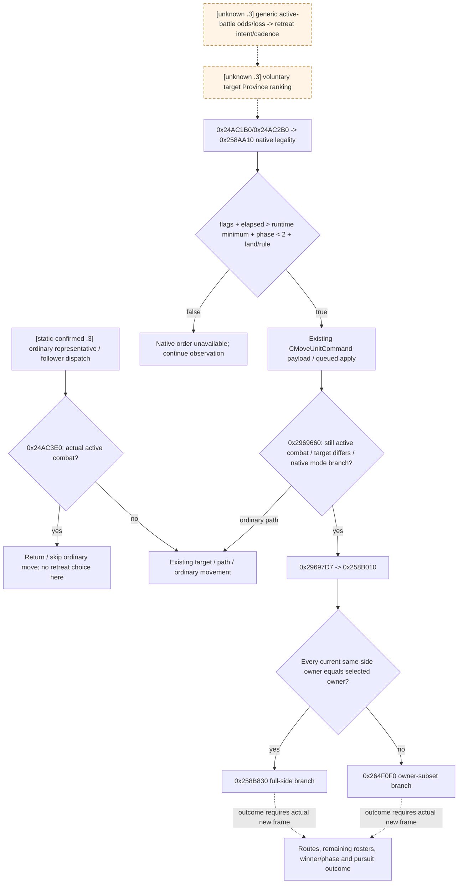
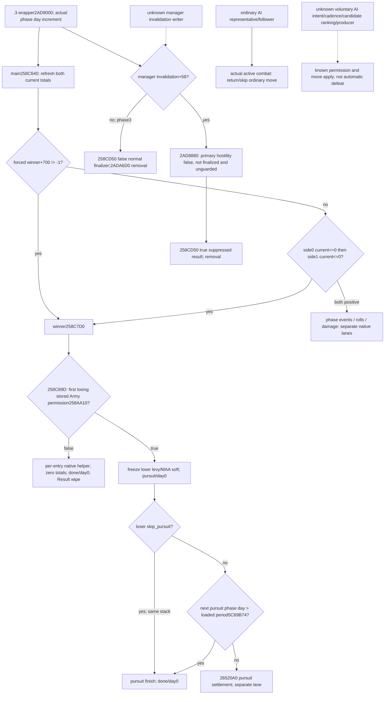

# CK3 1.20.0.3：战中撤退、继续交战与原生 AI 选择边界

2026-10-03，只读磁盘研究。目标为已安装 **CK3 1.20.0.3 / Steam 25652598**，EXE SHA-256 `94B55397ABB687A3DCD436805A5D885E6BE90FA6C693FEB44A9E3BBEEADE02A6`。证据来自 `Z:/SteamLibrary/steamapps/common/Crusader Kings III/`；外部包位于 `Z:/ck3_mod_rewrite_process_assets/g2-resume-20261003/battle-retreat-ai/`。研究者没有启动、附加、查询或操控游戏，没有桌面输入、时间推进、共享源文件修改或 Git 操作。ROOT 最新战争与战斗授权适用。

本包先读并复用 [旧版主动撤退专题](active-combat-retreat.md)、[普通战争队列研究](ordinary-war-active-retreat-queue-audit-2026-09-27.md)、[旧版 normal/desperate 研究](war-film-retreat-policy-2026-09-23.md)与 [1.20.0.2 战中迁移](ck3-1.20.0.2-battle-migration.md)。旧版 AI 阴性样本和 `.2` fixture-live 不外推为 `.3` 实机事实；此次只补当前 EXE 的原生分支和生产源码入口。

## 对当前战争的直接结论

- **[static-confirmed]** 普通战争 representative `0x1A1CB00` 与 follower `0x1A1CFF0` 都先检查实际 active combat；为真时退出／跳过普通移动路径。因此不能拿这两条路径的目标选择或接战预测，声称 AI 已选择战中主动撤退。
- **[static-confirmed]** 当前撤退合法性只读取身份、side flags、战斗结果基准日期、运行期天数门槛、phase 与 owner 的 land/rule 状态，**不读取兵力、战损、advantage 或胜率**。合法不等于想撤退，也不等于已有安全目标省。
- **[static-confirmed]** 普通移动命令执行时发现 active combat，可把目的省交给战中撤退分派。全 side 同 owner 与混合 owner 的撤退是不同原生分支。
- **[research]** `.3` 通用战争 AI 的“实际战中 odds／战损 → 撤退意愿 → 目标省 → 入队”完整生产链、cadence 和目的省评分仍未闭合。当前排除范围可复核；没有宣称 AI 永不撤退。
- 当前原生树足以支持明确标作**我方自有策略**的有界继续／增援／撤退决策；未闭合的原版对手选择不构成继续当前战役的禁令或新门禁。

## 当前 EXE 的撤退合法性树

`0x258AA10(CCombat*, CArmy*, ErrorSink*)` 是现有 `BattleBindings::can_order_combat_retreat`。生产查询传 `ErrorSink=nullptr`，首个失败门返回 false；现有 bridge 另按原生顺序投影各个原因，再对账其合取与原生 boolean。下面地址均为当前 EXE 的 RVA。

| 原生门 | 当前指令与字段 | 语义边界 |
|---|---|---|
| 所选 side 不禁止撤退 | `0x258AA7E..0x258AA92`，combat-relative `+0xE0/+0x428`，即 side `+0xC0` | 从所选 CArmy 是否在 attacker stored roster 选择 side；不是战争攻守身份 |
| 允许提前，或经过天数严格大于门槛 | `0x258AB77..0x258AC08`；Result FullID `Combat+0x708`、Result `+0x2C`；side `+0xC1`；门槛 `0x5C699B4`；最后 `jg` | 原版默认 `MIN_DAYS_BEFORE_MANUAL_RETREAT=14`，常规最早 elapsed 15；实际决策读取运行期值和结果日期，不能只看 main phase day |
| phase < 2 | `0x258ADBE..0x258ADC5`，`Combat+0x6B0`，signed `jl` | maneuver/main 可继续评估；pursuit/done 不可主动撤退 |
| 原生 land/rule 门通过 | `0x258AEC4..0x258AF2F`；CUnit owner `+0x174`，Character `+0x1C0`，land `+0x1F8`；`0x28C2E10(owner)` 返回对象 flags `+0x40` bit10 | 无 land 对象、land marker 非 -1 或该 rule bit 为真可通过；bridge 只命名该 gate boolean，不扩展成未经证明的头衔语义 |

日期转换是 `whole_day(x) = signed_trunc((x - 0x029C55C0) / 24)`；elapsed 是 current 与 Result baseline 的 whole-day 差，而非先相减再取整。原生 Earliest date 可由现有 `legality.earliest_day_gate_date_raw` 直接消费。`allow_early_retreat=true` 只免天数门，其他三门继续执行。

原生原因顺序为 `COMBAT_NO_RETREAT_DISALLOWED`、`COMBAT_NO_RETREAT_TOO_EARLY`、`COMBAT_NO_RETREAT_PURSUIT`、`COMBAT_NO_RETREAT_LANDLESS`。本包复核当前指令与已存在生产投影；没有取得新的 Robert 撤退 legality live 帧。

当前源码在 `ck3_autonomous_player/native_bridge/src/ck3_12002_battle.cpp` 的 `Retreat()` 已发布 selected side/scope、affected/unaffected、上述 flags、baseline/elapsed/minimum/earliest、land gate、native boolean 与 reasons。`ControlSample()` 同时读取完整双方 roster、main entries 的 starting/current/soft/hard、有效战斗属性、owner hard ledger、native side/entry strength、当前 roll 与 64 位 base/resolved advantage。这些是我方继续／撤退比较的现有输入；它们没有被此次研究变成原版 AI 的撤退阈值。

## 普通 AI 派令与现有引擎分派

`legality-callers-exact03.json` 的当前全 EXE 直接引用采集得到 8 个 instruction-boundary-verified 调用点：`0xD0F552`、`0x140EFFA`、`0x140F18B`、`0x140F429`、`0x140F4F9`、`0x24AC265`、`0x24AC381`、`0x258C89D`。没有一个位于当前普通 AI `0x19.../0x1A...` 区域，也没有搜索到 absolute pointer。此 census 不枚举 indirect/vtable 调用，不证明全局无主动撤退策略；较低地址的界面／脚本业务归属也没有靠地址邻近强行命名。

原生通用 CUnit move validator `0x24AC1B0` 在 unit regular、非 retreating、generation-valid CArmy/CCombat 时，于 `0x24AC265` 调上述 null-sink helper。相邻路径 `0x24AC2B0` 于 `0x24AC381` 有同一 legality gate。两者能检查撤退，不表示每个上游 AI caller 都在战中到达它们。

当前普通战争早退分支已经闭合：

| 路径 | 当前证据 | 有界结果 |
|---|---|---|
| active-combat predicate | `0x24AC3E0` 检查 CUnit `+0x18==0`，generation-safe `+0x178` CArmy，然后 `0x24E8360` | 读取有效战斗状态，非兵力比 |
| representative | 复用并行 target 研究已提取的 `0x1A1CB00`：`0x1A1CB59 → 0x24AC3E0`，AL true 于 `0x1A1CB60` 退出到 `0x1A1CFD2` | 在后续 `0x1A1CBCA → 0x24AC1B0`、路线和派令之前跳过战中军队 |
| follower | `0x1A1CFF0`：`0x1A1D1E3 → 0x24AC3E0`，AL true 于 `0x1A1D1EA` 跳到 `0x1A1D3E8` | 跳过该 follower 后继续遍历；同样早于 move validator |

当前 `CMoveUnitCommand` secondary vtable `0x476B138` 的 apply entry 是 `0x2969660`。该函数 generation-safe 解析 CUnit/CArmy，调用 `0x24E8360` 确認实际 active combat；在 active 分支、目标省不同且原生 mode 分支允许时，于 `0x29697D7` 调 `0x258B010(combat, public CUnitID, target Province*)`。这里记录的是原生 apply 数据流；生产动作继续使用已发布 typed retreat preview/order，无需直接调用 mutator。

`0x258B010` 从实际两侧 stored CArmy rosters 选择所选 side；在 `0x258B222` 比较每支 CUnit owner 与所选 owner。全部相同，于 `0x258B23C` 调 full-side helper `0x258B830`；任何 owner 不同，于 `0x258B281` 调 owner-subset helper `0x264F0F0`，携带当前 side/opposite side、selected owner、目标省和 subset flag。完整后续 pursuit/损失实现没有由本包重新展开，原 `.2` 已验收语义保留其 fixture 来源。

## Current constants: separate stock semantics from active choice

Installed `common/defines/00_defines.txt` SHA `8e430d77eb6e8767030f34b1c53d5dae84277fb354bd73cc42f93dc500be8982` gives manual minimum 14 at line 606. Installed `common/defines/ai/00_ai.txt` SHA `3af5d4100789bad56570e05c5852f35783605813957de7a5129d23142a116120` defines normal/desperate combat-admission `.5/.4` at lines 1223/1230; its own comments describe entering provinces. The parallel [current target research](army-target-triage-1.20.0.3.md) closes their current slot selection and general target countdown 7/14; neither is an active-retreat cadence.

Stock `.45` `RETREAT_COMBAT_PREDICTION_RATIO`, distance `2` and elsewhere-strength `.25` occur at lines 1282/1297/1305. Prior exact `1.19.0.6` research placed the corresponding strategic stand/retreat tree before contact. This package did not migrate their complete `.3` producer/consumer chain, so their current comments alone do not prove a battle-day retreat threshold. `SHATTERED_RETREAT_*` stocks describe a separate retreat system; no new direct xref to voluntary target selection was established here. These unknowns stay dashed and outside the minimum current player action dependency.

## Root's actual current combat and usable next inputs

This researcher reused ROOT's existing `war-battle-phase/actual-battle-transition-v34-01/004-ck3_query_battle_transition_v1.json`. At paused DateRaw `53236608`, native revision `16`, public `2`, **CombatID `1577058305`** exists at `2640`, maneuver/day `0`, winner/forced winner none, finalized false, Result FullID `1493172226`. Actual attacker CUnits are `[251658381,473,474]` owned `70766`; actual defenders are `[50331920,83886484]`, owners `30097/35357` from the separately saved root snapshot. Robert `83886367` remains outside at `2614`. This is **enemy versus enemy**, not Robert's battle or a player retreat opportunity; no child requery occurred.

The root's actual remote discovery is separately owned by the [existing-combat observation composition](battle-hostile-existing-combat-discovery-1.20.0.3-2026-10-03.md). Current phase/day/roster can be monitored by already-published `ck3_query_battle_transition_v1(combat_id, expected_revision)`; it does not require player participation. The published player battle-control/retreat methods correctly require a controllable army in actual combat. Do not submit Robert control now or enemy retreat queries to recover a field which cannot yet apply to Robert.

When Robert actually enters a battle, reuse the following source-confirmed existing tools:

| Needed decision input/action | Existing concrete entry | What to verify |
|---|---|---|
| Current player battle and retained side losses/strength/advantage | `ck3_query_battle_control_snapshot_v1(subject_army_id, expected_revision)` → `ReadBattleControlSnapshot` | actual CombatID, side, current roster, phase/day, current entries; never reuse undepleted pre-contact state |
| Continue for a bounded observed interval | `ck3_execute_step("life-advance", expected_revision)` | existing official one-day paused postcondition; no invented daily keep-fighting command |
| Route-backed legal retreat preview | `ck3_preview_active_combat_retreat_v1(selected_public_cunit_id, target_province_id, expected_revision)` | current native legality, full-side/owner-subset affected/unaffected, exact route and one-use candidate token |
| One actual selected retreat | `ck3_order_active_combat_retreat_v1(selected_public_cunit_id, expected_revision, expected_combat_id, expected_side_index, expected_scope, target_province_id, candidate_token)` | fields come from current preview; later real retreat state/route and prior-C transition, not ACK |
| Prior battle transition after retreat | `ck3_query_battle_transition_v1(combat_id, expected_revision)` | full side's winner/pursuit or owner-subset retained allies and enemies |
| Actual result and post-battle state | `ck3_query_battle_terminal_transition_v1(prior_combat_id, subject_public_cunit_id, expected_revision, after_terminal_sequence)` | saved positive journal cursor or None; normal result vs other branch, old ID removal, result, current subject/reentry; missing ID alone is insufficient |

Root must retain the existing Sway recorder attachments before its first time advance; this lane did not modify or rerun them. Existing permissions, unique Robert campaign and no-focus operation remain inputs to ROOT's work, while war authorization has already been granted.

## Minimum own-policy scope and future native construction entry

After the native tree above, an own bounded policy may compare current battle continuation, actually reachable reinforcement and a currently native-valid retreat. Read present losses and effective attributes on one current frame, choose an observation horizon or route-backed retreat, execute through existing tools, then record the material result. Future roster changes, reinforcement ETA, pursuit loss, destination enemy routes and campaign value are separate inputs or explicitly recorded quality gaps; no UI soldier ratio becomes a native win probability.

For a concrete future opponent-model need, the remaining native research entry is current ordinary-war command production: `0x1A1CF88 → 0x1A188B0(...,7)` from the accepted target package, with current command vtables `0x476B168/0x476B138` and apply `0x2969660`. A producer receipt would capture naturally produced complete UnitID, route/target, mode, caller RVA, date, exact CombatID/phase and correlated apply/result; its caller must actually read active battle odds/losses before being classified as voluntary retreat. This is a concrete observation/construction entry, not a new query implementation, an authorization request, or a required detour for Robert's current remote battle.

Current status is **research with current-build static branches closed**. Existing production source is reused; this package adds no implementation or new live readiness, battle action, days, victory or G2 milestone. `.2` full-side/owner-subset fixture results retain their own evidence boundary. ROOT merges the new topic and the supplied daily/weekly report fields, commits and pushes; this researcher leaves canonical files untouched.

## 2026-10-04：active exit 与自动终结的当前原生输入增量

本增量绑定 CK3 **1.20.0.3 / Steam 25652598**，EXE SHA-256 `94B55397ABB687A3DCD436805A5D885E6BE90FA6C693FEB44A9E3BBEEADE02A6`；只读源码为 Root 冻结 `g57/source1791d84`。状态为 **research / current-build static-confirmed branches**，无新实现、测试、SDK、游戏动作、存档日或部署信用。原四项撤退合法性、普通 AI active-combat 早退树及 final-survivor wrapper 直接复用；没有再次全 EXE caller census。

只新提取三个逻辑函数 `0x258C7D0 / 0x258CA60 / 0x2AD8880`，沿 `.pdata` 的 chained unwind 收齐其 **14 个原生片段、1787 字节**；不展开 roll、width、damage 和 final-survivor callees。既有 `.3` main `0x258C640` 与 wrapper `0x2AD8000` 字节证据复用 `combat-commander-quality-v46/in-battle-assignment/evidence/`，没有重提。旧 `.19` 终结树只作问题目录；下表地址均由当前 `.3` 指令证明。

### 玩家权限、AI 主动选择、自动战败分别解释

1. **玩家/native permission**：`0x258AA10` 只决定当前选定 army 是否可以主动撤退，现有四门不重研究。原生合法为 true 不代表 AI 想撤退，也不代表任何目的省排序或命令已经生产。
2. **AI voluntary intent**：普通 representative `0x1A1CB00` 与 follower `0x1A1CFF0` 已证明 active combat 时退出／跳过普通派令；通用 AI 的 active battle intent、cadence、候选省枚举/排序及真正自然命令 producer 仍为虚线 unknown。`.5/.4` combat-admission 与 `.45` retreat-prediction stock 值不升级成已证战中退出阈值。
3. **Automatic defeat / destroy / result**：下列判胜、追击、毁灭标记与正常／抑制结果是引擎战斗生命周期路径，不是 AI 依据胜率选择主动撤退。Root 的一次玩家撤退命令或战后 retreating 同样不能证明上述 AI intent。

### 已闭合的当前分支

| 入口与精确 callsite / 指令 | 当前真实决策输入与有界语义 |
|---|---|
| `0x258C652/0x258C661 → 0x26505E0`，随后 `0x258C666..0x258C6A5` | main 开头刷新两侧 current 合计；`Combat+0x700 != -1` 时 forced winner 优先。否则先测 attacker `Combat+0xB8`（side0+98）`<=0` 得 winner1，再测 defender `+0x400`（side1+98）`<=0` 得 winner0；两侧均正才进入当天其它 work。两侧同时不正时 side0 检查优先。它不检查 AI 意愿或 `.45`。 |
| main 的 `0x258C68A / 0x258C6A5 → 0x258C7D0` | 引擎判胜进入 winner helper；本 main 当天伤害写回后没有同体末尾再次判胜。下一次 main 入场刷新合计再判；其它 effect/命令独立路径不能由此排除。 |
| `0x258C840`；`0x258C849..0x258C89D → 0x258AA10(combat, first_losing_stored_Army, nullptr)` | 先写 `winner+0x6E0`，按反侧选择败方，再读取该侧 **第一支 stored internal CArmyID**、完整 generation 解析后调用已核 permission。不是整侧兵力比，不按请求 partition 或任意玩家军替换败方代表。空 roster/fallback 保留原生路径，不能假定一定有有效首军。 |
| `0x258C8C7/0x258C8F0 → 0x2657C10`；`0x258C90D..0x258C922`、`0x258C9B9` | 败方 permission false 分支调用各 Entry60 的原生处理 helper，清败方 current totals、写 `phase=3/day=0`，在实际 Result `+0x28` 写 wipe。该分支已经区别于正常追击；本包不展开 helper 的逐兵团因果或把 wipe 译为所有人物死亡。 |
| `0x258C9E0..0x258CA24` | permission true 时按败方原生 levy/MAA stored entries 分别汇总 `entry+0x20` soft，冻结至 `Combat+0x6E8/+0x6F0`，写 `phase=2/day=0`。冻结 soft 量不是日后剩余人数或 final survivor。 |
| `0x258CA2F..0x258CA3B → 0x258CA60` | 败方 `skip_pursuit`（side+C2）为真，胜方转入 pursuit 的同一调用栈同步进入 pursuit helper。其开头直接 finish，不能把该同步 call 计为一次正常追击伤害日。 |
| `0x258CA9F..0x258CAB5` | pursuit 先读取败方 skip flag；未 skip 时读 runtime int32 **`0x5C69B74`**，只有 `phase_day > runtime_period` 才 finish。安装 stock `PURSUIT_PHASE_DAYS=3`（00_defines:599）表示默认 phase days1/2/3 可走伤亡、day4走finish；当前 loaded 值尚未由该 MCP 读口发布，不把默认3声称本帧实读。 |
| `0x258CB87 → 0x26520A0` | 未 finish 才将冻结 soft 与当天当前 soft 及 runtime period 交给追击结算 callee。本包不展开追击损失公式，B lane 另有 owner。 |
| `0x258CBB9`、`0x258CBC7 → 0x2588FC0`、`0x258CD22/0x258CD27` | finish 写 `phase=3/day=0`，再调用原生 finish work。之后零 soft 与有效 MAA/关联人物分支决定是否给 Result wipe；这些检查不等同 named-character killed/captured 发布。phase3 仍不单独证明 finalizer 或旧 Combat 删除。 |
| wrapper `0x2AD814F..0x2AD817B` | 每轮 work 后先清 daily guard `Combat+705`。若 wrapper-relative manager invalidation `+58` 为真，优先 `0x2AD815A → 0x2AD8880`；否则只有 phase3 才 `0x2AD816F → 0x258CD50(combat,false)` 正常结果，然后 `0x2AD817B → 0x2ADA6D0` 移除旧 full Combat。正常结果后置继续用现有 terminal journal，不能从 phase3 单字段推胜利。 |
| sweep `0x2AD898C..0x2AD89C2` | 完整解析双方 primary CharacterID，`0x2AD8992 → 0x2C09640(primary_attacker,primary_defender,false)` 使用已核 hostility predicate。hostile 为真跳过；非 hostile 且未 finalized，daily guard 真则延迟 sweep，guard 假才 `0x2AD89B6 → 0x258CD50(combat,true)` 抑制正常结果，随后 `0x2AD89C2 → 0x2ADA6D0` 移除。无需 main 已打空或 phase3。此分支不能记成普通胜利。 |

wrapper 参数处的 manager 相对偏移与 sweep 参数处相差8：wrapper 用 `r14+58`，传 `r14-8`；sweep 用 `manager+60` 保存延迟。不能将它们当成两个不同业务旗标。sweep flag 的完整上游写入条件仍未在本包展开，保持具体 unknown，不臆称战争已结束或 primary 已死亡。

### 当前实际边界与下一施工入口

唯一 actual 输入为协调者缓存 `cached-input/SHARED-DAYS04-CACHED-OBSERVATION.json`（SHA `34310e64c51cb3a23476e9589fb121f7b2b5f0ca6ccbbe88d877ae84c4cb230c`），不读 original days、call leaves 或 provider LAST。该缓存属于 **R25/nativeg54/Pyg56**，不是 g57 live：Combat1593835526@2629、Robert defender，main12/elapsed15、forced/winner均none、未finalized、player current permission true/full-side、selected-side skipfalse。敌攻击方 stored fighting1189.63865、entry-derived1028.53124不同是已发布的 tick-start cache 区别；不能用旧 stored 数字替代下一 main refresh，亦不从差值解释具体退出原因。双方当前仍正不表示未来不会forced/owner-subset退出。Root 已另开 continue；本包不增日、不改动作、不阻塞 R26。

现有同一 MCP `ck3_query_battle_control_snapshot_v1` 已发布双方 ordered army、current/soft/hard、forced/winner/phase/day及 **selected army** flags/permission。已有结果和上述静态树足以继续当前有界交战；没有完整 AI 主动退出模型也能作自有策略。

真正需要预测“败方将毁灭还是追击／何时正常终结”时，最小新增只读输入应接**同一 control 查询**，不新建 MCP、schema实现、flags 或门禁：读取两侧各自 side+C0/C1/C2，绑定第一 stored CArmy 的原生 `258AA10` 结果（带 full internal/public IDs、空集/读取失败区分），读取 current loaded int32 pursuit period `5C69B74` 与 `Combat+6E8/+6F0` 冻结 soft。现有 selected-player legaltrue 不能填另一侧 first-Army permission；selected skipfalse也不能填 enemy skip。`258C89D` 与 `258CAAF` 是这几个字段的确切消费者；先完成 same-frame paused query 后才依赖它们安排结果时点。此处仅列施工入口，没有改 DTO／schema 或实现 producer。

通用 AI 主动退出意愿仍不能由上述 permission/readout 推出。其下一具体研究入口是 **自然产生**的 owned move command：复用已知 `.3` ordinary producer `1A1CF88→1A188B0(...,7)`、move apply `2969660→258B010` 和 existing command queue，将实际 full CUnit/Combat、owner、date/phase、目标/route/mode、producer return RVA 与 applied结果配对；只有 producer 确实在 active battle 读取并比较决策量，才继续上溯该**实际命中**caller的输入与候选排序。不再做全 EXE census，不把未闭合策略或 `.45` stock 默认作为游戏继续前置。

外部证据包为 `Z:/ck3_mod_rewrite_process_assets/g2-resume-20261004/battle-source-next-increments-v52/native-active-exit/`：`NATIVE-TREE.md` 保留提取前账本；三份 `EXE-*.json/.asm` 保存 exact bytes/span hashes；`SOURCE-PINS.json` 与 `STOCK-FACTORS.json` 固定源与安装 stock。状态保持 research/static branches，现有实机循环只保留协调者自己的原有限 credit。
