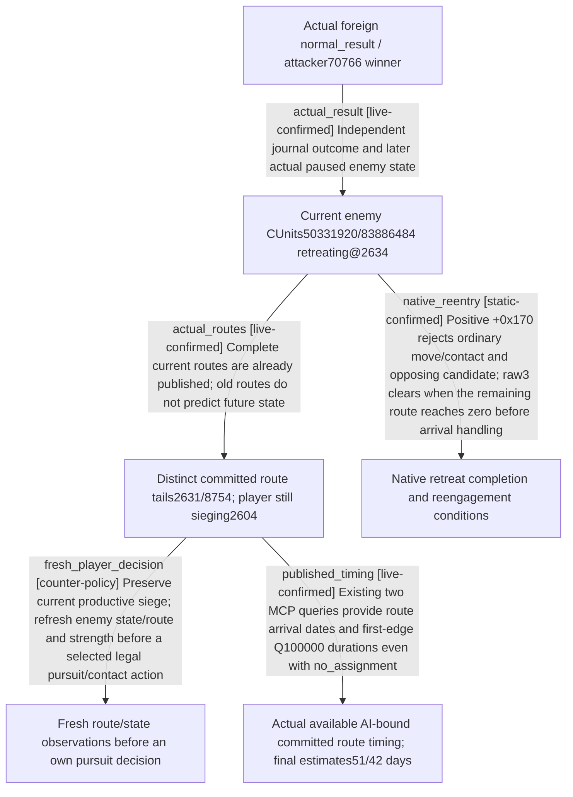

# Research plan: battle-retreat-pursuit-12003-20261003

GENERATED from the supplied research plan; no native semantics are inferred.

Question: After the actual foreign normal_result, which native retreat state prevents immediate reengagement, which existing read-only route fields describe it, and what minimal player pursuit decision can reuse those fields?



| Edge | Declared status | Evidence IDs | Open question |
|---|---|---|---|
| actual_result | live-confirmed | actual_terminal, actual_retreat_snapshot |  |
| actual_routes | live-confirmed | actual_retreat_snapshot |  |
| native_reentry | static-confirmed | native_tree, native_fragments |  |
| fresh_player_decision | counter-policy | native_tree, own_policy, actual_retreat_snapshot |  |
| published_timing | live-confirmed | actual_timeline_50331920, actual_timeline_83886484 |  |

| Observation design | Value |
|---|---|
| mode | offline-only |
| actor_kind | engine |
| owner_scope | Foreign Combat1577058305 attacker70766 and defenders30097/35357; Robert29829 is outside both sides and remains sieging at2604. |
| identity_kind | generation-id |
| identity_lifetime | Complete CUnit/CArmy/Combat/result IDs bind to the current ordinary Robert episode; a later frame must resolve each ID again and never infer destruction from absence. |
| producer_trigger | not-applicable |
| producer | Existing Root terminal journal event18 and paused snapshot; exact installed EXE retreat state/control flow is read from disk only. |
| caller | This package consumes saved Root v39 terminal and day37 snapshots; no new game caller, SDK session or mutation is executed. |
| consumer | Existing MCP snapshot, strength, reinforcement-assignment route signal and a Root-owned future movement decision. |
| cache_lifetime | Saved artifacts are immutable evidence; current retreat state and route are frame-bound and must be queried after further ordinary advancement. |
| expected_signal | Actual terminal_date_raw53238096 separate from query53238336; enemy retreating true and distinct stored route tails2631/8754; exact native retreat reentry branch, or a concrete unresolved getter. |
| zero_sample_meaning | No new samples are planned or collected. A null AI-bound route signal does not mean zero travel time, no path, no retreat or no pursuit opportunity. |
| stop_condition | One bounded file-only study of the actual saved event plus the exact-build retreat/reentry fields; Root receives the existing-query recipe and any minimal actionable gap. |
| runtime_window_ref | None |

| Evidence ID | Declared layer | File | SHA-256 | Supports |
|---|---|---|---|---|
| actual_terminal | live-observation | Z:\ck3_mod_rewrite_process_assets\g2-resume-20261003\runtime-preparation\v39\actual-terminal-after-pursuit-v39-01\002-ck3_query_battle_terminal_transition_v1.json | 0066e2ef80ea49e158f87c9c27bf2e4431d3a91e73ecdf0a86abecb1705b2010 | Reused actual Root foreign terminal event or current paused army/retreat scope; this package adds no live observation. |
| actual_retreat_snapshot | live-observation | Z:\ck3_mod_rewrite_process_assets\g2-resume-20261003\military-ooda-continuation\siege-v39\actual-stationary-siege-batch-2604-02\day-37\005-ck3_take_snapshot.json | e8085c7055ff0de74fd8ea5c4d2ea4e8c0c4d93e5229d20e78bb012d8f7cddea | Reused actual Root foreign terminal event or current paused army/retreat scope; this package adds no live observation. |
| actual_facts | live-observation | Z:\ck3_mod_rewrite_process_assets\g2-resume-20261003\battle-retreat-pursuit\policy\ACTUAL-EVIDENCE.json | 0d1b5a92914b123eefb72dae7cacb7adda86768b0e93e16f7cb41b89cb811886 | Reused actual Root foreign terminal event or current paused army/retreat scope; this package adds no live observation. |
| native_tree | source-contract | Z:\ck3_mod_rewrite_process_assets\g2-resume-20261003\battle-retreat-pursuit\native-tree\TREE\NATIVE-TREE.md | c510cefeac52b3d9013128103e8032df4fd21291bcf88ca56a9667a0c1bcd61a | Exact .3 disassembly interpretations for positive retreat state in ordinary movement/combat predicates, route-count lock release, and bounded coordinator update reuse; external native EVIDENCE.json pins the inspected bytes and sources. |
| native_fragments | exact-build | Z:\ck3_mod_rewrite_process_assets\g2-resume-20261003\battle-retreat-pursuit\native-tree\contact-entry-and-arrival.json | 0de2de7378a2dc0d16284e12279a22da196c8c2fa7ea4de8cbdd8968eec1ea75 | Bounded current installed EXE contact gate and arrival fragments; byte identity supports the exact-build binding but does not alone prove semantics. |
| own_policy | source-contract | Z:\ck3_mod_rewrite_process_assets\g2-resume-20261003\battle-retreat-pursuit\policy\PURSUIT-POLICY.md | 24dbd7543d99f5bdc75dc1b7649c6ac2a783aa5c0ae2800b1f4685b053cb27b2 | Minimal declared own pursuit policy is derived after the native tree was frozen, without claiming an observed native choice or a player action. |
| actual_timeline_50331920 | live-observation | Z:\ck3_mod_rewrite_process_assets\g2-resume-20261003\runtime-preparation\v40\actual-retreat-composition-v40-01\004-ck3_query_battle_reinforcement_assignment_v1.json | d2f9c7102a43f0dfcd6a2d983da610a6d130b0381ef496dd7fc2def7561d5079 | Root actual existing-query payload is available/native_ready; bound AI membership and complete current committed route timeline are published independently of helping assignment. |
| actual_timeline_83886484 | live-observation | Z:\ck3_mod_rewrite_process_assets\g2-resume-20261003\runtime-preparation\v40\actual-retreat-composition-v40-01\006-ck3_query_battle_reinforcement_assignment_v1.json | 4094bfe5446c80c88814bc84903950e6c319cd2f5e70d6f9d0f179f08f8b7c41 | Root actual existing-query payload is available/native_ready; bound AI membership and complete current committed route timeline are published independently of helping assignment. |

Check result (file integrity and declarations only):

```json
{
  "schema": "xar.native-research-plan-check.v1",
  "result": "plan-consistent",
  "proof_layer": "record-structure-and-file-integrity",
  "semantic_correctness_verified": false,
  "live_execution_performed": false,
  "observation_plan_issues": [
    "offline-only plan does not define a live observation window",
    "the real producer trigger must be located before live sampling"
  ],
  "declared_edges_by_status": {
    "counter-policy": 1,
    "inference": 0,
    "live-confirmed": 3,
    "static-confirmed": 1,
    "unknown": 0
  },
  "enumerated_native_edges": 4,
  "declared_cases_by_status": {
    "pending": 0,
    "observed": 1,
    "not-applicable": 0
  },
  "checked_evidence_files": 8,
  "limitations": [
    "Evidence layers and conclusions are author declarations; hashes bind bytes, not their truth.",
    "Counts cover this enumerated graph only, not all CK3 branches.",
    "A consistent observation plan is not authorization to run or manipulate CK3."
  ],
  "plan_sha256": "8cc02086d1072b82e1cceb2767def7377c8466ec428f1ea4b1ff70e99435ae12"
}
```
