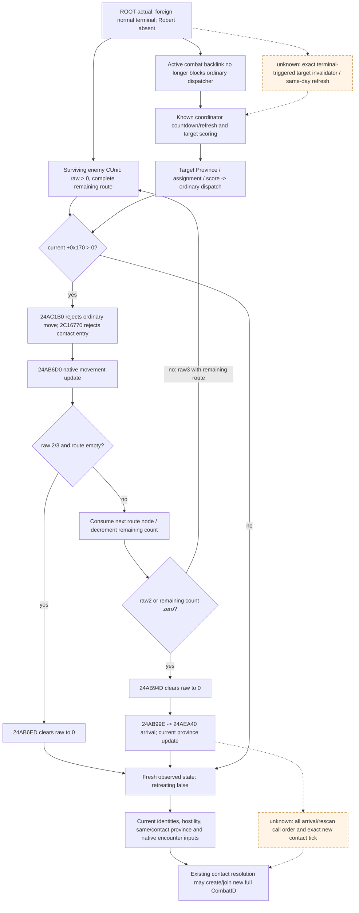

# CK3 1.20.0.3：败退路线锁定与重新接战原生树

2026-10-03，磁盘只读研究。冻结游戏为 CK3 **1.20.0.3 / Steam 25652598**，EXE SHA-256 `94B55397ABB687A3DCD436805A5D885E6BE90FA6C693FEB44A9E3BBEEADE02A6`。新指令证据来自已安装 EXE；源码与既有研究来自 `Z:/g38`，逐文件 SHA 见同包 `EVIDENCE.json`。该目录是 ROOT 持续推进的开发树，不能把早期 HEAD 当作全文冻结。此包没有进程访问、SDK、游戏查询、命令、推进、窗口输入或共享源码修改。

## 对当前追击决策的直接输入

**原生败退保护由当前 CUnit 的撤退状态及剩余路线控制；没有证据支持固定“战后 7 天”保护期。** 当前 EXE 的移动 validator 和接战 entry predicate 都拒绝 `CUnit+0x170 > 0`。普通移动更新会在 raw `3` 的最后一个 route node 消费时把该字段清为 `0`，然后处理到达省份。若 raw `2/3` 已经没有路线，更新入口也会清为 `0`。因此策略应读取实际 `retreating`、当前省份与完整路线，等待真实解除状态，不能按 terminal 日期加一个猜定常数就宣称敌军可接战。

这里的 `+0x170` movement/retreat raw 与公开 `army_state_code=6` 不同。生产 `ck3_12002_army.cpp:287–292` 通过 native `get_unit_state` 给语义 army state，并独立以 `Load<int32>(unit,0x170)>0` 给 `retreating`。raw `3` 的正式内部 enum 名仍未独立闭合。

ROOT 提供的最新实际输入为：foreign Combat `1577058305` 在 DateRaw `53238096` 正常终结，实际 attacker `70766` 胜 defender `30097`；查询日期 `53238336`，敌 CUnit `50331920/83886484` 于 `2634` 撤退，各自 target 分别为 `2631/8754`，完整路线独立绑定各自 full CUnitID；玩家 `83886367` 在 `2604` 围城。这些事实来自协调层已有 artifact，本 lane 没有复测。该场玩家参战／胜利信用均为 **0**。当前 enemy retreat 的锁定树是追击可行性输入，不将这场 foreign 胜利计给 Robert。

## 当前构建已闭合的锁定与解除分支

所有下表地址均为冻结 `.3` EXE 的 RVA。`.pdata` 可以把同一逻辑函数切为多个 fragment，本包按显式控制流跟进相关 fragment。

| 分支 | 当前指令证据 | 最小语义 |
|---|---|---|
| 普通移动是否合法 | `0x24AC1D7 cmp [CUnit+0x170],0`；`0x24AC1DE jg 0x24AC291`；后者返回 AL=false | 所有 positive retreat raw 阻止此 validator 的普通移动；另有 unit type、完整 Army/Combat、mode gates |
| 相邻移动入口 | `0x24AC2C3 cmp [CUnit+0x170],0`；`0x24AC2CA jg 0x24AC3D6`；后者 AL=false | 另一现有原生移动 predicate 也拒绝撤退军队 |
| 原生接战 entry predicate | `0x2C16783 cmp [CUnit+0x170],0`；`0x2C1678A jg 0x2C167F2`；后者 AL=false | 该 combat contact entry gate 对撤退军队为 false；并非单纯敌我身份判断 |
| predicate 的真实消费者 | Province contact resolver `0x2479180` 于 `0x24791D3` 调 `0x2C16770`，紧随测试返回值 | 现有 resolver 已实际接入该 raw gate；query 只能镜像只读 predicate，不得调用 mutating resolver |
| 对方同省候选的接战过滤 | `0x247957C cmp [candidate CUnit+0x170],0`；`0x2479583 jg 0x2479729`（遍历下一 CUnit） | 不仅 initiating CUnit 被拒绝，正状态的对方 CUnit 也在 contact resolver 的候选扫描中被跳过 |
| 无剩余路线时解除 | 更新入口 `0x24AB6D6..0x24AB6ED`：`(uint32)(state-2)<=1 && route_count==0` 时写 `[CUnit+0x170]=0` | raw `2/3` 没有 route 会解除；不是以终局日期或固定日数判断 |
| 每跨一个 route node | `0x24AB820` 读 count，`0x24AB847` 移除首 node，`0x24AB85A/867` 递减并写 count | 当前路线确实被逐 node 消费，`r10d` 是消费后剩余 count |
| raw `3` 的解除 | `0x24AB937..0x24AB94D`：positive raw，若不是 raw2且剩余 count非0则保留；否则写 `0` | raw3在中途 node 保留锁定，最后 node 清零；raw2可在一次 node 消费时清零，不应混同两类 |
| 到达处理的时点 | raw 清零之后 `0x24AB99E` 调 `0x24AEA40(CUnit,targetProvince,transitionFlags*)`；`0x24AECA2` 写 current Province；`0x24AED01` 更新省内单位；`0x24AED50` 调 Army arrival helper | 清零发生在到达省份处理之前。该局部先后已闭合，arrival 内完整 rescan/cadence仍独立研究 |

上述新证据保存在 `unit-fields.json`（有界 `0x24AA000..0x24B1000` 的字段定位）、`unit-update-fragments.json`、`contact-resolver-fragment.json`、`contact-entry-and-arrival.json`。不是新 live 验收；读到 raw3/route 的实际现帧必须继续由 ROOT 管理的 MCP artifact 提供。

## 战中撤退与战后败退分别解释

复用既有 current-build [战中撤退原生树](battle-retreat-and-continue-native-ai-12003-2026-10-03.md) 的已闭合树：手动撤退 validator `0x258AA10` 检查 selected side `disallow_retreat`、allow-early 或 elapsed strictly greater than runtime minimum、phase<2、owner land/rule gate。原版 minimum 为14，因此常规 earliest elapsed15。它是**选择战中主动撤退的合法性**，不计算战后撤退保护剩余日数，也不提供敌军锁定结束预测。

同样，installed `SHATTERED_RETREAT_PREFERRED_PROVINCES=7` / `MAX_PROVINCES=15` 是首选距离省数／最大省数；own-realm、capital、enemy 等是目的地评分输入。这些 source 常量不能用来声称“败退固定7日”或“第15天必可攻击”。`MOVEMENT_SPEED_RETREAT=4.5` 是 stock 速度参数；完整 terrain/edge/native modifier 和路径期间状态决定实际时间，不能仅据常量换算 current enemy ETA。

既有 `.19` normal terminal 与 loser disposition 树、`.19` pursuit join reopen 保留历史构建边界。本包没有把旧 `0x230A590/0x23C9F00/0x23040A0` 地址升级为 `.3`。当前 `.3` terminal journal 已由 ROOT actual 正常终结证据证明本场分支，下一次重新接战的 full CombatID 仍需真实新帧。

## 战后 coordinator 目标选择：复用 current `.3` 树

复用 current package `war-native-target-ai/native-evidence.json` 与接受的 [当前目标选择树](army-target-triage-1.20.0.3.md)，不重复已闭合指令提取：

1. coordinator update `0x19FF515..0x19FF740` 维护 stance、split/merge、target countdown；target countdown `+0x9C` 在 `+0xB0/+0xC0` 非零时不减。target refresh 可由到期、`+0x68` bit1或 stack-validity请求。
2. update `0x19FF788 -> 0x1A04F40` 刷新；`0x19FF78D..0x19FF7A1` 按当前 lopsided byte把 normal7或lopsided14写回 `+0x9C`。这不是战后败退锁定长度，也不是已证明的“终局当天必重算”。
3. `0x1A04F40 -> 0x1A05200` 从 stance objectives展开省候选，经 `0x1A140C0` 局部action score、`0x1A070F0` per-stack score、排名和 `0x1A09450` 路径可行性。最终 target Province `+0x60`、raw assignment `+0x78`、score `+0x74` 写 stack。
4. representative `0x1A1CB00` 先检查 active combat（`0x1A1CB59 -> 0x24AC3E0`），为真则早退；后续 `0x1A1CBCA -> 0x24AC1B0` 又被当前 retreat raw>0拒绝。战斗脱链能移除 active-combat 阻碍，**不自动移除败退路线锁定，也不证明 coordinator已选新目标**。

当前 complete target scorer 的部分 producer、tie-break、战后 target invalidator和actual refresh全局调度顺序仍为unknown。已有 `stack` identity/assignment getter和source tree是可施工入口；仅在未来具体追击决策需要预测对方target时补同一只读观测，不让“完整重现AI”挡住基于真实解除状态的现有玩家行动。

当前 resolver 候选扫描还闭合了第二侧保护：`0x247957C/0x2479583` 在对方 CUnit 的原生 `+0x170 > 0` 时跳到 next-candidate。因此 regular 玩家军队进入同省，也不会由该路径把仍退却的敌军拉入新战斗。完整 CArmy/CUnit identity、hostility、active-combat 与 current province 等其他原生门继续适用；“retreating=false”解锁了这一门，不单独保证一定开战。

## Readiness、实际信用与施工入口

新结果是 **research / current-build static branches closed**。现有 snapshot 的 retreating/route、terminal journal 的已有 live readiness保持本身状态；本包新增 live动作、日数、玩家胜利、收复与G2信用均为0。ROOT可直接用现有fresh snapshot判断“仍撤退”或“已解除”，将移动、接战、胜利分开实际验证。

若需要精确到达／可再交战的时间，先复用原生当前route ETA与最终边entry输入。完整 contact/rescan路径的最窄下一入口为 `.3` `0x2479180` 的 callers、`0x24AED50 -> 0x24E4B00` arrival chain，以及 `0x2C16770` 的现有只读镜像；只读MCP可发布当前 gate boolean和route末端预计到达，不能以战后日期固定倒计时替代。若需要预测战后AI目标，沿 `0x1A04F40` target refresh消费者绑定真正stack/full IDs、选中Province/assignment与日期，并区分已观察target与未来意图。此两项是功能输入入口，不是新的战争授权或安全门禁。

## 现有撤退敌军观测接口

The minimum next observation is two existing `ck3_query_battle_reinforcement_assignment_v1` calls, selected public CUnit IDs50331920 and83886484, each with the public revision from a fresh paused snapshot. `ROOT-QUERY-CONFIG.json` is compatible with Root's read-only capture helper, which injects that revision separately for each call. The package does not call SDK, touch the game, modify shared source or add days.

Root's historical raw53238336 leaf shows both enemy units retreating at2634 with complete destination routes to2631 and8754. The independent terminal journal records foreign Combat1577058305 ending normally at53238096, attacker70766 winning against defender30097. Robert83886367 is still sieging2604 and was absent from that combat; player battle and victory credit remain0. Exact leaf/source hashes are in `ACTUAL-BASELINE.json` and `SOURCE-PINS.json`.

`ck3_take_snapshot` already publishes native retreat state (`CUnit+0x170 >0`), current province and complete route tail. The new-contact reader rejects a retreating subject and skips retreating candidates (`ck3_12002_routes.cpp:1442,1560,1615`). That observed native condition is sufficient to exclude these two armies from an immediate intercept engagement. The locked movement-edge origin (`0x24AB2F0` progress/global0x5C699E8) is a different concept; the existing DTO does not publish a retreat-unlock date. Fresh `retreating=false` remains the actual observable prerequisite for reconsidering them.

The existing reinforcement reader accepts a selected CUnit without a player-control or in-combat prerequisite, but requires its native AI coordinator/subunit/parent membership before emitting route data (`ck3_12002_battle.cpp:442`). If it is available, use `route.arrival_date_raws` parallel to `route.route_province_ids`, plus optional `signal.first_route_edge_remaining_duration_q100000`. `assignment_eta_date_raw` may be null when the army is not assigned to help; that does not erase a separately present committed timeline. Final arrival is a rounded whole-day estimate under current speed/progress, not proven completion or retreat unlock. Do not subtract native progress raw as days.

The existing route-contact horizon explicitly excludes retreating hostile armies. Injecting these IDs into that scope is invalid, and treating their absence as evidence that no later battle can occur would overstate the query. Use current snapshots to detect actual retreat cessation, then refresh relevant strength and current complete nonretreating hostile scope. Move previews are `ck3_execute_step(step="preview-move-army-83886367-to-<fresh Province>", expected_revision=<fresh revision>)`, not an unregistered `ck3_preview_move_army` tool. `ck3_query_actual_contact_scope` requires Robert to be at its requested province and should be used only at actual contact. This recipe does not select a pursuit target or abandon the active siege.

An actual `ai_assignment_not_bound` result is not a new blocker for the ongoing siege. Whole army state, route and fresh retreat flags remain usable. Only if the missing ETA prevents a selected interception decision should the next increment expose the already implemented `ReadCommittedRouteTimeline` independently of AI membership, retaining the existing exact-build, full ID, paused clock and route checks. The concrete native inputs are already bound: prefix duration0x24AADA0 and first-edge remaining duration0x24AB060. No additional observer, API, fixture or live readiness is claimed by this package.

Readiness: **research / prepared existing-query composition**. The single offline validation checks registered signatures, Root's already saved baseline and exact-build ledger; it does not rerun previous live checks. `DAY-WEEK-FIELDS.json` provides the report fields for Root's central merge.

## 当前外部终战后的我方最小追击策略

本段在 exact `.3` 原生 retreat/contact 分支 TREE READY 后制定，是我方确定性策略，未声称原生 AI 已采用同一战术。当前 native entry predicate `0x2C16783/0x2C1678A` 对 initiating `CUnit+0x170 > 0` 返回 false，其 contact-resolver consumer 为 `0x24791D3`；resolver 又于 `0x247957C/0x2479583` 跳过 positive retreat raw 的对方 CUnit，转到 next-candidate `0x2479729`。ordinary move validator `0x24AC1D7/0x24AC1DE` 拒绝的是所选撤退 CUnit 的普通移动，不是禁止 regular 玩家移动到撤退敌军所在省。raw 2/3 且 route count 0 可于 `0x24AB6ED` 清零；raw 3 的最后一个 node 消费后于 `0x24AB94D` 清零、`0x24AB99E` 进入 arrival。没有固定七日免战锁证据；stock `preferred_provinces=7` 是偏好省数，不是天数。

冻结树：`Z:/ck3_mod_rewrite_process_assets/g2-resume-20261003/battle-retreat-pursuit/native-tree/TREE/NATIVE-TREE.md`，SHA `c510cefeac52b3d9013128103e8032df4fd21291bcf88ca56a9667a0c1bcd61a`。其 Root receipt `native-tree/ROOT-DELIVERY.json` SHA `9d8378b20311d76be5c96fc2b4d3086c07ffe7754a67f503339f99e902724a45`；`NATIVE-EVIDENCE.json` SHA `77bdff6cd57de34dda39d105dff98a3dab597c61665a5e098bf732c34e444421`。树先提供最小 READY 分支，最终冻结后本段附入准确引用。

### 当前帧的决策

消费已有 v39 actual：foreign Combat 1577058305 于 raw53238096 正常结束，70766 胜 30097；raw53238336 暂停查询确认 journal event18、原 Combat 移除及胜方 assignment reopened。Robert 83886367 不在任一 stored roster，保持 sieging@2604，无玩家战胜或追击信用。同日期败方 50331920、83886484 都 retreating@2634，分别以 2631、8754 为当帧 endpoint，并有两条不同 route。

我方当前继续既有 2604 收复围城。保持这一动作的理由是已存在真实收复目标与约30.096%进度，而当前两支败方正处在原生不可接战状态；离开围城立即追往旧 route endpoint 尚无新鲜可接战对象或实际抵达时间的收益证据。这不是禁止追击，也没有新增战争授权门禁。玩家 capital2640 的敌围城另记 War50331736／当帧约46.738%／native ETA205天，own2604 ETA109天；native估计会变化，不能由差值承诺先完成哪一座。

### 重新接战的最小循环

1. 由 Root 在当前原 episode 获取 fresh paused snapshot，逐支保留 exact public CUnit／owner、current province、retreating、in_combat、route完整性及目标。50331920 与83886484 不合并；旧 terminal 日期和旧路线不决定当前 state。若还 retreating，则保持已有围城观察；只有在战术收益有实际新证据时才把当前 endpoint 当作移动候选，而不声称能够攻击撤退军。regular玩家即使已经同省，resolver的对方raw门仍会跳过退却者。
2. 某个真实 hostile 在 fresh frame 已 `retreating=false` 时，以该当前 province／可达拦截候选重新比较：现有 `ck3_query_army_strengths` 读玩家与实际敌军完整集合的当前兵数、补给；现有 move preview／route-contact-horizon 读玩家路线及当帧非撤退 hostile。目标省所有 hostile 必须保留其实际 WarID／owner 和当前 combat 状态，不能把不同战争互相敌对的军队直接合为一队。兵数或原生 combat-strength ratio 只作确定性输入，不叫胜率。
3. 普通 route-contact-horizon 明确排除 retreating enemy，不能由其缺少冲突证明敌撤退 route 可追上、ETA已知或接敌安全。若路线到达时效成为这次选取拦截目标的必要输入，复用 `ck3_query_battle_reinforcement_assignment_v1(selected_public_cunit_id=50331920 or83886484, expected_revision=R)`，每次 R 来自该单次调用前的 fresh snapshot。available 时读取 `battle_reinforcement_assignment.route.arrival_date_raws` 和 `signal.first_route_edge_remaining_duration_q100000`；`no_assignment` 的 `assignment_eta_date_raw=null` 不代表 committed route 没 timeline。预计末端日期不是已证实的解除锁定 tick，仍须读实际 retreating flag。具体调用配置在 `query-increment/ROOT-QUERY-CONFIG.json`，语义及分支在 `query-increment/RECIPE.json`。只有实际 `ai_assignment_not_bound` 阻塞已选 intercept 的必要 ETA 时，才把已经实现的 `ReadCommittedRouteTimeline` 独立投影进同一 MCP；当前不加 API，也不阻断围城。
4. 选定实际候选后，Root 复用当帧已发布 move preview 与现有玩家 move command 执行一次；通过已有 bounded time progression 观察，按实际经过日数保存，不能假设 ordinary `life-advance` 永远24小时。每次 paused after-frame重新检查军队、route、敌retreat/contact和capital/own siege，变更即重新计划。没有 move ACK 或旧路线完成能替代真实接战。
5. 真正出现玩家的当前 CombatID C 后，转现有 battle-control、transition 与 terminal MCP，读 actual side membership／phase／roster／losses与胜负，并用同一 exact C 的 positive journal cursor 观察终结。新 `normal_result` 且胜方匹配玩家实际 side 才记玩家战胜；foreign终战、missing C、route clearing、assignment reopened均不能单独计胜。完成一次战术循环后保存真实 normal checkpoint。

当前可施工入口仅是决策真正需要的 current retreat / route timeline / strength / contact字段；不能用尚缺完整对手 retreat-destination scorer 或完整 Monte Carlo 概率阻止当前有用的围城与重新观测。此包只提供 recipe，Root 尚未执行玩家追击或再次接战；readiness仍 `research`，已有暂停敌撤退与foreign terminal证据保留各自有限 `production-live primitive` 边界。

实际 extract 与固定证据：`battle-retreat-pursuit/policy/ACTUAL-EVIDENCE.json`、`SOURCE-PINS.json`；声明式 recipe：`POST-BATTLE-PURSUIT-RECIPE.json`。本段0新日／0动作／0 SDK／0窗口／0玩家胜利，中央日报、周报由 Root 合并 `ACTUAL-REPORT-FIELDS.md` 与更新后的同名 JSON。

## v40：两支真实撤退敌军的 committed-route timeline

Root 在 v40 / R0019 / PID28788、`Z:/g42` source `02e88d57fcef399368f34b23f497d3e8565af95d` 执行两次现有 registered `ck3_query_battle_reinforcement_assignment_v1`。SDK80096 正常关闭；两份 payload 均为 `available`、`native_ready=true`，paused `native:9` / public revision2 / date_raw53238336。query 自身的 game_version/executable_sha256 为 null，exact `.3` 与 EXE SHA 由 Root runtime freeze 单独绑定；没有把空 metadata 补成 query 自行发布的版本证据。

| 当前 public CUnit / native CArmy | AI coordinator | 当前省 | 完整 stored route | 首边剩余 Q100000 日 | 末省预计到达 raw / 剩余估计 |
|---|---:|---:|---|---:|---|
| 50331920 / 33554713 | 16777247 | 2634 | `[2633, 2627, 2626, 8753, 2629, 2630, 2631]` | 638752 = 6.38752日 | 53239560 / 51日 |
| 83886484 / 150995083 | 16777247 | 2634 | `[1032, 8645, 8754]` | 2559441 = 25.59441日 | 53239344 / 42日 |

两军 asking_for_help/assigned_to_help 均为 false，route_alignment 为 `no_assignment`，assignment_eta_date_raw 为 null；这些合法值不妨碍独立完整路线时间观测。逐省 arrival_date_raws 分别为 `[53238480,53238720,53238936,53239080,53239272,53239440,53239560]` 与 `[53238960,53239104,53239344]`。时间为当前速度/进度下的估计，末省 ETA 不能冒充撤退解除日期、实际抵达、再次交战或玩家追击成功。下一轮 fresh snapshot 必须独立观察 retreating 与实际 route；现有接口已足够提供本次 ETA，当前无需新 API。

这两次既有 query 的有限 readiness 为 **production-live primitive：这两支敌军当前路线、AI membership 与时间观测**。原生锁定/解除分支维持 current-build static-confirmed；当前玩家追击 recipe 维持 research。没有新 move、接战、追击胜利、战争结算或完整玩家 battle loop。本消费者新增 SDK/窗口/游戏动作/存档日均为0，Root 实际只读查询也增加0日；截至该日期的已保存 calendar3917、resume764、2026-10-03 +669 不重复计日。

实际消费包：[ROOT-DELIVERY.json](Z:/ck3_mod_rewrite_process_assets/g2-resume-20261003/battle-retreat-pursuit/query-increment/actual-v40-01/ROOT-DELIVERY.json)。源叶 004 SHA `d2f9c7102a43f0dfcd6a2d983da610a6d130b0381ef496dd7fc2def7561d5079`，006 SHA `4094bfe5446c80c88814bc84903950e6c319cd2f5e70d6f9d0f179f08f8b7c41`；完整实际字段保留在 `ACTUAL-TIMELINES.json`。008 combat-v2 composition 由其他 owner 消费，不在本包重复解释。

本专题的 [研究记录](battle-retreat-pursuit-reengagement-12003.plan.json) 与 [同源图表](battle-retreat-pursuit-reengagement-12003.graph.md) 使用 native_research_plan.py 生成与检查。它们记录既有离线/实机证据层次，不授权新采样，也不把 file-check 当原生语义验收。未知 arrival/rescan 全局时序、terminal-target invalidator 保留具体施工入口；当前围城继续执行。
